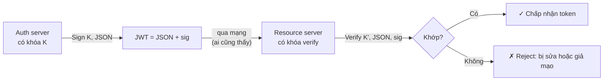
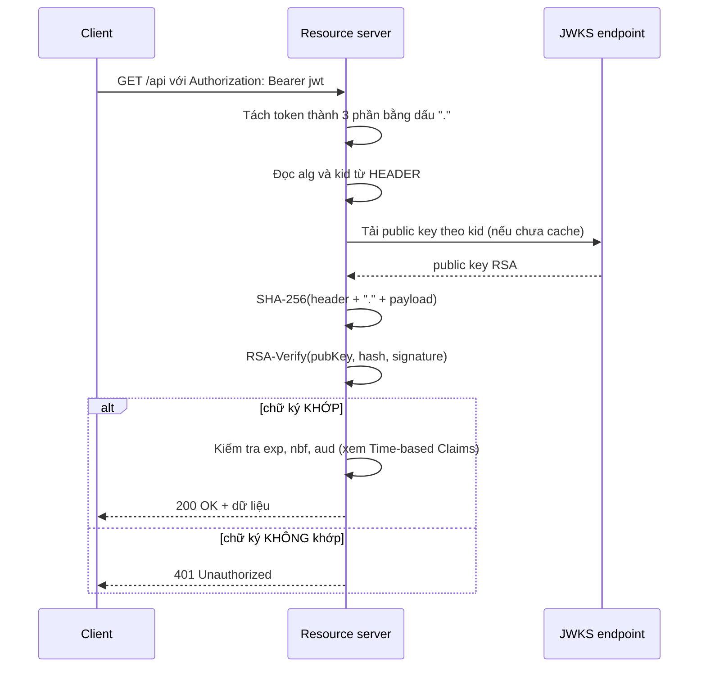

# Chữ ký số (Digital Signature) — Deep Dive

## Mục lục

- [Sự cố: token bị sửa 1 chữ cái, toàn hệ thống bị chiếm quyền admin](#1-sự-cố-token-bị-sửa-1-chữ-cái-toàn-hệ-thống-bị-chiếm-quyền-admin)
- [Chữ ký số giải quyết bài toán nào](#2-chữ-ký-số-giải-quyết-bài-toán-nào)
- [Ba thuộc tính an ninh mà chữ ký phải đảm bảo](#3-ba-thuộc-tính-an-ninh-mà-chữ-ký-phải-đảm-bảo)
- [Hash function — viên gạch đầu tiên](#4-hash-function--viên-gạch-đầu-tiên)
- [Ký bằng HMAC (đối xứng) — bước chốt](#5-ký-bằng-hmac-đối-xứng--bước-chốt)
- [Ký bằng RSA (bất đối xứng) — verify công khai](#6-ký-bằng-rsa-bất-đối-xứng--verify-công-khai)
- [Mổ một token thật byte-cập-byte](#7-mổ-một-token-thật-byte-cập-byte)
- [Vì sao đổi 1 bit làm chữ ký bét — hiệu ứng avalanche](#8-vì-sao-đổi-1-bit-làm-chữ-ký-bét--hiệu-ứng-avalanche)
- [Tamper-evident KHÔNG phải tamper-proof](#9-tamper-evident-không-phải-tamper-proof)
- [Non-repudiation — ai cũng có thể ký, hay chỉ một người?](#10-non-repudiation--ai-cũng-có-thể-ký-hay-chỉ-một-người)
- [Chữ ký vs MAC vs Mã hoá — bảng phân biệt cuối cùng](#11-chữ-ký-vs-mac-vs-mã-hoá--bảng-phan-biệt-cuối-cùng)
- [Code thực chiến — ký/verify với crypto thuần](#12-code-thực-chiến--kýverify-với-crypto-thuần)
- [Anti-patterns cần tránh](#13-anti-patterns-cần-tránh)
- [Tóm tắt — Cheat sheet](#14-tóm-tắt--cheat-sheet)

---

## 1. Sự cố: token bị sửa 1 chữ cái, toàn hệ thống bị chiếm quyền admin

Một bug rất phổ biến: trang admin của họ chặn theo giá trị `role` **nằm trong payload JWT** — frontend decode payload (base64url) ra JSON, đọc `role`, nếu là `"admin"` thì hiện nút. Logic kiểm tra quyền **chỉ ở client**.

```diagram
Token ban đầu (payload base64url decode ra):
   { "sub": "user-42", "role": "user", "exp": 1735689600 }

Kẻ tấn công làm gì:
   1. Bỏ token vào jwt.io → thấy payload là JSON rõ
   2. Sửa "role":"user" → "role":"admin"
   3. Base64url lại payload → ghép vào token
   4. … nhưng CHỮ KÝ không khớp nữa (vì payload đã đổi)
```

Đến đây có hai kịch bản, và đó là ranh giới sống/còn của JWT:

```diagram
KỊCH BẢN A — server verify ĐÚNG (may mắn):
   server tính lại chữ ký trên payload đã sửa → KHÔNG khớp → 401
   → token giả bị reject, hệ thống an toàn.

KỊCH BẢN B — server KHÔNG verify (thảm họa thực tế):
   server tin payload, không kiểm chữ ký (hoặc alg:none, xem bên dưới)
   → token giả được chấp nhận → "user-42" thành admin mà không cần mật khẩu.
```

Sự cố thật luôn ở kịch bản B. Lỗi không phải JWT "không an toàn" — mà là **server quên (hoặc bị lừa) kiểm chữ ký**. JWT không có chữ ký thì chỉ là một mẩu JSON dán băng keo — ai cũng gỡ ra sửa rồi dán lại.

> [!IMPORTANT]
> Toàn bộ niềm tin vào một JWT nằm ở **một chuỗi chữ ký ở cuối token**. Nếu server không kiểm nó (hoặc kiểm sai), JWT tụt từ "chống giả" xuống "tệ hơn cả cookie thường" — vì cookie thường ít nhất còn do server sinh, còn payload JWT thì client đọc được nên client cũng biết đường sửa. Doc này mổ xẻ chữ ký số từ viên gạch (hash) tới chữ ký hoàn chỉnh, để bạn hiểu vì sao đúng 40 byte cuối của token lại giữ cả hệ thống đứng vững.

---

## 2. Chữ ký số giải quyết bài toán nào

Đặt câu hỏi gốc: nếu JWT chỉ là JSON đóng gói, sao không gửi JSON thường đi? Vì JSON thường **bất cứ ai trên đường truyền cũng sửa được** — proxy, gateway, browser extension, kẻ tấn công middling — và server không cách nào biết token đã bị xáo trộn.

Chữ ký số giải đúng ba bài toán mà JSON thường bất lực:

```diagram
                       JSON thường        JWT (có chữ ký)
                     ────────────────    ──────────────────
  Ai cũng đọc được?        CÓ                  CÓ (payload base64url)
  Ai cũng sửa được         CÓ                  KHÔNG (sửa → chữ ký bét)
  mà không bị phát hiện?
  Biết chắc ai phát hành?  KHÔNG              CÓ (verify = chứng minh nguồn)
```

Cột bên phải chính là chữ ký số mang lại. Ba khả năng đó — **toàn vẹn, xác thực nguồn, không thể chối bỏ** — là ba thuộc tính an ninh cốt lõi, mổ ở §3.



Hộp công khai `JSON` đi trên đường truyền rõ ràng — chữ ký `sig` không giấu nội dung, nó chỉ **chứng minh nội dung không bị ai đụng và do đúng người phát**. Đây là điểm người mới hay nhầm: chữ ký không che giấu, nó *chống giả*.

> [!NOTE]
> Nếu bạn cần **giấu** nội dung (không cho ai đọc payload), đó là việc của **mã hoá (JWE)**, không phải chữ ký (JWS). JWT hằng ngày là JWS — ký, đọc được. Xem [JWE — Token mã hoá](/cryptography/jwe-encrypted-token/) và [Encoding vs Encryption](/fundamentals/encoding-vs-encryption/) để tránh nhầm hai khái niệm nền tảng này.

---

## 3. Ba thuộc tính an ninh mà chữ ký phải đảm bảo

Một chữ ký số "đúng" phải thoả mãn cả ba. JWT bỏ sót bất kỳ cái nào cũng sập.

| Thuộc tính | Tiếng Anh | Nghĩa | JWT đạt bằng cách nào |
|---|---|---|---|
| **Toàn vẹn** | Integrity | Token không bị sửa trên đường truyền. Sửa 1 bit → phát hiện. | Chữ ký là HMAC/RSA/ECDSA trên `header.payload` |
| **Xác thực nguồn** | Authenticity | Token do đúng server phát, không phải kẻ lạ giả. | Verify cần khóa đúng — kẻ lạ không có khóa để ký khớp |
| **Không thể chối bỏ** | Non-repudiation | Server phát không thể nói "token này không phải tôi ký". | Mới thật sự đạt với **bất đối xứng** (RSA/ECDSA) — xem §10 |

```diagram
┌───────────────────────────────────────────────────────────────────────────┐
│  Phân biệt tinh tế nhưng QUAN TRỌNG:                                      │
│                                                                           │
│  • Integrity    : "token này NGUYÊN VẸN hay đã bị sửa?"                   │
│  • Authenticity : "token này do AI phát — đúng server hay kẻ giả?"        │
│  • Non-repudiation : "người phát CÓ THỂ chối hay KHÔNG?"                  │
│                                                                           │
│  HMAC (đối xứng) đạt 2 cái đầu, KHÔNG đạt cái 3 — vì verifier cũng có     │
│  khóa nên cũng có thể tự ký rồi đổ cho server. RSA/ECDSA đạt cả 3.        │
└───────────────────────────────────────────────────────────────────────────┘
```

> [!IMPORTANT]
> Khi nghe "JWT có chữ ký nên an toàn", hãy hỏi ngược: **an toàn theo thuộc tính nào?** Với HMAC, bạn có toàn vẹn + xác thực (đủ cho phần lớn auth nội bộ), nhưng không có non-repudiation (vì cả hai bên giữ cùng một secret). Với RSA/ECDSA bạn có cả ba — đó là lý do các IdP công khai (Auth0, Google, Keycloak) dùng bất đối xứng cho `id_token`. Chi tiết mô hình tin cậy từng thuật toán ở [HMAC vs RSA vs ECDSA — Deep Dive](/cryptography/hmac-vs-rsa-vs-ecdsa/).

---

## 4. Hash function — viên gạch đầu tiên

Trước khi có chữ ký, cần hiểu **hash** — vì mọi chữ ký đều bắt đầu bằng việc băm nội dung.

Hash function mật mã (SHA-256, SHA-3...) nhận đầu vào **bất kỳ độ dài**, xuất ra một **chuỗi cố định độ dài** (256 bit = 32 byte cho SHA-256), với ba tính chất:

```diagram
ĐẦU VÀO (bất kỳ)                       HASH (256 bit cố định)
─────────────────                      ──────────────────────
"hello"              ─── SHA-256 ───▶  2cf24dba5fb0a30e26e83b2ac5b9e29e
                                        1b76e43905b2c4f9b3d6e1f6c8a9b0c1
"Toàn bộ Wikipedia tiếng Việt (GB)"  ▶  (vẫn 32 byte, nhưng khác hoàn toàn)
```

Ba tính chất mật yếu của hash:

```diagram
① DETERMINISTIC  : cùng đầu vào → luôn cùng đầu ra (để verify lại được).
② ONE-WAY         : có hash → KHÔNG suy ra được đầu vào (khả thi về tính toán).
③ AVALANCHE       : đổi 1 bit đầu vào → đầu ra thay đổi ~50% bit (như lở tuyết).
                   "hello"  → 2cf24dba5fb0a30e26e83b2ac5b9e29e...
                   "Hello"  → 185f8db32271fe25f561a6fc938b2e26...
                              (sửa 1 chữ, đầu ra khác từ byte đầu)
```

Tính chất ③ (avalanche) chính là lý do sửa 1 chữ trong payload JWT khiến chữ ký "bét hoàn toàn" — không có cách nào sửa token "một chút" cho chữ ký vẫn khớp. Mổ kỹ ở §8.

> [!NOTE]
> Hash **một mình** chưa phải chữ ký. Bất cứ ai cũng có thể tính `SHA-256(payload)` — nên một hash trần không chứng minh được ai phát hành (kẻ tấn công sửa payload, tự tính hash mới, dán vào — server tưởng nguyên). Hash chỉ trở thành chữ ký khi **kết hợp với một bí mật (key)** — đó là bước kế tiếp.

---

## 5. Ký bằng HMAC (đối xứng) — bước chốt

HMAC (Hash-based Message Authentication Code) = hash **có trộn thêm một bí mật**. Cái bí mật này biến hash thường thành "hash mà chỉ ai có bí mật mới tính được".

```diagram
HMAC(K, message)  với K là bí mật:
   ┌─────────────────────────────────────────────────────────────┐
   │  1. Trộn K vào message theo công thức pad (ipad/opad)       │
   │  2. Hash hai lần (HS256 = HMAC dùng SHA-256)                │
   │  3. Kết quả 32 byte → base64url → chính là chữ ký           │
   └─────────────────────────────────────────────────────────────┘

Kẻ tấn công có payload + chữ ký, nhưng KHÔNG có K:
   → không thể tính lại chữ ký khi sửa payload
   → không thể "sửa token" mà vẫn hợp lệ.
```

### Ví dụ tính tay (số nhỏ, để hiểu cơ chế)

Giả sử (đơn giản hoá cực) hash là "cộng ASCII mod 10", và secret `K = 7`:

```diagram
payload = "role=user"
   mã ASCII: 'r'=114 'o'=111 'l'=108 'e'=101 '='=61 'u'=117 's'=115 'e'=101 'r'=114
   tổng = 942
   HMAC = hash(K + payload) = (7 + 942) mod 10 = 9      ← chữ ký = "9"

Kẻ tấn công sửa payload = "role=admin":
   tổng thay đổi → HMAC(K, "role=admin") = (7 + ???) mod 10 = khác 9
   → nhưng kẻ KHÔNG BIẾT K=7 nên không tính được chữ ký mới
   → ghép "role=admin" với "9" cũ → server tính lại → KHÔNG KHỚP → reject.
```

Số thật phức tạp hơn nhiều (SHA-256 lặp 64 vòng), nhưng cơ chế y hệt: **bí mật K là thứ phân biệt "hash trần" (ai cũng tính) với "chữ ký HMAC" (chỉ người giữ K mới tính)**.

### Trong JWT, chữ ký trông thế nào

```diagram
eyJhbGciOiJIUzI1NiIsInR5cCI6IkpXVCJ9           ← header  (base64url của {"alg":"HS256","typ":"JWT"})
.
eyJzdWIiOiJ1c2VyLTQyIiwicm9sZSI6InVzZXIifQ     ← payload (base64url của JSON)
.
5LWms...rJQ                                     ← SIGNATURE = base64url( HMAC-SHA256(K, header.payload) )
```

Chữ ký HMAC-SHA256 luôn dài đúng **43 ký tự** (32 byte → base64url). Đó là "dấu vân tay" của cả header + payload dưới secret K.

> [!IMPORTANT]
> Chữ ký chỉ tính trên `header + "." + payload` — **không bao gồm** dấu chấm thứ hai, không bao gồm chính chữ ký. Sửa bất kỳ byte nào trong phần `header.payload` (kể cả sửa 1 dấu phẩy trong JSON, đổi `alg`, thêm claim) → hash thay đổi → chữ ký cũ không khớp. Đó là toàn bộ cơ chế chống sửa của JWT.

---

## 6. Ký bằng RSA (bất đối xứng) — verify công khai

HMAC có một hạn chế kiến trúc: **người verify cũng cần bí mật K**, nghĩa là cũng có thể ký. Khi nhiều service cùng verify, secret K phải phát khắp nơi → bề mặt bị lộ nhân lên.

RSA tách hai vai trò: **private key** (chỉ để ký, giữ kín) và **public key** (ai cũng có, chỉ để verify). Kẻ có public key **không thể** ký.

```diagram
                  RSA (RS256 trong JWT)
   ┌──────────────────┐                       ┌──────────────────┐
   │   Auth server    │  private key (d, n)   │  Resource server │
   │   ── KÝ ──       │ ─────────────────────▶│  ── VERIFY ──    │
   │   sig = m^d mod n│                       │  m^e mod n ==?   │
   └──────────────────┘                       │  hash(payload)   │
                                              └──────────────────┘
                       public key (e, n)
   ─────────────────────────────────────────▶ (phát qua JWKS — ai cũng tải được)

  • Người verify CÓ public key (e, n) → verify được
  • Nhưng KHÔNG có private key d → KHÔNG ký được
  → lộ public key không gây hại; lộ private key mới sập.
```

### Cơ chế (đơn giản hoá)

RSA dựa vào toán lũy thừa modulo với số cực lớn. Tinh giản với số nhỏ (chỉ để thấy hình dáng):

```diagram
Giả sử n = 33 (= 3 × 11), public exponent e = 3, private d = 7.
  Ký:     sig = message^d  mod n  = message^7 mod 33
  Verify: sig^e mod n     == message   (vì (m^d)^e = m^(d·e) = m^1 mod n)
```

Toán thật dùng `n` ~ 2048 bit (RSA-2048), `d`/`e` được sinh từ hai số nguyên tố khổng lồ, bài toán "từ public key suy ra private key" tương đương **phân tích một số 2048-bit ra thừa số nguyên tố** — việc máy tính hiện tại không kham nổi trong thời gian hữu ích. Đó là chỗ niềm tin RSA nằm.

### Kết quả trong JWT

```diagram
RS256 → chữ ký dài 256 byte (base64url → 344 ký tự)
        → token to hơn HS256 nhiều (43 ký tự) — cái giá của verify công khai.
ES256 (ECDSA) → 64 byte → nhỏ hơn, nhanh hơn, xem HMAC vs RSA vs ECDSA.
```

> [!TIP]
> Khi có nhiều service verify token (microservices), **chọn bất đối xứng**: auth server giữ private key, các service tải public key từ JWKS endpoint để verify (xem [JWK & JWKS — Deep Dive](/cryptography/jwk-and-jwks/)). Một service bị xâm nhập chỉ lộ public key → vô hại, không thể giả token. Với HMAC, một service lộ là cả cụm sập vì secret chia sẻ.

---

## 7. Mổ một token thật byte-cập-byte

Đây là một JWT thật (RS256), tách từng phần để thấy chữ ký nằm đâu:

```diagram
┌─ HEADER (base64url) ──────────────────────────────────────────────────────┐
│ eyJ0eXAiOiJKV1QiLCJhbGciOiJSUzI1NiIsImtpZCI6InJvdC0yMDI0In0               │
│ decode → {"typ":"JWT","alg":"RS256","kid":"rot-2024"}                     │
│   alg: RS256 = RSA + SHA-256                                              │
│   kid: định danh khóa (để JWKS biết lấy public key nào verify)            │
└───────────────────────────────────────────────────────────────────────────┘
                                    .
┌─ PAYLOAD (base64url) ────────────────────────────────────────────────────┐
│ eyJzdWIiOiJ1c2VyLTQyIiwicm9sZSI6InVzZXIiLCJleHAiOjE3MzU2ODk2MDB9         │
│ decode → {"sub":"user-42","role":"user","exp":1735689600}                │
│   AI CŨNG ĐỌC ĐƯỢC — đây là điểm người mới sốc nhất.                     │
└──────────────────────────────────────────────────────────────────────────┘
                                    .
┌─ SIGNATURE (base64url, 344 ký tự với RS256) ─────────────────────────────┐
│ kT8x...2wE                                                               │
│ = base64url( RSA-Sign(privateKey, SHA-256(header + "." + payload)) )     │
│                                                                          │
│  Chỉ phần này là "chứng minh". Phần kia ai cũng có thể fake được nếu     │
│  server quên verify. Phần này không fake được nếu không có private key.  │
└──────────────────────────────────────────────────────────────────────────┘
```

Quy trình verify ở server (theo đúng chuẩn JWT):



> [!WARNING]
> Bước "đọc `alg` từ header để chọn thuật toán verify" là **điểm nguy hiểm nhất**. Nếu server tin mù `alg` từ header, kẻ tấn công set `alg: none` (không ký) hoặc `alg: HS256` (khi server thực ra dùng RSA → nhầm public key thành HMAC secret) → giả token. Luôn **allowlist `alg` phía server**, xem [Algorithm Confusion — Deep Dive](/security/algorithm-confusion-deep-dive/).

---

## 8. Vì sao đổi 1 bit làm chữ ký bét — hiệu ứng avalanche

Sửa một ký tự trong payload JWT, chữ ký cũ **chắc chắn** không khớp. Hiệu ứng này gọi là **avalanche** — "lở tuyết" — của hàm băm mật mã.

```diagram
Hash của hai payload chỉ khác 1 ký tự (dùng SHA-256):

  payload A: {"role":"user"}    → SHA-256 → 9b74c9897bac770ffc029102...
  payload B: {"role":"admin"}   → SHA-256 → 8c723a0fa70b1110d9bf1eaa...

  So sánh byte-cập-byte: ~50% số bit khác nhau — KHÔNG có tính "sửa nhẹ".
```

Hệ quả thực tế: **không tồn tại** "sửa token một chút cho chữ ký vẫn khớp". Hai khả năng duy nhất:

```diagram
① Sửa payload → tính lại chữ ký     : CẦN khóa K (HMAC) hoặc private key (RSA).
                                        Kẻ tấn công không có → không làm được.
② Sửa payload, KHÔNG tính lại chữ ký: chữ ký cũ ≠ chữ ký đúng → server reject.
```

Đây là lý do chữ ký số gọi là **tamper-evident** (làm sai thì phát hiện được), chứ không phải tamper-proof (ngăn không cho đụng — trên đường truyền ai cũng đụng được, vấn đề là server sẽ biết).

> [!NOTE]
> Avalanche cũng đúng với HMAC và RSA: HMAC băm hai lần (đều avalanche), RSA lũy thừa modulo trên số 2048-bit cũng khuếch đại mọi thay đổi. Cùng cơ chế: sửa 1 bit → chữ ký khác hoàn toàn → không thể "đụng nhẹ" mà lọt.

---

## 9. Tamper-evident KHÔNG phải tamper-proof

Phân biệt này thường bị nhầm, và nhầm thì thiết kế sai:

```diagram
┌────────────────────────────────────────────────────────────────────────────┐
│  TAMPER-EVIDENT  (JWT/JWS thuộc loại này)                                  │
│     Có thể sửa token trên đường truyền — NHƯNG server PHÁT HIỆN được       │
│     (chữ ký không khớp) và reject.                                         │
│     Giống "niêm phong chuối": ai cũng bóc được, nhưng bóc ra là biết.      │
│                                                                            │
│  TAMPER-PROOF                                                              │
│     Sửa KHÔNG được — không có cách nào đụng vào nội dung.                  │
│     JWT KHÔNG thuộc loại này (payload base64url, đụng được).               │
│     Muốn tamper-proof cần mã hoá ở lớp truyền (TLS) + bảo mật lưu trữ.     │
└────────────────────────────────────────────────────────────────────────────┘
```

Hệ quả cho thiết kế:

- **TLS vẫn bắt buộc** — chữ ký chống sửa token, nhưng không chống *đọc* (ai middling HTTP nếu chưa có TLS vẫn đọc được payload). TLS che giấu, chữ ký chống sửa: hai lớp, bổ sung nhau.
- **Lưu trữ client cũng vậy** — lưu JWT trong localStorage không "tamper-proof" (JS nào cũng sửa được); nhưng client có sửa cũng vô hại vì **server sẽ reject** nếu chữ ký không khớp. Vấn đề thực sự của localStorage là XSS *đánh cắp* token (xem [Secure Storage](/security/secure-storage/)), không phải sửa.

> [!IMPORTANT]
> Đừng nghĩ "JWT có chữ ký nên client không sửa được". Client **sửa được thoải mái** — điều đúng phải nói là "client sửa thì server sẽ phát hiện và reject". Câu nói chính xác hơn, dễ nhớ: **JWT chống giả, không chống đọc và không chống lấy cắp**.

---

## 10. Non-repudiation — ai cũng có thể ký, hay chỉ một người?

Thuộc tính thứ ba (non-repudiation = "không thể chối bỏ") là chỗ HMAC và RSA/ECDSA **khác nhau hẳn** về mô hình tin cậy.

```diagram
HMAC (đối xứng) — KHÔNG có non-repudiation:
   Auth server và Resource server CÙNG GIỮ secret K.
   → cả hai đều có khả năng ký token hợp lệ.
   → nếu có tranh chấp ("token này ai ký?"), auth server có thể đổ:
       "không phải tôi, chính resource server tự ký rồi đổ cho tôi"
   → không chứng minh được ai ký — vì cả hai đều có K.

RSA/ECDSA (bất đối xứng) — CÓ non-repudiation:
   Chỉ auth server có private key.
   → chỉ MỘT bên có thể ký token hợp lệ.
   → nếu token verify bằng public key của auth server → CHẮC CHẮN do auth server ký.
   → auth server KHÔNG THỂ chối (không ai khác có private key).
```

Bảng so sánh mô hình tin cậy:

| | HMAC (HS256) | RSA/ECDSA (RS256/ES256) |
|---|---|---|
| Ai có thể ký token hợp lệ? | **Bất kỳ ai giữ K** (thường là nhiều bên) | **Chỉ một bên** giữ private key |
| Bề mặt lộ khóa | Mỗi bản sao K là một điểm lộ | Chỉ 1 nơi giữ private key |
| Non-repudiation | ❌ Không | ✓ Có |
| Phù hợp khi | Một bên vừa ký vừa verify (monolith) | Nhiều bên verify, một bên ký (microservices, IdP) |

> [!TIP]
> Cho auth nội bộ một monolith, **HMAC đủ** (đơn giản, nhanh). Cho IdP công khai (Auth0, Google, Keycloak) hoặc microservices với nhiều verifier, **bất đối xứng là bắt buộc** — vừa giảm bề mặt lộ, vừa có non-repudiation cho audit. Quyết định chọn thuật toán là quyết định kiến trúc, không phải "thích cái nào nhanh hơn" — xem [HMAC vs RSA vs ECDSA — Deep Dive](/cryptography/hmac-vs-rsa-vs-ecdsa/).

---

## 11. Chữ ký vs MAC vs Mã hoá — bảng phân biệt cuối cùng

Ba khái niệm hay bị trộn. Phân biệt một lần cho rõ:

```diagram
┌──────────────┬─────────────────────────┬───────────────────────────────────┐
│ Khái niệm    │ Che giấu nội dung?      │ Chống sửa / chứng minh nguồn?     │
├──────────────┼─────────────────────────┼───────────────────────────────────┤
│ HASH (SHA-2) │ ❌ Không (chỉ tóm tắt)   │ ❌ Không (ai cũng tính được)     │
│ MAC (HMAC)   │ ❌ Không                 │ ✓ Chống sửa + xác thực nguồn     │
│              │                         │   (cần bí mật chung)              │
│ SIGNATURE    │ ❌ Không                 │ ✓ Chống sửa + nguồn + non-repud. │
│ (RSA/ECDSA)  │                         │   (cần cặp khóa)                  │
│ ENCRYPTION   │ ✓ Có                    │ ❌ Một mình KHÔNG (cần thêm MAC)  │
│ (AES/RSA-enc)│                         │   → mã hoá bản rõ không chống sửa │
└──────────────┴─────────────────────────┴───────────────────────────────────┘
```

```diagram
┌───────────────────────────────────────────────────────────────────────────┐
│  JWT (JWS)  = MAC hoặc SIGNATURE, KHÔNG phải ENCRYPTION                   │
│     • HS256 = MAC (HMAC-SHA256)                                           │
│     • RS256 = SIGNATURE (RSA + SHA-256)                                   │
│     • ES256 = SIGNATURE (ECDSA + SHA-256)                                 │
│  Tất cả đều KHÔNG giấu nội dung — payload base64url đọc được.             │
│                                                                           │
│  Muốn giấu → JWE (JSON Web Encryption), một chuẩn KHÁC, dùng AES + RSA.   │
└───────────────────────────────────────────────────────────────────────────┘
```

> [!IMPORTANT]
> Câu hỏi phổ biến nhất: **"JWT có mã hoá không?"** Đáp: KHÔNG — JWT bạn dùng hằng ngày (JWS) chỉ **ký**, payload đọc được bằng base64url. Muốn **mã hoá** phải dùng JWE (5 phần thay vì 3). Nhầm hai cái này dẫn đến đặt secret vào payload → lộ ngay. Chi tiết ở [JWE — Token mã hoá](/cryptography/jwe-encrypted-token/) và [Encoding vs Encryption](/fundamentals/encoding-vs-encryption/).

---

## 12. Code thực chiến — ký/verify với crypto thuần

Ví dụ Node.js thuần (không thư viện JWT), để thấy cơ chế bên trong rõ ràng. Code production nên dùng `jose` hoặc `jsonwebtoken` — không tự viết crypto.

```javascript
import { createHmac, timingSafeEqual } from 'node:crypto';

// ─── HMAC-SHA256 ký/verify "từ tay" ─────────────────────────────────────
const SECRET = process.env.JWT_SECRET; // 32+ byte ngẫu nhiên, giữ tuyệt mật

function base64url(buf) {
  return Buffer.from(buf).toString('base64url');
}

// KÝ: trả về JWT dạng HS256
function sign(payload, secret = SECRET) {
  const header = { alg: 'HS256', typ: 'JWT' };
  const encHeader = base64url(JSON.stringify(header));
  const encPayload = base64url(JSON.stringify(payload));
  const data = `${encHeader}.${encPayload}`;
  const sig = createHmac('sha256', secret).update(data).digest(); // 32 byte
  return `${data}.${base64url(sig)}`;
}

// VERIFY: kiểm chữ ký + exp
function verify(token, secret = SECRET) {
  const [encHeader, encPayload, sig] = token.split('.');
  if (!encHeader || !encPayload || !sig) throw new Error('malformed');

  // 1) Tính lại chữ ký trên phần header.payload nhận được
  const data = `${encHeader}.${encPayload}`;
  const expected = createHmac('sha256', secret).update(data).digest();

  // 2) So sánh hằng-số-thời-gian (chống timing attack)
  const got = Buffer.from(sig, 'base64url');
  if (got.length !== expected.length || !timingSafeEqual(got, expected)) {
    throw new Error('invalid signature'); // ← token bị sửa hoặc giả
  }

  // 3) Kiểm exp (chữ ký khớp chưa đủ — token có thể đã hết hạn)
  const payload = JSON.parse(Buffer.from(encPayload, 'base64url'));
  if (payload.exp && Date.now() / 1000 > payload.exp) {
    throw new Error('expired');
  }
  return payload;
}

// ─── Dùng thử ────────────────────────────────────────────────────────────
const token = sign({ sub: 'user-42', role: 'user', exp: 1735689600 });
console.log(token);
// → eyJhbGciOi...eyJzdWIi...5LWmsrJQ

console.log(verify(token)); // { sub: 'user-42', role: 'user', exp: 1735689600 }

// ─── Sửa payload rồi ghép lại ─────────────────────────────────────────────
const tampered = token.replace('dXNlcg', 'YWRtaW4'); // 'user' → 'admin' trong base64
try { verify(tampered); }
catch (e) { console.log(e.message); } // → 'invalid signature' ← avalanche đã làm việc
```

```typescript
// Production với thư viện jose (bất đối xứng RS256, recommended)
import { SignJWT, jwtVerify, importPKCS8, importSPKI } from 'jose';

// Auth server: ký bằng private key
const privateKey = await importPKCS8(process.env.JWT_PRIVATE_KEY, 'RS256');
const token = await new SignJWT({ sub: 'user-42', role: 'user' })
  .setProtectedHeader({ alg: 'RS256', kid: 'rot-2024' })
  .setExpirationTime('15m')
  .setIssuer('https://auth.example.com')
  .setAudience('api.example.com')
  .sign(privateKey);

// Resource server: verify bằng public key (lấy từ JWKS)
const publicKey = await importSPKI(process.env.JWT_PUBLIC_KEY, 'RS256');
const { payload } = await jwtVerify(token, publicKey, {
  issuer: 'https://auth.example.com',   // allowlist các claim quan trọng
  audience: 'api.example.com',
});
```

> [!WARNING]
> Ba điểm dễ chết trong code verify:
> 1. **So sánh chữ ký bằng `===`** → timing attack. Dùng `timingSafeEqual` (hoặc thư viện tự làm).
> 2. **Tin `alg` từ header** → cho phép `alg: none`. Allowlist `alg` ở code verify.
> 3. **Quên kiểm `exp`/`aud`/`iss` sau khi chữ ký khớp** → token hợp lệ nhưng sai ngữ cảnh vẫn lọt. Verify chữ ký chỉ là bước đầu — xem [Token Validation Flow](/internals/token-validation-flow/).

---

## 13. Anti-patterns cần tránh

| Anti-pattern | Hậu quả | Thay bằng |
|---|---|---|
| Server không verify chữ ký, tin payload | Giả mạo `role: admin` → chiếm tài khoản | Luôn verify + kiểm exp/aud/iss |
| Chấp nhận `alg: none` (hoặc mù theo header) | Kẻ tấn công bỏ chữ ký, token vẫn lọt | Allowlist `alg` phía verifier |
| So sánh chữ ký bằng `===` / `Buffer.compare` | Timing attack rò thông tin | `timingSafeEqual` hoặc thư viện |
| Đặt secret HMAC ngắn / dễ đoán | Brute-force chữ ký → giả token | Secret ≥ 32 byte ngẫu nhiên; rotate (xem Key Rotation) |
| Dùng HMAC khi nhiều service verify | Secret phát khắp → bề mặt lộ nhân lên | RSA/ECDSA + JWKS cho verifier nhiều |
| Coi payload là "đã mã hoá" | Đặt secret/PII vào → lộ ngay | Hiểu JWS chỉ ký; cần giấu → JWE |
| Verify song song cho mọi request mà không cache JWKS | Mỗi request tải public key → chậm | Cache JWKS theo `kid` + TTL, xem JWK & JWKS |
| Verification pass nhưng bỏ qua `exp` | Token đã hết hạn vẫn dùng được | Verify xong luôn kiểm time-based claims |

---

## 14. Tóm tắt — Cheat sheet

```diagram
┌──────────────────────── CHỮ KÝ SỐ TRONG JWT — MỘT KHUNG ───────────────────┐
│                                                                            │
│  Chữ ký = hash + bí mật. HMAC = bí mật chung; RSA/ECDSA = cặp khóa.        │
│  Mục đích: KHÔNG giấu (payload vẫn đọc được) — chỉ CHỐNG SỬA + CHỨNG MINH  │
│  NGUỒN.                                                                    │
│                                                                            │
│  BA THUỘC TÍNH:                                                            │
│     • Integrity    (toàn vẹn)        — sửa 1 bit → phát hiện (avalanche)   │
│     • Authenticity (xác thực nguồn)  — chỉ đúng server mới ký khớp         │
│     • Non-repudiation               — chỉ bất đối xứng mới có              │
│                                                                            │
│  TAMPER-EVIDENT ≠ TAMPER-PROOF:                                            │
│     Ai cũng sửa token trên đường truyền — NHƯNG server PHÁT HIỆN được.     │
│     TLS che giấu, chữ ký chống sửa: hai lớp bổ sung nhau.                  │
│                                                                            │
│  CHỌN THUẬT TOÁN THEO KIẾN TRÚC:                                           │
│     • Một bên ký+verify (monolith) → HMAC (HS256)                          │
│     • Nhiều bên verify, một bên ký    → RSA/ECDSA + JWKS                   │
└────────────────────────────────────────────────────────────────────────────┘
```

```
5 ĐIỂM GHIM:
   ① Chữ ký = hash + key. Hash trần ai cũng tính → KHÔNG phải chữ ký.
   ② Payload JWT đọc được (base64url). Chữ ký KHÔNG giấu nội dung.
   ③ Sửa 1 ký tự payload → chữ ký bét (avalanche) → không "sửa nhẹ" được.
   ④ Server PHẢI verify chữ ký + allowlist alg + kiểm exp/aud/iss.
   ⑤ HMAC đủ cho monolith; bất đối xứng cho phân tán / IdP công khai.
```

> [!NOTE]
> Doc này là nền: từ đây rẽ sang [HMAC vs RSA vs ECDSA](/cryptography/hmac-vs-rsa-vs-ecdsa/) (mổ số học từng thuật toán), [JWK & JWKS](/cryptography/jwk-and-jwks/) (phát public key), [Key Rotation](/cryptography/key-rotation/) (xoay khóa không downtime), [JWE](/cryptography/jwe-encrypted-token/) (khi cần mã hoá thay vì ký). Thuộc tính toàn vẹn của chữ ký được dùng ở [Token Validation Flow](/internals/token-validation-flow/); lỗ hổng "tin alg" mổ ở [Algorithm Confusion](/security/algorithm-confusion/).
