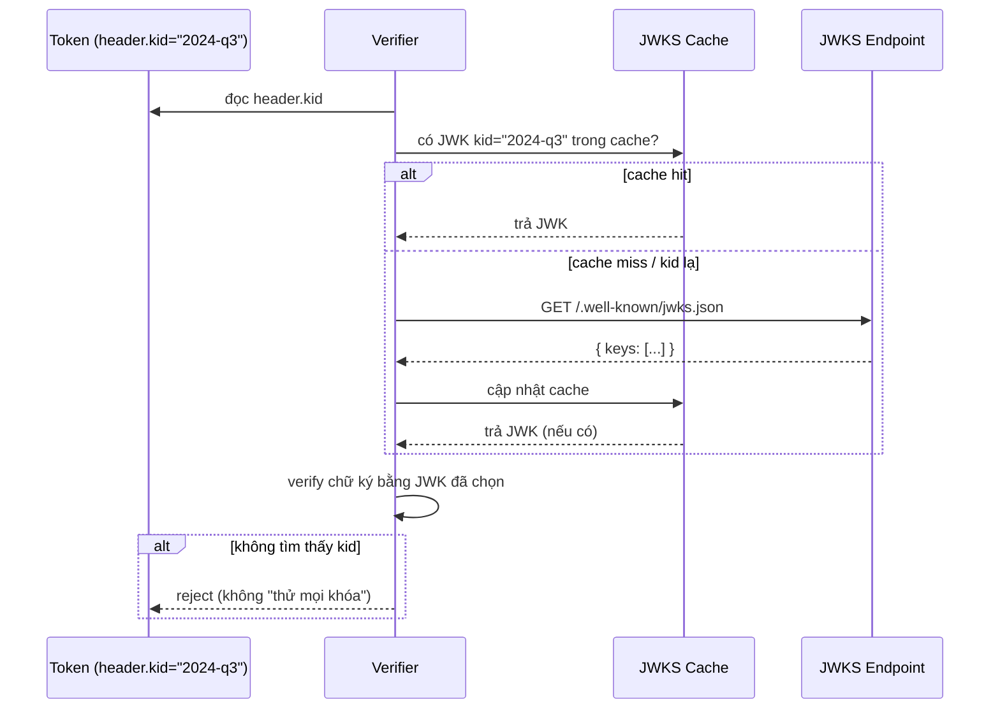

# JWK & JWKS — Deep Dive

## Mục lục

- [Bài toán: làm sao 20 service biết khóa để verify?](#1-bài-toán-làm-sao-20-service-biết-khóa-để-verify)
- [JWK là gì — public key mặc áo JSON](#2-jwk-là-gì--public-key-mặc-áo-json)
- [Mổ xẻ từng field của một JWK](#3-mổ-xẻ-từng-field-của-một-jwk)
- [JWK cho RSA vs EC — khác nhau ở đâu](#4-jwk-cho-rsa-vs-ec--khác-nhau-ở-đâu)
- [JWKS — một tập khóa publish qua HTTP](#5-jwks--một-tập-khóa-publish-qua-http)
- [Verifier chọn key thế nào — vai trò của kid](#6-verifier-chọn-key-thế-nào--vai-trò-của-kid)
- [Cache & refetch — đừng gọi JWKS mỗi request](#7-cache--refetch--đừng-gọi-jwks-mỗi-request)
- [JWK Thumbprint — định danh khóa ổn định](#8-jwk-thumbprint--định-danh-khóa-ổn-định)
- [Bẫy bảo mật quanh JWK/JWKS](#9-bẫy-bảo-mật-quanh-jwkjwks)
- [Code thực chiến — publish & verify qua JWKS](#10-code-thực-chiến--publish--verify-qua-jwks)
- [Anti-patterns cần tránh](#11-anti-patterns-cần-tránh)
- [Tóm tắt — Cheat sheet](#12-tóm-tắt--cheat-sheet)

---

## 1. Bài toán: làm sao 20 service biết khóa để verify?

Bạn đã chọn đúng: dùng RS256/ES256 bất đối xứng (xem [HMAC vs RSA vs ECDSA — Deep Dive](/cryptography/hmac-vs-rsa-vs-ecdsa/)), auth server giữ private key để ký, các service khác chỉ cần **public key** để verify. Câu hỏi vận hành lập tức nảy ra:

```diagram
auth-svc (giữ private key, KÝ)
     │  phát token RS256
     ▼
20 service cần VERIFY  →  mỗi service lấy public key ở đâu? bằng cách nào?
```

Cách ngây thơ: copy file `public.pem` vào cả 20 service. Nhưng rồi:

- Đến kỳ **xoay khóa**, bạn phải deploy lại cả 20 service với public key mới — không có khóa cũ thì token đang lưu hành chết hàng loạt.
- Không có cách nào để 20 service biết "khóa nào ứng với token nào" khi có nhiều khóa song song.

> [!IMPORTANT]
> JWK và JWKS sinh ra để giải đúng bài toán này: **chuẩn hóa cách biểu diễn public key (JWK) và cách phân phối chúng qua một URL HTTP (JWKS)** — để mọi verifier tự tải khóa cần thiết, tự cập nhật khi khóa xoay, mà không cần deploy lại. Đây là nền tảng cho key rotation không downtime (xem [Key Rotation — Deep Dive](/cryptography/key-rotation/)).

---

## 2. JWK là gì — public key mặc áo JSON

**JWK (JSON Web Key, RFC 7517)** là một object JSON biểu diễn một khóa mật mã. Thay vì định dạng PEM/DER nhị phân khó nhúng vào JSON, JWK mô tả khóa bằng các field JSON đọc được.

```diagram
PEM (RSA public key)                JWK (cùng khóa đó)
-----BEGIN PUBLIC KEY-----          {
MIIBIjANBgkqhkiG9w0BAQEFAAOC...       "kty": "RSA",
...base64 DER...                      "n": "0vx7 ... (modulus base64url)",
-----END PUBLIC KEY-----              "e": "AQAB",
                                      "kid": "2024-q3",
                                      "use": "sig",
                                      "alg": "RS256"
                                    }
```

Cùng một khóa, hai cách viết. JWK thắng ở chỗ: **tự mô tả** (kèm `kid`, `use`, `alg`), nhúng JSON gọn, và ghép được thành mảng (JWKS).

---

## 3. Mổ xẻ từng field của một JWK

```diagram
{
  "kty": "RSA",        ← Key Type: bắt buộc. "RSA" | "EC" | "OKP" (EdDSA) | "oct" (HMAC)
  "use": "sig",        ← dùng để làm gì: "sig" (ký/verify) | "enc" (mã hóa)
  "alg": "RS256",      ← thuật toán dự kiến dùng với khóa này
  "kid": "2024-q3",    ← Key ID: nhãn để token tham chiếu (header.kid)
  "n":   "0vx7...",    ← (RSA) modulus, base64url
  "e":   "AQAB"        ← (RSA) public exponent, base64url (AQAB = 65537)
}
```

| Field | Ý nghĩa | Ghi chú |
|-------|---------|---------|
| `kty` | Key Type | **Bắt buộc**. Quyết định các field còn lại (RSA dùng n/e; EC dùng crv/x/y) |
| `use` | Mục đích | `sig` cho ký/verify, `enc` cho mã hóa; verifier nên kiểm `use=sig` |
| `key_ops` | Thao tác cho phép | Thay thế chi tiết hơn `use` (vd `["verify"]`) |
| `alg` | Thuật toán | Gợi ý alg dự kiến — nhưng verifier vẫn phải tự ghim allowlist |
| `kid` | Key ID | Khớp với `header.kid` của token để chọn đúng khóa |
| `x5c`/`x5t` | Chuỗi cert X.509 / thumbprint | Khi key đi kèm certificate |

> [!NOTE]
> `alg` và `use` trong JWK chỉ là **metadata gợi ý**. Verifier KHÔNG được phó mặc quyết định bảo mật cho chúng — luôn tự ghim `algorithms` của mình (xem [Algorithm Confusion — Deep Dive](/security/algorithm-confusion-deep-dive/)).

---

## 4. JWK cho RSA vs EC — khác nhau ở đâu

Các field phụ thuộc vào `kty`:

```diagram
RSA  (kty="RSA")                 EC  (kty="EC")                 EdDSA (kty="OKP")
┌────────────────────┐          ┌────────────────────┐         ┌────────────────────┐
│ "kty": "RSA"        │          │ "kty": "EC"         │         │ "kty": "OKP"        │
│ "n": "<modulus>"    │          │ "crv": "P-256"      │         │ "crv": "Ed25519"    │
│ "e": "AQAB"         │          │ "x": "<toạ độ x>"   │         │ "x": "<public key>" │
│                     │          │ "y": "<toạ độ y>"   │         │                     │
└────────────────────┘          └────────────────────┘         └────────────────────┘
 modulus n + exponent e          điểm (x, y) trên đường cong     1 điểm nén (chỉ x)
```

| `kty` | Thuật toán JWT | Field định danh khóa |
|-------|----------------|----------------------|
| `RSA` | RS256/384/512, PS256/384/512 | `n` (modulus), `e` (exponent) |
| `EC` | ES256 (P-256), ES384 (P-384), ES512 (P-521) | `crv`, `x`, `y` |
| `OKP` | EdDSA (Ed25519/Ed448) | `crv`, `x` |
| `oct` | HS256/384/512 | `k` (secret — **không bao giờ** publish công khai!) |

> [!WARNING]
> `kty: "oct"` là khóa đối xứng (HMAC secret) — nó là **bí mật**. Không bao giờ đưa khóa `oct` vào JWKS công khai; làm vậy là phát tán secret cho cả thế giới ký token. JWKS công khai chỉ chứa **public key** (`RSA`/`EC`/`OKP`).

---

## 5. JWKS — một tập khóa publish qua HTTP

**JWKS (JSON Web Key Set)** đơn giản là một object có field `keys` chứa **mảng** các JWK. Nó thường được publish tại một URL cố định:

```diagram
GET https://auth.example.com/.well-known/jwks.json
```

```json
{
  "keys": [
    {
      "kty": "RSA", "use": "sig", "alg": "RS256",
      "kid": "2024-q2",
      "n": "rR2f...cũ...", "e": "AQAB"
    },
    {
      "kty": "RSA", "use": "sig", "alg": "RS256",
      "kid": "2024-q3",
      "n": "8mKp...mới...", "e": "AQAB"
    }
  ]
}
```

```diagram
Vì sao là một MẢNG, không phải một khóa?
   → để chứa NHIỀU khóa cùng lúc trong giai đoạn xoay vòng:
       kid=2024-q2 (khóa cũ, vẫn verify token cũ chưa hết hạn)
       kid=2024-q3 (khóa mới, ký token mới)
   → verifier tự chọn khóa theo kid của từng token
```

> [!NOTE]
> Đường dẫn `/.well-known/jwks.json` là quy ước phổ biến (OIDC). Provider thường công bố URL chính xác trong document `/.well-known/openid-configuration` ở field `jwks_uri`. Verifier nên đọc URL từ cấu hình tin cậy, không phải từ token.

---

## 6. Verifier chọn key thế nào — vai trò của kid

Khi nhận token, verifier đọc `kid` trong **header** rồi tra trong JWKS:



```diagram
Quy tắc chọn key:
   1. token.header.kid  →  tìm JWK có "kid" trùng trong keys[]
   2. khớp thêm kty/alg phù hợp với alg verifier cho phép
   3. KHÔNG thấy → refetch JWKS (nếu cache cũ) → vẫn không → REJECT
```

> [!IMPORTANT]
> `kid` chỉ là **gợi ý để chọn khóa**, không phải yếu tố bảo mật. Đừng nối thẳng `kid` vào path/SQL (đòn kid injection), và đừng "thử lần lượt mọi khóa" khi không khớp — chọn sai cách xử lý kid mở ra lỗ hổng (xem [Algorithm Confusion — Deep Dive §8](/security/algorithm-confusion-deep-dive/)).

---

## 7. Cache & refetch — đừng gọi JWKS mỗi request

Fetch JWKS qua HTTP cho **mỗi** request verify là thảm họa hiệu năng (và phụ thuộc mạng). Verifier phải cache:

```diagram
Chiến lược cache JWKS:
   • Cache toàn bộ key set theo TTL (vd 10 phút – vài giờ)
   • Tra kid trong cache trước
   • Gặp kid LẠ (không có trong cache) → refetch 1 lần (token mới ký bằng key mới)
   • Có rate-limit/cooldown để chống bị "kid rác" ép refetch liên tục (DoS)
   • Tôn trọng Cache-Control/max-age của JWKS endpoint nếu có
```

```diagram
   ┌─ request đến ─┐
   │  đọc kid       │
   │  kid ∈ cache?  │── có ──▶ verify luôn
   │      │ không            
   │      ▼                  
   │  refetch JWKS (nếu chưa refetch gần đây)
   │  kid ∈ cache mới? ── có ──▶ verify
   │      │ không
   │      ▼
   │   REJECT (fail-closed)
   └────────────────┘
```

> [!TIP]
> Thư viện tốt (vd `jose` với `createRemoteJWKSet`) lo sẵn cache + refetch + cooldown. Đừng tự viết tay phần này nếu không cần — dễ sót rate-limit và biến JWKS endpoint thành điểm chịu tải/DoS.

---

## 8. JWK Thumbprint — định danh khóa ổn định

Đôi khi cần một **định danh tất định** cho khóa (vd tự sinh `kid`, hoặc so khớp hai khóa có phải một). **JWK Thumbprint (RFC 7638)** chuẩn hóa điều này:

```diagram
Thumbprint(JWK):
   1. Lấy ĐÚNG các field bắt buộc theo kty, theo thứ tự lexicographic:
        RSA → {"e","kty","n"}
        EC  → {"crv","kty","x","y"}
        OKP → {"crv","kty","x"}
   2. Serialize JSON canonical (không khoảng trắng, key sắp xếp)
   3. SHA-256 → base64url
   → ra một chuỗi cố định, độc lập với cách trình bày JWK
```

```diagram
Dùng để:
   • Sinh kid ổn định (kid = thumbprint) → cùng khóa luôn ra cùng kid
   • So khớp khóa giữa hai hệ thống mà không lo khác thứ tự field
```

> [!NOTE]
> Thumbprint chỉ tính trên các field **public bắt buộc** — nên thumbprint của private key và public key tương ứng là **giống nhau**, an toàn để công bố.

---

## 9. Bẫy bảo mật quanh JWK/JWKS

Vì verifier *tải khóa từ nguồn ngoài*, đây là vùng nhạy cảm. Các bẫy chính (chi tiết đòn tấn công ở [Algorithm Confusion — Deep Dive](/security/algorithm-confusion-deep-dive/)):

| Bẫy | Vì sao nguy hiểm | Phòng thủ |
|-----|------------------|-----------|
| Tin `jku` trong header (URL JWKS do token chỉ định) | Token trỏ verifier tới JWKS của attacker | Chỉ dùng `jwks_uri` cấu hình sẵn; bỏ qua `jku` |
| Tin `jwk` nhúng trong header | Token tự mang khóa → self-signed | Bỏ qua `jwk` header; khóa chỉ từ JWKS tin cậy |
| Publish khóa `oct` (HMAC) trong JWKS | Phát tán secret → ai cũng ký được | JWKS công khai chỉ chứa public key |
| Fetch JWKS qua HTTP (không TLS) | MITM thay khóa | Luôn HTTPS; pin host |
| Không giới hạn refetch | kid rác ép DoS | Rate-limit + cooldown |
| Bỏ qua `use`/`kty` khi chọn key | Dùng nhầm khóa enc để verify sig | Kiểm `use=sig`, `kty`/`alg` khớp allowlist |

> [!WARNING]
> Nguyên tắc bất biến: **verifier biết trước khóa hợp lệ đến từ đâu** (một `jwks_uri` cố định, qua HTTPS). Mọi thông tin khóa *nằm trong token* (`jku`, `jwk`, `x5u`) đều do bên gửi điền → không đáng tin → bỏ qua.

---

## 10. Code thực chiến — publish & verify qua JWKS

### 10.1. Auth server publish JWKS

```javascript
import { exportJWK, calculateJwkThumbprint, generateKeyPair } from 'jose';

const { publicKey, privateKey } = await generateKeyPair('RS256');

const jwk = await exportJWK(publicKey);          // PEM/KeyObject → JWK
jwk.use = 'sig';
jwk.alg = 'RS256';
jwk.kid = await calculateJwkThumbprint(jwk);     // kid ổn định theo RFC 7638

// Endpoint /.well-known/jwks.json trả về:
const jwks = { keys: [jwk] };                    // mảng — sẵn sàng cho rotation
// (private key giữ kín ở auth server để ký)
```

### 10.2. Verifier dùng JWKS từ xa (cache + refetch tự động)

```javascript
import { createRemoteJWKSet, jwtVerify } from 'jose';

// Tải & cache JWKS; tự refetch khi gặp kid lạ; có cooldown chống DoS
const JWKS = createRemoteJWKSet(
  new URL('https://auth.example.com/.well-known/jwks.json')
);

async function verify(token) {
  const { payload, protectedHeader } = await jwtVerify(token, JWKS, {
    algorithms: ['RS256'],                       // ghim alg — bắt buộc
    issuer: 'https://auth.example.com',
    audience: 'api.payments',
  });
  // jose tự đọc protectedHeader.kid và chọn JWK tương ứng trong set
  return payload;
}
```

### 10.3. Xem một JWKS thật

```bash
# Ví dụ với Google (provider OIDC công khai)
curl -s https://www.googleapis.com/oauth2/v3/certs | jq
# → { "keys": [ { "kty":"RSA","kid":"...","n":"...","e":"AQAB","use":"sig","alg":"RS256" }, ... ] }
```

---

## 11. Anti-patterns cần tránh

| Anti-pattern | Hậu quả | Làm đúng |
|--------------|---------|----------|
| Copy `public.pem` vào N service thủ công | Xoay khóa = deploy lại N service | Publish JWKS; verifier tự tải |
| Fetch JWKS mỗi request | Chậm, phụ thuộc mạng, dễ DoS | Cache theo TTL + refetch khi kid lạ |
| Lấy URL JWKS từ `jku` trong token | Verify bằng khóa attacker | `jwks_uri` cố định, HTTPS |
| Đưa khóa `oct` (HMAC) vào JWKS công khai | Phát tán secret | Chỉ public key trong JWKS |
| Bỏ `kid` (chỉ có 1 khóa "cho gọn") | Không xoay khóa được sau này | Luôn đặt `kid`, dùng mảng `keys[]` |
| "Thử mọi khóa" khi kid không khớp | Mở rộng bề mặt tấn công | Không khớp kid → reject |
| Tin `alg`/`use` trong JWK thay vì tự ghim | alg confusion | Verifier tự ghim `algorithms` |

---

## 12. Tóm tắt — Cheat sheet

```diagram
╭──────────────────────────────────────────────────────────────╮
│  JWK  = một public key dạng JSON, tự mô tả                    │
│         kty (RSA→n,e | EC→crv,x,y | OKP→crv,x | oct→k=SECRET) │
│         + kid, use="sig", alg                                 │
│                                                                │
│  JWKS = { "keys": [ JWK, JWK, ... ] } publish qua HTTPS       │
│         tại jwks_uri cố định (vd /.well-known/jwks.json)      │
│         → mảng để chứa nhiều khóa khi xoay vòng               │
│                                                                │
│  VERIFY:  token.header.kid → tra JWK trong set → verify       │
│           cache + refetch khi kid lạ (có cooldown)            │
│           không thấy kid → REJECT (fail-closed)               │
│                                                                │
│  TIN CẬY: khóa chỉ đến từ jwks_uri cấu hình sẵn.             │
│           BỎ QUA jku / jwk / x5u trong header token.          │
│           JWKS công khai KHÔNG chứa khóa oct (HMAC).          │
╰──────────────────────────────────────────────────────────────╯
```

**3 nguyên tắc xương sống:**

1. **JWK chuẩn hóa "khóa", JWKS chuẩn hóa "phát khóa".** Nhờ đó nhiều verifier tự lấy public key và tự cập nhật khi khóa xoay — không deploy lại.
2. **`kid` để chọn khóa, không phải để tin.** Tra trong set tin cậy; không nối vào path/SQL; không khớp thì reject.
3. **Nguồn khóa do verifier kiểm soát.** Chỉ `jwks_uri` cố định qua HTTPS; bỏ qua mọi khóa token tự khai (`jku`/`jwk`); không bao giờ publish secret HMAC.

Đọc tiếp: [Key Rotation — Deep Dive](/cryptography/key-rotation/) — cách dùng JWKS + `kid` để xoay khóa không downtime.
