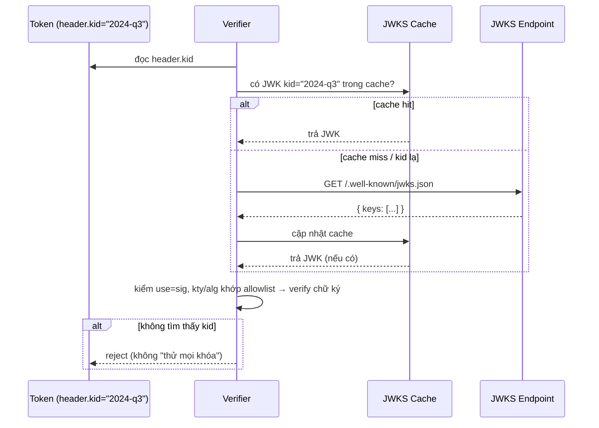

# JWK & JWKS — Deep Dive

## Mục lục

- [Bài toán: làm sao 20 service biết khóa để verify?](#1-bài-toán-làm-sao-20-service-biết-khóa-để-verify)
- [JWK là gì — public key mặc áo JSON](#2-jwk-là-gì--public-key-mặc-áo-json)
- [Mổ xẻ từng field của một JWK](#3-mổ-xẻ-từng-field-của-một-jwk)
- [JWK cho RSA vs EC vs OKP — khác nhau ở đâu](#4-jwk-cho-rsa-vs-ec-vs-okp--khác-nhau-ở-đâu)
- [PEM → JWK tới từng byte: bẫy leading-zero & zero-pad](#5-pem--jwk-tới-từng-byte-bẫy-leading-zero--zero-pad)
- [JWKS — một tập khóa publish qua HTTP](#6-jwks--một-tập-khóa-publish-qua-http)
- [Verifier chọn key thế nào — vai trò của kid](#7-verifier-chọn-key-thế-nào--vai-trò-của-kid)
- [Cache & refetch — HTTP header, cooldown, thundering herd](#8-cache--refetch--http-header-cooldown-thundering-herd)
- [JWK Thumbprint — tính tay theo RFC 7638](#9-jwk-thumbprint--tính-tay-theo-rfc-7638)
- [x5c / x5t — khi khóa đi kèm certificate](#10-x5c--x5t--khi-khóa-đi-kèm-certificate)
- [Bẫy bảo mật & walkthrough jku/jwk injection](#11-bẫy-bảo-mật--walkthrough-jkujwk-injection)
- [Code thực chiến — publish & verify qua JWKS](#12-code-thực-chiến--publish--verify-qua-jwks)
- [Anti-patterns cần tránh](#13-anti-patterns-cần-tránh)
- [Tóm tắt — Cheat sheet](#14-tóm-tắt--cheat-sheet)

---

## 1. Bài toán: làm sao 20 service biết khóa để verify?

Bạn đã chọn đúng: dùng RS256/ES256 bất đối xứng (xem [HMAC vs RSA vs ECDSA — Deep Dive](/cryptography/hmac-vs-rsa-vs-ecdsa/)), auth server giữ private key để ký, các service khác chỉ cần **public key** để verify. Câu hỏi vận hành lập tức nảy ra:

```diagram
auth-svc (giữ private key, KÝ)
     │  phát token RS256
     ▼
20 service cần VERIFY  →  mỗi service lấy public key ở đâu? bằng cách nào?
```

Cách ngây thơ: copy file `public.pem` vào cả 20 service. Nhưng rồi:

- Đến kỳ **xoay khóa**, bạn phải deploy lại cả 20 service với public key mới — không có khóa cũ thì token đang lưu hành chết hàng loạt.
- Không có cách nào để 20 service biết "khóa nào ứng với token nào" khi có nhiều khóa song song.

> [!IMPORTANT]
> JWK và JWKS sinh ra để giải đúng bài toán này: **chuẩn hóa cách biểu diễn public key (JWK) và cách phân phối chúng qua một URL HTTP (JWKS)** — để mọi verifier tự tải khóa cần thiết, tự cập nhật khi khóa xoay, mà không cần deploy lại. Đây là nền tảng cho key rotation không downtime (xem [Key Rotation — Deep Dive](/cryptography/key-rotation/)).

---

## 2. JWK là gì — public key mặc áo JSON

**JWK (JSON Web Key, RFC 7517)** là một object JSON biểu diễn một khóa mật mã. Thay vì định dạng PEM/DER nhị phân khó nhúng vào JSON, JWK mô tả khóa bằng các field JSON đọc được.

```diagram
PEM (RSA public key)                JWK (cùng khóa đó)
-----BEGIN PUBLIC KEY-----          {
MIIBIjANBgkqhkiG9w0BAQEFAAOC...       "kty": "RSA",
...base64 DER...                      "n": "0vx7 ... (modulus base64url)",
-----END PUBLIC KEY-----              "e": "AQAB",
                                      "kid": "2024-q3",
                                      "use": "sig",
                                      "alg": "RS256"
                                    }
```

Cả hai đều mã hóa *đúng cùng các con số* (modulus + exponent), chỉ khác lớp đóng gói:

```diagram
PEM = Base64 của một cấu trúc DER/ASN.1 (SubjectPublicKeyInfo) lồng nhiều lớp
JWK = JSON, mỗi con số là một field riêng, base64url, KHÔNG lồng ASN.1
```

JWK thắng ở chỗ: **tự mô tả** (kèm `kid`, `use`, `alg`), nhúng JSON gọn, ghép được thành mảng (JWKS), và không phải parse ASN.1.

---

## 3. Mổ xẻ từng field của một JWK

```diagram
{
  "kty": "RSA",        ← Key Type: bắt buộc. "RSA" | "EC" | "OKP" (EdDSA) | "oct" (HMAC)
  "use": "sig",        ← dùng để làm gì: "sig" (ký/verify) | "enc" (mã hóa)
  "key_ops": ["verify"], ← (tùy chọn) thao tác cho phép, chi tiết hơn use
  "alg": "RS256",      ← thuật toán dự kiến dùng với khóa này
  "kid": "2024-q3",    ← Key ID: nhãn để token tham chiếu (header.kid)
  "n":   "0vx7...",    ← (RSA) modulus, base64url
  "e":   "AQAB"        ← (RSA) public exponent, base64url (AQAB = 65537)
}
```

| Field | Ý nghĩa | Ghi chú |
|-------|---------|---------|
| `kty` | Key Type | **Bắt buộc**. Quyết định các field còn lại (RSA dùng n/e; EC dùng crv/x/y) |
| `use` | Mục đích | `sig` cho ký/verify, `enc` cho mã hóa; verifier nên kiểm `use=sig` |
| `key_ops` | Thao tác cho phép | Mảng (vd `["verify"]`); không nên đặt cùng `use` mâu thuẫn |
| `alg` | Thuật toán | Gợi ý alg dự kiến — nhưng verifier vẫn phải tự ghim allowlist |
| `kid` | Key ID | Khớp với `header.kid` của token để chọn đúng khóa |
| `x5c` | Chuỗi cert X.509 (base64 DER) | Khi key đi kèm certificate — xem §10 |
| `x5t`/`x5t#S256` | Thumbprint của cert (SHA-1 / SHA-256) | Trỏ tới cert, **khác** JWK thumbprint (§9) |

> [!NOTE]
> `alg` và `use` trong JWK chỉ là **metadata gợi ý**. Verifier KHÔNG được phó mặc quyết định bảo mật cho chúng — luôn tự ghim `algorithms` của mình (xem [Algorithm Confusion — Deep Dive](/security/algorithm-confusion-deep-dive/)). Đừng nhầm `x5t` (thumbprint của *certificate*) với JWK Thumbprint RFC 7638 (thumbprint của *bản thân khóa*).

---

## 4. JWK cho RSA vs EC vs OKP — khác nhau ở đâu

Các field phụ thuộc vào `kty`:

```diagram
RSA  (kty="RSA")                 EC  (kty="EC")                 EdDSA (kty="OKP")
┌────────────────────┐          ┌────────────────────┐         ┌────────────────────┐
│ "kty": "RSA"       │          │ "kty": "EC"        │         │ "kty": "OKP"       │
│ "n": "<modulus>"   │          │ "crv": "P-256"     │         │ "crv": "Ed25519"   │
│ "e": "AQAB"        │          │ "x": "<toạ độ x>"  │         │ "x": "<public key>"│
│                    │          │ "y": "<toạ độ y>"  │         │                    │
└────────────────────┘          └────────────────────┘         └────────────────────┘
 modulus n + exponent e          điểm (x, y) trên đường cong     1 toạ độ nén (chỉ x)
```

| `kty` | Thuật toán JWT | Field định danh khóa | Độ dài (ví dụ) |
|-------|----------------|----------------------|----------------|
| `RSA` | RS256/384/512, PS256/384/512 | `n` (modulus), `e` (exponent) | n: 256B (RSA-2048) |
| `EC` | ES256 (P-256), ES384 (P-384), ES512 (P-521) | `crv`, `x`, `y` | x,y: 32B mỗi cái (P-256) |
| `OKP` | EdDSA (Ed25519/Ed448) | `crv`, `x` | x: 32B (Ed25519) |
| `oct` | HS256/384/512 | `k` (secret — **không bao giờ** publish công khai!) | ≥ 32B |

> [!WARNING]
> `kty: "oct"` là khóa đối xứng (HMAC secret) — nó là **bí mật**. Không bao giờ đưa khóa `oct` vào JWKS công khai; làm vậy là phát tán secret cho cả thế giới ký token. JWKS công khai chỉ chứa **public key** (`RSA`/`EC`/`OKP`).

---

## 5. PEM → JWK tới từng byte: bẫy leading-zero & zero-pad

Đây là phần hay bị hiểu mơ hồ nhất. "Số" trong JWK được mã hóa là **integer big-endian không dấu (unsigned)**, rồi base64url. Nhưng RSA và EC mã hóa độ dài **khác nhau** — và đó là nguồn của hai lỗi kinh điển.

### 5.1. `e` (exponent) — ví dụ rõ nhất

```diagram
e = 65537 = 0x01 00 01   (3 byte, big-endian)
   → base64url("01 00 01") = "AQAB"

Kiểm tra ngược:  base64url-decode("AQAB") = bytes 01 00 01 = 65537 ✓
```

Hầu hết JWK RSA có `"e":"AQAB"` chính là vì `65537` được khuyến nghị làm public exponent (xem [HMAC vs RSA vs ECDSA §4.1](/cryptography/hmac-vs-rsa-vs-ecdsa/)).

### 5.2. `n` (modulus RSA) — bẫy leading-zero `0x00`

RSA-2048 có modulus đúng **256 byte**. Nhưng có một bẫy đến từ khác biệt giữa DER và JWK:

```diagram
ASN.1 INTEGER (trong DER/PEM) là số có DẤU (signed):
   → nếu byte cao nhất ≥ 0x80 (bit dấu = 1), DER PHẢI thêm 1 byte 0x00 ở đầu
     để số không bị hiểu là âm.

JWK dùng số KHÔNG DẤU (unsigned, RFC 7518):
   → KHÔNG có byte 0x00 thừa đó.
```

Ví dụ thật (modulus 256 byte, byte đầu = `0xAD`, có bit cao = 1):

```diagram
DER (signed) :  00 AD 9C ... (257 byte — thêm 00 vì 0xAD ≥ 0x80)
JWK  n (unsigned):  AD 9C ...   (256 byte — KHÔNG có 00)
   → base64url(256 byte) = chuỗi 342 ký tự

LỖI THƯỜNG GẶP: copy nguyên byte modulus từ DER (kèm 00) vào JWK
   → một số thư viện chặt chẽ coi là sai độ dài / sai khóa → verify fail
```

Minh họa thu nhỏ quy tắc: số có byte cao `0x8F` (≥ 0x80):

```diagram
DER  : 00 8F 2A     (thêm 00 vì 0x8F là "âm" nếu coi có dấu)
JWK  : 8F 2A        → base64url = "jyo"     (bỏ 00 đầu)
```

### 5.3. `x`, `y` (toạ độ EC) — ngược lại: PHẢI zero-pad cố định độ dài

EC làm **ngược** với RSA: mỗi toạ độ phải có **đúng** số byte của field (P-256 = 32 byte), **left-pad bằng `0x00`** nếu giá trị nhỏ:

```diagram
P-256:  x và y mỗi cái ĐÚNG 32 byte (RFC 7518 §6.2.1.2)
   → base64url(32 byte) = ĐÚNG 43 ký tự (không padding '=')

Nếu toạ độ tình cờ nhỏ (vài byte đầu là 0):
   ĐÚNG : 00 00 .. <giá trị> (đệm trái đủ 32 byte)
   SAI  : <giá trị> (chặt mất byte 0 đầu → 31 byte → khóa sai)
```

```diagram
TƯƠNG PHẢN dễ nhớ:
   RSA modulus n : minimal-unsigned (BỎ 0x00 đầu)        → độ dài có thể thay đổi
   EC toạ độ x,y : fixed-length (THÊM 0x00 đầu cho đủ)   → độ dài luôn = size đường cong
```

> [!IMPORTANT]
> Hai quy tắc trái chiều này là lý do "tự convert key bằng tay" hay sai. Trong thực tế hãy dùng `crypto.export({format:'jwk'})` (Node) hoặc `exportJWK` (jose) — chúng xử lý đúng leading-zero và zero-pad. Phần này để bạn *hiểu* khi debug một JWK "trông đúng mà verify fail".

### 5.4. Tự convert (để hiểu, không để tự cài production)

```javascript
import { createPublicKey } from 'crypto';

const pub = createPublicKey(pemString);
const jwk = pub.export({ format: 'jwk' });   // xử lý đúng unsigned/zero-pad
// RSA → { kty:'RSA', n:'...(342 ký tự)...', e:'AQAB' }
// EC  → { kty:'EC', crv:'P-256', x:'...(43)...', y:'...(43)...' }

// Kiểm độ dài để bắt lỗi:
const len = (b64u) => Buffer.from(b64u, 'base64url').length;
// RSA-2048: len(jwk.n) === 256 ; EC P-256: len(jwk.x) === 32 && len(jwk.y) === 32
```

---

## 6. JWKS — một tập khóa publish qua HTTP

**JWKS (JSON Web Key Set)** đơn giản là một object có field `keys` chứa **mảng** các JWK. Nó thường được publish tại một URL cố định:

```diagram
GET https://auth.example.com/.well-known/jwks.json
```

```json
{
  "keys": [
    {
      "kty": "RSA", "use": "sig", "alg": "RS256",
      "kid": "2024-q2",
      "n": "rR2f...cũ...", "e": "AQAB"
    },
    {
      "kty": "RSA", "use": "sig", "alg": "RS256",
      "kid": "2024-q3",
      "n": "8mKp...mới...", "e": "AQAB"
    }
  ]
}
```

```diagram
Vì sao là một MẢNG, không phải một khóa?
   → để chứa NHIỀU khóa cùng lúc trong giai đoạn xoay vòng:
       kid=2024-q2 (khóa cũ, vẫn verify token cũ chưa hết hạn)
       kid=2024-q3 (khóa mới, ký token mới)
   → verifier tự chọn khóa theo kid của từng token
```

```diagram
Một JWKS thật (rút gọn từ Google /oauth2/v3/certs):
{
  "keys": [
    { "kty":"RSA", "use":"sig", "alg":"RS256",
      "kid":"6f7254...", "n":"v8Hq9c...(342 ký tự)...", "e":"AQAB" },
    { "kty":"RSA", "use":"sig", "alg":"RS256",
      "kid":"a1b2c3...", "n":"q3Fg2w...", "e":"AQAB" }
  ]
}
   → luôn ≥ 2 khóa: Google xoay khóa thường xuyên, overlap nhiều khóa cùng lúc
```

> [!NOTE]
> Đường dẫn `/.well-known/jwks.json` là quy ước phổ biến (OIDC). Provider thường công bố URL chính xác trong document `/.well-known/openid-configuration` ở field `jwks_uri`. Verifier nên đọc URL từ cấu hình tin cậy, không phải từ token.

---

## 7. Verifier chọn key thế nào — vai trò của kid

Khi nhận token, verifier đọc `kid` trong **header** rồi tra trong JWKS:



```diagram
Quy tắc chọn key (theo thứ tự):
   1. token.header.kid  →  tìm JWK có "kid" trùng trong keys[]
   2. khớp thêm kty/alg phù hợp với alg verifier cho phép, và use="sig"
   3. KHÔNG thấy → refetch JWKS (nếu cache cũ) → vẫn không → REJECT
```

Các tình huống biên cần xử lý đúng:

| Tình huống | Xử lý đúng |
|------------|-----------|
| Token **không có** `kid`, JWKS chỉ 1 khóa | Dùng khóa duy nhất (chấp nhận được) |
| Token không có `kid`, JWKS **nhiều** khóa | Lọc theo `kty`/`alg`/`use`; nếu vẫn nhiều → reject (mơ hồ) |
| **Nhiều** JWK trùng `kid` | Lọc tiếp theo `kty`/`alg`; vẫn nhiều → reject hoặc thử đúng tập đã lọc |
| `kid` lạ (chưa có trong cache) | Refetch 1 lần; vẫn không có → reject |
| `kid` khớp nhưng `use="enc"` | Reject — sai mục đích khóa |

> [!IMPORTANT]
> `kid` chỉ là **gợi ý để chọn khóa**, không phải yếu tố bảo mật. Đừng nối thẳng `kid` vào path/SQL (đòn kid injection), và đừng "thử lần lượt mọi khóa" khi không khớp — chọn sai cách xử lý kid mở ra lỗ hổng (xem [Algorithm Confusion — Deep Dive §8](/security/algorithm-confusion-deep-dive/)).

---

## 8. Cache & refetch — HTTP header, cooldown, thundering herd

Fetch JWKS qua HTTP cho **mỗi** request verify là thảm họa hiệu năng (và phụ thuộc mạng). Verifier phải cache — nhưng cache đúng cách:

```diagram
Chiến lược cache JWKS:
   • Cache toàn bộ key set theo TTL (vd 5–15 phút)
   • Tra kid trong cache trước
   • Gặp kid LẠ (không có trong cache) → refetch 1 lần (token mới ký bằng key mới)
   • Có cooldown giữa các lần refetch để chống "kid rác" ép refetch liên tục (DoS)
   • Tôn trọng Cache-Control/max-age và dùng ETag/If-None-Match nếu endpoint hỗ trợ
```

### 8.1. Dùng HTTP header của chính JWKS endpoint

```diagram
JWKS endpoint nên trả:
   Cache-Control: public, max-age=600        ← verifier biết cache 10'
   ETag: "v3-2024q3"                         ← định danh phiên bản key set

Verifier refetch có điều kiện:
   GET /.well-known/jwks.json
   If-None-Match: "v3-2024q3"
   → 304 Not Modified (không tải lại body) nếu chưa đổi → rẻ
```

### 8.2. Hai bẫy vận hành

```diagram
THUNDERING HERD: cache hết hạn đồng loạt → 1000 verifier cùng GET JWKS một lúc
   → thêm JITTER vào TTL (vd 600s ± ngẫu nhiên 60s) để lệch thời điểm refetch

REFETCH BÃO HÒA: attacker gửi hàng loạt token với kid ngẫu nhiên (không tồn tại)
   → mỗi kid lạ kích 1 refetch → DoS lên JWKS endpoint
   → COOLDOWN: tối đa N refetch / khoảng thời gian; quá ngưỡng → reject luôn (không refetch)
```

```diagram
   ┌─ request đến ──────────────────────────────────────────────────────────────┐
   │  đọc kid                                                                   │
   │  kid ∈ cache?  │── có ──▶ verify luôn                                      │
   │      │ không                                                               │
   │      ▼                                                                     │
   │  đã refetch trong cooldown gần đây?  ── có ──▶ REJECT (không refetch nữa)  │
   │      │ chưa                                                                │
   │      ▼                                                                     │
   │  refetch JWKS (có điều kiện ETag)                                          │
   │  kid ∈ cache mới? ── có ──▶ verify                                         │
   │      │ không                                                               │
   │      ▼                                                                     │
   │   REJECT (fail-closed)                                                     │
   └────────────────────────────────────────────────────────────────────────────┘
```

> [!TIP]
> Thư viện tốt (vd `jose` với `createRemoteJWKSet`) lo sẵn cache + refetch + cooldown + dedup request đồng thời. Đừng tự viết tay phần này nếu không cần — dễ sót cooldown/jitter và biến JWKS endpoint thành điểm chịu tải/DoS.

---

## 9. JWK Thumbprint — tính tay theo RFC 7638

Đôi khi cần một **định danh tất định** cho khóa (vd tự sinh `kid`, hoặc so khớp hai khóa có phải một). **JWK Thumbprint (RFC 7638)** chuẩn hóa điều này. Quan trọng: phải dùng **JSON canonical** chính xác — sai một dấu cách là sai thumbprint.

```diagram
Thumbprint(JWK):
   1. Lấy ĐÚNG các field bắt buộc theo kty, theo thứ tự lexicographic (KHÔNG field nào khác):
        RSA → e, kty, n
        EC  → crv, kty, x, y
        OKP → crv, kty, x
   2. Serialize JSON canonical: KHÔNG khoảng trắng, key sắp xếp theo thứ tự trên
   3. SHA-256 → base64url (không '=')
   → ra một chuỗi cố định, độc lập với cách trình bày JWK
```

### Ví dụ tính tay (EC P-256, số thật)

```diagram
JWK (đầy đủ, có thể kèm kid/use/alg — nhưng thumbprint CHỈ dùng 4 field bắt buộc):
   { "kty":"EC", "crv":"P-256",
     "x":"cVXAmIrYmBzfOj6b59BLnlzVJPhFEZ9UbDoJbcmqMjw",
     "y":"7oTgAcVFMMxaBq2Z-7Ki4YOT3Om4rsLS1FH6nv1rMvw",
     "use":"sig", "kid":"bất kỳ" }

Bước 1+2  Canonical JSON (crv, kty, x, y — đúng thứ tự, không space):
   {"crv":"P-256","kty":"EC","x":"cVXAmIrYmBzfOj6b59BLnlzVJPhFEZ9UbDoJbcmqMjw","y":"7oTgAcVFMMxaBq2Z-7Ki4YOT3Om4rsLS1FH6nv1rMvw"}

Bước 3  SHA-256(canonical) → base64url:
   2mgfqcxRdPHaAC2pXj1fUmaSDE8e8N3NmomTPNeM6Xs
```

```javascript
import { createHash } from 'crypto';
const canon = `{"crv":"P-256","kty":"EC","x":"${x}","y":"${y}"}`;
const thumbprint = createHash('sha256').update(canon).digest('base64url');
// → "2mgfqcxRdPHaAC2pXj1fUmaSDE8e8N3NmomTPNeM6Xs"
```

> [!NOTE]
> Thumbprint chỉ tính trên các field **public bắt buộc** — nên thumbprint của private key và public key tương ứng là **giống nhau**, an toàn để công bố. Dùng nó làm `kid` giúp "cùng khóa luôn ra cùng `kid`" trên mọi hệ thống — rất tiện khi rotate (xem [Key Rotation — Deep Dive](/cryptography/key-rotation/)).

---

## 10. x5c / x5t — khi khóa đi kèm certificate

Một số provider (đặc biệt doanh nghiệp, AzureAD) publish khóa kèm **chuỗi certificate X.509** thay vì chỉ số khóa trần:

```diagram
{
  "kty":"RSA", "use":"sig", "kid":"...",
  "n":"...", "e":"AQAB",
  "x5c":[ "MIID...(cert lá, base64 DER)...", "MIIE...(cert CA trung gian)..." ],
  "x5t#S256":"...(SHA-256 thumbprint của cert lá)..."
}
```

```diagram
x5c   = mảng certificate (base64 DER), phần tử [0] là cert chứa CHÍNH public key này
x5t   = SHA-1 thumbprint của cert lá   (cũ)
x5t#S256 = SHA-256 thumbprint của cert lá  (nên dùng)
```

> [!WARNING]
> Khi có cả `n`/`e` lẫn `x5c`, **public key trong `x5c[0]` phải khớp** với `n`/`e`. Verifier cẩn thận nên dùng khóa từ một nguồn nhất quán và, nếu tin chain, kiểm cert hợp lệ (hạn, CA). Đừng "tin `x5c` mù" rồi bỏ qua `n`/`e` — và tuyệt đối đừng tải cert từ `x5u` (URL) do token chỉ định (cùng họ rủi ro với `jku`, xem §11).

---

## 11. Bẫy bảo mật & walkthrough jku/jwk injection

Vì verifier *tải khóa từ nguồn ngoài*, đây là vùng nhạy cảm nhất. Bảng tổng hợp (chi tiết đòn tấn công ở [Algorithm Confusion — Deep Dive](/security/algorithm-confusion-deep-dive/)):

| Bẫy | Vì sao nguy hiểm | Phòng thủ |
|-----|------------------|-----------|
| Tin `jku` trong header (URL JWKS do token chỉ định) | Token trỏ verifier tới JWKS của attacker | Chỉ dùng `jwks_uri` cấu hình sẵn; bỏ qua `jku` |
| Tin `jwk` nhúng trong header | Token tự mang khóa → self-signed | Bỏ qua `jwk` header; khóa chỉ từ JWKS tin cậy |
| Tin `x5u` (URL cert) trong header | Như `jku` nhưng với cert | Bỏ qua `x5u`; cert chỉ từ nguồn cấu hình |
| Publish khóa `oct` (HMAC) trong JWKS | Phát tán secret → ai cũng ký được | JWKS công khai chỉ chứa public key |
| Fetch JWKS qua HTTP (không TLS) | MITM thay khóa | Luôn HTTPS; pin host |
| Không giới hạn refetch | kid rác ép DoS | Rate-limit + cooldown + jitter |
| Bỏ qua `use`/`kty` khi chọn key | Dùng nhầm khóa enc để verify sig | Kiểm `use=sig`, `kty`/`alg` khớp allowlist |

### Walkthrough: đòn `jwk` header injection

```diagram
1. Attacker tự sinh CẶP khóa RSA của riêng mình (privA, pubA).
2. Tự ký một token admin bằng privA.
3. Nhét pubA vào header dưới dạng JWK:
      header = { "alg":"RS256", "jwk": { "kty":"RSA","n":"<pubA.n>","e":"AQAB" } }
4. Gửi lên server.

Server NGÂY THƠ:  "à, header có sẵn khóa, dùng luôn nó để verify"
   → verify token-của-attacker bằng khóa-của-attacker → KHỚP → admin!  ✗

Server ĐÚNG:  bỏ qua hoàn toàn header.jwk;
   chỉ lấy khóa từ jwks_uri cấu hình sẵn (khóa của auth server thật)
   → chữ ký không khớp khóa thật → REJECT  ✓
```

> [!WARNING]
> Nguyên tắc bất biến: **verifier biết trước khóa hợp lệ đến từ đâu** (một `jwks_uri` cố định, qua HTTPS). Mọi thông tin khóa *nằm trong token* (`jku`, `jwk`, `x5u`, `x5c`-tự-khai) đều do bên gửi điền → không đáng tin → bỏ qua hoặc kiểm rất chặt.

---

## 12. Code thực chiến — publish & verify qua JWKS

### 12.1. Auth server publish JWKS

```javascript
import { exportJWK, calculateJwkThumbprint, generateKeyPair } from 'jose';

const { publicKey, privateKey } = await generateKeyPair('RS256');

const jwk = await exportJWK(publicKey);          // KeyObject → JWK (đúng leading-zero)
jwk.use = 'sig';
jwk.alg = 'RS256';
jwk.kid = await calculateJwkThumbprint(jwk);     // kid ổn định theo RFC 7638

// Endpoint /.well-known/jwks.json trả về (kèm cache header):
//   Cache-Control: public, max-age=600
//   ETag: "<hash của key set>"
const jwks = { keys: [jwk] };                    // mảng — sẵn sàng cho rotation
// (private key giữ kín ở auth server để ký)
```

### 12.2. Verifier dùng JWKS từ xa (cache + refetch + cooldown tự động)

```javascript
import { createRemoteJWKSet, jwtVerify } from 'jose';

// Tải & cache JWKS; tự refetch khi gặp kid lạ; có cooldown chống DoS;
// dedup các request fetch đồng thời (chống thundering herd)
const JWKS = createRemoteJWKSet(
  new URL('https://auth.example.com/.well-known/jwks.json'),
  { cacheMaxAge: 600_000, cooldownDuration: 30_000 },
);

async function verify(token) {
  const { payload, protectedHeader } = await jwtVerify(token, JWKS, {
    algorithms: ['RS256'],                       // ghim alg — bắt buộc
    issuer: 'https://auth.example.com',
    audience: 'api.payments',
  });
  // jose tự đọc protectedHeader.kid và chọn JWK tương ứng trong set;
  // bỏ qua header.jwk/jku → an toàn trước injection
  return payload;
}
```

### 12.3. Xem & soi một JWKS thật

```bash
# Lấy jwks_uri từ OIDC discovery rồi tải JWKS
curl -s https://accounts.google.com/.well-known/openid-configuration | jq .jwks_uri
curl -s https://www.googleapis.com/oauth2/v3/certs | jq '.keys[] | {kid, kty, alg, n_len: (.n|length)}'
# → mỗi khóa: kid, kty=RSA, alg=RS256, n_len≈342 (256 byte modulus sau base64url)
```

---

## 13. Anti-patterns cần tránh

| Anti-pattern | Hậu quả | Làm đúng |
|--------------|---------|----------|
| Copy `public.pem` vào N service thủ công | Xoay khóa = deploy lại N service | Publish JWKS; verifier tự tải |
| Tự convert PEM→JWK, quên leading-zero `n` | Verify fail khó hiểu | Dùng `exportJWK`/`export({format:'jwk'})` |
| Chặt byte 0 đầu của toạ độ EC | Khóa sai (≠ 32 byte) | Zero-pad cố định độ dài đường cong |
| Fetch JWKS mỗi request | Chậm, phụ thuộc mạng, dễ DoS | Cache + refetch khi kid lạ + cooldown |
| Cache hết hạn đồng loạt | Thundering herd lên JWKS | Thêm jitter vào TTL |
| Lấy URL JWKS/cert từ `jku`/`x5u` trong token | Verify bằng khóa attacker | `jwks_uri` cố định, HTTPS |
| Tin `jwk`/`x5c` nhúng trong header | Self-signed forgery (§11) | Bỏ qua; khóa chỉ từ nguồn tin cậy |
| Đưa khóa `oct` (HMAC) vào JWKS công khai | Phát tán secret | Chỉ public key trong JWKS |
| Bỏ `kid` (chỉ có 1 khóa "cho gọn") | Không xoay khóa được sau này | Luôn đặt `kid`, dùng mảng `keys[]` |
| "Thử mọi khóa" khi kid không khớp | Mở rộng bề mặt tấn công | Không khớp kid → reject |
| Tin `alg`/`use` trong JWK thay vì tự ghim | alg confusion | Verifier tự ghim `algorithms` |

---

## 14. Tóm tắt — Cheat sheet

```diagram
╭────────────────────────────────────────────────────────────────╮
│  JWK  = một public key dạng JSON, tự mô tả                     │
│         kty (RSA→n,e | EC→crv,x,y | OKP→crv,x | oct→k=SECRET)  │
│         + kid, use="sig", alg                                  │
│                                                                │
│  MÃ HÓA SỐ (unsigned big-endian, base64url):                   │
│     RSA n : minimal-unsigned — BỎ byte 0x00 đầu (khác DER!)    │
│     EC x,y: fixed-length — THÊM 0x00 đầu cho đủ 32B (P-256)    │
│     e = 65537 = "AQAB"                                         │
│                                                                │
│  JWKS = { "keys": [ JWK, ... ] } qua HTTPS tại jwks_uri cố định│
│         mảng để chứa nhiều khóa khi xoay vòng                  │
│                                                                │
│  VERIFY: header.kid → tra JWK (lọc kty/alg/use=sig) → verify   │
│          cache theo Cache-Control/ETag; refetch khi kid lạ;    │
│          cooldown + jitter; không thấy → REJECT (fail-closed)  │
│                                                                │
│THUMBPRINT (RFC 7638): canonical JSON 4 field → SHA-256 → b64url│
│                                                                │
│  TIN CẬY: khóa CHỈ từ jwks_uri cấu hình sẵn.                   │
│           BỎ QUA jku / jwk / x5u / x5c-tự-khai trong token.    │
│           JWKS công khai KHÔNG chứa khóa oct (HMAC).           │
╰────────────────────────────────────────────────────────────────╯
```

**3 nguyên tắc xương sống:**

1. **JWK chuẩn hóa "khóa", JWKS chuẩn hóa "phát khóa".** Nhờ đó nhiều verifier tự lấy public key và tự cập nhật khi khóa xoay — không deploy lại. Hiểu cách số được mã hóa (leading-zero RSA, zero-pad EC) để debug được JWK "trông đúng mà fail".
2. **`kid` để chọn khóa, không phải để tin.** Tra trong set tin cậy, lọc theo `kty`/`alg`/`use`; không nối vào path/SQL; không khớp thì reject.
3. **Nguồn khóa do verifier kiểm soát.** Chỉ `jwks_uri` cố định qua HTTPS; bỏ qua mọi khóa token tự khai (`jku`/`jwk`/`x5u`); không bao giờ publish secret HMAC.

Đọc tiếp: [Key Rotation — Deep Dive](/cryptography/key-rotation/) — cách dùng JWKS + `kid` để xoay khóa không downtime.
