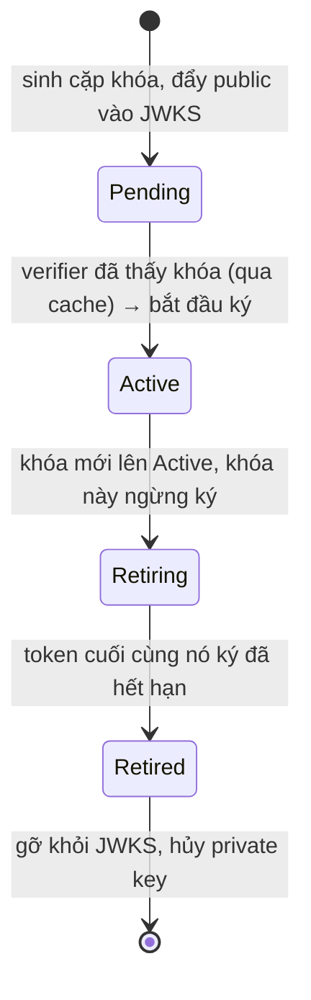

# Key Rotation — Deep Dive

## Mục lục

- [Sự cố: xoay khóa lúc nửa đêm, sáng ra 100% token chết](#1-sự-cố-xoay-khóa-lúc-nửa-đêm-sáng-ra-100-token-chết)
- [Vì sao phải xoay khóa](#2-vì-sao-phải-xoay-khóa)
- [Nguyên lý overlap — chìa khóa của zero-downtime](#3-nguyên-lý-overlap--chìa-khóa-của-zero-downtime)
- [Vòng đời một khóa ký](#4-vòng-đời-một-khóa-ký)
- [Timeline cụ thể: một vòng rotate với mốc giờ](#5-timeline-cụ-thể-một-vòng-rotate-với-mốc-giờ)
- [Quy trình rotate định kỳ — từng bước & rollback](#6-quy-trình-rotate-định-kỳ--từng-bước--rollback)
- [Tính overlap window — nhiều loại token & token dài hạn](#7-tính-overlap-window--nhiều-loại-token--token-dài-hạn)
- [Độ trễ lan truyền: cache, multi-region, CDN](#8-độ-trễ-lan-truyền-cache-multi-region-cdn)
- [Ký qua KMS/HSM — private key không bao giờ rời ra](#9-ký-qua-kmshsm--private-key-không-bao-giờ-rời-ra)
- [Rotate khẩn cấp khi khóa bị lộ — runbook](#10-rotate-khẩn-cấp-khi-khóa-bị-lộ--runbook)
- [Giám sát rotate — metric theo kid](#11-giám-sát-rotate--metric-theo-kid)
- [Code thực chiến — state machine rotate với kid](#12-code-thực-chiến--state-machine-rotate-với-kid)
- [Anti-patterns cần tránh](#13-anti-patterns-cần-tránh)
- [Tóm tắt — Cheat sheet](#14-tóm-tắt--cheat-sheet)

---

## 1. Sự cố: xoay khóa lúc nửa đêm, sáng ra 100% token chết

Đội security yêu cầu xoay khóa ký JWT định kỳ. Một kỹ sư làm "đúng tinh thần": tạo cặp khóa RSA mới, thay private key ở auth server, thay public key ở JWKS — tất cả trong một lần deploy, **xóa hẳn khóa cũ**.

```diagram
23:00  deploy: private key cũ → MỚI,  JWKS: [khóa cũ] → [khóa MỚI]   (xóa cũ)
23:01  mọi token đang lưu hành (ký bằng khóa CŨ) → verify bằng JWKS chỉ-có-khóa-mới
        → chữ ký không khớp → 401 TẤT CẢ
```

Hàng triệu access token đang còn hạn (ký bằng khóa cũ) bỗng không verify được, vì JWKS không còn khóa cũ để đối chiếu. Toàn bộ người dùng bị đăng xuất cưỡng bức lúc nửa đêm. Refresh cũng fail vì refresh flow cũng verify. Một sự cố sản xuất kinh điển — và hoàn toàn tránh được.

> [!IMPORTANT]
> Sai lầm gốc: coi rotate là **thay thế tức thời** (cũ → mới). Đúng ra rotate là một **giai đoạn chuyển tiếp có overlap**: khóa mới bắt đầu ký, *trong khi* khóa cũ vẫn còn trong JWKS để verify nốt những token nó đã ký — cho tới khi token cũ hết hạn tự nhiên. `kid` + JWKS (xem [JWK & JWKS — Deep Dive](/cryptography/jwk-and-jwks/)) là thứ làm overlap khả thi.

---

## 2. Vì sao phải xoay khóa

```diagram
• Giảm "blast radius": khóa dùng càng lâu, lộ ra thì càng nhiều token bị ảnh hưởng
• Tuân thủ: nhiều chuẩn (PCI-DSS, nội bộ) yêu cầu xoay khóa định kỳ
• Mật mã: hạn chế lượng dữ liệu ký bằng một khóa
• Quy trình sẵn sàng: rotate định kỳ = "diễn tập" để khi PHẢI rotate khẩn (lộ khóa)
  thì đội đã quen tay, không loay hoay giữa khủng hoảng
```

> [!NOTE]
> Lý do cuối quan trọng hơn vẻ ngoài: nếu chưa bao giờ rotate êm khi *bình thường*, thì lúc khóa bị lộ — đúng lúc áp lực cao nhất — sẽ là lần đầu thử, và rất dễ gây ra chính sự cố ở §1.

---

## 3. Nguyên lý overlap — chìa khóa của zero-downtime

Mấu chốt: **vai trò "ký" và "verify" của một khóa kết thúc ở hai thời điểm khác nhau.**

```diagram
Một khóa ngừng KÝ   →  ngay khi khóa mới lên thay
Một khóa ngừng VERIFY → chỉ khi token CUỐI CÙNG nó từng ký đã hết hạn

   → giữa hai mốc đó là OVERLAP WINDOW: khóa cũ "nghỉ ký" nhưng "vẫn verify"
```

```diagram
Trục thời gian (ví dụ access token sống 15 phút):

  Khóa A:  ████████████ KÝ ████████████┐
                                        └──── vẫn VERIFY (≥15') ────┐ xóa
                                                                    
  Khóa B:                  ┌──── publish vào JWKS trước ────┐
                           └──────────── KÝ ────────────────────────▶

  JWKS:    [A]            [A, B]                    [A, B]        [B]
                          ▲ B vào trước khi ký      ▲ A ở lại     ▲ A out
```

```diagram
Hai bất biến phải giữ:
   (1) Khóa MỚI phải có mặt trong JWKS TRƯỚC khi bắt đầu ký bằng nó
       → nếu không, token mới ký mà verifier chưa có khóa → 401
   (2) Khóa CŨ phải ở lại JWKS cho tới khi token cuối nó ký HẾT HẠN
       → nếu rút sớm, token cũ còn hạn → 401 (đúng sự cố §1)
```

---

## 4. Vòng đời một khóa ký



| Trạng thái | Có trong JWKS? | Dùng để ký? | Dùng để verify? | Ở trạng thái này bao lâu |
|------------|----------------|-------------|-----------------|--------------------------|
| **Pending** | ✅ (vừa thêm) | ❌ chưa | ✅ (sẵn sàng) | ≥ độ trễ lan truyền (cache TTL) |
| **Active** | ✅ | ✅ (khóa ký hiện hành) | ✅ | tới chu kỳ rotate kế tiếp |
| **Retiring** | ✅ | ❌ (đã nhường cho khóa mới) | ✅ (verify token cũ) | ≥ overlap (max token life + margin) |
| **Retired** | ❌ (đã gỡ) | ❌ | ❌ | vĩnh viễn |

> [!IMPORTANT]
> Giai đoạn **Pending** thường bị bỏ qua nhưng rất quan trọng: phải đợi khóa mới *lan truyền* tới mọi verifier (qua cache JWKS) **trước khi** dùng nó để ký. Nhảy thẳng từ "thêm khóa" sang "ký ngay" có thể khiến verifier còn cache cũ chưa thấy khóa → 401 cho token mới. Xem §8.

---

## 5. Timeline cụ thể: một vòng rotate với mốc giờ

Lý thuyết overlap dễ trôi tuột nếu không gắn số. Đặt tham số thật:

```diagram
Tham số ví dụ:
   access token TTL        = 15 phút
   JWKS cache TTL (verifier) = 10 phút
   margin (clock skew + thao tác) = 5 phút
   → overlap cần = 15 + 5 = 20 phút
```

```diagram
ĐỒNG HỒ        HÀNH ĐỘNG                                    JWKS              KÝ BẰNG
──────────     ─────────────────────────────────────────   ───────────────   ───────
10:00  T0      Sinh khóa B, publish public B vào JWKS        [A act, B pend]   A
               (B = Pending: verifier CÓ THỂ verify, CHƯA ký)

10:00–10:10    Chờ lan truyền ≥ cache TTL (10')              [A act, B pend]   A
               (mọi verifier refetch và thấy B)

10:10  T+10    PROMOTE: B → Active, A → Retiring             [A retr, B act]   B
               token mới từ giờ ký bằng B (kid=B)
               token A ký CUỐI ngay trước 10:10 → hết hạn ~10:25

10:10–10:30    OVERLAP (20'): A vẫn trong JWKS để verify     [A retr, B act]   B
               nốt token A đã ký (token A cuối hết hạn 10:25;
               +margin 5' = 10:30 cho chắc)

10:30  T+30    RETIRE: gỡ A khỏi JWKS, hủy private key A      [B act]           B
               (không còn token A hợp lệ nào → an toàn gỡ)
```

```diagram
Vì sao KHÔNG có 401 ở bất kỳ mốc nào:
   • Token ký bằng A (trước 10:10): A còn trong JWKS suốt tới 10:30 → verify OK
   • Token ký bằng B (sau 10:10):   B đã ở trong JWKS từ 10:00 → mọi verifier thấy → OK
   • 10:30 gỡ A: token A cuối đã hết hạn lúc 10:25 → không ai còn dùng A → OK
```

> [!TIP]
> Nếu verifier hỗ trợ "refetch khi gặp `kid` lạ" (xem [JWK & JWKS §8](/cryptography/jwk-and-jwks/)), bước chờ 10' ở Pending có thể an toàn hơn (khóa mới được kéo về ngay khi token đầu tiên ký bằng B xuất hiện). Nhưng vẫn nên giữ Pending để không phụ thuộc hoàn toàn vào refetch.

---

## 6. Quy trình rotate định kỳ — từng bước & rollback

```diagram
Bước 1  [Pending]  Sinh cặp khóa mới B (kid_B). Đẩy public key B vào JWKS.
                   JWKS = [A(active), B(pending)].  KHÔNG ký bằng B vội.

Bước 2  [Chờ lan]  Đợi ≥ TTL cache JWKS (và CDN, multi-region — xem §8).

Bước 3  [Active]   Đổi con trỏ "khóa ký hiện hành" A → B.
                   Token mới ký bằng B. A chuyển [Retiring]: vẫn trong JWKS để verify.

Bước 4  [Overlap]  Giữ A trong JWKS thêm ≥ overlap (max token life + margin).

Bước 5  [Retired]  Gỡ A khỏi JWKS. Hủy private key A an toàn.
                   JWKS = [B(active)].  Hoàn tất.
```

```diagram
Bất biến kiểm tra ở mỗi bước (gate — không qua thì DỪNG):
   • Trước bước 3: mọi verifier ĐÃ thấy B?         (nếu không → token B sẽ 401)
   • Trước bước 5: token cuối A ký ĐÃ hết hạn?      (nếu không → token A sẽ 401)
```

### Rollback — nếu khóa mới B "có vấn đề"

```diagram
Phát hiện B lỗi (vd KMS cấu hình sai, alg lệch) SAU khi promote:
   • A vẫn đang [Retiring] và CÒN trong JWKS → đổi con trỏ ký NGƯỢC về A
   • token đã lỡ ký bằng B: B vẫn trong JWKS (đang active) → vẫn verify được
   • điều tra B, sửa, rồi rotate lại từ đầu
   → Đây là lý do KHÔNG hủy A ngay khi promote B: overlap cũng là "mạng lưới an toàn" để rollback
```

> [!TIP]
> Tự động hóa quy trình này (cron + trạng thái khóa trong KMS/secret store) thay vì làm tay. Mỗi bước nên **idempotent**, và "khóa ký hiện hành" nên là một **con trỏ** (pointer) tới `kid` — rotate = đổi con trỏ, rollback = đổi con trỏ ngược lại, không deploy code.

---

## 7. Tính overlap window — nhiều loại token & token dài hạn

Overlap (thời gian giữ khóa cũ trong JWKS sau khi ngừng ký) phải **≥ tuổi thọ tối đa của token mà khóa cũ còn có thể đã ký**.

```diagram
overlap_tối_thiểu  ≥  max_token_lifetime  +  margin

   max_token_lifetime = exp − iat lớn nhất bạn cấp
   margin             = bù clock skew + độ trễ thao tác + độ trễ lan truyền (§8)
```

### Nhiều loại token ký bằng cùng khóa → lấy loại sống lâu nhất

| Loại token ký bằng khóa A | TTL | Overlap tối thiểu phải bao trùm |
|---------------------------|-----|---------------------------------|
| access token | 15' | 15' |
| id token (OIDC) | 1h | **1h** ← loại dài nhất quyết định |
| → overlap thực tế | | 1h + margin |

```diagram
Bẫy: tính overlap theo access token (15') nhưng id token (1h) cũng ký cùng khóa
   → gỡ khóa sau 20' → id token còn hạn tới 40' nữa bỗng 401
   → LUÔN lấy max trên TẤT CẢ loại token ký bằng khóa đó
```

### Token dài hạn làm overlap "phình" — và cách xử lý

```diagram
Nếu refresh/long-lived token = JWT ký, TTL 7 ngày:
   → overlap phải ≥ 7 ngày → khóa cũ "sống" 7 ngày sau khi ngừng ký → rất bất tiện

CÁC HƯỚNG:
   • Tách khóa: access (ngắn) và refresh (dài) dùng KHÓA RIÊNG → rotate độc lập
   • Refresh KHÔNG là JWT tự-verify mà là opaque token tra DB (revoke tức thì,
     không phụ thuộc overlap khóa) — xem revocation/logout
   • Rút ngắn TTL token dài + dùng refresh để gia hạn
```

> [!IMPORTANT]
> Refresh token thường **KHÔNG nên** là JWT ký bằng cùng khóa với access token, đúng vì lý do overlap này (và vì revoke). Token càng dài hạn thì càng nên là opaque + tra store, để rotate khóa ký access không bị token dài kéo dài overlap.

---

## 8. Độ trễ lan truyền: cache, multi-region, CDN

Verifier cache JWKS (xem [JWK & JWKS — Deep Dive §8](/cryptography/jwk-and-jwks/)), nên luôn có **độ trễ** giữa lúc bạn cập nhật JWKS và lúc *mọi* verifier thấy thay đổi. Trong hệ thống thật, độ trễ này là **tổng nhiều lớp**:

```diagram
auth-svc cập nhật JWKS
   │
   ├─ CDN/edge cache (nếu JWKS qua CDN)      TTL_cdn
   ├─ verifier region A cache                TTL_app
   ├─ verifier region B cache (đồng bộ chậm) TTL_app + độ trễ replicate
   └─ verifier on-prem/đối tác               TTL_app (có thể dài hơn)

độ_trễ_lan_truyền_thực_tế = MAX trên toàn fleet (không phải min, không phải trung bình)
```

```diagram
Hệ quả cho hai chiều rotate:

  Thêm khóa MỚI (Pending → Active):
     phải đợi ≥ MAX(độ trễ lan truyền) trước khi ký bằng nó
        (region chậm nhất chưa thấy B → token B 401 ở region đó)

  Gỡ khóa CŨ (Retiring → Retired):
     verifier có thể còn cache khóa cũ thêm tới TTL — vô hại
        (chỉ là verify được lâu hơn chút, không sai)
```

```diagram
Đường an toàn:
   • Đặt TTL cache JWKS hợp lý (vd 5–15') và ĐỒNG NHẤT giữa các region nếu được
   • Pending → Active đợi ≥ MAX cache/CDN TTL toàn hệ
   • margin trong overlap phải cộng thêm độ trễ lan truyền này
   • Hỗ trợ refetch-khi-kid-lạ ở verifier để rút ngắn rủi ro Pending
```

> [!WARNING]
> Sai lầm hay gặp ở hệ multi-region/CDN: tính TTL theo cache *ứng dụng* (10') mà quên CDN trước nó cũng cache (vd 1h). Region sau CDN có thể không thấy khóa mới tới **1 giờ** → token mới 401 cả giờ. Luôn lấy **MAX** mọi lớp cache.

---

## 9. Ký qua KMS/HSM — private key không bao giờ rời ra

Mô hình mạnh nhất cho production: private key **sinh ra và sống trong KMS/HSM**, không bao giờ export. App ký bằng cách **gọi API** của KMS, không cầm key.

```diagram
        ┌──────────── KMS / HSM ───────────┐
        │  private key (KHÔNG export được) │
auth-svc ──Sign(kid, signingInput)──▶│  ký bên trong, trả về chữ ký        │
        │  public key  ──export──▶ JWKS    │
        └──────────────────────────────────┘

→ App-server bị xâm nhập KHÔNG làm lộ private key
  (kẻ tấn công chỉ ký được TRONG KHI còn quyền gọi API — thu hồi quyền là chặn ngay)
```

### Rotate khi dùng KMS

```diagram
Rotate = tạo "key version" mới trong KMS:
   1. Tạo version mới (V2). Export public key V2 → publish vào JWKS (Pending).
   2. Chờ lan truyền (§8).
   3. Đổi con trỏ "kid ký hiện hành" → V2 (Active). V1 → Retiring.
   4. Sau overlap, ngừng cho phép Sign bằng V1; gỡ public V1 khỏi JWKS (Retired).

Lưu ý: KMS có "auto-rotate" nhưng thường KHÔNG tự lo overlap JWKS/kid của bạn
   → vẫn phải tự quản vòng đời public key trong JWKS theo §4–§6.
```

```javascript
// Ví dụ ý niệm với AWS KMS (asymmetric sign)
import { KMSClient, SignCommand, GetPublicKeyCommand } from '@aws-sdk/client-kms';
const kms = new KMSClient({});

async function signJWT(signingInput, keyId) {
  const { Signature } = await kms.send(new SignCommand({
    KeyId: keyId,                       // = "kid ký hiện hành" (con trỏ)
    Message: Buffer.from(signingInput),
    MessageType: 'RAW',
    SigningAlgorithm: 'RSASSA_PKCS1_V1_5_SHA_256',  // ↔ RS256
  }));
  return Buffer.from(Signature).toString('base64url'); // ghép vào header.payload.<sig>
}
// public key cho JWKS: GetPublicKeyCommand → chuyển sang JWK (xem JWK & JWKS §5)
```

> [!TIP]
> KMS/HSM đổi bản chất "lộ khóa": private key không nằm trên disk app nên ít bị lộ qua log/dump/SSRF. Nhưng "lộ" giờ là **lộ quyền gọi Sign** (IAM role bị chiếm) — phòng thủ chuyển sang kiểm soát truy cập + audit log lời gọi Sign.

---

## 10. Rotate khẩn cấp khi khóa bị lộ — runbook

Khi private key **bị lộ**, ưu tiên đảo ngược: không chờ overlap, vì khóa lộ nghĩa là kẻ tấn công **đang ký token giả** bằng nó.

```diagram
Rotate ĐỊNH KỲ:  ưu tiên zero-downtime → giữ overlap dài, không vội gỡ khóa cũ
Rotate KHẨN CẤP: ưu tiên chặn token giả → gỡ/đánh dấu khóa lộ NGAY,
                 chấp nhận đăng xuất cưỡng bức người dùng hợp lệ
```

### Runbook khẩn (thứ tự thao tác)

```bash
# 0) Xác nhận & khoanh vùng: khóa nào lộ? kid gì? lộ qua đâu?

# 1) Sinh khóa mới B và publish vào JWKS, chuyển ký sang B NGAY
#    (đổi con trỏ "kid ký hiện hành" → B)

# 2) GỠ khóa lộ A khỏi JWKS NGAY — KHÔNG overlap
#    → mọi token ký bằng A (kể cả token thật) lập tức không verify được
curl -X POST https://internal-ops/jwks/remove --data '{"kid":"A"}'

# 3) Vô hiệu hóa refresh token nghi đã bị dùng (revoke hàng loạt nếu cần)
#    → buộc đăng nhập lại; chặn attacker dùng refresh để lấy access mới

# 4) Nếu dùng KMS: thu hồi quyền Sign bằng key A (disable key version / sửa IAM)
aws kms disable-key --key-id <A>     # hoặc gỡ quyền kms:Sign khỏi role bị chiếm

# 5) Thông báo: người dùng thật đăng nhập lại (đánh đổi chấp nhận được)

# 6) Điều tra hậu sự: vì sao lộ, có token giả nào đã được tạo, xoay các secret liên quan
```

> [!WARNING]
> Đừng "overlap" một khóa đã bị lộ — overlap nghĩa là vẫn chấp nhận token ký bằng nó, tức vẫn chấp nhận token giả của attacker. Khi lộ khóa, mục tiêu đảo từ "không downtime" sang "chặn ngay", và **chủ động** đăng xuất toàn bộ là đúng. Đây cũng là lý do nên có sẵn **danh sách revoke `kid`** ở verifier để "tắt" một khóa tức thì mà không chờ JWKS lan truyền.

---

## 11. Giám sát rotate — metric theo kid

Rotate "mù" rất nguy hiểm: bạn không biết còn ai dùng khóa cũ trước khi gỡ. Phát metric theo `kid`:

```diagram
Metric nên có (gắn nhãn theo kid):
   • jwt_sign_total{kid}      — đang ký bằng kid nào (chỉ 1 kid active nên có số)
   • jwt_verify_total{kid}    — verify theo kid → thấy khóa cũ còn được dùng nhiều không
   • jwt_verify_fail{kid,reason="unknown_kid"} — token tham chiếu kid không có trong JWKS
   • jwks_refetch_total       — tần suất refetch (đột biến = kid lạ/tấn công)

Quy tắc gỡ khóa AN TOÀN (thay cho "đợi đủ giờ" mù):
   chỉ Retired một kid khi  jwt_verify_total{kid=cũ} ≈ 0 trong một khoảng đủ dài
   → "data-driven retirement": gỡ khi thực sự không còn ai dùng
```

```diagram
Cảnh báo nên đặt:
   • verify_fail{reason="unknown_kid"} tăng vọt  → có thể gỡ khóa quá sớm (sự cố §1)
   • vẫn còn verify{kid=retiring} sát giờ Retired → overlap chưa đủ, hoãn gỡ
   • sign bằng >1 kid cùng lúc                    → con trỏ active bị nhập nhằng
```

> [!TIP]
> Kết hợp timeline cố định (§5) với "data-driven retirement" (§11): dùng overlap tối thiểu làm sàn, nhưng chỉ thực sự gỡ khóa khi metric xác nhận `verify{kid}` đã về 0. Vừa an toàn vừa không giữ khóa cũ lâu hơn cần thiết.

---

## 12. Code thực chiến — state machine rotate với kid

### 12.1. Auth server: keystore + con trỏ active + build JWKS

```javascript
import { SignJWT, exportJWK, calculateJwkThumbprint } from 'jose';

// Kho khóa: nhiều khóa song song, mỗi khóa một kid + trạng thái
const keystore = new Map(); // kid -> { privateKey, publicKey, status }
let activeKid = null;       // CON TRỎ tới khóa đang KÝ (rotate = đổi con trỏ)

// JWKS chỉ publish PUBLIC key của khóa CHƯA retired (pending + active + retiring)
async function buildJWKS() {
  const keys = [];
  for (const [kid, k] of keystore) {
    if (k.status === 'retired') continue;
    const jwk = await exportJWK(k.publicKey);
    keys.push({ ...jwk, kid, use: 'sig', alg: 'RS256' });
  }
  return { keys };
}

async function sign(payload) {
  const k = keystore.get(activeKid);
  return new SignJWT(payload)
    .setProtectedHeader({ alg: 'RS256', kid: activeKid }) // gắn kid để verifier chọn khóa
    .setIssuedAt()
    .setExpirationTime('15m')
    .sign(k.privateKey);
}
```

### 12.2. Vòng đời: add → promote → retire (idempotent)

```javascript
async function addPendingKey(kid, keyPair) {
  keystore.set(kid, { ...keyPair, status: 'pending' }); // vào JWKS, CHƯA ký
}

// Gọi sau khi đã đợi ≥ MAX cache/CDN TTL toàn hệ (§8)
function promote(kid) {
  if (activeKid && activeKid !== kid)
    keystore.get(activeKid).status = 'retiring';  // khóa cũ: chỉ verify
  keystore.get(kid).status = 'active';
  activeKid = kid;                                 // đổi con trỏ ký
}

// Rollback (nếu khóa mới lỗi): chỉ cần promote lại khóa cũ — nó vẫn trong JWKS
function rollbackTo(oldKid) { promote(oldKid); }

// Gọi sau overlap ≥ max token life + margin, VÀ khi metric verify{kid}≈0 (§11)
function retire(kid) {
  if (kid === activeKid) throw new Error('không retire khóa đang active');
  keystore.get(kid).status = 'retired'; // ra khỏi JWKS ở lần build kế tiếp
  // hủy private key an toàn (zeroize / xóa khỏi secret store / disable KMS version)
}
```

### 12.3. Verifier: không đổi gì — rotate trong suốt

```javascript
import { createRemoteJWKSet, jwtVerify } from 'jose';
const JWKS = createRemoteJWKSet(new URL('https://auth.example.com/.well-known/jwks.json'));

async function verify(token) {
  const { payload } = await jwtVerify(token, JWKS, { algorithms: ['RS256'] });
  return payload; // jose tự chọn khóa theo header.kid; rotate trong suốt với verifier
}
```

---

## 13. Anti-patterns cần tránh

| Anti-pattern | Hậu quả | Làm đúng |
|--------------|---------|----------|
| Thay khóa cũ → mới tức thời, xóa khóa cũ | Token cũ còn hạn chết hàng loạt (§1) | Overlap: giữ khóa cũ tới khi token cũ hết hạn |
| Ký bằng khóa mới ngay khi vừa thêm vào JWKS | Verifier cache cũ chưa thấy → 401 token mới | Pending → đợi ≥ MAX cache/CDN TTL → mới Active |
| Tính lan truyền theo cache app, quên CDN | Region sau CDN 401 cả giờ | Lấy MAX mọi lớp cache (§8) |
| Không gắn `kid` vào token | Không phân biệt được khóa khi có nhiều khóa | Luôn set `header.kid` |
| Overlap tính theo access, quên id/token dài | Token dài hạn chết sớm | Tính overlap theo loại sống lâu nhất (§7) |
| Refresh token là JWT ký cùng khóa access, TTL dài | Overlap phình theo refresh; khó revoke | Refresh opaque + tra store, hoặc khóa riêng |
| Hủy khóa cũ ngay khi promote khóa mới | Không rollback được nếu khóa mới lỗi | Giữ khóa cũ suốt overlap (mạng an toàn) |
| Overlap một khóa **đã bị lộ** | Vẫn chấp nhận token giả của attacker | Lộ khóa → gỡ ngay, runbook khẩn (§10) |
| Gỡ khóa "theo giờ" mà không nhìn metric | Gỡ sớm → 401; gỡ muộn → blast radius | Data-driven retirement: verify{kid}≈0 (§11) |
| Private key nằm trên disk app | Lộ qua log/dump/SSRF | Ký qua KMS/HSM, key không export (§9) |
| Rotate thủ công, không quy trình | Sai bước giữa khủng hoảng | Tự động hóa, idempotent, diễn tập định kỳ |
| Không bao giờ rotate ("đang chạy ổn") | Blast radius lớn khi lộ; lần đầu rotate là lúc khẩn | Rotate định kỳ để quen tay |

---

## 14. Tóm tắt — Cheat sheet

```diagram
╭──────────────────────────────────────────────────────────────╮
│  ROTATE ≠ thay thế tức thời. ROTATE = chuyển tiếp có OVERLAP. │
│                                                                │
│  Vòng đời khóa:  Pending → Active → Retiring → Retired        │
│     Pending : trong JWKS, CHƯA ký (đợi lan truyền ≥ MAX TTL)  │
│     Active  : khóa đang ký (1 khóa duy nhất, là con trỏ kid)  │
│     Retiring: ngừng ký, VẪN verify token cũ (+ mạng rollback) │
│     Retired : gỡ khỏi JWKS, hủy private key                  │
│                                                                │
│  2 bất biến:                                                  │
│     (1) khóa mới VÀO JWKS trước khi ký bằng nó                │
│     (2) khóa cũ Ở LẠI tới khi token cuối nó ký hết hạn        │
│                                                                │
│  overlap ≥ max_token_lifetime(mọi loại) + margin              │
│           margin gồm clock skew + thao tác + lan truyền (MAX  │
│           cache app + CDN + multi-region)                     │
│                                                                │
│  KMS/HSM: private key không export; ký qua API → app lộ ≠ key lộ │
│  GIÁM SÁT: metric verify{kid} → gỡ khi ≈0 (data-driven)       │
│                                                                │
│  Định kỳ → zero-downtime (overlap dài + rollback).            │
│  Lộ khóa → gỡ NGAY + runbook + revoke refresh (chặn token giả).│
╰──────────────────────────────────────────────────────────────╯
```

**3 nguyên tắc xương sống:**

1. **Overlap là tất cả.** Khóa mới vào JWKS trước khi ký; khóa cũ ở lại tới khi token cuối hết hạn (và còn là mạng an toàn để rollback). `kid` + JWKS khiến verifier xoay khóa trong suốt, không cần đổi code.
2. **Pending tính theo độ trễ lan truyền THẬT.** Đợi ≥ MAX mọi lớp cache (app + CDN + multi-region) trước khi ký bằng khóa mới; cộng độ trễ này vào margin của overlap.
3. **Rotate định kỳ khác rotate khẩn.** Bình thường tối ưu zero-downtime, gỡ khóa theo metric `verify{kid}≈0`; khi lộ khóa, đảo mục tiêu sang chặn ngay (gỡ khóa + revoke refresh + thu quyền KMS). Và để private key trong KMS/HSM để "lộ app" không thành "lộ khóa".

Đọc kèm: [JWK & JWKS — Deep Dive](/cryptography/jwk-and-jwks/) (hạ tầng phát khóa) và [Token Validation Flow — Deep Dive](/internals/token-validation-deep-dive/) (verifier resolve key qua kid).
