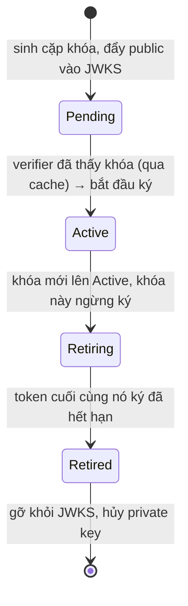

# Key Rotation — Deep Dive

## Mục lục

- [Sự cố: xoay khóa lúc nửa đêm, sáng ra 100% token chết](#1-sự-cố-xoay-khóa-lúc-nửa-đêm-sáng-ra-100-token-chết)
- [Vì sao phải xoay khóa](#2-vì-sao-phải-xoay-khóa)
- [Nguyên lý overlap — chìa khóa của zero-downtime](#3-nguyên-lý-overlap--chìa-khóa-của-zero-downtime)
- [Vòng đời một khóa ký](#4-vòng-đời-một-khóa-ký)
- [Quy trình rotate định kỳ — từng bước](#5-quy-trình-rotate-định-kỳ--từng-bước)
- [Rotate khẩn cấp khi khóa bị lộ](#6-rotate-khẩn-cấp-khi-khóa-bị-lộ)
- [Tính overlap window bao lâu là đủ](#7-tính-overlap-window-bao-lâu-là-đủ)
- [Cache JWKS & độ trễ lan truyền khóa](#8-cache-jwks--độ-trễ-lan-truyền-khóa)
- [Code thực chiến — rotate với kid](#9-code-thực-chiến--rotate-với-kid)
- [Anti-patterns cần tránh](#10-anti-patterns-cần-tránh)
- [Tóm tắt — Cheat sheet](#11-tóm-tắt--cheat-sheet)

---

## 1. Sự cố: xoay khóa lúc nửa đêm, sáng ra 100% token chết

Đội security yêu cầu xoay khóa ký JWT định kỳ. Một kỹ sư làm "đúng tinh thần": tạo cặp khóa RSA mới, thay private key ở auth server, thay public key ở JWKS — tất cả trong một lần deploy, **xóa hẳn khóa cũ**.

```diagram
23:00  deploy: private key cũ → MỚI,  JWKS: [khóa cũ] → [khóa MỚI]   (xóa cũ)
23:01  mọi token đang lưu hành (ký bằng khóa CŨ) → verify bằng JWKS chỉ-có-khóa-mới
        → chữ ký không khớp → 401 TẤT CẢ
```

Hàng triệu access token đang còn hạn (ký bằng khóa cũ) bỗng không verify được, vì JWKS không còn khóa cũ để đối chiếu. Toàn bộ người dùng bị đăng xuất cưỡng bức lúc nửa đêm. Refresh cũng fail vì refresh flow cũng verify. Một sự cố sản xuất kinh điển — và hoàn toàn tránh được.

> [!IMPORTANT]
> Sai lầm gốc: coi rotate là **thay thế tức thời** (cũ → mới). Đúng ra rotate là một **giai đoạn chuyển tiếp có overlap**: khóa mới bắt đầu ký, *trong khi* khóa cũ vẫn còn trong JWKS để verify nốt những token nó đã ký — cho tới khi token cũ hết hạn tự nhiên. `kid` + JWKS (xem [JWK & JWKS — Deep Dive](/cryptography/jwk-and-jwks/)) là thứ làm overlap khả thi.

---

## 2. Vì sao phải xoay khóa

```diagram
• Giảm "blast radius": khóa dùng càng lâu, lộ ra thì càng nhiều token bị ảnh hưởng
• Tuân thủ: nhiều chuẩn (PCI-DSS, nội bộ) yêu cầu xoay khóa định kỳ
• Mật mã: hạn chế lượng dữ liệu ký bằng một khóa
• Quy trình sẵn sàng: rotate định kỳ = "diễn tập" để khi PHẢI rotate khẩn (lộ khóa)
  thì đội đã quen tay, không loay hoay giữa khủng hoảng
```

> [!NOTE]
> Lý do cuối quan trọng hơn vẻ ngoài: nếu chưa bao giờ rotate êm khi *bình thường*, thì lúc khóa bị lộ — đúng lúc áp lực cao nhất — sẽ là lần đầu thử, và rất dễ gây ra chính sự cố ở §1.

---

## 3. Nguyên lý overlap — chìa khóa của zero-downtime

Mấu chốt: **vai trò "ký" và "verify" của một khóa kết thúc ở hai thời điểm khác nhau.**

```diagram
Một khóa ngừng KÝ   →  ngay khi khóa mới lên thay
Một khóa ngừng VERIFY → chỉ khi token CUỐI CÙNG nó từng ký đã hết hạn

   → giữa hai mốc đó là OVERLAP WINDOW: khóa cũ "nghỉ ký" nhưng "vẫn verify"
```

```diagram
Trục thời gian (ví dụ access token sống 15 phút):

  Khóa A:  ████████████ KÝ ████████████┐
                                        └──── vẫn VERIFY (≥15') ────┐ xóa
                                                                    
  Khóa B:                  ┌──── publish vào JWKS trước ────┐
                           └──────────── KÝ ────────────────────────▶

  JWKS:    [A]            [A, B]                    [A, B]        [B]
                          ▲ B vào trước khi ký      ▲ A ở lại     ▲ A out
```

```diagram
Hai bất biến phải giữ:
   (1) Khóa MỚI phải có mặt trong JWKS TRƯỚC khi bắt đầu ký bằng nó
       → nếu không, token mới ký mà verifier chưa có khóa → 401
   (2) Khóa CŨ phải ở lại JWKS cho tới khi token cuối nó ký HẾT HẠN
       → nếu rút sớm, token cũ còn hạn → 401 (đúng sự cố §1)
```

---

## 4. Vòng đời một khóa ký



| Trạng thái | Có trong JWKS? | Dùng để ký? | Dùng để verify? |
|------------|----------------|-------------|-----------------|
| **Pending** | ✅ (vừa thêm) | ❌ chưa | ✅ (sẵn sàng) |
| **Active** | ✅ | ✅ (khóa ký hiện hành) | ✅ |
| **Retiring** | ✅ | ❌ (đã nhường cho khóa mới) | ✅ (verify token cũ) |
| **Retired** | ❌ (đã gỡ) | ❌ | ❌ |

> [!IMPORTANT]
> Giai đoạn **Pending** thường bị bỏ qua nhưng rất quan trọng: phải đợi khóa mới *lan truyền* tới mọi verifier (qua cache JWKS) **trước khi** dùng nó để ký. Nhảy thẳng từ "thêm khóa" sang "ký ngay" có thể khiến verifier còn cache cũ chưa thấy khóa → 401 cho token mới. Xem §8.

---

## 5. Quy trình rotate định kỳ — từng bước

```diagram
Bước 1  [Pending]  Sinh cặp khóa mới B (kid_B). Đẩy public key B vào JWKS.
                   JWKS = [A(active), B(pending)].  KHÔNG ký bằng B vội.

Bước 2  [Chờ lan]  Đợi ≥ TTL cache JWKS để mọi verifier thấy B.
                   (vd cache 10' → đợi > 10').

Bước 3  [Active]   Chuyển khóa ký hiện hành A → B.
                   Từ giờ token mới ký bằng B (header.kid = kid_B).
                   A chuyển sang [Retiring]: vẫn trong JWKS, chỉ để verify.

Bước 4  [Overlap]  Giữ A trong JWKS thêm ≥ tuổi thọ access token tối đa
                   (để token cuối A ký kịp hết hạn).

Bước 5  [Retired]  Gỡ A khỏi JWKS. Hủy private key A an toàn.
                   JWKS = [B(active)].  Hoàn tất.
```

```diagram
Bất biến kiểm tra ở mỗi bước:
   • Trước bước 3: mọi verifier ĐÃ thấy B?         (nếu không → token B sẽ 401)
   • Trước bước 5: token cuối A ký ĐÃ hết hạn?      (nếu không → token A sẽ 401)
```

> [!TIP]
> Tự động hóa quy trình này (cron + trạng thái khóa trong KMS/secret store) thay vì làm tay. Mỗi bước nên là một hành động idempotent, và "khóa ký hiện hành" nên là một con trỏ (pointer) tới `kid`, đổi con trỏ chứ không sửa code.

---

## 6. Rotate khẩn cấp khi khóa bị lộ

Khi private key **bị lộ**, ưu tiên đảo ngược: không thể chờ overlap, vì khóa lộ nghĩa là kẻ tấn công **đang ký token giả** bằng nó.

```diagram
Rotate ĐỊNH KỲ:  ưu tiên zero-downtime → giữ overlap dài, không vội gỡ khóa cũ
Rotate KHẨN CẤP: ưu tiên chặn token giả → gỡ/đánh dấu khóa lộ NGAY,
                 chấp nhận đăng xuất cưỡng bức người dùng hợp lệ
```

```diagram
Quy trình khẩn:
   1. Sinh khóa mới B, publish vào JWKS, chuyển sang ký bằng B ngay.
   2. GỠ khóa lộ A khỏi JWKS NGAY (không overlap)
        → mọi token ký bằng A (kể cả token thật) lập tức 401.
   3. Vô hiệu refresh token nếu nghi đã bị dùng (xem revocation/logout).
   4. Người dùng thật phải đăng nhập lại — đánh đổi chấp nhận được để chặn attacker.
   5. Điều tra: vì sao lộ, quay vòng các secret liên quan.
```

> [!WARNING]
> Đừng "overlap" một khóa đã bị lộ — overlap nghĩa là vẫn chấp nhận token ký bằng nó, tức vẫn chấp nhận token giả của attacker. Khi lộ khóa, mục tiêu đảo từ "không downtime" sang "chặn ngay", và **chủ động** đăng xuất toàn bộ là đúng.

---

## 7. Tính overlap window bao lâu là đủ

Overlap (thời gian giữ khóa cũ trong JWKS sau khi ngừng ký) phải **≥ tuổi thọ tối đa của token mà khóa cũ còn có thể đã ký**.

```diagram
overlap_tối_thiểu  ≥  max_token_lifetime  +  margin

   max_token_lifetime = exp - iat lớn nhất bạn cấp (vd access 15')
   margin             = bù clock skew + độ trễ thao tác (vd vài phút)
```

```diagram
Ví dụ:
   access token sống 15'  →  overlap ≥ 15' + margin (vd 5')  ≈ 20'
   access token sống 1h   →  overlap ≥ 1h + margin
```

> [!IMPORTANT]
> Nếu có **nhiều loại token** ký bằng cùng khóa (access 15', và ID token 1h chẳng hạn), overlap phải tính theo **loại sống lâu nhất**. Quên điều này → loại token dài hạn chết sớm khi gỡ khóa. Refresh token thường KHÔNG nên ký dài bằng cùng khóa lý do này — quản lý riêng.

---

## 8. Cache JWKS & độ trễ lan truyền khóa

Verifier cache JWKS (xem [JWK & JWKS — Deep Dive §7](/cryptography/jwk-and-jwks/)), nên có **độ trễ** giữa lúc bạn cập nhật JWKS và lúc mọi verifier thấy thay đổi.

```diagram
Hai chiều ảnh hưởng của cache TTL:

  Thêm khóa MỚI (pending → active):
     phải đợi ≥ TTL để verifier thấy khóa mới TRƯỚC khi ký bằng nó
        (nếu ký sớm → verifier cache cũ chưa có khóa → 401 token mới)

  Gỡ khóa CŨ (retiring → retired):
     verifier có thể còn cache khóa cũ thêm tới TTL — vô hại
        (chỉ là verify được lâu hơn một chút, không sai)
```

```diagram
Đường an toàn:
   • Đặt TTL cache JWKS hợp lý (vd 5–15')
   • Bước "Pending → Active" đợi ≥ TTL
   • Hỗ trợ refetch-khi-kid-lạ ở verifier → khóa mới được nhận nhanh hơn TTL
```

> [!TIP]
> "Refetch khi gặp `kid` lạ" là cơ chế cứu cánh: ngay cả khi cache chưa hết hạn, gặp token có `kid` chưa biết, verifier fetch lại JWKS một lần (có cooldown). Điều này rút ngắn rủi ro ở bước Pending → Active. Nhưng vẫn nên tôn trọng overlap, đừng dựa hoàn toàn vào refetch.

---

## 9. Code thực chiến — rotate với kid

### 9.1. Auth server: con trỏ "khóa ký hiện hành" + JWKS đa khóa

```javascript
import { SignJWT, exportJWK, calculateJwkThumbprint } from 'jose';

// Kho khóa: nhiều khóa song song, mỗi khóa một kid
const keystore = new Map(); // kid -> { privateKey, publicKey, status }
let activeKid = null;       // con trỏ tới khóa đang KÝ

// JWKS chỉ publish PUBLIC key của khóa chưa retired
async function buildJWKS() {
  const keys = [];
  for (const [kid, k] of keystore) {
    if (k.status === 'retired') continue;
    const jwk = await exportJWK(k.publicKey);
    keys.push({ ...jwk, kid, use: 'sig', alg: 'RS256' });
  }
  return { keys };
}

async function sign(payload) {
  const k = keystore.get(activeKid);
  return new SignJWT(payload)
    .setProtectedHeader({ alg: 'RS256', kid: activeKid }) // gắn kid để verifier chọn khóa
    .setIssuedAt()
    .setExpirationTime('15m')
    .sign(k.privateKey);
}
```

### 9.2. Promote khóa mới (Pending → Active) sau khi đã lan truyền

```javascript
async function addPendingKey(kid, keyPair) {
  keystore.set(kid, { ...keyPair, status: 'pending' }); // vào JWKS, chưa ký
}

// Gọi sau khi đã đợi ≥ TTL cache JWKS
function promote(kid) {
  if (activeKid) keystore.get(activeKid).status = 'retiring'; // khóa cũ: chỉ verify
  keystore.get(kid).status = 'active';
  activeKid = kid;                                            // đổi con trỏ ký
}

// Gọi sau overlap ≥ max token lifetime
function retire(kid) {
  keystore.get(kid).status = 'retired'; // ra khỏi JWKS ở lần build kế tiếp
}
```

### 9.3. Verifier: không đổi gì — chỉ cần JWKS

```javascript
import { createRemoteJWKSet, jwtVerify } from 'jose';
const JWKS = createRemoteJWKSet(new URL('https://auth.example.com/.well-known/jwks.json'));

async function verify(token) {
  const { payload } = await jwtVerify(token, JWKS, { algorithms: ['RS256'] });
  return payload; // jose tự chọn khóa theo header.kid; rotate trong suốt với verifier
}
```

---

## 10. Anti-patterns cần tránh

| Anti-pattern | Hậu quả | Làm đúng |
|--------------|---------|----------|
| Thay khóa cũ → mới tức thời, xóa khóa cũ | Token cũ còn hạn chết hàng loạt (§1) | Overlap: giữ khóa cũ tới khi token cũ hết hạn |
| Ký bằng khóa mới ngay khi vừa thêm vào JWKS | Verifier cache cũ chưa thấy → 401 token mới | Pending → đợi ≥ TTL → mới Active |
| Không gắn `kid` vào token | Không phân biệt được khóa khi có nhiều khóa | Luôn set `header.kid` |
| Overlap tính theo access token, quên ID/token dài | Token dài hạn chết sớm | Tính overlap theo loại sống lâu nhất |
| Overlap một khóa **đã bị lộ** | Vẫn chấp nhận token giả của attacker | Lộ khóa → gỡ ngay, rotate khẩn (§6) |
| Rotate thủ công, không quy trình | Sai bước giữa khủng hoảng | Tự động hóa, idempotent, diễn tập định kỳ |
| Không bao giờ rotate ("đang chạy ổn") | Blast radius lớn khi lộ; lần đầu rotate là lúc khẩn | Rotate định kỳ để quen tay |

---

## 11. Tóm tắt — Cheat sheet

```diagram
╭──────────────────────────────────────────────────────────────╮
│  ROTATE ≠ thay thế tức thời. ROTATE = chuyển tiếp có OVERLAP. │
│                                                                │
│  Vòng đời khóa:  Pending → Active → Retiring → Retired        │
│     Pending : trong JWKS, CHƯA ký (đợi lan truyền ≥ TTL)      │
│     Active  : khóa đang ký (1 khóa duy nhất)                  │
│     Retiring: ngừng ký, VẪN verify token cũ                  │
│     Retired : gỡ khỏi JWKS, hủy private key                  │
│                                                                │
│  2 bất biến:                                                  │
│     (1) khóa mới VÀO JWKS trước khi ký bằng nó                │
│     (2) khóa cũ Ở LẠI tới khi token cuối nó ký hết hạn        │
│                                                                │
│  overlap ≥ max_token_lifetime + margin (clock skew + thao tác)│
│                                                                │
│  Định kỳ → zero-downtime (overlap dài).                       │
│  Lộ khóa → gỡ NGAY, chấp nhận logout (chặn token giả).        │
╰──────────────────────────────────────────────────────────────╯
```

**3 nguyên tắc xương sống:**

1. **Overlap là tất cả.** Khóa mới vào JWKS trước khi ký; khóa cũ ở lại tới khi token cuối hết hạn. `kid` + JWKS khiến verifier xoay khóa trong suốt, không cần đổi code.
2. **Pending là bước thật, không bỏ.** Đợi khóa lan truyền tới mọi verifier (≥ TTL cache) trước khi dùng để ký.
3. **Rotate định kỳ khác rotate khẩn.** Bình thường tối ưu zero-downtime; khi lộ khóa, đảo mục tiêu sang chặn ngay token giả và chấp nhận đăng xuất.

Đọc kèm: [JWK & JWKS — Deep Dive](/cryptography/jwk-and-jwks/) (hạ tầng phát khóa) và [Token Validation Flow — Deep Dive](/internals/token-validation-deep-dive/) (verifier resolve key qua kid).
