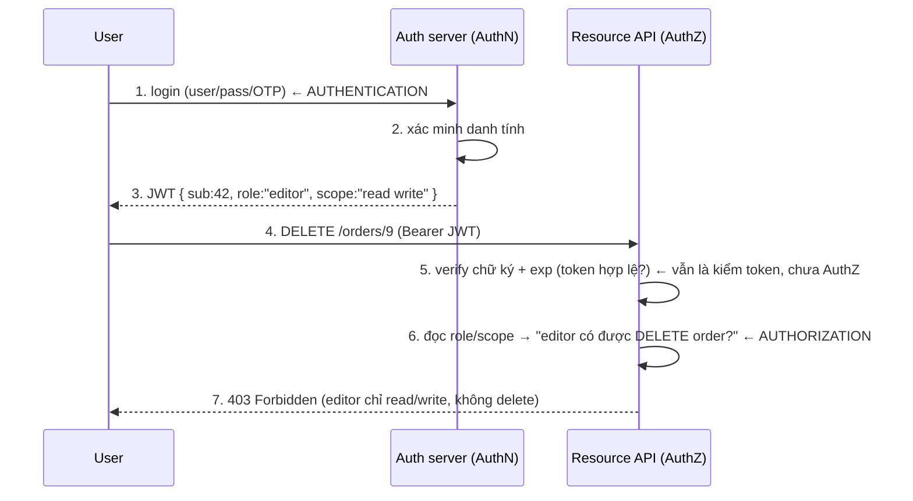

## Mục lục

- [1. Hai câu hỏi khác nhau: "anh là ai" và "anh được làm gì"](#1-hai-câu-hỏi-khác-nhau-anh-là-ai-và-anh-được-làm-gì)
- [2. AuthN vs AuthZ — định nghĩa & thứ tự](#2-authn-vs-authz--định-nghĩa--thứ-tự)
- [3. JWT đứng ở đâu giữa hai việc này](#3-jwt-đứng-ở-đâu-giữa-hai-việc-này)
- [4. Dòng chảy đầy đủ: từ login tới chặn 403](#4-dòng-chảy-đầy-đủ-từ-login-tới-chặn-403)
- [5. 401 vs 403 — hai mã lỗi của hai việc](#5-401-vs-403--hai-mã-lỗi-của-hai-việc)
- [6. Role vs Scope vs Permission trong claim](#6-role-vs-scope-vs-permission-trong-claim)
- [7. Mô hình phân quyền: RBAC, ABAC, ReBAC](#7-mô-hình-phân-quyền-rbac-abac-rebac)
- [8. OAuth2 & OIDC: AuthZ và AuthN chuẩn hoá](#8-oauth2--oidc-authz-và-authn-chuẩn-hoá)
- [9. Lỗ hổng khi nhập nhằng hai khái niệm](#9-lỗ-hổng-khi-nhập-nhằng-hai-khái-niệm)
- [10. Anti-patterns cần tránh](#10-anti-patterns-cần-tránh)
- [11. Tóm tắt — Cheat sheet](#11-tóm-tắt--cheat-sheet)

---

## 1. Hai câu hỏi khác nhau: "anh là ai" và "anh được làm gì"

Hai từ na ná nhau, viết tắt còn dễ lẫn hơn (AuthN/AuthZ), nhưng là hai việc tách bạch:

```
   AUTHENTICATION (AuthN)              AUTHORIZATION (AuthZ)
   "ANH LÀ AI?"                        "ANH ĐƯỢC LÀM GÌ?"
   ───────────────────                 ───────────────────
   chứng minh danh tính                kiểm tra quyền hạn
   vd: đúng user/pass + OTP            vd: user này có được xoá order không
   xảy ra MỘT LẦN khi login           kiểm Ở MỖI hành động cần quyền
```

```
PHÉP LOẠI SUY SÂN BAY:
   AuthN = quầy CHECK-IN: xác minh bạn đúng là người trong hộ chiếu.
   AuthZ = cửa LÊN MÁY BAY/phòng chờ: vé của bạn có cho vào khoang này không.
   → qua check-in (biết bạn là ai) KHÔNG tự động cho vào phòng chờ hạng nhất.
```

> [!IMPORTANT]
> Lẫn lộn hai khái niệm này là gốc của rất nhiều lỗ hổng nghiêm trọng (broken access control — hạng mục số 1 trong OWASP Top 10). "Đã đăng nhập" (AuthN) **không** đồng nghĩa "được phép làm việc này" (AuthZ). Mọi hành động nhạy cảm phải kiểm AuthZ riêng, kể cả khi user đã xác thực.

---

## 2. AuthN vs AuthZ — định nghĩa & thứ tự

| | Authentication (AuthN) | Authorization (AuthZ) |
|--|------------------------|------------------------|
| Câu hỏi | Bạn là ai? | Bạn được làm gì? |
| Mục đích | Xác minh danh tính | Kiểm soát quyền truy cập |
| Khi nào | Khi login (một lần/phiên) | Mỗi lần truy cập tài nguyên |
| Dựa trên | Bằng chứng (mật khẩu, OTP, khoá) | Quyền/chính sách (role, scope) |
| Kết quả | Danh tính (ai) → cấp token | Cho/chặn (403) |
| Mã lỗi HTTP | 401 Unauthorized | 403 Forbidden |
| Trong JWT | claim `sub` (+ iss) | claim `role`/`scope`/`permissions` |

```
THỨ TỰ LUÔN LÀ: AuthN TRƯỚC, AuthZ SAU.
   ① phải biết BẠN LÀ AI (AuthN)
   ② rồi mới quyết BẠN ĐƯỢC LÀM GÌ (AuthZ)
   → không thể phân quyền cho một danh tính chưa xác định.
```

> [!NOTE]
> Tên HTTP gây nhầm: mã `401` tên là "Unauthorized" nhưng thực ra nói về *authentication* ("chưa/không xác thực được"); còn `403 Forbidden` mới là *authorization* ("biết anh là ai nhưng không cho"). Đây là di sản đặt tên của HTTP — nhớ theo §5.

---

## 3. JWT đứng ở đâu giữa hai việc này

JWT không phải "cơ chế đăng nhập" — nó là **vật mang kết quả AuthN và dữ liệu cho AuthZ**.

```
   ① AUTHN (login)                    ② JWT mang kết quả           ③ AUTHZ (mỗi request)
   user/pass/OTP ──▶ auth server ──▶  JWT { sub: 42,        ──▶  resource server đọc
   (AuthN xảy ra ở đây,               role: "editor",            role/scope từ claim
   JWT KHÔNG làm AuthN)               scope: "read write" }      → quyết cho/chặn
```

```
┌────────────────────────────────────────────────────────────────────────────┐
│  VAI TRÒ CỦA JWT:                                                          │
│     • KẾT QUẢ AuthN: claim "sub" = danh tính đã được xác thực (anh là ai). │
│     • DỮ LIỆU cho AuthZ: claim "role"/"scope" = nguyên liệu để quyết quyền.│
│  JWT KHÔNG tự xác thực user (đó là việc của login: mật khẩu/OTP/khoá),     │
│  cũng KHÔNG tự phân quyền (đó là logic ở resource server đọc claim).       │
│  JWT chỉ CHUYÊN CHỞ kết quả & dữ liệu giữa hai bước — một cách đáng tin    │
│  (vì có chữ ký, xem Chữ ký số).                                            │
└────────────────────────────────────────────────────────────────────────────┘
```

> [!IMPORTANT]
> Hiểu đúng: chữ ký JWT chỉ đảm bảo "claim này do issuer phát và chưa bị sửa" — tức nó làm cho dữ liệu AuthZ *đáng tin*. Nhưng *quyết định* phân quyền vẫn là việc của resource server: đọc `role`/`scope`, đối chiếu chính sách, cho hay chặn. Chữ ký không thay được logic phân quyền. Xem [Chữ ký số — Deep Dive](/internals/signature-deep-dive/).

---

## 4. Dòng chảy đầy đủ: từ login tới chặn 403



```
BA TẦNG KIỂM TÁCH BẠCH Ở RESOURCE SERVER:
   ① TOKEN HỢP LỆ?  verify chữ ký + exp + aud   → sai ⇒ 401
   ② BIẾT LÀ AI?    đọc sub (danh tính)          → (kết quả AuthN)
   ③ ĐƯỢC LÀM KHÔNG? đối chiếu role/scope + policy → không ⇒ 403
```

> [!TIP]
> Bước ① (verify token) hay bị nhầm là "authorization" nhưng nó chỉ đảm bảo token thật/chưa hết hạn. *Phân quyền thật* là bước ③: so quyền trong token với hành động yêu cầu. Tách rõ ba tầng giúp đặt đúng mã lỗi và không bỏ sót kiểm quyền.

---

## 5. 401 vs 403 — hai mã lỗi của hai việc

```
401 UNAUTHORIZED  → vấn đề AUTHENTICATION
   "Tôi không biết anh là ai" / "token thiếu/sai/hết hạn".
   GỢI Ý client: hãy (đăng nhập lại / refresh token) rồi thử lại.
   vd: không gửi token, token hết hạn, chữ ký sai.

403 FORBIDDEN     → vấn đề AUTHORIZATION
   "Tôi BIẾT anh là ai, nhưng anh KHÔNG được phép làm việc này".
   client đăng nhập lại cũng vô ích — danh tính đúng nhưng thiếu quyền.
   vd: user thường gọi API admin; editor cố xoá khi chỉ có quyền read/write.
```

```
┌───────────────────────────────────────────────────────────────────────────┐
│  PHÉP THỬ: "Đăng nhập lại có giải quyết được không?"                      │
│     CÓ   → đó là 401 (vấn đề danh tính/token).                            │
│     KHÔNG (đúng người nhưng thiếu quyền) → đó là 403.                     │
└───────────────────────────────────────────────────────────────────────────┘
```

> [!WARNING]
> Lưu ý bảo mật: đôi khi cố tình trả `404 Not Found` thay vì `403` cho tài nguyên nhạy cảm — để không tiết lộ "tài nguyên này tồn tại nhưng bạn không được xem". Nhưng đừng dùng `200` khi đáng lẽ phải `403`: trả dữ liệu cho người không có quyền là lỗ hổng broken access control.

---

## 6. Role vs Scope vs Permission trong claim

Ba cách biểu diễn quyền trong JWT, hay bị dùng lẫn:

```
ROLE (vai trò)        — gom quyền theo "chức danh" người dùng.
   "role": "admin"  hoặc  "roles": ["editor","reviewer"]
   → thô, dễ hiểu; ánh xạ role→quyền cụ thể nằm ở resource server.

SCOPE (phạm vi)       — quyền theo kiểu OAuth2, thường cho API/đại diện app.
   "scope": "read:orders write:orders"   (chuỗi cách nhau dấu cách)
   → "token này được phép làm gì THAY MẶT user", hợp với uỷ quyền bên thứ ba.

PERMISSION (quyền chi tiết) — liệt kê hành động cụ thể.
   "permissions": ["order:read","order:write","user:delete"]
   → mịn nhất nhưng token PHÌNH; cân nhắc để chi tiết ở server.
```

```
NÊN DÙNG GÌ:
   • role thô trong token (1–vài giá trị) + ánh xạ role→permission ở server
     → token nhỏ, đổi policy không cần phát lại token.
   • scope khi làm OAuth2 / uỷ quyền cho app bên thứ ba.
   • TRÁNH nhồi danh sách permission dài vào token (phình + ảnh chụp đông cứng).
```

> [!IMPORTANT]
> Nhớ bài học từ [Claims](/fundamentals/claims/): claim là **ảnh chụp đông cứng**. Nếu nhồi permission chi tiết vào token, thu hồi một quyền cụ thể sẽ không có hiệu lực cho tới khi token hết hạn. Giữ quyền ở mức thô trong token; quyết định mịn (và quyền nhạy cảm) kiểm tươi ở resource server.

---

## 7. Mô hình phân quyền: RBAC, ABAC, ReBAC

```
┌──────────┬─────────────────────────────────────┬─────────────────────────────┐
│ Mô hình  │ Quyết định dựa trên                 │ JWT mang gì                 │
├──────────┼─────────────────────────────────────┼─────────────────────────────┤
│ RBAC     │ VAI TRÒ (role) → tập quyền          │ role/roles                  │
│ (role)   │ "admin được mọi thứ"                │                             │
│ ABAC     │ THUỘC TÍNH (attribute) + ngữ cảnh   │ vài attribute (dept, tier)  │
│ (attr)   │ "dept=finance & giờ hành chính"     │ + server đánh giá policy    │
│ ReBAC    │QUAN HỆ (relationship) giữa đối tượng│ sub; quan hệ tra ở store    │
│(relation)│ "user là owner của doc X"           │ riêng (vd Zanzibar)         │
└──────────┴─────────────────────────────────────┴─────────────────────────────┘
```

```
JWT HỢP VỚI GÌ:
   • RBAC: hợp nhất — role thô đặt trong claim, server ánh xạ ra quyền.
   • ABAC: đặt vài attribute ổn định trong claim; quyết định policy ở server.
   • ReBAC: token chỉ mang danh tính (sub); quan hệ tra ở hệ phân quyền riêng
     (vì quan hệ hay đổi & nhiều — không hợp để đông cứng trong token).
```

> [!TIP]
> Bắt đầu bằng RBAC (đơn giản, đủ cho phần lớn ứng dụng): vài role thô trong token. Chỉ leo lên ABAC/ReBAC khi luật phân quyền thật sự phụ thuộc thuộc tính/quan hệ động. Dù mô hình nào, nguyên tắc chung: token mang *danh tính + tín hiệu thô*, quyết định *chi tiết/động* nằm ở server.

---

## 8. OAuth2 & OIDC: AuthZ và AuthN chuẩn hoá

Hai chuẩn hay bị gọi nhầm lẫn, nhưng phân vai đúng theo AuthN/AuthZ:

```
OAuth2  = framework UỶ QUYỀN (AUTHORIZATION).
   trả lời: "app này được phép truy cập GÌ thay mặt user".
   sản phẩm: ACCESS TOKEN (mang scope) — có thể là JWT hoặc opaque.

OIDC (OpenID Connect) = lớp XÁC THỰC (AUTHENTICATION) ĐẶT TRÊN OAuth2.
   trả lời: "user này LÀ AI" (đăng nhập).
   sản phẩm: ID TOKEN — LUÔN là JWT, mang claim danh tính (sub, name, email...).
```

```
┌───────────────────────────────────────────────────────────────────────────┐
│  PHÂN BIỆT 2 TOKEN CỦA OIDC/OAuth2:                                       │
│     ID TOKEN     → cho CLIENT biết "user là ai" (AuthN). Đừng gửi tới API.│
│     ACCESS TOKEN → cho API biết "được phép làm gì" (AuthZ). Gửi tới API.  │
│  Lỗi phổ biến: dùng id_token để gọi API, hoặc dùng access_token để lấy    │
│  thông tin danh tính → sai vai trò token.                                 │
└───────────────────────────────────────────────────────────────────────────┘
```

> [!NOTE]
> Gốc nhầm lẫn: "đăng nhập bằng Google" thực ra dùng OIDC (AuthN) chồng trên OAuth2 (AuthZ). id_token chứng minh danh tính cho *app của bạn*; access_token cho phép *gọi API của Google*. Chi tiết tích hợp ở [OAuth2 & OIDC Integration](/implementation/oauth2-oidc-integration/).

---

## 9. Lỗ hổng khi nhập nhằng hai khái niệm

```
LỖ HỔNG 1 — "đã đăng nhập nên cho qua" (thiếu AuthZ):
   chỉ kiểm token hợp lệ (AuthN) rồi cho làm mọi thứ → user thường gọi được
   API admin. → đây chính là Broken Access Control (OWASP #1).
   FIX: mỗi hành động nhạy cảm kiểm quyền riêng (role/scope/policy).

LỖ HỔNG 2 — IDOR (thiếu kiểm "được làm trên TÀI NGUYÊN NÀY"):
   GET /orders/123 chỉ kiểm "đã đăng nhập" mà không kiểm "order 123 thuộc về bạn"
   → đổi id thành 124 đọc đơn người khác. → AuthZ phải gắn với TÀI NGUYÊN, không
   chỉ với endpoint.
   FIX: kiểm chủ sở hữu/quan hệ tài nguyên ở server.

LỖ HỔNG 3 — tin role trong token cho thao tác nhạy cảm (stale claim):
   role hạ ở DB nhưng token cũ vẫn ghi "admin" → vẫn làm được tới khi hết hạn.
   FIX: quyền nhạy cảm kiểm TƯƠI ở server; TTL ngắn.

LỖ HỔNG 4 — phân quyền Ở CLIENT (ẩn nút ≠ chặn):
   frontend ẩn nút "Xoá" cho user thường nhưng API không kiểm → gọi thẳng API xoá được.
   FIX: AuthZ phải ở SERVER; client chỉ là trải nghiệm, không phải hàng rào.
```

> [!WARNING]
> Lỗ hổng 4 cực phổ biến: ẩn/disable nút trên giao diện **không phải** phân quyền — kẻ tấn công gọi thẳng API. Mọi quyết định phân quyền phải thực thi ở **server**; UI chỉ phản ánh quyền cho đẹp. Xem thêm [Common Vulnerabilities](/security/common-vulnerabilities/) và [Threat Model](/security/jwt-threat-model/).

---

## 10. Anti-patterns cần tránh

| Anti-pattern | Hậu quả | Thay bằng |
|--------------|---------|-----------|
| "Đã đăng nhập = được làm mọi thứ" | Broken access control (OWASP #1) | Kiểm AuthZ riêng mỗi hành động nhạy cảm |
| Kiểm endpoint nhưng không kiểm tài nguyên | IDOR (đọc/sửa dữ liệu người khác) | Kiểm chủ sở hữu/quan hệ tài nguyên |
| Phân quyền ở client (ẩn nút) | Gọi thẳng API vẫn làm được | Thực thi AuthZ ở server |
| Trả 200 cho người thiếu quyền | Lộ dữ liệu | 403 (hoặc 404 cho tài nguyên nhạy cảm) |
| Dùng 401 cho lỗi thiếu quyền | Client refresh vô ích, sai ngữ nghĩa | 403 khi danh tính đúng nhưng thiếu quyền |
| Nhồi permission chi tiết vào token | Token phình + stale, khó thu hồi quyền | role thô + ánh xạ ở server |
| Tin role token cho thao tác nhạy cảm | Stale claim giữ quyền đã thu hồi | Kiểm tươi ở server; TTL ngắn |
| Dùng id_token gọi API / access_token lấy danh tính | Sai vai trò token | id_token cho client, access_token cho API |

---

## 11. Tóm tắt — Cheat sheet

```
┌──────────────────── AUTHENTICATION vs AUTHORIZATION ──────────────────────┐
│                                                                           │
│  AUTHN "anh là ai"          AUTHZ "anh được làm gì"                       │
│  ─ xác minh danh tính       ─ kiểm quyền hạn                              │
│  ─ MỘT LẦN khi login        ─ MỖI hành động nhạy cảm                      │
│  ─ lỗi → 401 Unauthorized   ─ lỗi → 403 Forbidden                         │
│  ─ JWT: claim "sub"         ─ JWT: claim "role"/"scope"                   │
│                                                                           │
│  THỨ TỰ: AuthN TRƯỚC → AuthZ SAU                                          │
│                                                                           │
│  JWT = vật MANG kết quả AuthN (sub) + dữ liệu AuthZ (role/scope);         │
│        KHÔNG tự xác thực, KHÔNG tự phân quyền — logic ở server.           │
│                                                                           │
│  OAuth2 = uỷ quyền (access_token, scope) · OIDC = xác thực (id_token)     │
│  QUYỀN:  role (RBAC) · scope (OAuth2) · permission (mịn, dễ phình)        │
└───────────────────────────────────────────────────────────────────────────┘
```

```
3 NGUYÊN TẮC GHIM:
   ① "ĐÃ ĐĂNG NHẬP" ≠ "ĐƯỢC PHÉP" — luôn kiểm AuthZ riêng cho hành động nhạy cảm.
   ② AUTHZ Ở SERVER — ẩn nút ở client không phải phân quyền; kẻ địch gọi thẳng API.
   ③ TOKEN MANG TÍN HIỆU THÔ — role/scope thô; quyết định mịn & nhạy cảm kiểm tươi.
```

> [!NOTE]
> Đọc tiếp: [Claims](/fundamentals/claims/) (role/scope đặt thế nào), [Token Validation Flow](/internals/token-validation-flow/) (verifier kiểm trước khi phân quyền), [OAuth2 & OIDC](/implementation/oauth2-oidc-integration/) (AuthN/AuthZ chuẩn hoá), và [Security Best Practices](/security/security-best-practices/) (chống broken access control).
