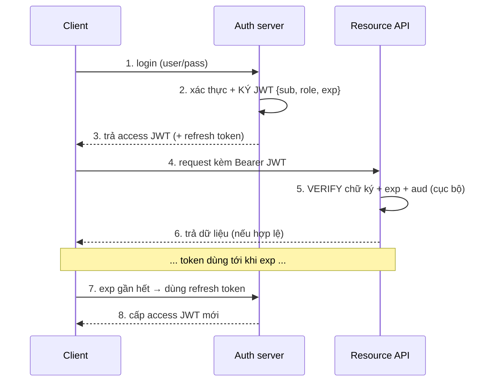

## Mục lục

- [1. JWT thực sự là gì — định nghĩa lại](#1-jwt-thực-sự-là-gì--định-nghĩa-lại)
- [2. Vấn đề JWT sinh ra để giải quyết](#2-vấn-đề-jwt-sinh-ra-để-giải-quyết)
- [3. Giải phẫu nhanh: 3 phần, một chuỗi tự chứa](#3-giải-phẫu-nhanh-3-phần-một-chuỗi-tự-chứa)
- [4. Họ JOSE: JWT vs JWS vs JWE vs JWK](#4-họ-jose-jwt-vs-jws-vs-jwe-vs-jwk)
- [5. Vòng đời một JWT — từ cấp tới hết hạn](#5-vòng-đời-một-jwt--từ-cấp-tới-hết-hạn)
- [6. Kích thước thật & cái giá của "tự chứa"](#6-kích-thước-thật--cái-giá-của-tự-chứa)
- [7. Khi nào NÊN dùng JWT](#7-khi-nào-nên-dùng-jwt)
- [8. Khi nào KHÔNG nên dùng JWT](#8-khi-nào-không-nên-dùng-jwt)
- [9. JWT so với các loại token khác](#9-jwt-so-với-các-loại-token-khác)
- [10. Ba hiểu lầm nền tảng](#10-ba-hiểu-lầm-nền-tảng)
- [11. Anti-patterns cần tránh](#11-anti-patterns-cần-tránh)
- [12. Tóm tắt — Cheat sheet](#12-tóm-tắt--cheat-sheet)

---

## 1. JWT thực sự là gì — định nghĩa lại

Phần lớn người ta học JWT là "một chuỗi token dài để đăng nhập". Đúng nhưng vô dụng — nó không cho biết JWT *khác gì* một chuỗi ngẫu nhiên. Định nghĩa hữu ích hơn:

```
JWT = một mẩu JSON (claims) được ĐÓNG GÓI gọn + KÝ để chống sửa,
      sao cho ai cầm nó cũng TỰ ĐỌC được nội dung và TỰ KIỂM được tính toàn vẹn
      mà KHÔNG cần hỏi lại server đã cấp.
```

Hai từ khoá định nghĩa nên bản chất JWT:

```
┌───────────────────────────────────────────────────────────────────────────┐
│  TỰ CHỨA (self-contained):                                                │
│     mọi thông tin cần để dùng token nằm NGAY TRONG token (sub, role, exp).│
│     → verifier không cần tra database/phiên để biết "đây là ai, quyền gì".│
│                                                                           │
│  CÓ CHỮ KÝ (signed):                                                      │
│     phần chữ ký chứng minh token do bên có khoá ký phát ra & chưa bị sửa. │
│     → KHÔNG phải mã hoá: nội dung vẫn đọc được, chỉ là không sửa được lén.│
└───────────────────────────────────────────────────────────────────────────┘
```

> [!IMPORTANT]
> Sự khác biệt cốt lõi giữa JWT và một "session id ngẫu nhiên": session id là một **con trỏ** (server phải tra trong store ra mới biết nó là ai); JWT là **dữ liệu tự thân** (đọc thẳng ra là biết, chỉ cần verify chữ ký). Toàn bộ ưu — nhược điểm của JWT chảy ra từ đặc tính "tự chứa" này. Chi tiết byte-level của 3 phần ở [Cấu trúc JWT — Deep Dive](/fundamentals/jwt-structure/).

---

## 2. Vấn đề JWT sinh ra để giải quyết

Để hiểu JWT, phải thấy cái đau nó chữa: **xác thực ở hệ phân tán/không trạng thái**.

```
KIẾN TRÚC SESSION TRUYỀN THỐNG (stateful):
   login → server tạo session, lưu vào RAM/Redis/DB → trả về session_id (cookie)
   mỗi request → server TRA session_id trong store → biết user
   ┌────────┐  sid   ┌────────┐  tra store  ┌─────────────┐
   │ client │ ─────▶ │ server │ ──────────▶ │session store│
   └────────┘        └────────┘             └─────────────┘
   VẤN ĐỀ khi scale ngang:
      • có 5 server → session ở server A, request rơi vào server B → "chưa đăng nhập"
      • phải có store chia sẻ (Redis) → mọi request tốn 1 lượt tra store
      • hệ phân tán/microservices: mỗi service phải truy cập store chung
```

```
KIẾN TRÚC JWT (stateless):
   login → server KÝ một JWT chứa {sub, role, exp} → trả về cho client
   mỗi request → server chỉ VERIFY chữ ký (toán cục bộ) → biết user NGAY
   ┌────────┐  JWT   ┌────────┐  verify cục bộ (không tra store)
   │ client │ ─────▶ │ server │ ──✓ biết user, quyền, hạn dùng
   └────────┘        └────────┘
   ĐƯỢC:
      • server nào cũng verify được (chỉ cần khoá/khoá-công-khai) → scale ngang dễ
      • không cần store chung cho mỗi request → bớt một điểm nghẽn & một round-trip
      • microservices: phát một JWT, mọi service tự verify (xem Cryptography)
```

> [!NOTE]
> JWT không "tốt hơn" session — nó **đánh đổi**: bỏ được store tra-cứu-mỗi-request, nhưng đổi lại mất khả năng *thu hồi tức thì* (token đã ký thì còn hiệu lực tới khi hết hạn). Đây là trục đánh đổi trung tâm, mổ kỹ ở [Session vs Token](/fundamentals/session-vs-token/) và [Revocation & Logout](/lifecycle/revocation-and-logout/).

---

## 3. Giải phẫu nhanh: 3 phần, một chuỗi tự chứa

```
eyJhbGciOiJIUzI1NiIsInR5cCI6IkpXVCJ9.eyJzdWIiOiIxMjM0NTY3ODkwIiwibmFtZSI6IkpvaG4
gRG9lIiwicm9sZSI6ImFkbWluIiwiaWF0IjoxNTE2MjM5MDIyLCJleHAiOjE1MTYyNDI2MjJ9.zDX8Th
hog1JE4hTGFG97syI56W_nk0NTQb6KHRdjaDM
└──────── HEADER ───────┘ └──────────────── PAYLOAD ───────────────┘ └─ SIGNATURE ─┘
        (alg, typ)              (claims: sub, role, exp...)          (HMAC/RSA...)
```

```
HEADER    {"alg":"HS256","typ":"JWT"}         → token này ký bằng thuật toán gì
PAYLOAD   {"sub":"1234567890","role":"admin",  → token NÓI GÌ (claims)
           "iat":1516239022,"exp":1516242622}
SIGNATURE HMAC-SHA256(base64url(header)+"."+base64url(payload), secret)
                                                → bằng chứng chống sửa
```

```
┌───────────────────────────────────────────────────────────────────────────┐
│  Điều dễ gây sốc với người mới: header và payload chỉ là JSON được        │
│  base64url — AI CŨNG GIẢI RA ĐỌC ĐƯỢC (dán lên jwt.io là thấy).           │
│ base64url KHÔNG phải mã hoá. JWT (dạng JWS) bảo vệ TOÀN VẸN, không bí mật.│
│  → không bao giờ để mật khẩu/PII/secret trong payload. (xem §10, §4)      │
└───────────────────────────────────────────────────────────────────────────┘
```

Doc này không lặp lại phần mổ byte — chi tiết base64url, compact serialization, từng byte chữ ký ở [Cấu trúc JWT — Deep Dive](/fundamentals/jwt-structure/) và [Chữ ký số — Deep Dive](/internals/signature-deep-dive/).

---

## 4. Họ JOSE: JWT vs JWS vs JWE vs JWK

"JWT" hay bị dùng lẫn lộn với cả họ chuẩn JOSE (JSON Object Signing and Encryption). Phân biệt cho rõ:

| Tên | Là gì | Bảo vệ | Nội dung |
|-----|-------|--------|----------|
| **JWT** | Một *claim set* (JSON) được đóng gói | — | Khái niệm "token mang claims" |
| **JWS** | JWT được **ký** (signed) | Toàn vẹn + xác thực nguồn | Đọc được, không sửa được |
| **JWE** | JWT được **mã hoá** (encrypted) | Bí mật (+toàn vẹn) | KHÔNG đọc được nếu thiếu khoá |
| **JWK** | Biểu diễn **khoá** dạng JSON | — | Khoá để ký/verify (n, e, x, y...) |

```
QUAN HỆ:
   "JWT" trong thực tế gần như luôn nghĩa là JWS (token KÝ, không mã hoá).
   JWS:  header.payload.signature          → 3 phần, payload ĐỌC được
   JWE:  header.key.iv.ciphertext.tag      → 5 phần, payload MÃ HOÁ (đọc không ra)
   JWK:  {"kty":"RSA","n":"...","e":"AQAB"} → mô tả khoá, dùng cho JWKS endpoint
```

```
┌───────────────────────────────────────────────────────────────────────────┐
│  KHI NÀO CẦN JWE (mã hoá) THAY VÌ JWS (ký):                               │
│     JWS đủ cho 99% auth: ta chỉ cần "không bị giả", không cần giấu claims.│
│     JWE khi token BẮT BUỘC chứa dữ liệu nhạy cảm mà bên trung gian không  │
│     được đọc (hiếm — tốt hơn là ĐỪNG nhét dữ liệu nhạy cảm vào token).    │
└───────────────────────────────────────────────────────────────────────────┘
```

> [!TIP]
> Khi ai đó nói "JWT có mã hoá không?" — câu trả lời chuẩn: JWT bạn dùng hằng ngày là **JWS (chỉ ký, đọc được)**. Muốn mã hoá phải dùng **JWE**, và thường thì không nên — thay vì mã hoá token để giấu PII, hãy đừng đặt PII vào token. Chi tiết JWE ở [JWE — Token mã hoá](/cryptography/jwe-encrypted-token/), JWK ở [JWK & JWKS — Deep Dive](/cryptography/jwk-and-jwks/).

---

## 5. Vòng đời một JWT — từ cấp tới hết hạn



```
6 GIAI ĐOẠN (mỗi giai đoạn có bài deep-dive riêng):
   ① CẤP      auth server ký JWT sau khi xác thực   → Issuing Token
   ② TRUYỀN   gửi trong header Authorization: Bearer → HTTP transport
   ③ DÙNG     mỗi API verify cục bộ                   → Token Validation Flow
   ④ HẾT HẠN  exp tới → token vô hiệu                 → Expiration & Renewal
   ⑤ LÀM MỚI  refresh token đổi lấy access mới        → Access vs Refresh
   ⑥ THU HỒI  (khó với JWT thuần) denylist/TTL ngắn   → Revocation & Logout
```

> [!IMPORTANT]
> Điểm khiến JWT khác session nhất nằm ở giai đoạn ③ và ⑥: verify **cục bộ** (không tra store) là siêu năng lực của JWT, nhưng chính nó khiến **thu hồi tức thì khó** — vì server không "nắm" token nào đang sống. Đây là lý do mô hình chuẩn dùng access TTL ngắn + refresh token (xem [Access vs Refresh](/lifecycle/access-token-vs-refresh-token/)).

---

## 6. Kích thước thật & cái giá của "tự chứa"

"Tự chứa" không miễn phí: token mang theo claims nên to hơn một session id, và đi kèm MỌI request.

```
ĐO THẬT (token ví dụ ở §3):
   header  = 36 ký tự
   payload = 116 ký tự  (sub, name, role, iat, exp)
   sig     = 43 ký tự   (HMAC-SHA256)
   ─────────────────────
   TỔNG    = 197 byte    cho MỘT access token điển hình

So sánh:
   session id (32 byte ngẫu nhiên, base64url) = 43 byte
   JWT tối thiểu (chỉ sub + exp + sig)        = 120 byte
   JWT "béo" (nhiều claim, dùng RS256 sig)    = 800–1500+ byte
```

```
HỆ QUẢ THỰC TẾ:
   • JWT đi kèm MỖI request → 197 byte × hàng triệu request = băng thông đáng kể
   • cookie giới hạn ~4KB: JWT 197 byte = 4.8% một cookie (ổn); JWT 1.5KB = 37%
   • header HTTP có giới hạn (8KB nhiều server) → JWT quá béo gây 431 Request Header Too Large
   • RS256 chữ ký 256 byte → token to hơn HS256 đáng kể
```

> [!WARNING]
> Cám dỗ lớn nhất của người mới: "token tự chứa nên nhét luôn cả profile, danh sách quyền chi tiết, dữ liệu giỏ hàng vào cho khỏi query". Đừng. Mỗi byte thêm vào payload đi kèm **mọi request mãi mãi** cho tới khi token hết hạn, và claims trong token là **ảnh chụp đông cứng** — sửa quyền ở DB không cập nhật được token đã phát. Giữ payload tối thiểu (xem [Claims — Deep Dive](/fundamentals/claims/)).

---

## 7. Khi nào NÊN dùng JWT

```
✓ API stateless / nhiều instance sau load balancer
    → verify cục bộ, không cần session store chia sẻ → scale ngang dễ.

✓ Microservices / hệ phân tán
    → một auth server ký, mọi service tự verify bằng public key (RS256/ES256).

✓ Xác thực giữa các bên (federation / SSO / OIDC)
    → id_token của OpenID Connect chính là JWT; bên thứ ba verify bằng JWKS.

✓ Truy cập ngắn hạn, ít cần thu hồi tức thì
    → access token TTL 5–15' + refresh token cho phiên dài.

✓ Service-to-service / machine-to-machine
    → mỗi service mang JWT có scope hẹp, aud đúng đích.
```

> [!NOTE]
> Mẫu hình thắng lớn nhất của JWT: **access token sống ngắn, stateless, verify cục bộ** kết hợp **refresh token sống dài, có trạng thái, thu hồi được**. Tận dụng ưu điểm stateless của JWT cho phần "nóng" (mỗi request), giữ phần "cần thu hồi" ở token khác. Xem [Access vs Refresh — Deep Dive](/lifecycle/access-token-vs-refresh-token/).

---

## 8. Khi nào KHÔNG nên dùng JWT

JWT bị lạm dụng nhiều. Có những chỗ session cookie truyền thống tốt hơn hẳn:

```
✗ Cần ĐĂNG XUẤT / THU HỒI TỨC THÌ là yêu cầu cứng
    JWT đã ký còn hiệu lực tới khi hết hạn. Muốn revoke ngay phải thêm denylist
    (tra store mỗi request) → mất luôn ưu điểm stateless → khi đó session đơn giản hơn.

✗ Phiên web truyền thống, một backend, một server
    không có nhu cầu phân tán → session cookie + store là đủ, đơn giản, revoke dễ.

✗ Cần lưu nhiều state phiên thay đổi liên tục
    JWT là ảnh chụp đông cứng; state hay đổi → phải phát lại token liên tục → bất tiện.

✗ Lưu dữ liệu nhạy cảm trong token
    JWS đọc được; dùng JWE thì phức tạp → tốt hơn là không đặt dữ liệu nhạy cảm vào token.

✗ Token "vĩnh viễn" không hết hạn
    bỏ exp = không thu hồi được + lộ là vĩnh viễn → đừng.
```

```
┌──────────────────────────────────────────────────────────────────────────────┐
│  PHÉP THỬ NHANH: "Tôi có CẦN verify cục bộ ở nhiều nơi không?"               │
│     CÓ  → JWT hợp lý (scale, phân tán, federation).                          │
│     KHÔNG (một backend, cần revoke tức thì) → session cookie thường tốt hơn. │
│  Đừng chọn JWT chỉ vì "nghe hiện đại" — chọn vì đánh đổi của nó hợp bài toán.│
└──────────────────────────────────────────────────────────────────────────────┘
```

> [!IMPORTANT]
> Một "anti-pattern kiến trúc" rất phổ biến: dùng JWT cho phiên web một-server rồi thêm denylist tra Redis mỗi request để "revoke được". Lúc đó bạn đã trả cái giá phức tạp của JWT (đồng bộ khoá, exp, refresh) **lẫn** cái giá của session (tra store mỗi request) — tệ hơn cả hai. Nếu cần revoke tức thì trong hệ đơn giản, dùng session.

---

## 9. JWT so với các loại token khác

```
┌──────────────────┬─────────────────────────┬─────────────────────────────────┐
│ Loại token       │ Verify thế nào          │ Đặc tính                        │
├──────────────────┼─────────────────────────┼─────────────────────────────────┤
│ JWT (JWS)        │ verify chữ ký CỤC BỘ    │ tự chứa, stateless, khó revoke  │
│ Opaque token     │ TRA store/introspect    │ revoke tức thì, cần round-trip  │
│  (session id)    │                         │ store; không tự đọc được        │
│ JWE              │ giải mã + verify        │ như JWT nhưng nội dung bí mật   │
│ SAML assertion   │ verify chữ ký XML       │ XML, nặng, dùng SSO doanh nghiệp│
│ PASETO           │ verify (versioned)      │ "JWT an toàn hơn", ít cấu hình  │
│                  │                         │ nguy hiểm (không có alg:none)   │
└──────────────────┴─────────────────────────┴─────────────────────────────────┘
```

```
TRỤC PHÂN BIỆT QUAN TRỌNG NHẤT — verify cục bộ vs tra store:
   JWT (tự chứa)  : nhanh, scale, NHƯNG revoke khó (token tự sống tới exp)
   opaque (con trỏ): mỗi request tra store (chậm hơn), NHƯNG revoke = xoá 1 dòng

   → nhiều hệ dùng LAI: access = JWT (nóng, stateless), refresh = opaque (revoke được).
```

> [!TIP]
> OAuth2 không bắt buộc access token phải là JWT — nó có thể là opaque token và server dùng *introspection endpoint* để verify. Nhiều nhà cung cấp chọn JWT cho access (verify cục bộ nhanh) và opaque cho refresh (revoke được). Hiểu rằng "token" là một phổ lựa chọn, JWT chỉ là một điểm trên đó.

---

## 10. Ba hiểu lầm nền tảng

```
HIỂU LẦM 1: "JWT được mã hoá nên an toàn để chứa dữ liệu nhạy cảm"
   THỰC TẾ: JWT (JWS) chỉ base64url — ai cũng decode đọc payload (jwt.io).
   HỆ QUẢ:  nhét mật khẩu/PII/secret → lộ ngay. Cần bí mật → JWE, hoặc tốt hơn:
            đừng đặt vào token. (xem Encoding vs Encryption)

HIỂU LẦM 2: "Có JWT là đăng xuất được bằng cách xoá token ở client"
   THỰC TẾ: xoá ở client chỉ làm client quên; token đó VẪN HỢP LỆ tới exp nếu
            ai đó còn giữ bản sao. Revoke thật cần TTL ngắn + denylist/rotation.
   HỆ QUẢ:  "logout" của JWT thuần là ảo giác nếu không có cơ chế thu hồi.

HIỂU LẦM 3: "JWT luôn tốt hơn session vì nó hiện đại/stateless"
   THỰC TẾ: stateless là ĐÁNH ĐỔI (mất revoke tức thì), không phải ưu thế tuyệt đối.
   HỆ QUẢ:  dùng JWT sai chỗ (web một-server cần revoke) → phức tạp hơn session.
```

> [!WARNING]
> Cả ba hiểu lầm đều bắt nguồn từ việc không phân biệt **toàn vẹn (integrity)** với **bí mật (confidentiality)**, và không thấy **đánh đổi stateless↔revoke**. Nắm chắc hai cặp khái niệm này thì hầu hết quyết định JWT trở nên hiển nhiên.

---

## 11. Anti-patterns cần tránh

| Anti-pattern | Hậu quả | Thay bằng |
|--------------|---------|-----------|
| Nhét cả profile/PII vào payload | Lộ dữ liệu + token béo đi kèm mọi request | Claims tối thiểu; tra chi tiết từ DB khi cần |
| Token không có `exp` | Không thu hồi được, lộ là vĩnh viễn | Luôn set exp; access TTL ngắn |
| Dùng JWT cho web một-server cần revoke tức thì | Phức tạp hơn session mà vẫn phải tra store | Session cookie |
| "Logout" chỉ xoá token ở client | Token vẫn hợp lệ nếu bị giữ bản sao | TTL ngắn + denylist/rotation |
| Tin `alg` trong header để verify | alg:none / confusion → giả token | Allowlist alg phía verifier |
| Coi base64url là "mã hoá" | Đặt secret vào payload → lộ | Hiểu JWS đọc được; dùng JWE nếu cần |
| TTL access dài cho "đỡ phải refresh" | Token trộm sống lâu, revoke chậm | Access 5–15' + refresh token |
| Dùng JWE "cho chắc" khi chỉ cần ký | Phức tạp vô ích | JWS đủ cho auth; đừng đặt bí mật vào token |

---

## 12. Tóm tắt — Cheat sheet

```
┌─────────────────────────── JWT TRONG MỘT KHUNG ────────────────────────────┐
│                                                                            │
│  JWT = JSON claims + đóng gói gọn + KÝ (không mã hoá)                      │
│        → TỰ CHỨA (đọc thẳng ra) + CHỐNG SỬA (verify chữ ký cục bộ)         │
│                                                                            │
│  HỌ JOSE:  JWT≈JWS (ký, đọc được) · JWE (mã hoá) · JWK (khoá)              │
│                                                                            │
│  ĐÁNH ĐỔI CỐT LÕI:                                                         │
│     ĐƯỢC : verify cục bộ, không tra store → scale/phân tán/federation      │
│     MẤT  : thu hồi tức thì khó (token sống tới exp) + token to hơn         │
│                                                                            │
│  DÙNG khi : API stateless, microservices, SSO/OIDC, M2M                    │
│  TRÁNH khi: web một-server cần revoke tức thì, chứa dữ liệu nhạy cảm       │
│                                                                            │
│  MẪU CHUẨN: access JWT (ngắn, stateless) + refresh token (dài, revoke được)│
└────────────────────────────────────────────────────────────────────────────┘
```

```
3 NGUYÊN TẮC GHIM:
   ① TOÀN VẸN ≠ BÍ MẬT — JWT (JWS) chống sửa, KHÔNG giấu nội dung.
   ② STATELESS LÀ ĐÁNH ĐỔI — đổi revoke-tức-thì lấy verify-cục-bộ.
   ③ PAYLOAD TỐI THIỂU — mỗi byte đi kèm mọi request tới khi token hết hạn.
```

> [!NOTE]
> Doc này là cửa vào: từ đây rẽ sang [Cấu trúc JWT](/fundamentals/jwt-structure/) (mổ byte), [Claims](/fundamentals/claims/) (đặt gì trong payload), [Encoding vs Encryption](/fundamentals/encoding-vs-encryption/) (vì sao đọc được), [Session vs Token](/fundamentals/session-vs-token/) (đánh đổi), và [AuthN vs AuthZ](/fundamentals/authentication-vs-authorization/) (JWT đứng ở đâu trong bức tranh xác thực).
