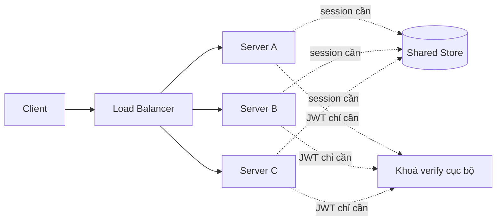
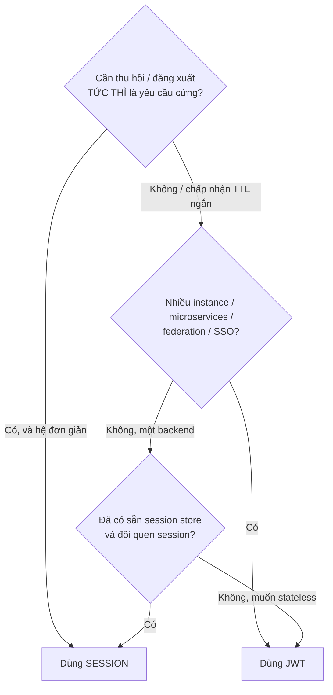

## Mục lục

- [1. Hai triết lý: server nhớ vs token tự khai](#1-hai-triết-lý-server-nhớ-vs-token-tự-khai)
- [2. Session-cookie hoạt động ra sao](#2-session-cookie-hoạt-động-ra-sao)
- [3. JWT (token) hoạt động ra sao](#3-jwt-token-hoạt-động-ra-sao)
- [4. Trục đánh đổi trung tâm: trạng thái nằm ở đâu](#4-trục-đánh-đổi-trung-tâm-trạng-thái-nằm-ở-đâu)
- [5. Chi phí mỗi request — đo thật](#5-chi-phí-mỗi-request--đo-thật)
- [6. Scale ngang & hệ phân tán](#6-scale-ngang--hệ-phân-tán)
- [7. Thu hồi tức thì — điểm yếu của JWT](#7-thu-hồi-tức-thì--điểm-yếu-của-jwt)
- [8. Bảng so sánh toàn diện](#8-bảng-so-sánh-toàn-diện)
- [9. Cây quyết định: chọn cái nào](#9-cây-quyết-định-chọn-cái-nào)
- [10. Mô hình lai — tận dụng cả hai](#10-mô-hình-lai--tận-dụng-cả-hai)
- [11. Anti-patterns cần tránh](#11-anti-patterns-cần-tránh)
- [12. Tóm tắt — Cheat sheet](#12-tóm-tắt--cheat-sheet)

---

## 1. Hai triết lý: server nhớ vs token tự khai

"Session hay JWT?" thực ra là câu hỏi **trạng thái phiên nằm ở đâu**:

```
┌───────────────────────────────────────────────────────────────────────────┐
│  STATEFUL (session):  SERVER NHỚ ai đang đăng nhập.                        │
│     client chỉ cầm một CON TRỎ (session_id) — bản thân nó vô nghĩa.        │
│     "ai là user 7f3a?" → server phải TRA store mới biết.                   │
│                                                                            │
│  STATELESS (JWT):     TOKEN TỰ KHAI nó là ai.                             │
│     client cầm cả DỮ LIỆU (claims đã ký) — đọc thẳng ra là biết.          │
│     "ai là token này?" → verify chữ ký rồi đọc claim, KHÔNG tra store.    │
└───────────────────────────────────────────────────────────────────────────┘
```

> [!IMPORTANT]
> Đây không phải "cái nào tốt hơn" mà là "đặt gánh nặng trạng thái ở đâu". Session đặt ở **server** (dễ thu hồi, nhưng phải có store và tra mỗi request). JWT đặt ở **token** (verify cục bộ nhanh, scale dễ, nhưng khó thu hồi tức thì). Mọi khác biệt khác chảy ra từ lựa chọn này. Liên hệ tổng quan ở [Tổng quan về JWT](/fundamentals/jwt-overview/).

---

## 2. Session-cookie hoạt động ra sao

```
LOGIN:
   1. user gửi user/pass
   2. server xác thực → TẠO bản ghi session trong store:
         "7f3a..." → {userId: 42, role: "admin", createdAt: ...}
   3. server gửi về cookie:  Set-Cookie: sid=7f3a...; HttpOnly; Secure
   4. trình duyệt TỰ ĐỘNG đính kèm cookie này ở mọi request sau

MỖI REQUEST:
   5. server đọc sid từ cookie → TRA store → lấy {userId, role}
   6. biết user → xử lý request
```

```
   ┌────────┐  sid=7f3a (cookie)  ┌────────┐  GET 7f3a  ┌──────────────┐
   │ browser│ ──────────────────▶ │ server │ ─────────▶ │ session store │
   └────────┘                     └────────┘            │ 7f3a→{u:42}  │
                                       ▲                 └──────────────┘
                                       └── biết user 42, role admin
```

```
ĐẶC TÍNH:
   • trạng thái thật nằm Ở SERVER (store) → client chỉ giữ con trỏ vô nghĩa.
   • THU HỒI = xoá 1 dòng trong store → request sau lập tức "chưa đăng nhập".
   • CÁI GIÁ = phải có store + tra store MỖI request.
```

> [!NOTE]
> Vì session_id là con trỏ ngẫu nhiên vô nghĩa, lộ nó chỉ nguy hiểm khi store còn dòng tương ứng — xoá dòng đó là vô hiệu hoá ngay. Đây là ưu thế thu-hồi-tức-thì cốt lõi của session.

---

## 3. JWT (token) hoạt động ra sao

```
LOGIN:
   1. user gửi user/pass
   2. server xác thực → KÝ một JWT {sub:42, role:admin, exp:...}
      KHÔNG lưu gì ở server (stateless).
   3. server gửi token về cho client (cookie hoặc body)

MỖI REQUEST:
   4. client gửi token (Authorization: Bearer ...)
   5. server VERIFY chữ ký (toán cục bộ) + kiểm exp/aud
   6. chữ ký hợp lệ → đọc claim → biết user 42, role admin. KHÔNG tra store.
```

```
   ┌────────┐  Bearer eyJ... (claims đã ký)  ┌────────┐
   │ client │ ─────────────────────────────▶ │ server │ ──✓ verify cục bộ
   └────────┘                                └────────┘    → biết user NGAY
                                                  (không có store để tra)
```

```
ĐẶC TÍNH:
   • trạng thái nằm TRONG TOKEN → server không cần nhớ gì.
   • verify CỤC BỘ → server nào có khoá cũng kiểm được → scale ngang dễ.
   • CÁI GIÁ = token đã ký SỐNG tới exp → không xoá-một-dòng để thu hồi được.
```

> [!IMPORTANT]
> Điểm đối xứng đẹp: session lộ-id nhưng xoá-store-là-xong; JWT verify-nhanh nhưng phát-ra-rồi-khó-thu-về. Hai cơ chế là hai mặt của cùng đồng tiền "trạng thái ở đâu".

---

## 4. Trục đánh đổi trung tâm: trạng thái nằm ở đâu

```
                 SERVER GIỮ TRẠNG THÁI          TOKEN GIỮ TRẠNG THÁI
                 (session, stateful)            (JWT, stateless)
   ┌──────────────────────────────────┬──────────────────────────────────┐
   │ thu hồi tức thì    ✓ xoá 1 dòng   │ ✗ token sống tới exp              │
   │ chi phí mỗi request ✗ tra store   │ ✓ verify cục bộ                   │
   │ scale ngang        ✗ cần store    │ ✓ chỉ cần chia sẻ khoá            │
   │                       chia sẻ     │                                   │
   │ bộ nhớ             ✗ tỉ lệ #user  │ ✓ ~0 (không lưu)                  │
   │ kích thước/request ✓ id nhỏ (~40B)│ ✗ token to (200B–1.5KB)           │
   │ federation/SSO     ✗ khó          │ ✓ token tự verify ở mọi bên       │
   └──────────────────────────────────┴──────────────────────────────────┘
   → KHÔNG có bên thắng tuyệt đối: mỗi ✓ của bên này là ✗ của bên kia.
```

> [!TIP]
> Cách nhớ: **session đổi "tra store mỗi request" lấy "thu hồi tức thì"; JWT đổi "thu hồi tức thì" lấy "verify cục bộ + scale".** Câu hỏi đúng không phải "cái nào tốt" mà "ứng dụng của tôi cần thu-hồi-tức-thì hơn hay cần scale-không-store hơn?".

---

## 5. Chi phí mỗi request — đo thật

```
SESSION: mỗi request = 1 lượt TRA STORE
   Redis cục bộ round-trip ~0.2–1 ms; store ở xa/quá tải → cao hơn.
   @ 50.000 req/s → 50.000 lượt tra store MỖI GIÂY → store phải chịu tải này.

JWT: mỗi request = 1 lần VERIFY CHỮ KÝ cục bộ
   HMAC-SHA256 ~vài µs (micro-giây), thuần CPU, không I/O mạng.
   @ 50.000 req/s → 0 lượt tra store → mỗi node tự verify, store không là nút cổ chai.
```

```
┌───────────────────────────────────────────────────────────────────────────┐
│  KHÁC BIỆT BẢN CHẤT:                                                       │
│     session → chi phí mỗi request là I/O MẠNG tới store (chậm, có thể nghẽn)│
│     JWT      → chi phí mỗi request là PHÉP TOÁN CPU cục bộ (rất nhanh)      │
│  → ở tải cao, session store dễ thành điểm nghẽn; JWT phân tán tải ra node.  │
└───────────────────────────────────────────────────────────────────────────┘
```

```
BỘ NHỚ STORE (session):
   1.000.000 phiên hoạt động × ~200 byte/phiên = ~200 MB RAM trong store.
   → tỉ lệ thuận số user online. JWT: ~0 (không lưu phiên ở server).
```

> [!NOTE]
> Con số trên là lý tưởng hoá: thực tế session store thường có cache cục bộ, JWT thường thêm denylist (lại tra store). Điểm cần nhớ là *hình dạng* chi phí: session = I/O-bound mỗi request, JWT = CPU-bound cục bộ. RS256 verify đắt hơn HS256 (xem [HMAC vs RSA vs ECDSA](/cryptography/hmac-vs-rsa-vs-ecdsa/)) nhưng vẫn là toán cục bộ.

---

## 6. Scale ngang & hệ phân tán

```
SCALE SESSION RA NHIỀU SERVER:
   server A tạo session → lưu ở RAM server A
   load balancer đẩy request kế tiếp sang server B → B không có session → lỗi!
   GIẢI: phải có STORE CHIA SẺ (Redis) → mọi server tra cùng store
         → store thành phụ thuộc chung + điểm nghẽn + điểm chết.

SCALE JWT RA NHIỀU SERVER:
   server A ký token → client cầm token
   request kế tiếp sang server B → B chỉ cần KHOÁ để verify → OK ngay
   → không cần store chia sẻ; chỉ cần phân phối khoá/khoá-công-khai.
```



> [!IMPORTANT]
> Đây là lý do JWT thắng lớn ở **microservices/đa-instance/federation**: một auth server ký, hàng chục service tự verify bằng public key (RS256/ES256) mà không gọi về auth server hay store chung. Với một backend đơn lẻ thì ưu thế này biến mất — và session đơn giản hơn. Chi tiết phân phối khoá ở [JWK & JWKS](/cryptography/jwk-and-jwks/).

---

## 7. Thu hồi tức thì — điểm yếu của JWT

```
SESSION — thu hồi = tức thì:
   xoá dòng session trong store → request kế tiếp KHÔNG tìm thấy → đăng xuất ngay.
   "đăng xuất mọi thiết bị" = xoá mọi session của user. Đơn giản.

JWT — thu hồi = khó:
   token đã ký là "giấy thông hành tự xác thực" → server không nắm nó.
   xoá token ở client chỉ làm CLIENT quên; bản sao token vẫn hợp lệ tới exp.
   muốn thu hồi thật phải THÊM TRẠNG THÁI:
      • denylist theo jti (tra store mỗi request → mất stateless)
      • tokensValidAfter / token version (so iat với mốc)
      • TTL access NGẮN → cửa sổ thiệt hại hẹp (cách thực dụng nhất)
```

```
┌───────────────────────────────────────────────────────────────────────────┐
│  NGHỊCH LÝ: muốn JWT "thu hồi được" → thêm denylist tra store mỗi request  │
│  → khi đó bạn lại trả cái giá I/O của session, MẤT ưu thế stateless.       │
│  → nếu thu-hồi-tức-thì là yêu cầu CỨNG cho hệ đơn giản: dùng session.      │
└───────────────────────────────────────────────────────────────────────────┘
```

> [!WARNING]
> Đừng quảng cáo "logout" cho JWT thuần mà không có cơ chế thu hồi — đó là ảo giác bảo mật. Nếu cần đăng xuất thật/khoá tài khoản tức thì, hãy dùng TTL ngắn + refresh rotation hoặc denylist. Chi tiết ở [Revocation & Logout](/lifecycle/revocation-and-logout/) và [Blacklist vs Whitelist](/lifecycle/blacklist-whitelist/).

---

## 8. Bảng so sánh toàn diện

| Tiêu chí | Session-cookie (stateful) | JWT (stateless) |
|----------|---------------------------|-----------------|
| Trạng thái nằm ở | Server (store) | Trong token |
| Chi phí mỗi request | Tra store (I/O mạng) | Verify chữ ký (CPU cục bộ) |
| Bộ nhớ server | Tỉ lệ số user online | ~0 |
| Kích thước gửi kèm | id nhỏ (~40B) | token to (200B–1.5KB) |
| Scale ngang | Cần store chia sẻ | Chỉ cần chia sẻ khoá |
| Thu hồi tức thì | ✓ xoá 1 dòng | ✗ khó (cần denylist/TTL ngắn) |
| Đăng xuất mọi thiết bị | ✓ dễ | ✗ cần token version/denylist |
| Federation / SSO / OIDC | Khó | ✓ token tự verify ở mọi bên |
| Đọc được nội dung | Không (id vô nghĩa) | Có (payload công khai) |
| Phù hợp | Web một backend, cần revoke | API/microservices, đa instance |

---

## 9. Cây quyết định: chọn cái nào



```
PHÉP THỬ 1 CÂU:
   "Tôi có cần verify CỤC BỘ ở nhiều nơi mà không gọi về một store chung không?"
      CÓ   → JWT (scale, phân tán, federation là sân nhà).
      KHÔNG (một backend + cần revoke tức thì) → session thường đơn giản & an toàn hơn.
```

> [!TIP]
> Đừng chọn JWT chỉ vì "nghe hiện đại/stateless". Rất nhiều ứng dụng web một-backend sẽ đơn giản, an toàn và dễ vận hành hơn với session cookie truyền thống. Chọn theo *đánh đổi hợp bài toán*, không theo trào lưu.

---

## 10. Mô hình lai — tận dụng cả hai

Thực tế nhiều hệ lớn không chọn một, mà **lai** để lấy ưu của cả hai:

```
ACCESS TOKEN = JWT (stateless)
   • sống NGẮN (5–15') · verify cục bộ · dùng cho mỗi API call (phần "nóng")
   • lộ thì cửa sổ thiệt hại hẹp; không cần tra store mỗi request.

REFRESH TOKEN = opaque, CÓ trạng thái (stateful)
   • sống DÀI (ngày/tuần) · lưu ở server (DB/Redis) · revoke được
   • chỉ dùng KHI làm mới access (hiếm hơn nhiều so với mỗi request)
   • rotation + reuse detection → phát hiện token bị trộm.
```

```
┌───────────────────────────────────────────────────────────────────────────┐
│  Ý TƯỞNG: đặt phần TẦN SUẤT CAO (mỗi request) lên JWT stateless (nhanh),   │
│  đặt phần CẦN THU HỒI (refresh) lên token có trạng thái (revoke được).     │
│  → verify cục bộ cho 99% lưu lượng, vẫn giữ được khả năng đăng xuất thật.  │
└───────────────────────────────────────────────────────────────────────────┘
```

> [!IMPORTANT]
> Mô hình lai này là chuẩn de-facto cho ứng dụng hiện đại. Nó cho thấy "session vs JWT" không phải lựa chọn loại trừ — bạn có thể đặt mỗi loại token vào đúng chỗ điểm mạnh của nó. Chi tiết ở [Access vs Refresh — Deep Dive](/lifecycle/access-token-vs-refresh-token/).

---

## 11. Anti-patterns cần tránh

| Anti-pattern | Hậu quả | Thay bằng |
|--------------|---------|-----------|
| Chọn JWT chỉ vì "stateless = hiện đại" | Phức tạp sai chỗ | Chọn theo đánh đổi hợp bài toán |
| JWT cho web một-server cần revoke tức thì | Phải thêm denylist → mất stateless | Session cookie |
| Quảng cáo "logout" cho JWT thuần | Token vẫn sống tới exp | TTL ngắn + denylist/rotation |
| Session không có store chia sẻ khi scale | Request rơi server khác → mất phiên | Redis/store chung hoặc sticky session |
| TTL access JWT dài cho "đỡ refresh" | Token trộm sống lâu, revoke chậm | Access 5–15' + refresh token |
| Nhồi nhiều state hay đổi vào JWT | Ảnh chụp đông cứng, token phình | State động để ở server, token tối thiểu |
| Dùng cả JWT lẫn denylist-mỗi-request mà không nhận ra | Trả giá của cả hai mô hình | Chọn rõ; hoặc lai access-JWT + refresh-opaque |

---

## 12. Tóm tắt — Cheat sheet

```
┌─────────────────────────── SESSION vs TOKEN ─────────────────────────────┐
│                                                                          │
│  CÂU HỎI GỐC: trạng thái phiên nằm Ở ĐÂU?                                │
│     SESSION → ở SERVER (store)   · JWT → trong TOKEN                      │
│                                                                          │
│  SESSION (stateful):                                                     │
│     ✓ thu hồi tức thì (xoá 1 dòng) · ✗ tra store mỗi request · cần store  │
│  JWT (stateless):                                                        │
│     ✓ verify cục bộ, scale, federation · ✗ khó thu hồi · token to        │
│                                                                          │
│  CHI PHÍ/REQUEST: session = I/O store · JWT = CPU verify cục bộ          │
│                                                                          │
│  CHỌN: cần revoke tức thì + hệ đơn giản → SESSION                        │
│        đa instance / microservices / SSO  → JWT                          │
│        cả hai → LAI: access=JWT (ngắn) + refresh=opaque (revoke được)    │
└────────────────────────────────────────────────────────────────────────────┘
```

```
3 NGUYÊN TẮC GHIM:
   ① TRẠNG THÁI Ở ĐÂU quyết định mọi đánh đổi còn lại.
   ② STATELESS ĐỔI thu-hồi-tức-thì LẤY verify-cục-bộ + scale — không miễn phí.
   ③ MÔ HÌNH LAI thường thắng: JWT cho phần nóng, opaque có-trạng-thái cho refresh.
```

> [!NOTE]
> Đọc tiếp: [Tổng quan về JWT](/fundamentals/jwt-overview/) (bức tranh lớn), [Access vs Refresh](/lifecycle/access-token-vs-refresh-token/) (mô hình lai chi tiết), [Revocation & Logout](/lifecycle/revocation-and-logout/) (vì sao JWT khó thu hồi), và [Secure Storage](/security/secure-storage/) (lưu token/cookie ở đâu cho an toàn).
