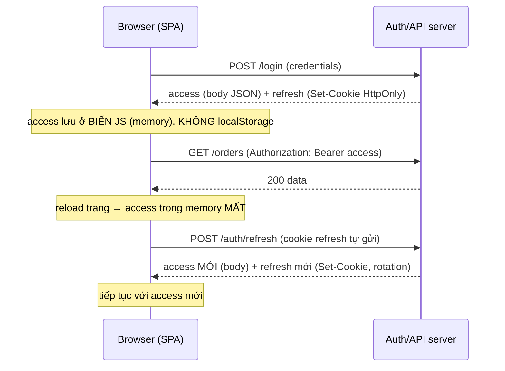

# HTTP Transport & Storage

## Mục lục

- [Tổng quan](#tổng-quan)
- [1. Hai câu hỏi tách biệt: truyền và lưu](#1-hai-câu-hỏi-tách-biệt-truyền-và-lưu)
- [2. Truyền token: Authorization Bearer](#2-truyền-token-authorization-bearer)
- [3. Truyền token: Cookie](#3-truyền-token-cookie)
  - [3.1 Thuộc tính cookie bắt buộc](#31-thuộc-tính-cookie-bắt-buộc)
  - [3.2 SameSite và cross-site](#32-samesite-và-cross-site)
- [4. Vì sao KHÔNG để token trên URL](#4-vì-sao-không-để-token-trên-url)
- [5. Mô hình mối đe dọa: XSS vs CSRF](#5-mô-hình-mối-đe-dọa-xss-vs-csrf)
- [6. Ma trận nơi lưu token](#6-ma-trận-nơi-lưu-token)
- [7. Mẫu khuyến nghị: access ở memory + refresh ở cookie](#7-mẫu-khuyến-nghị-access-ở-memory--refresh-ở-cookie)
- [8. CORS cho cross-origin](#8-cors-cho-cross-origin)
- [9. Lưu token trên mobile](#9-lưu-token-trên-mobile)
- [10. Checklist transport & storage](#10-checklist-transport--storage)
- [Tài liệu tham khảo](#tài-liệu-tham-khảo)

---

## Tổng quan

Một JWT được ký đúng, verify đúng vẫn có thể bị đánh cắp nếu **truyền** hoặc **lưu** sai chỗ. Đây là tầng dễ sai nhất khi triển khai: token nằm trên URL bị ghi vào log, refresh token trong `localStorage` bị XSS đọc, cookie thiếu `Secure` bị nghe lén. Doc này tách bạch hai quyết định độc lập — *gửi token đi bằng cách nào* và *cất token ở đâu* — rồi gắn mỗi lựa chọn với mối đe dọa cụ thể.

```diagram
        CẤP token  ──▶  TRUYỀN token  ──▶  LƯU token  ──▶  GỬI LẠI mỗi request
                          (mục 2,3,4)      (mục 6,7)         (vòng lặp)
                              │                 │
                       Bearer? Cookie?     memory? cookie? localStorage?
                              │                 │
                       sai → bị nghe lén   sai → bị XSS/CSRF đánh cắp
```

> [!IMPORTANT]
> "Truyền" và "lưu" là **hai quyết định khác nhau**, đừng gộp. *Truyền* quyết định token đi qua header hay cookie (ảnh hưởng CSRF, CORS). *Lưu* quyết định token nằm ở memory/cookie/storage (ảnh hưởng XSS, mất khi reload). Một mẫu an toàn phổ biến kết hợp cả hai: **access token gửi qua `Authorization` + lưu ở memory**, còn **refresh token lưu+gửi qua cookie `HttpOnly`**.

---

## 1. Hai câu hỏi tách biệt: truyền và lưu

| Quyết định | Lựa chọn | Đánh đổi chính |
|------------|----------|----------------|
| **Truyền** (gửi token thế nào) | `Authorization: Bearer` | Client phải tự đính kèm; không tự gửi → ít CSRF; cần lưu token ở nơi JS đọc được |
| | Cookie | Trình duyệt tự gửi; tiện nhưng dính CSRF; có thể `HttpOnly` chống XSS |
| **Lưu** (cất token ở đâu) | Memory (biến JS) | An toàn XSS nhất nhưng mất khi reload |
| | Cookie `HttpOnly` | JS không đọc được (chống XSS) nhưng tự gửi (CSRF) |
| | `localStorage` | Tiện, bền qua reload — nhưng **XSS đọc được** |

<Callout type="info">
Hai câu hỏi này tương tác nhau: nếu gửi qua <code>Authorization</code> header, JS phải đọc được token để đính kèm → không thể để token ở cookie <code>HttpOnly</code>. Nếu để cookie <code>HttpOnly</code> (JS không đọc được), trình duyệt phải tự gửi → bạn dùng cơ chế cookie, không phải header. Hiểu ràng buộc này trước khi chọn.
</Callout>

---

## 2. Truyền token: Authorization Bearer

Cách chuẩn cho API: client đính token vào header mỗi request.

```text
GET /api/orders HTTP/1.1
Host: api.example.com
Authorization: Bearer eyJhbGciOiJSUzI1Ni|...payload...|...signature
```

```javascript
// Client tự đính token (token lấy từ memory — xem mục 7)
const res = await fetch('https://api.example.com/orders', {
  headers: { Authorization: `Bearer ${accessToken}` },
});
```

```javascript
// Server (Express) đọc và verify
function bearerToken(req) {
  const h = req.headers.authorization;
  if (!h?.startsWith('Bearer ')) return null;
  return h.slice(7).trim();            // bỏ đúng "Bearer "
}
```

| Ưu | Nhược |
|----|-------|
| Trình duyệt **không tự gửi** → bề mặt CSRF nhỏ | Client phải tự quản lý + đính token |
| Hợp API không-trình-duyệt (mobile, service-to-service) | Token phải nằm nơi JS đọc được → cân nhắc XSS |
| Tường minh, dễ debug | Không tự bền qua reload (nếu để memory) |

> [!TIP]
> `Authorization: Bearer` là lựa chọn mặc định cho **access token** của API. Vì trình duyệt không tự gửi header này, kẻ tấn công không thể lợi dụng CSRF để "mượn" phiên người dùng như với cookie. Đổi lại, token phải nằm nơi JS truy cập được — nên để ở **memory** thay vì `localStorage` (xem [mục 6](#6-ma-trận-nơi-lưu-token)).

---

## 3. Truyền token: Cookie

Cookie phù hợp cho **refresh token** (và phiên web truyền thống): trình duyệt tự gửi, và có thể đặt `HttpOnly` để JS không đọc được.

### 3.1 Thuộc tính cookie bắt buộc

```javascript
res.cookie('refresh_token', refreshToken, {
  httpOnly: true,                 // JS KHÔNG đọc được → chống XSS đánh cắp
  secure: true,                   // chỉ gửi qua HTTPS → chống nghe lén
  sameSite: 'lax',                // giảm CSRF (xem 3.2)
  path: '/auth',                  // chỉ gửi tới endpoint refresh, không gửi mọi request
  maxAge: 7 * 24 * 3600 * 1000,   // hạn cookie ~ hạn refresh token
});
```

| Thuộc tính | Tác dụng | Bỏ qua = hậu quả |
|------------|----------|-------------------|
| `HttpOnly` | JS không đọc được cookie | XSS đọc & gửi token đi |
| `Secure` | Chỉ gửi qua HTTPS | Token lộ trên HTTP/nghe lén Wi-Fi |
| `SameSite` | Hạn chế gửi cross-site | Bề mặt CSRF lớn |
| `Path` | Giới hạn URL gửi cookie | Refresh token bị gửi kèm mọi request (lộ thừa) |

<Callout type="warn">
Thiếu <code>HttpOnly</code> là sai lầm nghiêm trọng nhất: cookie trở thành "localStorage có tên khác" — XSS đọc được. Thiếu <code>Secure</code> khiến token bị gửi qua HTTP và lộ khi nghe lén. Cả hai phải <b>luôn</b> bật cho cookie chứa token.
</Callout>

### 3.2 SameSite và cross-site

```diagram
SameSite=Strict  → cookie KHÔNG gửi khi điều hướng từ site khác sang
                    (an toàn nhất, nhưng phá vỡ link từ ngoài vào)
SameSite=Lax      → gửi khi điều hướng top-level (click link), KHÔNG gửi cho
                    request ngầm cross-site (img/form ẩn) → cân bằng tốt
SameSite=None     → gửi cả cross-site, BẮT BUỘC kèm Secure
                    (chỉ dùng khi frontend & API khác site và thật sự cần)
```

> [!NOTE]
> `SameSite=Lax` là mặc định hợp lý cho hầu hết app: nó chặn phần lớn CSRF (request ngầm cross-site không kèm cookie) mà không phá trải nghiệm click link từ email/site khác. Chỉ dùng `SameSite=None` (kèm `Secure` bắt buộc) khi frontend và API nằm ở site khác nhau và bạn buộc phải gửi cookie cross-site — khi đó cần thêm chống CSRF (token/double-submit).

---

## 4. Vì sao KHÔNG để token trên URL

Đặt token vào query string (`?token=eyJ...` hay `?access_token=...`) là một trong những rò rỉ phổ biến và nguy hiểm nhất.

```diagram
GET /api/orders?token=eyJhbGci...  ← SAI
       │
       ├── ghi vào access log của server/proxy/CDN         → lộ trong log
       ├── ghi vào lịch sử trình duyệt + bookmark           → lộ trên máy client
       ├── gửi qua header Referer khi load tài nguyên ngoài → lộ sang bên thứ 3
       └── dễ bị share nhầm (copy URL gửi cho người khác)   → lộ qua chat/email
```

> [!WARNING]
> Token **không bao giờ** được đặt trên URL/query string. URL bị ghi vào access log (server, proxy, CDN), lịch sử trình duyệt, và rò qua header `Referer` sang bên thứ ba. Luôn dùng header `Authorization` hoặc cookie. Ngoại lệ hiếm (vd magic link một lần) phải dùng token dùng-một-lần, hết hạn cực ngắn, và chấp nhận rủi ro có ý thức.

---

## 5. Mô hình mối đe dọa: XSS vs CSRF

Chọn nơi truyền/lưu thực chất là chọn phòng thủ trước hai mối đe dọa khác nhau:

```diagram
XSS (Cross-Site Scripting)              CSRF (Cross-Site Request Forgery)
───────────────────────────            ──────────────────────────────────
Kẻ tấn công chạy JS trong trang bạn     Site độc khiến trình duyệt nạn nhân
→ đọc mọi thứ JS đọc được               tự gửi request kèm cookie sẵn có
→ localStorage, biến JS, cookie KHÔNG   → lợi dụng việc cookie TỰ GỬI
   HttpOnly đều bị đọc                   → KHÔNG đọc được token, chỉ "mượn" phiên
PHÒNG: HttpOnly cookie (JS không đọc),  PHÒNG: SameSite cookie, CSRF token,
       CSP, sanitize input                     dùng Authorization header (không tự gửi)
```

| | Cookie thường | Cookie `HttpOnly` | `localStorage` | Memory + Bearer |
|---|---|---|---|---|
| XSS đọc được token? | ✅ (nguy hiểm) | ❌ (an toàn) | ✅ (nguy hiểm) | ⚠ chỉ khi đang chạy |
| Tự gửi (rủi ro CSRF)? | ✅ | ✅ | ❌ | ❌ |

<Callout type="error" title="Vì sao localStorage cho token nhạy cảm là sai">
<code>localStorage</code> bị <b>mọi đoạn JS trên trang</b> đọc được — kể cả script của thư viện bên thứ ba bị nhiễm. Một lỗ hổng XSS duy nhất = lộ toàn bộ access + refresh token. Refresh token (sống lâu) trong <code>localStorage</code> đặc biệt nguy hiểm. Đây là lý do mẫu khuyến nghị để refresh ở cookie <code>HttpOnly</code>.
</Callout>

---

## 6. Ma trận nơi lưu token

| Nơi lưu | Bền qua reload? | XSS đọc? | Tự gửi (CSRF)? | Dùng cho |
|---------|------------------|----------|-----------------|----------|
| **Memory** (biến JS) | ❌ (mất khi reload) | ⚠ chỉ khi đang chạy | ❌ | **Access token** |
| **Cookie `HttpOnly`** | ✅ | ❌ | ✅ (cần SameSite) | **Refresh token** |
| `localStorage` | ✅ | ✅ (nguy hiểm) | ❌ | ❌ Tránh cho token |
| `sessionStorage` | Chỉ trong tab | ✅ (nguy hiểm) | ❌ | ❌ Tránh cho token |
| Keychain/Keystore | ✅ | Theo OS | ❌ | **Mobile** (mục 9) |

> [!TIP]
> Quy tắc đơn giản: **access token → memory**, **refresh token → cookie `HttpOnly`**. Tránh `localStorage`/`sessionStorage` cho bất kỳ token nào vì XSS đọc được. Việc access token mất khi reload không phải vấn đề — dùng refresh token (trong cookie) để lấy access mới ngay khi tải lại trang (silent refresh, xem [mục 7](#7-mẫu-khuyến-nghị-access-ở-memory--refresh-ở-cookie)).

---

## 7. Mẫu khuyến nghị: access ở memory + refresh ở cookie

Đây là mẫu cân bằng tốt nhất giữa an toàn (XSS/CSRF) và trải nghiệm cho web SPA:



```javascript
// --- LOGIN: server trả access trong body, refresh trong cookie HttpOnly ---
app.post('/login', async (req, res) => {
  const { access, refresh } = await issueTokens(req.body);   // sau khi xác thực
  res.cookie('refresh_token', refresh, {
    httpOnly: true, secure: true, sameSite: 'lax', path: '/auth',
    maxAge: 7 * 24 * 3600 * 1000,
  });
  res.json({ access });          // access KHÔNG vào cookie; client giữ ở memory
});

// --- REFRESH: đọc refresh từ cookie, cấp access mới + xoay refresh ---
app.post('/auth/refresh', async (req, res) => {
  const refresh = req.cookies.refresh_token;
  if (!refresh) return res.status(401).end();
  const { access, refresh: rotated } = await rotateRefresh(refresh);  // reuse detection bên trong
  res.cookie('refresh_token', rotated, {
    httpOnly: true, secure: true, sameSite: 'lax', path: '/auth',
    maxAge: 7 * 24 * 3600 * 1000,
  });
  res.json({ access });
});
```

```javascript
// --- CLIENT: access ở memory; tự refresh khi 401 ---
let accessToken = null;                        // BIẾN memory, không localStorage

async function apiFetch(url, opts = {}) {
  const run = () => fetch(url, {
    ...opts,
    headers: { ...opts.headers, Authorization: `Bearer ${accessToken}` },
    credentials: 'include',                    // để cookie refresh được gửi khi cần
  });
  let res = await run();
  if (res.status === 401) {                    // access hết hạn/mất → silent refresh
    const r = await fetch('/auth/refresh', { method: 'POST', credentials: 'include' });
    if (!r.ok) { redirectToLogin(); return r; }
    accessToken = (await r.json()).access;     // cập nhật access mới vào memory
    res = await run();                         // thử lại request gốc
  }
  return res;
}
```

> [!NOTE]
> Điểm mấu chốt: **access token không bao giờ chạm `localStorage`/cookie** — chỉ sống trong biến JS, mất khi reload và được khôi phục qua silent refresh. **Refresh token không bao giờ chạm JS** — nằm trong cookie `HttpOnly` mà JS không đọc được. Nhờ vậy XSS không lấy được refresh token (sống lâu), còn `Authorization` header tránh CSRF cho access. Chi tiết đánh đổi: [Secure Storage](/security/secure-storage/).

---

## 8. CORS cho cross-origin

Khi SPA (vd `app.example.com`) gọi API ở origin khác (`api.example.com`), trình duyệt áp CORS. Cấu hình sai sẽ chặn cookie/header hoặc mở quá rộng.

```javascript
import cors from 'cors';

app.use(cors({
  origin: ['https://app.example.com'],   // allowlist cụ thể — KHÔNG dùng '*' khi gửi cookie
  credentials: true,                      // cho phép gửi cookie cross-origin
  allowedHeaders: ['Authorization', 'Content-Type'],
  methods: ['GET', 'POST', 'PUT', 'DELETE'],
}));
```

```diagram
QUY TẮC CORS QUAN TRỌNG:
□ credentials: true (gửi cookie) ⇒ origin PHẢI là allowlist cụ thể, KHÔNG được '*'
□ Trình duyệt sẽ TỪ CHỐI '*' + credentials → cookie không gửi được
□ Client fetch phải có credentials: 'include' để cookie đi kèm
```

<Callout type="warn">
Đặt <code>Access-Control-Allow-Origin: *</code> cùng <code>credentials: true</code> vừa bị trình duyệt chặn, vừa nguy hiểm nếu vô hiệu hóa kiểm tra. Luôn dùng <b>allowlist origin cụ thể</b> khi cần gửi cookie/credentials cross-origin. Nếu frontend và API cùng site (vd qua reverse proxy chung domain), bạn tránh được phần lớn phức tạp CORS lẫn cross-site cookie.
</Callout>

---

## 9. Lưu token trên mobile

Mobile không có `localStorage`/cookie như web; dùng kho an toàn của OS:

```diagram
iOS      → Keychain (mã hóa, gắn với thiết bị, có thể yêu cầu Face/Touch ID)
Android  → Keystore / EncryptedSharedPreferences
React Native → expo-secure-store / react-native-keychain (bọc hai cái trên)
KHÔNG dùng: AsyncStorage / SharedPreferences thường (plaintext, app khác/đọc được khi root)
```

| Nên | Tránh |
|-----|-------|
| Keychain (iOS) / Keystore (Android) | `AsyncStorage`, `UserDefaults`, file plaintext |
| Refresh token trong secure storage | Hardcode token trong code |
| Cân nhắc yêu cầu sinh trắc học mở khóa token nhạy cảm | Lưu token trong log/crash report |

> [!TIP]
> Trên mobile, access token vẫn nên giữ ngắn hạn trong memory, refresh token lưu ở Keychain/Keystore. Lưu ý cert pinning + chỉ gọi HTTPS để chống man-in-the-middle khi truyền token. Xem thêm [SPA & Mobile Auth](/implementation/spa-and-mobile-auth/).

---

## 10. Checklist transport & storage

```diagram
TRUYỀN:
□ Access token gửi qua Authorization: Bearer (không qua URL/query)
□ Refresh token gửi qua cookie HttpOnly (path giới hạn tới /auth)
□ Mọi token chỉ đi qua HTTPS/TLS; bật HSTS
□ KHÔNG bao giờ đặt token trên URL/query string

COOKIE (nếu dùng):
□ HttpOnly + Secure + SameSite (Lax mặc định; None chỉ khi cross-site + kèm Secure)
□ Path giới hạn; maxAge ~ TTL token
□ SameSite=None ⇒ thêm chống CSRF (token/double-submit)

LƯU:
□ Access token ở memory (biến JS), KHÔNG localStorage
□ Refresh token ở cookie HttpOnly, KHÔNG localStorage/sessionStorage
□ Mobile: Keychain/Keystore, không plaintext storage
□ Có silent refresh để khôi phục access sau reload

CROSS-ORIGIN:
□ CORS origin allowlist cụ thể (không '*' khi credentials)
□ credentials: true ở server + credentials:'include' ở client nếu dùng cookie

CHỐNG MỐI ĐE DỌA:
□ XSS: HttpOnly cookie + CSP + sanitize input (đừng để token nơi JS đọc được)
□ CSRF: SameSite + (Authorization header tránh CSRF tự nhiên)
```

<Callout type="success" title="Một câu để nhớ">
<b>Access token → Authorization Bearer + memory; refresh token → cookie HttpOnly+Secure+SameSite.</b> Không bao giờ để token trên URL, không bao giờ để token (nhất là refresh) trong localStorage. Mẫu này phòng cả XSS (refresh không cho JS chạm) lẫn CSRF (access không tự gửi).
</Callout>

---

## Tài liệu tham khảo

- [Secure Storage](/security/secure-storage/) — phân tích sâu nơi lưu token & XSS
- [Common Vulnerabilities](/security/common-vulnerabilities/) — XSS, CSRF, token leakage
- [JWT Threat Model](/security/jwt-threat-model/) — các mối đe dọa khi truyền/lưu
- [Backend API Auth](/implementation/backend-api-auth/) — server đọc & verify Bearer
- [SPA & Mobile Auth](/implementation/spa-and-mobile-auth/) — lưu token ở client
- [Access vs Refresh Token](/lifecycle/access-token-vs-refresh-token/) — vì sao tách hai loại
- [Production Checklist](/operations/production-checklist/) — mục transport/storage là P0
- [RFC 6750 — Bearer Token Usage](https://www.rfc-editor.org/rfc/rfc6750)
