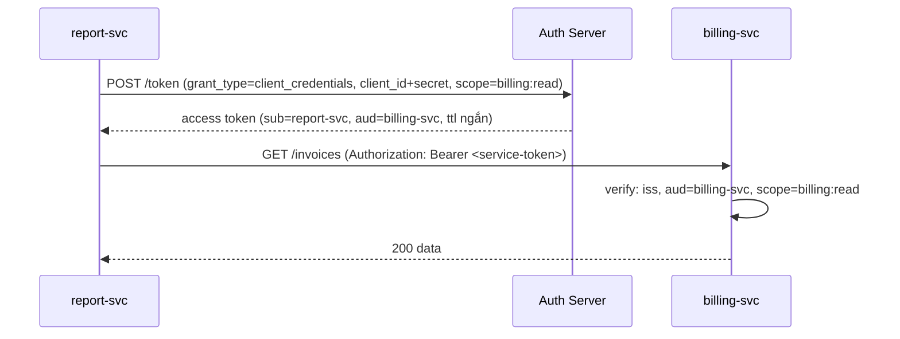
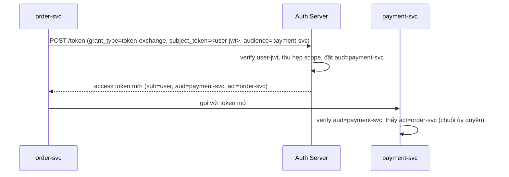
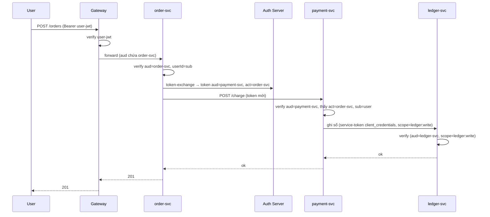

# Microservices Authentication

## Mục lục

- [1. Bối cảnh: một SSRF mở toang cả cụm](#1-bối-cảnh-một-ssrf-mở-toang-cả-cụm)
- [2. Tổng quan: hai trục danh tính](#2-tổng-quan-hai-trục-danh-tính)
- [3. Hai mô hình tin tưởng: edge-only vs zero-trust](#3-hai-mô-hình-tin-tưởng-edge-only-vs-zero-trust)
- [4. Truyền danh tính người dùng giữa các service](#4-truyền-danh-tính-người-dùng-giữa-các-service)
- [5. Service-to-service: client credentials](#5-service-to-service-client-credentials)
- [6. mTLS: danh tính ở tầng vận chuyển](#6-mtls-danh-tính-ở-tầng-vận-chuyển)
- [7. Token exchange & on-behalf-of](#7-token-exchange--on-behalf-of)
- [8. Lan truyền context: trace, tenant, scope](#8-lan-truyền-context-trace-tenant-scope)
- [9. Bẫy "tin tưởng mạng nội bộ"](#9-bẫy-tin-tưởng-mạng-nội-bộ)
- [10. Một ca thiết kế: order → payment → ledger](#10-một-ca-thiết-kế-order--payment--ledger)
- [11. Edge cases thực tế — những lỗi khó debug](#11-edge-cases-thực-tế--những-lỗi-khó-debug)
- [12. Anti-patterns cần tránh](#12-anti-patterns-cần-tránh)
- [13. Câu hỏi thường gặp](#13-câu-hỏi-thường-gặp)
- [14. Checklist microservices auth](#14-checklist-microservices-auth)
- [Tài liệu tham khảo](#tài-liệu-tham-khảo)

---

## 1. Bối cảnh: một SSRF mở toang cả cụm

Một hệ thống có 20 microservice trong cùng cluster Kubernetes. Đội tin rằng "mạng nội bộ là an toàn", nên chỉ API Gateway verify JWT; các service nội bộ gọi nhau qua HTTP thường và **đọc danh tính từ header** `X-User-Id`, `X-User-Role` mà gateway tiêm vào.

Một service xử lý ảnh có lỗ hổng SSRF (Server-Side Request Forgery): attacker khiến nó gửi request HTTP tùy ý. Vì service này nằm *trong* cluster, attacker dùng nó làm bàn đạp:

```text
Attacker → SSRF ở image-svc → gọi nội bộ:
   POST http://admin-svc/users/promote
   X-User-Id: 1
   X-User-Role: admin        ← attacker tự đặt, admin-svc TIN vì "đến từ nội bộ"
→ admin-svc tin header (không verify token) → nâng quyền tài khoản attacker → chiếm hệ thống
```

Không có JWT nào bị giả. Không có khóa nào bị lộ. Lỗ hổng nằm ở **giả định tin tưởng**: "trong mạng nội bộ thì khỏi verify". Một SSRF/RCE ở *một* service biến thành quyền truy cập *toàn hệ thống* (lateral movement).

> [!IMPORTANT]
> Trong microservices, một request người dùng đi qua nhiều service, và mỗi service phải trả lời: *Request này đến từ ai?* (user nào), *Service gọi tôi là ai?* (service nào), *Tôi có nên tin không?*. Câu trả lời an toàn: **mỗi service tự verify**, không tin mù mạng nội bộ hay header chưa ký. Đó là **zero-trust**.

---

## 2. Tổng quan: hai trục danh tính

```diagram
╭───────────────────────────────────────────────────────────────────────────╮
│   HAI LOẠI DANH TÍNH CÙNG TỒN TẠI TRONG MỖI REQUEST NỘI BỘ                 │
│                                                                            │
│   DANH TÍNH NGƯỜI DÙNG               DANH TÍNH SERVICE                       │
│   "ai bấm nút?"                       "service nào đang gọi?"                │
│   mang qua: user JWT (sub=U123)       mang qua: service token / mTLS cert    │
│   dùng để: phân quyền theo user       dùng để: kiểm "service nào được gọi"   │
│                                                                            │
│   vd: payment-svc cần biết CẢ                                              │
│       "order-svc gọi tôi" (service)  +  "thay mặt U123" (user)             │
╰───────────────────────────────────────────────────────────────────────────╯
```

> [!IMPORTANT]
> Đừng trộn lẫn hai trục: **danh tính người dùng** (ai bấm nút — mang qua user JWT) và **danh tính service** (service nào đang gọi — mang qua service token/mTLS). Một request có thể cần cả hai. Doc này tách bạch và chỉ cách kết hợp chúng an toàn.

---

## 3. Hai mô hình tin tưởng: edge-only vs zero-trust

```diagram
EDGE-ONLY (xác thực biên)              ZERO-TRUST (phòng thủ chiều sâu)
────────────────────────              ───────────────────────────────
Gateway verify token 1 lần            Gateway verify + MỖI service verify lại
Nội bộ tin nhau (mạng kín)            Không service nào tin mặc định
Nhanh, đơn giản                       An toàn hơn, chi phí verify mỗi chặng
RỦI RO: 1 service bị xâm nhập →        Lateral movement bị chặn từng tầng
        attacker tự do đi ngang
```

| Tiêu chí | Edge-only | Zero-trust |
|----------|-----------|------------|
| Verify ở đâu | Chỉ gateway | Gateway + mỗi service |
| Hiệu năng | Cao | Thấp hơn (verify lặp) — giảm bằng cache JWKS |
| An toàn lateral movement | Yếu | Mạnh |
| Độ phức tạp | Thấp | Cao hơn (phân phối khóa, cache) |
| Phù hợp | Hệ nhỏ, mạng thật sự kín | Hệ lớn, dữ liệu nhạy cảm, đa nhóm |

```diagram
CHI PHÍ VERIFY ZERO-TRUST có thật sự lớn?
  - verify RS256 với public key đã cache: ~vài chục–trăm microsecond/lần (CPU thuần)
  - KHÔNG gọi mạng nếu JWKS đã cache → không thêm độ trễ mạng
  → so với lợi ích (chặn lateral movement), chi phí thường chấp nhận được
  → "verify chậm" thường là do gọi JWKS mỗi request (sai) chứ không phải do thuật toán
```

> [!TIP]
> Mặc định nên nghiêng về **zero-trust**: mỗi service tự verify JWT (chữ ký + `iss` + `aud` của chính nó) thay vì tin mù vào việc "gateway đã verify". Chi phí verify rất nhỏ khi cache JWKS, đổi lại một service bị xâm nhập không cho attacker tự do gọi các service khác. "Mạng nội bộ an toàn" là giả định nguy hiểm (xem [mục 9](#9-bẫy-tin-tưởng-mạng-nội-bộ)).

---

## 4. Truyền danh tính người dùng giữa các service

Khi gateway đã verify user JWT, làm sao các service phía sau biết "user U123"? Có hai cách phổ biến:

```diagram
CÁCH A: chuyển tiếp NGUYÊN user JWT
  Gateway ──(Authorization: Bearer <user-jwt>)──▶ order-svc ──(cùng JWT)──▶ payment-svc
  ✔ mỗi service tự verify lại (zero-trust); đơn giản
  ✘ token sống lâu lan rộng; aud phải bao gồm mọi service; khó least-privilege

CÁCH B: gateway/service phát token NỘI BỘ (token exchange)
  Gateway verify user-jwt → phát internal-jwt (aud=order-svc, ttl ngắn, scope hẹp) ──▶ order-svc
  ✔ token nội bộ aud hẹp, ttl ngắn, least-privilege; audit chuỗi act
  ✘ phức tạp hơn; cần auth server hỗ trợ token-exchange
```

```javascript
// Service phía sau verify user JWT được chuyển tiếp (zero-trust)
import { createRemoteJWKSet, jwtVerify } from 'jose';
const JWKS = createRemoteJWKSet(new URL('https://auth.example.com/.well-known/jwks.json'));

async function verifyForwardedUser(forwardedToken) {
  const { payload } = await jwtVerify(forwardedToken, JWKS, {
    algorithms: ['RS256'],
    issuer: 'https://auth.example.com',
    audience: 'payment-svc',          // token PHẢI nhắm tới đúng service này
  });
  return { userId: payload.sub, scope: payload.scope, tenant: payload.tenant };
}
```

<Callout type="warn">
Nếu chuyển tiếp nguyên user JWT, mỗi service vẫn <b>phải tự verify</b> (chữ ký + <code>aud</code> của nó). Đừng đọc <code>sub</code> từ token chưa verify chỉ vì "token đến từ service nội bộ". Lý tưởng nhất: token có <code>aud</code> liệt kê các service được phép dùng, hoặc dùng token exchange để mỗi chặng có token <code>aud</code> hẹp (mục 7).
</Callout>

```diagram
KHI NÀO CHỌN A, KHI NÀO CHỌN B?
  A (forward JWT)     → hệ vừa, ít chặng, các service tin cậy tương đương, ưu tiên đơn giản
  B (token-exchange)  → hệ lớn/nhạy cảm, cần least-privilege từng chặng, cần audit "ai thay mặt ai"
```

---

## 5. Service-to-service: client credentials

Khi service tự gọi service khác **không thay mặt người dùng nào** (vd cron job, background worker, đồng bộ dữ liệu), dùng **OAuth Client Credentials**: service tự lấy access token bằng `client_id`/`client_secret`.



```javascript
// report-svc lấy token service-to-service rồi cache tới gần hết hạn
let cached = { token: null, exp: 0 };

async function getServiceToken() {
  if (cached.token && Date.now() < cached.exp - 30_000) return cached.token;  // còn hạn → tái dùng
  const res = await fetch('https://auth.example.com/oauth/token', {
    method: 'POST',
    headers: { 'Content-Type': 'application/x-www-form-urlencoded' },
    body: new URLSearchParams({
      grant_type: 'client_credentials',
      client_id: process.env.SVC_CLIENT_ID,
      client_secret: process.env.SVC_CLIENT_SECRET,
      scope: 'billing:read',
    }),
  });
  if (!res.ok) throw new Error('token_request_failed');
  const { access_token, expires_in } = await res.json();
  cached = { token: access_token, exp: Date.now() + expires_in * 1000 };
  return access_token;
}

// dùng: gọi billing-svc với service token
async function fetchInvoices() {
  const token = await getServiceToken();
  return fetch('https://billing.internal/invoices', {
    headers: { Authorization: `Bearer ${token}` },
  });
}
```

> [!NOTE]
> Token client_credentials có `sub` là chính **service** (không phải người dùng), `aud` là service đích, scope hẹp đúng việc cần. Cache token tới gần hết hạn để không gọi `/token` mỗi request. Lưu `client_secret` trong secret manager, xoay định kỳ — xem [Migration Strategy](/operations/migration-strategy/) phần xoay khóa/secret.

<Callout type="warn">
Khi <code>client_credentials</code> token bị rò, attacker có quyền của <i>service</i> đó cho tới khi token hết hạn. Giữ scope tối thiểu (chỉ <code>billing:read</code> nếu chỉ cần đọc), TTL ngắn, và xoay <code>client_secret</code> định kỳ. Đừng dùng một "super service account" full-scope cho mọi việc — nó là chìa khóa vạn năng nếu lộ.
</Callout>

---

## 6. mTLS: danh tính ở tầng vận chuyển

JWT chứng minh danh tính ở tầng *ứng dụng*; **mTLS (mutual TLS)** chứng minh danh tính ở tầng *vận chuyển* — mỗi service có cert riêng, hai bên xác thực lẫn nhau khi bắt tay TLS.

```diagram
JWT (tầng app)              mTLS (tầng transport)
─────────────              ──────────────────────
"user U123 / svc X"        "kết nối này thật sự từ svc X"
mang context, scope        chống mạo danh ở tầng mạng
attacker chặn được token   attacker không có private key của svc → không kết nối được
   vẫn dùng lại được
KẾT HỢP: mTLS xác thực service + JWT mang danh tính user/scope  →  phòng thủ 2 lớp
```

| | JWT | mTLS |
|---|-----|------|
| Tầng | Ứng dụng (HTTP header) | Vận chuyển (TLS handshake) |
| Mang gì | Claim: user, scope, tenant | Danh tính cert của peer |
| Chống | Giả mạo nội dung danh tính | Mạo danh kết nối, MITM |
| Thu hồi | exp/blacklist | Thu hồi cert / xoay CA |
| Ai cấp/quản | IdP / auth server | PKI nội bộ / service mesh CA |

```diagram
TRONG SERVICE MESH (Istio/Linkerd):
  sidecar proxy tự thiết lập mTLS giữa mọi pod → mã hóa + xác thực service
  → app code KHÔNG phải quản cert, chỉ gọi http://service-b nội bộ
  → JWT vẫn đi trong header để mang danh tính USER + scope
  ⇒ mTLS lo "service nào", JWT lo "user nào + được làm gì"
```

> [!TIP]
> Trong service mesh (Istio, Linkerd), mTLS thường được sidecar tự lo: mọi kết nối service-to-service được mã hóa + xác thực bằng cert mà không cần sửa code. JWT vẫn mang danh tính *người dùng* và *scope* bên trong. Hai cơ chế bổ sung cho nhau, không thay thế nhau — mTLS một mình không biết "user nào", JWT một mình không chống được mạo danh kết nối nếu token bị rò.

---

## 7. Token exchange & on-behalf-of

Khi service A (đã có user token) cần gọi service B *thay mặt cùng người dùng* nhưng muốn token nhắm đúng B với scope hẹp hơn, dùng **OAuth Token Exchange (RFC 8693)**.



```javascript
// order-svc đổi user token lấy token nhắm payment-svc, scope hẹp
async function exchangeForPayment(userToken) {
  const res = await fetch('https://auth.example.com/oauth/token', {
    method: 'POST',
    headers: { 'Content-Type': 'application/x-www-form-urlencoded' },
    body: new URLSearchParams({
      grant_type: 'urn:ietf:params:oauth:grant-type:token-exchange',
      subject_token: userToken,
      subject_token_type: 'urn:ietf:params:oauth:token-type:jwt',
      audience: 'payment-svc',
      scope: 'payment:charge',                  // thu hẹp về đúng việc cần
    }),
  });
  const { access_token } = await res.json();    // sub=user, aud=payment-svc, act=order-svc
  return access_token;
}
```

```diagram
act (actor) claim — chuỗi ủy quyền:
  {
    "sub": "U123",                 ← user gốc
    "aud": "payment-svc",
    "act": { "sub": "order-svc" }  ← service đang thay mặt user
  }
→ audit log dựng lại: "U123 → order-svc → payment-svc"
→ payment-svc biết cả "thay mặt ai" lẫn "service nào đang gọi"
```

> [!NOTE]
> Token exchange giải quyết bài toán "least privilege giữa các chặng": thay vì để user token full-scope đi khắp nơi, mỗi chặng nhận token `aud` hẹp + scope tối thiểu + claim `act` (actor) ghi lại *service nào đang thay mặt user*. Nhờ `act`, audit log dựng lại được chuỗi "user U123 → order-svc → payment-svc". Phức tạp hơn nhưng cần cho hệ nhạy cảm.

---

## 8. Lan truyền context: trace, tenant, scope

Ngoài danh tính, request cần mang theo context xuyên suốt để quan sát và phân quyền:

| Context | Mang ở đâu | Dùng để | Tin được không? |
|---------|------------|---------|------------------|
| `trace_id` / `traceparent` | Header (W3C Trace Context) | Nối log/trace qua các service | Chỉ để quan sát, không phân quyền |
| `tenant_id` | **Claim trong JWT (đã verify)** | Cô lập dữ liệu đa tenant | Tin (đã ký) |
| `scope` / `roles` | **Claim trong JWT** | Phân quyền tại mỗi service | Tin (đã ký) |
| `act` (actor) | **Claim (token exchange)** | Audit chuỗi ủy quyền | Tin (đã ký) |

```javascript
// Chuyển tiếp trace context + verify tenant từ claim (KHÔNG từ header tùy ý)
function downstreamHeaders(req, serviceToken) {
  return {
    Authorization: `Bearer ${serviceToken}`,
    traceparent: req.headers.traceparent,        // nối trace xuyên service (chỉ quan sát)
    // KHÔNG tiêm X-Tenant-Id từ header client; tenant lấy từ JWT đã verify
  };
}

// tenant lấy từ claim ĐÃ verify ở tầng authenticate, KHÔNG từ header
const tenantId = req.user.tenant;
const rows = await db.query('SELECT * FROM orders WHERE tenant_id = $1', [tenantId]);
```

<Callout type="warn">
<code>tenant_id</code> và <code>scope</code> phải đến từ <b>claim JWT đã verify</b>, tuyệt đối không từ header tùy ý như <code>X-Tenant-Id</code> do client/service trước đặt. Tin header nội bộ là cách kẻ tấn công (đã chiếm 1 service) leo quyền sang tenant khác — đúng kịch bản bối cảnh mục 1. <code>trace_id</code> thì ngược lại — chỉ để quan sát, không dùng cho phân quyền, nên chuyển tiếp tự do được.
</Callout>

---

## 9. Bẫy "tin tưởng mạng nội bộ"

```diagram
GIẢ ĐỊNH SAI: "trong VPC/cluster nên không cần verify nữa"
   │
   ├── 1 service bị RCE/SSRF  →  attacker gọi tự do mọi service nội bộ
   ├── pod bị chiếm           →  lateral movement không bị chặn
   └── header X-User-Id tùy ý →  giả mạo bất kỳ user nào

ĐÚNG: mỗi service verify JWT (chữ ký + iss + aud) BẤT KỂ nguồn gọi từ đâu
       + network policy hạn chế đường gọi + mTLS xác thực service
```

| Lớp phòng thủ | Chống | Ghi chú |
|---------------|-------|---------|
| Mỗi service verify JWT | Header spoofing, token sai | Lớp chính (zero-trust) |
| Network policy (K8s) | Gọi ngang tùy tiện | Chỉ cho service A gọi service B đúng đường |
| mTLS | Mạo danh kết nối | Service mesh tự lo |
| Scope/aud hẹp từng token | Lateral movement | Token chiếm được chỉ dùng được phạm vi hẹp |

> [!WARNING]
> "Mạng nội bộ an toàn nên bỏ verify" là một trong những lỗi kiến trúc nguy hiểm nhất. Một lỗ hổng SSRF/RCE ở một service biến thành quyền truy cập toàn hệ thống. Luôn áp dụng zero-trust: mỗi service verify token, kiểm `aud` của chính nó, và **không bao giờ** tin các header danh tính/quyền hạn do service khác đặt mà chưa có chữ ký. Xem [Zero-Trust API](/case-studies/zero-trust-api/).

---

## 10. Một ca thiết kế: order → payment → ledger

Tình huống: user đặt hàng. `order-svc` gọi `payment-svc` để trừ tiền, `payment-svc` gọi `ledger-svc` ghi sổ.



| Chặng | Loại token | aud | Vì sao |
|-------|-----------|-----|--------|
| User → Gateway → order | user JWT | order-svc | Mang danh tính user; order verify lại |
| order → payment | token-exchange | payment-svc | Thu hẹp scope; ghi `act=order-svc` cho audit |
| payment → ledger | client_credentials | ledger-svc | Ghi sổ là việc *hệ thống*, không thay mặt user về quyền |

```diagram
NẾU payment-svc BỊ XÂM NHẬP, attacker cầm được gì?
  - token aud=payment-svc (nhận từ order): chỉ dùng được VỚI payment-svc, scope payment:charge
  - service-token aud=ledger-svc, scope ledger:write: chỉ ghi sổ được
  → KHÔNG có token nào cho phép gọi admin-svc hay đọc dữ liệu user khác
  → thiệt hại bị giới hạn trong phạm vi payment ↔ ledger (least-privilege phát huy)
```

> [!NOTE]
> Mỗi chặng có token `aud` nhắm đúng service đích và scope tối thiểu. Chuỗi `act` cho phép dựng lại "ai làm gì thay mặt ai" trong audit log. Nếu payment-svc bị xâm nhập, token nó cầm chỉ dùng được với ledger-svc ở scope `ledger:write` — không phải toàn hệ thống. Đó là phòng thủ chiều sâu trong thực tế.

---

## 11. Edge cases thực tế — những lỗi khó debug

### 11.1 `aud` không bao gồm service đích khi forward JWT

Triệu chứng: gateway forward nguyên user JWT, nhưng service phía sau 401 "invalid audience". Nguyên nhân: token chỉ có `aud=order-svc`, còn `payment-svc` verify `aud=payment-svc` → fail. Khắc phục: hoặc IdP cấp token với `aud` mảng gồm mọi service, hoặc dùng token-exchange cho mỗi chặng (khuyến nghị cho least-privilege).

### 11.2 Clock skew giữa các service

Token cấp ở service A, verify ở service B với đồng hồ lệch → `exp`/`nbf` fail chập chờn. Đồng bộ NTP mọi node + `clockTolerance` 30–60s. Xem [Backend API Auth](/implementation/backend-api-auth/).

### 11.3 JWKS "bão refetch" khi xoay khóa

Khi IdP xoay sang `kid` mới, *mọi* service đồng loạt gặp kid lạ và refetch JWKS cùng lúc → dồn tải IdP. Khắc phục: cache có cooldown (jose có sẵn), IdP công bố khóa mới *trước* khi ký bằng nó (overlap window), và cân nhắc cache JWKS ở sidecar/gateway dùng chung.

### 11.4 Service token hết hạn giữa chừng

`getServiceToken()` cache token nhưng worker chạy lâu, token hết hạn giữa request dài → 401. Khắc phục: làm tươi token *trước* khi gần hết hạn (đã trừ 30s ở mục 5), và retry 1 lần với token mới khi gặp 401.

### 11.5 Trace context đứt vì quên chuyển tiếp header

Triệu chứng: trace trong APM "gãy" tại một service. Nguyên nhân: service đó tạo request downstream mới mà không copy `traceparent`. Khắc phục: dùng thư viện OTel auto-instrument hoặc nhớ chuyển tiếp `traceparent` ở mọi lời gọi ra.

---

## 12. Anti-patterns cần tránh

| Anti-pattern | Hậu quả | Khắc phục |
|--------------|---------|-----------|
| Tin mù mạng nội bộ, không verify | Lateral movement khi 1 service thủng | Zero-trust: mỗi service verify |
| Đọc identity/quyền từ header chưa ký | Header spoofing | Lấy từ claim JWT đã verify |
| Một `aud` chung cho mọi service | Token service này dùng ở service kia | `aud` riêng từng service |
| Super service-account full-scope | Lộ = chìa khóa vạn năng | client_credentials scope tối thiểu/đích |
| Gọi JWKS mỗi request | Chậm, quá tải IdP | Cache + cooldown ở mỗi service |
| `client_secret` hardcode/trong image | Lộ khi image bị đọc | Secret manager, xoay định kỳ |
| Forward user JWT full-scope khắp nơi | Token sống lâu lan rộng | Token-exchange aud hẹp + act |
| Dùng `X-Tenant-Id` header cho phân quyền | Leo quyền cross-tenant | tenant từ claim đã verify |
| Bỏ mTLS, chỉ dựa JWT | Mạo danh kết nối nếu token rò | mTLS (mesh) + JWT |

---

## 13. Câu hỏi thường gặp

<Accordions>

<Accordion title="Mesh đã có mTLS rồi, còn cần verify JWT ở service không?">
Cần. mTLS chứng minh "service nào đang gọi" nhưng KHÔNG biết "user nào" và "được làm gì". Một service hợp lệ (đã qua mTLS) vẫn có thể bị lợi dụng (SSRF) để gọi service khác. JWT mang danh tính user + scope và cho phép mỗi service tự quyết định phân quyền. Hai lớp bổ sung nhau.
</Accordion>

<Accordion title="Forward nguyên JWT hay token-exchange — chọn cái nào?">
Hệ vừa, ít chặng, ưu tiên đơn giản: forward JWT (nhớ aud bao gồm các service, mỗi service verify lại). Hệ lớn/nhạy cảm, cần least-privilege và audit "ai thay mặt ai": token-exchange với aud hẹp + act. Có thể bắt đầu với forward và tiến hóa sang exchange khi cần.
</Accordion>

<Accordion title="Verify JWT ở mọi service có làm chậm hệ thống không?">
Verify RS256 với public key đã cache tốn vài chục–trăm microsecond CPU, KHÔNG gọi mạng nếu JWKS đã cache. "Verify chậm" gần như luôn do gọi JWKS mỗi request (cấu hình sai), không phải do thuật toán. Cache JWKS đúng cách thì chi phí không đáng kể so với lợi ích chặn lateral movement.
</Accordion>

<Accordion title="Service nội bộ gọi nhau có cần đi qua gateway không?">
Không nhất thiết — service nội bộ thường gọi trực tiếp nhau (qua mesh). Nhưng nếu bạn theo mẫu "gateway tiêm header danh tính", phải đảm bảo service CHỈ nhận traffic qua gateway (network policy) và không gọi tắt. An toàn hơn là zero-trust: gọi trực tiếp cũng được vì mỗi service tự verify token.
</Accordion>

</Accordions>

---

## 14. Checklist microservices auth

```diagram
MÔ HÌNH TIN TƯỞNG:
□ Zero-trust: MỖI service verify JWT (chữ ký + iss + aud của nó)
□ KHÔNG tin mù mạng nội bộ / header danh tính chưa ký
□ aud của token nhắm đúng service đích (riêng từng service)
□ Network policy hạn chế đường gọi ngang

DANH TÍNH:
□ Phân biệt danh tính user (user-jwt) vs service (client_credentials/mTLS)
□ tenant_id/scope lấy từ claim đã verify, KHÔNG từ header tùy ý
□ Cân nhắc token-exchange cho least-privilege giữa các chặng (claim act)

SERVICE-TO-SERVICE:
□ Client credentials cho gọi không thay mặt user; scope tối thiểu/đích
□ Cache service token tới gần hết hạn; làm tươi trước khi hết
□ mTLS (service mesh) xác thực kết nối ở tầng transport
□ client_secret trong secret manager, xoay định kỳ

QUAN SÁT:
□ Chuyển tiếp trace_id/traceparent xuyên service (chỉ để quan sát)
□ Audit chuỗi act cho hành động nhạy cảm
□ Cache JWKS ở mỗi service (verify nhanh, refetch theo kid + cooldown)
```

<Callout type="success" title="Một câu để nhớ">
<b>Mỗi service tự verify (zero-trust), aud nhắm đúng đích, quyền hạn từ claim đã ký — không bao giờ từ header nội bộ.</b> Tách danh tính user (JWT) và danh tính service (client_credentials/mTLS); dùng token-exchange để giữ least-privilege qua từng chặng và giới hạn thiệt hại khi một service bị xâm nhập.
</Callout>

---

## Tài liệu tham khảo

- [API Gateway Auth](/implementation/api-gateway-auth/) — verify tập trung ở biên
- [Backend API Auth](/implementation/backend-api-auth/) — verify ở từng service
- [Service-to-Service](/case-studies/service-to-service/) — ca thực tế s2s auth
- [Zero-Trust API](/case-studies/zero-trust-api/) — vì sao không tin mạng nội bộ
- [Audience / Issuer / Subject](/internals/audience-issuer-subject/) — vai trò claim aud trong định tuyến tin tưởng
- [OAuth2/OIDC Integration](/implementation/oauth2-oidc-integration/) — client_credentials, token exchange
- [JWT Threat Model](/security/jwt-threat-model/) — mối đe dọa lateral movement
- [Observability & Audit](/operations/observability-and-audit/) — lan truyền trace, audit chuỗi ủy quyền
- [Migration Strategy](/operations/migration-strategy/) — xoay khóa/secret
- [RFC 8693 — OAuth 2.0 Token Exchange](https://www.rfc-editor.org/rfc/rfc8693)
