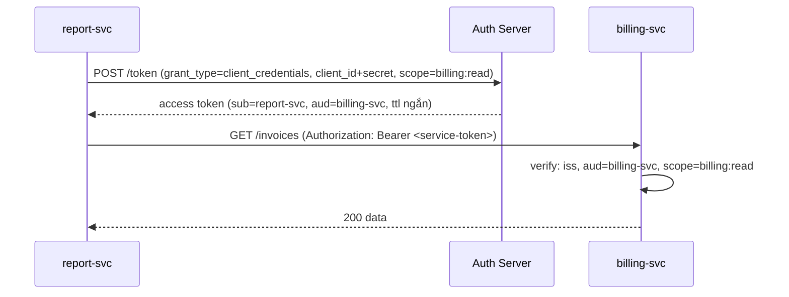

# Microservices Authentication

## Mục lục

- [Tổng quan](#tổng-quan)
- [1. Hai mô hình tin tưởng: edge-only vs zero-trust](#1-hai-mô-hình-tin-tưởng-edge-only-vs-zero-trust)
- [2. Truyền danh tính người dùng giữa các service](#2-truyền-danh-tính-người-dùng-giữa-các-service)
- [3. Service-to-service: client credentials](#3-service-to-service-client-credentials)
- [4. mTLS: danh tính ở tầng vận chuyển](#4-mtls-danh-tính-ở-tầng-vận-chuyển)
- [5. Token exchange & on-behalf-of](#5-token-exchange--on-behalf-of)
- [6. Lan truyền context: trace, tenant, scope](#6-lan-truyền-context-trace-tenant-scope)
- [7. Bẫy "tin tưởng mạng nội bộ"](#7-bẫy-tin-tưởng-mạng-nội-bộ)
- [8. Một ca thiết kế: order → payment → ledger](#8-một-ca-thiết-kế-order--payment--ledger)
- [9. Checklist microservices auth](#9-checklist-microservices-auth)
- [Tài liệu tham khảo](#tài-liệu-tham-khảo)

---

## Tổng quan

Trong monolith, xác thực xảy ra một lần ở cổng vào. Trong microservices, một request người dùng có thể đi qua hàng chục service — và mỗi service phải trả lời ba câu hỏi: *Request này đến từ ai?* (người dùng nào), *Service gọi tôi là ai?* (service nào), và *Tôi có nên tin không?*. JWT là phương tiện chính để mang danh tính đi qua nhiều chặng mà không cần mỗi service gọi lại IdP.

```diagram
Client ─▶ Gateway ─▶ order-svc ─▶ payment-svc ─▶ ledger-svc
            │            │             │              │
        verify user   tin gateway?   tin order?     tin payment?
        (1 lần)        ┌── edge-only: tin mù mạng nội bộ (rủi ro)
                       └── zero-trust: MỖI service tự verify lại
```

> [!IMPORTANT]
> Hai loại danh tính cùng tồn tại: **danh tính người dùng** (ai bấm nút — mang qua user JWT) và **danh tính service** (service nào đang gọi — mang qua service token/mTLS). Đừng trộn lẫn: payment-svc cần biết *cả* "order-svc gọi tôi" *lẫn* "thay mặt user U123". Doc này tách bạch hai trục đó.

---

## 1. Hai mô hình tin tưởng: edge-only vs zero-trust

```diagram
EDGE-ONLY (xác thực biên)              ZERO-TRUST (phòng thủ chiều sâu)
────────────────────────              ───────────────────────────────
Gateway verify token 1 lần            Gateway verify + MỖI service verify lại
Nội bộ tin nhau (mạng kín)            Không service nào tin mặc định
Nhanh, đơn giản                       An toàn hơn, chi phí verify mỗi chặng
RỦI RO: 1 service bị xâm nhập →        Lateral movement bị chặn từng tầng
        attacker tự do đi ngang
```

| Tiêu chí | Edge-only | Zero-trust |
|----------|-----------|------------|
| Verify ở đâu | Chỉ gateway | Gateway + mỗi service |
| Hiệu năng | Cao | Thấp hơn (verify lặp) — giảm bằng cache JWKS |
| An toàn lateral movement | Yếu | Mạnh |
| Phù hợp | Hệ nhỏ, mạng thật sự kín | Hệ lớn, dữ liệu nhạy cảm, đa nhóm |

> [!TIP]
> Mặc định nên nghiêng về **zero-trust**: mỗi service tự verify JWT (chữ ký + `iss` + `aud` của chính nó) thay vì tin mù vào việc "gateway đã verify". Chi phí verify rất nhỏ khi cache JWKS, đổi lại một service bị xâm nhập không cho attacker tự do gọi các service khác. "Mạng nội bộ an toàn" là giả định nguy hiểm (xem [mục 7](#7-bẫy-tin-tưởng-mạng-nội-bộ)).

---

## 2. Truyền danh tính người dùng giữa các service

Khi gateway đã verify user JWT, làm sao các service phía sau biết "user U123"? Có hai cách phổ biến:

```diagram
CÁCH A: chuyển tiếp NGUYÊN user JWT
  Gateway ──(Authorization: Bearer <user-jwt>)──▶ order-svc ──(cùng JWT)──▶ payment-svc
  ✔ mỗi service tự verify lại (zero-trust); ✘ token sống lâu lan rộng

CÁCH B: gateway phát token NỘI BỘ (token exchange)
  Gateway verify user-jwt → phát internal-jwt (aud=order-svc, ttl ngắn) ──▶ order-svc
  ✔ token nội bộ aud hẹp, ttl ngắn; ✘ phức tạp hơn
```

```javascript
// Service phía sau verify user JWT được chuyển tiếp (zero-trust)
const { payload } = await jwtVerify(forwardedToken, JWKS, {
  algorithms: ['RS256'],
  issuer: 'https://auth.example.com',
  audience: 'payment-svc',          // token PHẢI nhắm tới đúng service này
});
const userId = payload.sub;          // danh tính người dùng đi qua nhiều chặng
```

<Callout type="warn">
Nếu chuyển tiếp nguyên user JWT, mỗi service vẫn <b>phải tự verify</b> (chữ ký + <code>aud</code> của nó). Đừng đọc <code>sub</code> từ token chưa verify chỉ vì "token đến từ service nội bộ". Lý tưởng nhất: token có <code>aud</code> liệt kê các service được phép dùng, hoặc dùng token exchange để mỗi chặng có token <code>aud</code> hẹp.
</Callout>

---

## 3. Service-to-service: client credentials

Khi service tự gọi service khác **không thay mặt người dùng nào** (vd cron job, background worker), dùng **OAuth Client Credentials**: service tự lấy access token bằng `client_id`/`client_secret`.



```javascript
// report-svc lấy token service-to-service rồi cache tới gần hết hạn
let cached = { token: null, exp: 0 };
async function getServiceToken() {
  if (cached.token && Date.now() < cached.exp - 30_000) return cached.token;
  const res = await fetch('https://auth.example.com/oauth/token', {
    method: 'POST',
    headers: { 'Content-Type': 'application/x-www-form-urlencoded' },
    body: new URLSearchParams({
      grant_type: 'client_credentials',
      client_id: process.env.SVC_CLIENT_ID,
      client_secret: process.env.SVC_CLIENT_SECRET,
      scope: 'billing:read',
    }),
  });
  const { access_token, expires_in } = await res.json();
  cached = { token: access_token, exp: Date.now() + expires_in * 1000 };
  return access_token;
}
```

> [!NOTE]
> Token client_credentials có `sub` là chính **service** (không phải người dùng), `aud` là service đích, scope hẹp đúng việc cần. Cache token tới gần hết hạn để không gọi `/token` mỗi request. Lưu `client_secret` trong secret manager, xoay định kỳ — xem [Migration Strategy](/operations/migration-strategy/) phần xoay khóa/secret.

---

## 4. mTLS: danh tính ở tầng vận chuyển

JWT chứng minh danh tính ở tầng *ứng dụng*; **mTLS (mutual TLS)** chứng minh danh tính ở tầng *vận chuyển* — mỗi service có cert riêng, hai bên xác thực lẫn nhau khi bắt tay TLS.

```diagram
JWT (tầng app)              mTLS (tầng transport)
─────────────              ──────────────────────
"user U123 / svc X"        "kết nối này thật sự từ svc X"
mang context, scope        chống mạo danh ở tầng mạng
attacker chặn được token   attacker không có private key của svc → không kết nối được
   vẫn dùng lại được
KẾT HỢP: mTLS xác thực service + JWT mang danh tính user/scope  →  phòng thủ 2 lớp
```

| | JWT | mTLS |
|---|-----|------|
| Tầng | Ứng dụng (HTTP header) | Vận chuyển (TLS handshake) |
| Mang gì | Claim: user, scope, tenant | Danh tính cert của peer |
| Chống | Giả mạo nội dung danh tính | Mạo danh kết nối, MITM |
| Thu hồi | exp/blacklist | Thu hồi cert / xoay CA |

> [!TIP]
> Trong service mesh (Istio, Linkerd), mTLS thường được sidecar tự lo: mọi kết nối service-to-service được mã hóa + xác thực bằng cert mà không cần sửa code. JWT vẫn mang danh tính *người dùng* và *scope* bên trong. Hai cơ chế bổ sung cho nhau, không thay thế nhau.

---

## 5. Token exchange & on-behalf-of

Khi service A (đã có user token) cần gọi service B *thay mặt cùng người dùng* nhưng muốn token nhắm đúng B với scope hẹp hơn, dùng **OAuth Token Exchange (RFC 8693)**.

```mermaid
sequenceDiagram
    participant A as order-svc
    participant Z as Auth Server
    participant B as payment-svc
    A->>Z: POST /token (grant_type=token-exchange, subject_token=<user-jwt>, audience=payment-svc)
    Z->>Z: verify user-jwt, thu hẹp scope, đặt aud=payment-svc
    Z-->>A: access token mới (sub=user, aud=payment-svc, act=order-svc)
    A->>B: gọi với token mới
    B->>B: verify aud=payment-svc; thấy act=order-svc (chuỗi ủy quyền)
```

> [!NOTE]
> Token exchange giải quyết bài toán "least privilege giữa các chặng": thay vì để user token full-scope đi khắp nơi, mỗi chặng nhận token `aud` hẹp + scope tối thiểu + claim `act` (actor) ghi lại *service nào đang thay mặt user*. Nhờ `act`, audit log dựng lại được chuỗi "user U123 → order-svc → payment-svc". Phức tạp hơn nhưng cần cho hệ nhạy cảm.

---

## 6. Lan truyền context: trace, tenant, scope

Ngoài danh tính, request cần mang theo context xuyên suốt để quan sát và phân quyền:

| Context | Mang ở đâu | Dùng để |
|---------|------------|---------|
| `trace_id` / `traceparent` | Header (W3C Trace Context) | Nối log/trace qua các service |
| `tenant_id` | Claim trong JWT (đã verify) | Cô lập dữ liệu đa tenant |
| `scope` / `roles` | Claim trong JWT | Phân quyền tại mỗi service |
| `act` (actor) | Claim (token exchange) | Audit chuỗi ủy quyền |

```javascript
// Chuyển tiếp trace context + verify tenant từ claim (KHÔNG từ header tùy ý)
function downstreamHeaders(req, serviceToken) {
  return {
    Authorization: `Bearer ${serviceToken}`,
    traceparent: req.headers.traceparent,        // nối trace xuyên service
    // tenant lấy từ JWT đã verify, KHÔNG từ header client gửi
  };
}
const tenantId = req.user.tenant;                // đã verify ở tầng authenticate
```

<Callout type="warn">
<code>tenant_id</code> và <code>scope</code> phải đến từ <b>claim JWT đã verify</b>, tuyệt đối không từ header tùy ý như <code>X-Tenant-Id</code> do client/service trước đặt. Tin header nội bộ là cách kẻ tấn công (đã chiếm 1 service) leo quyền sang tenant khác. <code>trace_id</code> thì ngược lại — chỉ để quan sát, không dùng cho phân quyền, nên chuyển tiếp tự do được.
</Callout>

---

## 7. Bẫy "tin tưởng mạng nội bộ"

```diagram
GIẢ ĐỊNH SAI: "trong VPC/cluster nên không cần verify nữa"
   │
   ├── 1 service bị RCE/SSRF  →  attacker gọi tự do mọi service nội bộ
   ├── pod bị chiếm           →  lateral movement không bị chặn
   └── header X-User-Id tùy ý →  giả mạo bất kỳ user nào

ĐÚNG: mỗi service verify JWT (chữ ký + iss + aud) BẤT KỂ nguồn gọi từ đâu
```

> [!WARNING]
> "Mạng nội bộ an toàn nên bỏ verify" là một trong những lỗi kiến trúc nguy hiểm nhất. Một lỗ hổng SSRF/RCE ở một service biến thành quyền truy cập toàn hệ thống. Luôn áp dụng zero-trust: mỗi service verify token, kiểm `aud` của chính nó, và **không bao giờ** tin các header danh tính/quyền hạn do service khác đặt mà chưa có chữ ký. Xem [Zero-Trust API](/case-studies/zero-trust-api/).

---

## 8. Một ca thiết kế: order → payment → ledger

Tình huống: user đặt hàng. `order-svc` gọi `payment-svc` để trừ tiền, `payment-svc` gọi `ledger-svc` ghi sổ.

```mermaid
sequenceDiagram
    participant U as User
    participant G as Gateway
    participant O as order-svc
    participant P as payment-svc
    participant L as ledger-svc
    U->>G: POST /orders (Bearer user-jwt)
    G->>G: verify user-jwt
    G->>O: forward (aud chứa order-svc)
    O->>O: verify (aud=order-svc); userId=sub
    O->>Z: token-exchange → token aud=payment-svc, act=order-svc
    O->>P: POST /charge (token mới)
    P->>P: verify (aud=payment-svc); thấy act=order-svc, sub=user
    P->>L: ghi sổ (service-token client_credentials, scope=ledger:write)
    L->>L: verify (aud=ledger-svc, scope=ledger:write)
    L-->>P: ok → P-->>O: ok → O-->>G: 201 → G-->>U: 201
```

| Chặng | Loại token | aud | Vì sao |
|-------|-----------|-----|--------|
| User → Gateway → order | user JWT | order-svc | Mang danh tính user; order verify lại |
| order → payment | token-exchange | payment-svc | Thu hẹp scope; ghi `act=order-svc` cho audit |
| payment → ledger | client_credentials | ledger-svc | Ghi sổ là việc *hệ thống*, không thay mặt user cụ thể về quyền |

> [!NOTE]
> Mỗi chặng có token `aud` nhắm đúng service đích và scope tối thiểu. Chuỗi `act` cho phép dựng lại "ai làm gì thay mặt ai" trong audit log. Nếu payment-svc bị xâm nhập, token nó cầm chỉ dùng được với ledger-svc ở scope `ledger:write` — không phải toàn hệ thống. Đó là phòng thủ chiều sâu trong thực tế.

---

## 9. Checklist microservices auth

```diagram
MÔ HÌNH TIN TƯỞNG:
□ Zero-trust: MỖI service verify JWT (chữ ký + iss + aud của nó)
□ KHÔNG tin mù mạng nội bộ / header danh tính chưa ký
□ aud của token nhắm đúng service đích

DANH TÍNH:
□ Phân biệt danh tính user (user-jwt) vs service (client_credentials/mTLS)
□ tenant_id/scope lấy từ claim đã verify, KHÔNG từ header tùy ý
□ Cân nhắc token-exchange cho least-privilege giữa các chặng (claim act)

SERVICE-TO-SERVICE:
□ Client credentials cho gọi không thay mặt user; cache token tới gần hết hạn
□ mTLS (service mesh) xác thực kết nối ở tầng transport
□ client_secret trong secret manager, xoay định kỳ

QUAN SÁT:
□ Chuyển tiếp trace_id/traceparent xuyên service (chỉ để quan sát)
□ Audit chuỗi act cho hành động nhạy cảm
□ Cache JWKS ở mỗi service (verify nhanh, refetch theo kid)
```

<Callout type="success" title="Một câu để nhớ">
<b>Mỗi service tự verify (zero-trust), aud nhắm đúng đích, quyền hạn từ claim đã ký — không bao giờ từ header nội bộ.</b> Tách danh tính user (JWT) và danh tính service (client_credentials/mTLS); dùng token-exchange để giữ least-privilege qua từng chặng.
</Callout>

---

## Tài liệu tham khảo

- [API Gateway Auth](/implementation/api-gateway-auth/) — verify tập trung ở biên
- [Backend API Auth](/implementation/backend-api-auth/) — verify ở từng service
- [Service-to-Service](/case-studies/service-to-service/) — ca thực tế s2s auth
- [Zero-Trust API](/case-studies/zero-trust-api/) — vì sao không tin mạng nội bộ
- [Audience / Issuer / Subject](/internals/audience-issuer-subject/) — vai trò claim aud trong định tuyến tin tưởng
- [OAuth2/OIDC Integration](/implementation/oauth2-oidc-integration/) — client_credentials, token exchange
- [JWT Threat Model](/security/jwt-threat-model/) — mối đe dọa lateral movement
- [Observability & Audit](/operations/observability-and-audit/) — lan truyền trace, audit chuỗi ủy quyền
