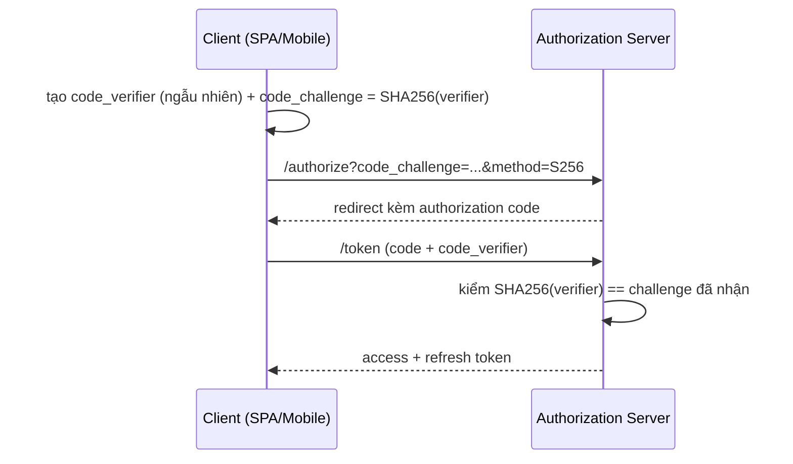

# SPA & Mobile Authentication

## Mục lục

- [Tổng quan](#tổng-quan)
- [1. Thách thức của client: không có nơi an toàn tuyệt đối](#1-thách-thức-của-client-không-có-nơi-an-toàn-tuyệt-đối)
- [2. SPA: mẫu access-ở-memory + refresh-ở-cookie](#2-spa-mẫu-access-ở-memory--refresh-ở-cookie)
- [3. Silent refresh khi 401](#3-silent-refresh-khi-401)
  - [3.1 Hàng đợi chống refresh đua nhau](#31-hàng-đợi-chống-refresh-đua-nhau)
  - [3.2 Axios interceptor đầy đủ](#32-axios-interceptor-đầy-đủ)
- [4. Quản lý phiên trên SPA](#4-quản-lý-phiên-trên-spa)
- [5. Mobile: lưu token trong Keychain/Keystore](#5-mobile-lưu-token-trong-keychainkeystore)
- [6. OAuth trên client: PKCE](#6-oauth-trên-client-pkce)
- [7. Mobile: cert pinning & truyền an toàn](#7-mobile-cert-pinning--truyền-an-toàn)
- [8. Những lỗi client thường gặp](#8-những-lỗi-client-thường-gặp)
- [9. Checklist SPA & mobile auth](#9-checklist-spa--mobile-auth)
- [Tài liệu tham khảo](#tài-liệu-tham-khảo)

---

## Tổng quan

Trên client, không có nơi nào *bí mật tuyệt đối*: mã JS chạy trên máy người dùng, mọi thứ JS đọc được thì XSS cũng đọc được. Mục tiêu vì vậy không phải "giấu token hoàn hảo" mà là **giảm thiểu thiệt hại**: giữ token sống lâu (refresh) ngoài tầm với của JS, giữ token sống ngắn (access) ở nơi dễ mất nhưng dễ khôi phục, và làm trải nghiệm mượt qua silent refresh.

```diagram
SPA (web)                                  Mobile (native)
─────────                                  ───────────────
access  → memory (biến JS)                 access  → memory
refresh → cookie HttpOnly (JS không đọc)   refresh → Keychain/Keystore (OS bảo vệ)
reload mất access → silent refresh         app restart → đọc refresh từ secure store
mối lo chính: XSS                          mối lo chính: thiết bị bị root/jailbreak
```

> [!IMPORTANT]
> Nguyên tắc xuyên suốt: **refresh token (sống lâu) phải ngoài tầm JS** — cookie `HttpOnly` trên web, Keychain/Keystore trên mobile. **Access token (sống ngắn) ở memory** — mất khi reload nhưng khôi phục ngay bằng silent refresh. Tuyệt đối tránh `localStorage` cho bất kỳ token nào.

---

## 1. Thách thức của client: không có nơi an toàn tuyệt đối

| Nơi lưu | XSS đọc được? | Bền qua reload/restart? | Kết luận |
|---------|----------------|--------------------------|----------|
| Biến JS (memory) | Chỉ khi đang chạy | ❌ | ✅ cho access |
| `localStorage` | ✅ (mọi script đọc) | ✅ | ❌ tránh |
| `sessionStorage` | ✅ | Chỉ trong tab | ❌ tránh |
| Cookie `HttpOnly` | ❌ | ✅ | ✅ cho refresh (web) |
| Keychain/Keystore | Theo OS, app khác khó | ✅ | ✅ cho refresh (mobile) |

<Callout type="error" title="localStorage là cái bẫy phổ biến nhất">
Nhiều tutorial bảo "lưu JWT vào localStorage" cho tiện. Nhưng <code>localStorage</code> bị <b>mọi đoạn JS</b> trên trang đọc — gồm cả thư viện bên thứ ba bị nhiễm. Một XSS = lộ cả access lẫn refresh token. Refresh token sống lâu trong localStorage là thảm họa. Xem <a href="/security/secure-storage/">Secure Storage</a>.
</Callout>

---

## 2. SPA: mẫu access-ở-memory + refresh-ở-cookie

```mermaid
sequenceDiagram
    participant U as User
    participant S as SPA (React/Vue)
    participant A as Auth/API
    U->>S: nhập credentials
    S->>A: POST /login
    A-->>S: { access } (body) + Set-Cookie refresh (HttpOnly)
    Note over S: access lưu BIẾN JS; refresh nằm cookie JS không đọc
    S->>A: GET /api/... (Authorization: Bearer access)
    A-->>S: 200 data
    Note over S: user F5 → access trong memory MẤT
    S->>A: POST /auth/refresh (cookie tự gửi)
    A-->>S: { access mới } + Set-Cookie refresh mới (rotation)
```

```javascript
// authStore.js — access token CHỈ ở memory (module-scope), không persist
let accessToken = null;
export const getAccess = () => accessToken;
export const setAccess = (t) => { accessToken = t; };
export const clearAccess = () => { accessToken = null; };

// login: lấy access từ body; refresh do server set cookie HttpOnly
export async function login(credentials) {
  const res = await fetch('/auth/login', {
    method: 'POST',
    headers: { 'Content-Type': 'application/json' },
    body: JSON.stringify(credentials),
    credentials: 'include',          // nhận Set-Cookie refresh
  });
  if (!res.ok) throw new Error('login_failed');
  setAccess((await res.json()).access);
}
```

> [!NOTE]
> `access` để ở biến module-scope (không React state persist, không storage). Khi component cần gọi API, lấy qua `getAccess()`. Refresh token do server quản lý hoàn toàn qua cookie — frontend **không bao giờ** thấy giá trị refresh, chỉ cần `credentials:'include'` để cookie tự đi kèm khi gọi `/auth/refresh`.

---

## 3. Silent refresh khi 401

Khi access hết hạn (hoặc mất sau reload), API trả 401 → client tự gọi `/auth/refresh` lấy access mới rồi **thử lại** request gốc, hoàn toàn trong suốt với người dùng.

```diagram
request → 401 ?
   │ không → trả kết quả
   │ có → POST /auth/refresh (cookie refresh tự gửi)
            │ thành công → cập nhật access mới → THỬ LẠI request gốc
            │ thất bại  → xóa access → chuyển tới /login
```

### 3.1 Hàng đợi chống refresh đua nhau

Vấn đề: nếu 5 request cùng nhận 401 một lúc, không xử lý khéo sẽ gọi `/auth/refresh` **5 lần song song** — gây xoay refresh token lung tung và có thể kích hoạt reuse-detection (thu hồi cả nhà). Giải pháp: chỉ cho **một** lần refresh chạy, các request khác chờ kết quả.

```javascript
let refreshing = null;   // Promise refresh đang chạy (hoặc null)

async function refreshOnce() {
  if (!refreshing) {                          // chưa ai refresh → khởi động một lần
    refreshing = fetch('/auth/refresh', { method: 'POST', credentials: 'include' })
      .then(async (r) => {
        if (!r.ok) throw new Error('refresh_failed');
        const { access } = await r.json();
        setAccess(access);
        return access;
      })
      .finally(() => { refreshing = null; });  // dọn để lần sau refresh lại được
  }
  return refreshing;                           // mọi caller cùng chờ 1 Promise
}
```

> [!TIP]
> `refreshing` là một Promise dùng chung: request đầu tiên gặp 401 khởi tạo nó, các request 401 tiếp theo *cùng `await`* Promise đó thay vì tạo refresh mới. Nhờ vậy chỉ đúng một lần gọi `/auth/refresh` cho cả chùm — tránh xoay token đua nhau và false-positive reuse detection. Xem [Revocation & Logout](/lifecycle/revocation-and-logout/) về reuse detection.

### 3.2 Axios interceptor đầy đủ

```javascript
import axios from 'axios';
import { getAccess, setAccess, clearAccess } from './authStore';

const api = axios.create({ baseURL: '/api', withCredentials: true });

// Gắn access vào mỗi request
api.interceptors.request.use((config) => {
  const t = getAccess();
  if (t) config.headers.Authorization = `Bearer ${t}`;
  return config;
});

// Bắt 401 → silent refresh → retry đúng 1 lần
let refreshing = null;
api.interceptors.response.use(
  (res) => res,
  async (error) => {
    const original = error.config;
    if (error.response?.status === 401 && !original._retried) {
      original._retried = true;                 // chỉ retry 1 lần, tránh vòng lặp vô hạn
      try {
        if (!refreshing) {
          refreshing = axios.post('/auth/refresh', null, { withCredentials: true })
            .then((r) => { setAccess(r.data.access); return r.data.access; })
            .finally(() => { refreshing = null; });
        }
        const access = await refreshing;
        original.headers.Authorization = `Bearer ${access}`;
        return api(original);                     // phát lại request gốc
      } catch {
        clearAccess();
        window.location.assign('/login');         // refresh hỏng → đăng nhập lại
      }
    }
    return Promise.reject(error);
  },
);

export default api;
```

<Callout type="warn">
Luôn đánh dấu <code>_retried</code> để mỗi request chỉ thử refresh <b>một lần</b>. Nếu không, khi refresh trả về access vẫn bị 401 (vd token bị thu hồi), bạn rơi vào vòng lặp refresh → 401 → refresh vô tận, đốt tài nguyên và spam endpoint refresh.
</Callout>

---

## 4. Quản lý phiên trên SPA

```diagram
Khởi động app (mở tab / F5):
  access = null  →  thử POST /auth/refresh (cookie có thể còn)
     │ thành công → có access → vào app (đã đăng nhập)
     │ thất bại  → chưa/đã hết phiên → hiện màn login

Logout:
  POST /auth/logout (server xóa refresh + cookie)  →  clearAccess()  →  về /login
```

```javascript
// Khôi phục phiên khi app khởi động
export async function bootstrapSession() {
  try {
    const r = await fetch('/auth/refresh', { method: 'POST', credentials: 'include' });
    if (r.ok) { setAccess((await r.json()).access); return true; }
  } catch { /* ignore */ }
  return false;       // chưa đăng nhập
}

export async function logout() {
  await fetch('/auth/logout', { method: 'POST', credentials: 'include' });  // server thu hồi refresh
  clearAccess();
  window.location.assign('/login');
}
```

> [!NOTE]
> Vì access ở memory, mỗi lần app khởi động bạn không có access — nhưng cookie refresh (`HttpOnly`, bền) vẫn còn nếu phiên chưa hết. Gọi `bootstrapSession()` một lần lúc khởi động để "đăng nhập im lặng". Logout phải gọi server để **thật sự thu hồi** refresh token, không chỉ xóa state phía client.

---

## 5. Mobile: lưu token trong Keychain/Keystore

```diagram
iOS      → Keychain (mã hóa bởi OS, gắn thiết bị, tùy chọn Face/Touch ID)
Android  → Keystore + EncryptedSharedPreferences
RN       → expo-secure-store hoặc react-native-keychain (bọc 2 cái trên)
TRÁNH    → AsyncStorage / UserDefaults / SharedPreferences thường (plaintext)
```

```javascript
// React Native với expo-secure-store
import * as SecureStore from 'expo-secure-store';

export async function saveRefresh(token) {
  await SecureStore.setItemAsync('refresh_token', token, {
    keychainAccessible: SecureStore.WHEN_UNLOCKED,   // chỉ đọc khi máy đã mở khóa
  });
}
export const getRefresh = () => SecureStore.getItemAsync('refresh_token');
export const clearRefresh = () => SecureStore.deleteItemAsync('refresh_token');

// access vẫn giữ ở memory như SPA; khi app khởi động đọc refresh từ secure store để lấy access mới
```

<Callout type="warn">
Trên mobile, <b>đừng</b> lưu token vào <code>AsyncStorage</code> hay file thường — chúng là plaintext, app khác (hoặc thiết bị bị root/jailbreak) có thể đọc. Dùng Keychain/Keystore qua <code>expo-secure-store</code>/<code>react-native-keychain</code>. Cân nhắc yêu cầu sinh trắc học để mở khóa token nhạy cảm.
</Callout>

---

## 6. OAuth trên client: PKCE

Khi SPA/mobile đăng nhập qua OAuth/OIDC, **bắt buộc dùng Authorization Code + PKCE** (không dùng Implicit flow đã lỗi thời). PKCE chống đánh cắp authorization code.



```javascript
// Tạo PKCE pair (Web Crypto)
function base64url(buf) {
  return btoa(String.fromCharCode(...new Uint8Array(buf)))
    .replace(/\+/g, '-').replace(/\//g, '_').replace(/=+$/, '');
}
async function createPkce() {
  const verifier = base64url(crypto.getRandomValues(new Uint8Array(32)));
  const digest = await crypto.subtle.digest('SHA-256', new TextEncoder().encode(verifier));
  return { verifier, challenge: base64url(digest) };       // gửi challenge đi, giữ verifier
}
```

> [!TIP]
> Client công khai (SPA/mobile) không giữ được client secret, nên **PKCE** thay thế: client tự sinh `code_verifier` bí mật, gửi `code_challenge = SHA256(verifier)` lúc xin code, rồi chứng minh bằng `verifier` lúc đổi token. Kẻ chặn được authorization code vẫn không đổi được token vì thiếu `verifier`. Xem [OAuth2/OIDC Integration](/implementation/oauth2-oidc-integration/).

---

## 7. Mobile: cert pinning & truyền an toàn

| Biện pháp | Mục đích |
|-----------|----------|
| Chỉ HTTPS/TLS (không HTTP) | Chống nghe lén token khi truyền |
| Certificate/Public-key pinning | Chống man-in-the-middle với cert giả |
| Không log token vào crash report/analytics | Tránh lộ qua công cụ bên thứ ba |
| Xóa token khi logout/đăng xuất thiết bị | Giảm cửa sổ lộ |
| Phát hiện root/jailbreak (tùy mức nhạy cảm) | Cảnh báo môi trường không tin cậy |

> [!WARNING]
> Trên mobile, kẻ tấn công có thể cài cert giả để chặn lưu lượng (MITM). **Certificate pinning** ghim cert/khóa công khai của server vào app, từ chối kết nối nếu không khớp — chặn nghe lén token dù attacker kiểm soát mạng. Kết hợp với chỉ-HTTPS và HSTS phía server.

---

## 8. Những lỗi client thường gặp

| Lỗi | Hậu quả | Khắc phục |
|-----|---------|-----------|
| Lưu token trong `localStorage` | XSS lấy token | Access→memory, refresh→cookie/Keychain |
| Không có hàng đợi refresh | Nhiều refresh đua → reuse-detection thu hồi | `refreshing` Promise dùng chung |
| Không đánh dấu `_retried` | Vòng lặp refresh→401 vô tận | Chỉ retry 1 lần/request |
| Quên `credentials:'include'` | Cookie refresh không gửi | Bật `withCredentials`/`credentials:'include'` |
| Logout chỉ xóa state client | Refresh vẫn dùng được | Gọi server thu hồi refresh |
| Dùng OAuth Implicit flow | Token lộ trên URL fragment | Authorization Code + PKCE |
| Mobile lưu token plaintext | App khác/đọc khi root | Keychain/Keystore |

---

## 9. Checklist SPA & mobile auth

```diagram
SPA (web):
□ access ở memory (biến module), KHÔNG localStorage/sessionStorage
□ refresh ở cookie HttpOnly+Secure+SameSite (server quản lý)
□ credentials:'include' / withCredentials khi gọi auth API
□ silent refresh khi 401 + hàng đợi chống refresh đua nhau
□ retry đúng 1 lần (_retried) tránh vòng lặp
□ bootstrapSession() lúc khởi động; logout gọi server thu hồi

MOBILE:
□ refresh ở Keychain/Keystore (expo-secure-store), KHÔNG AsyncStorage
□ access ở memory; đọc refresh để khôi phục khi mở app
□ chỉ HTTPS + certificate pinning
□ không log token vào crash report/analytics

OAUTH:
□ Authorization Code + PKCE (không Implicit)
□ verifier giữ bí mật, chỉ gửi challenge khi xin code

CHUNG:
□ XSS: CSP + sanitize input (token nhạy cảm không nằm nơi JS đọc)
□ Token không bao giờ trên URL/query
```

<Callout type="success" title="Một câu để nhớ">
<b>Access ở memory, refresh ngoài tầm JS (cookie HttpOnly trên web / Keychain trên mobile), silent refresh có hàng đợi, OAuth dùng PKCE.</b> Không có nơi an toàn tuyệt đối trên client — mục tiêu là giảm thiệt hại khi XSS xảy ra.
</Callout>

---

## Tài liệu tham khảo

- [HTTP Transport & Storage](/implementation/http-transport-and-storage/) — nơi lưu & cách truyền token
- [Secure Storage](/security/secure-storage/) — phân tích sâu localStorage vs cookie vs memory
- [OAuth2/OIDC Integration](/implementation/oauth2-oidc-integration/) — PKCE, authorization code flow
- [Access vs Refresh Token](/lifecycle/access-token-vs-refresh-token/) — vì sao tách access/refresh
- [Revocation & Logout](/lifecycle/revocation-and-logout/) — reuse detection khi refresh
- [Common Vulnerabilities](/security/common-vulnerabilities/) — XSS, CSRF phía client
- [Backend API Auth](/implementation/backend-api-auth/) — phía server verify token client gửi
