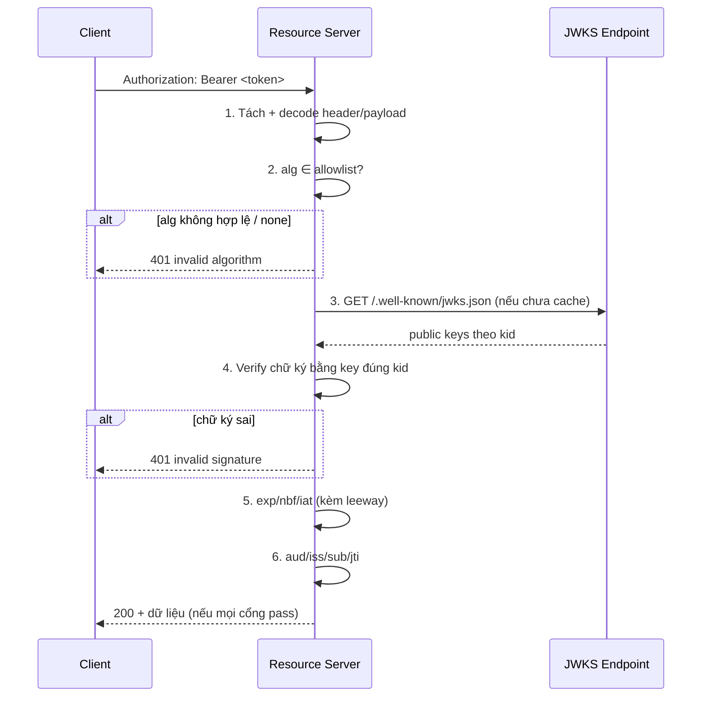

# Token Validation Flow — Deep Dive

## Mục lục

- [Bối cảnh: Token hết hạn vẫn lọt, token hợp lệ lại bị chặn](#1-bối-cảnh-token-hết-hạn-vẫn-lọt-token-hợp-lệ-lại-bị-chặn)
- [Toàn cảnh pipeline verify — 6 cổng](#2-toàn-cảnh-pipeline-verify--6-cổng)
- [Bước 1: Tách & decode — chưa tin gì cả](#3-bước-1-tách--decode--chưa-tin-gì-cả)
- [Bước 2: Allowlist thuật toán — cổng sống còn](#4-bước-2-allowlist-thuật-toán--cổng-sống-còn)
- [Bước 3: Resolve key qua kid và JWKS](#5-bước-3-resolve-key-qua-kid-và-jwks)
- [Bước 4: Verify chữ ký](#6-bước-4-verify-chữ-ký)
- [Bước 5: Validate claims thời gian — exp, nbf, iat](#7-bước-5-validate-claims-thời-gian--exp-nbf-iat)
- [Bước 6: Validate claims định danh — aud, iss, sub, jti](#8-bước-6-validate-claims-định-danh--aud-iss-sub-jti)
- [Clock skew & leeway — vì sao cần dung sai thời gian](#9-clock-skew--leeway--vì-sao-cần-dung-sai-thời-gian)
- [Thứ tự kiểm tra & nguyên tắc fail-closed](#10-thứ-tự-kiểm-tra--nguyên-tắc-fail-closed)
- [Code thực chiến — verify đầy đủ](#11-code-thực-chiến--verify-đầy-đủ)
- [Anti-patterns cần tránh](#12-anti-patterns-cần-tránh)
- [Tóm tắt — Cheat sheet](#13-tóm-tắt--cheat-sheet)

---

## 1. Bối cảnh: Token hết hạn vẫn lọt, token hợp lệ lại bị chặn

Hai sự cố thật, cùng một gốc rễ là **verify sai pipeline**:

**Sự cố A — token hết hạn vẫn được chấp nhận.** Một service tự viết hàm "verify nhanh": tách token, decode payload, check chữ ký. Nhưng quên check `exp`. Kết quả: một token rò rỉ từ 3 tháng trước vẫn dùng được — kẻ tấn công đăng nhập bằng token cũ.

**Sự cố B — token hợp lệ bị chặn hàng loạt lúc 0h.** Một service khác verify rất chặt, nhưng đồng hồ server lệch 40 giây so với Auth Server. Token vừa phát ra có `nbf` (not before) ở tương lai gần → service coi là "chưa hiệu lực" → 401 hàng loạt mỗi khi deploy.

```diagram
Sự cố A: verify chữ ký ✓  nhưng KHÔNG check exp  → token chết vẫn sống
Sự cố B: verify chữ ký ✓, check nbf ✓  nhưng KHÔNG có leeway  → lệch giờ = chặn nhầm
```

> [!IMPORTANT]
> "Verify một JWT" **không** chỉ là "check chữ ký". Đó là một **pipeline nhiều cổng**, mỗi cổng từ chối token vì một lý do khác nhau. Bỏ sót một cổng → lỗ hổng. Làm quá chặt một cổng (không có dung sai) → chặn nhầm người dùng thật. Doc này đi qua **từng cổng**, theo đúng thứ tự nên thực hiện.

---

## 2. Toàn cảnh pipeline verify — 6 cổng

```diagram
                  ┌─────────────────────────────────────────┐
   token string ─▶│ 1. Tách 3 phần + decode header/payload  │
                  └────────────────┬────────────────────────┘
                                   ▼
                  ┌─────────────────────────────────────────┐
                  │ 2. Allowlist thuật toán (alg ∈ cho phép?)│  ← chặn none/confusion
                  └────────────────┬────────────────────────┘
                                   ▼
                  ┌─────────────────────────────────────────┐
                  │ 3. Resolve key (kid → JWKS / key tĩnh)   │
                  └────────────────┬────────────────────────┘
                                   ▼
                  ┌─────────────────────────────────────────┐
                  │ 4. VERIFY CHỮ KÝ  (toàn vẹn + nguồn gốc) │  ← cổng tin cậy
                  └────────────────┬────────────────────────┘
                                   ▼ (từ đây mới được TIN payload)
                  ┌─────────────────────────────────────────┐
                  │ 5. Claims thời gian: exp, nbf, iat       │
                  └────────────────┬────────────────────────┘
                                   ▼
                  ┌─────────────────────────────────────────┐
                  │ 6. Claims định danh: aud, iss, sub, jti  │
                  └────────────────┬────────────────────────┘
                                   ▼
                              ✅ ACCEPTED
```



> [!NOTE]
> Mốc quan trọng nhất là **ranh giới sau cổng 4**. Trước khi chữ ký được verify, **mọi byte trong token là dữ liệu kẻ tấn công kiểm soát** — kể cả `alg`, `kid`, `exp`. Chỉ sau cổng 4 ta mới được phép *tin* các claim để dùng cho cổng 5–6.

---

## 3. Bước 1: Tách & decode — chưa tin gì cả

```diagram
token = "HEADER.PAYLOAD.SIGNATURE"

1. split('.')  → phải đúng 3 phần (JWS Compact). Khác 3 → reject ngay.
2. header  = JSON.parse( base64url_decode(parts[0]) )
3. payload = JSON.parse( base64url_decode(parts[1]) )
4. signature_bytes = base64url_decode(parts[2])
```

Những điều phải cẩn thận ngay ở bước "vô hại" này:

| Rủi ro | Phòng ngừa |
|--------|-----------|
| Số phần ≠ 3 (vd 2 phần = JWS unsecured, 5 phần = JWE) | Kiểm tra đúng định dạng mong đợi, reject nếu khác |
| `base64url_decode` lỗi (ký tự lạ) | Bắt lỗi → reject, đừng để throw lọt ra 500 |
| `JSON.parse` trên payload khổng lồ | Giới hạn kích thước token đầu vào (DoS) |
| Lấy claim từ payload **lúc này để phân quyền** | ❌ TUYỆT ĐỐI KHÔNG — chưa verify chữ ký |

> [!WARNING]
> `jwt.decode()` (chỉ decode, không verify) là một bẫy phổ biến. Nó tiện để **đọc** `kid`/`alg` phục vụ resolve key, nhưng **không bao giờ** được dùng giá trị từ `jwt.decode()` để ra quyết định bảo mật. Nhiều vụ lộ quyền đến từ việc nhầm `decode` với `verify`.

---

## 4. Bước 2: Allowlist thuật toán — cổng sống còn

Đây là cổng **dễ bị bỏ qua nhất** và cũng **nguy hiểm nhất** nếu sai. Header chứa `alg` do **bên gửi** quyết định — tức kẻ tấn công kiểm soát được.

```diagram
header = {"alg": "???", "kid": "..."}
                  ▲
         ⚠️ giá trị này KHÔNG đáng tin
```

Nếu verifier "đọc alg từ header rồi verify theo đó", kẻ tấn công có thể:

- Đặt `alg: "none"` → một số thư viện cũ coi là "không cần chữ ký" → token giả lọt.
- Đặt `alg: "HS256"` trong khi hệ thống dùng RS256 → *algorithm confusion* (dùng public key làm HMAC secret).

**Phòng ngừa duy nhất đúng:** verifier khai báo trước **danh sách thuật toán cho phép**, và **từ chối** mọi token có `alg` ngoài danh sách — trước cả khi verify.

```diagram
allowedAlgs = ["RS256"]          ← cấu hình phía server, KHÔNG lấy từ token

if header.alg not in allowedAlgs:
    reject("unexpected alg")     ← chặn none, HS256, ES256... nếu chỉ cho RS256
```

> [!IMPORTANT]
> Quy tắc vàng: **thuật toán verify do server quyết định, không phải token.** Chi tiết các đòn tấn công khi vi phạm quy tắc này nằm trong [Algorithm Confusion & alg:none — Deep Dive](/security/algorithm-confusion-deep-dive/).

---

## 5. Bước 3: Resolve key qua kid và JWKS

Verify chữ ký cần **đúng khóa**. Hệ thống thật thường có nhiều khóa cùng lúc (đang xoay vòng — key rotation), nên token mang theo `kid` (Key ID) trong header để chỉ ra "tôi được ký bằng khóa nào".

```diagram
header = {"alg":"RS256", "kid":"2024-q3-key"}
                                  │
                                  ▼  tra trong JWKS
   JWKS (/.well-known/jwks.json):
   {
     "keys": [
       { "kid":"2024-q2-key", "kty":"RSA", "n":"...", "e":"AQAB" },
       { "kid":"2024-q3-key", "kty":"RSA", "n":"...", "e":"AQAB" }  ← chọn cái này
     ]
   }
```

Luồng resolve key thực tế:

```diagram
1. Đọc kid từ header (đã decode ở bước 1)
2. Tìm key có kid tương ứng trong JWKS đã cache
3. Nếu không thấy & cache cũ → refetch JWKS (có rate-limit/backoff)
4. Vẫn không thấy → reject (đừng "thử mọi key" vô tội vạ)
5. Có key → chuyển sang verify chữ ký
```

| Rủi ro quanh `kid` | Phòng ngừa |
|--------------------|-----------|
| `kid` chứa path traversal (`../../etc/passwd`) hoặc SQL injection | Validate `kid` theo allowlist/format, không nối thẳng vào path/query |
| Header `jku`/`x5u`/`jwk` trỏ tới khóa của kẻ tấn công | **Bỏ qua** các header này; chỉ dùng JWKS đã cấu hình tin cậy |
| Fetch JWKS mỗi request | Cache theo `kid` + TTL; refetch khi gặp kid lạ (có giới hạn) |
| Key bị thu hồi nhưng cache còn | Đặt TTL hợp lý + cơ chế invalidate khi rotate |

> [!TIP]
> JWKS cho phép **xoay khóa không downtime**: phát hành token mới bằng key mới (`kid` mới) trong khi vẫn verify được token cũ bằng key cũ còn trong JWKS, cho tới khi mọi token cũ hết hạn. Xem thêm doc về key rotation trong mục cryptography.

---

## 6. Bước 4: Verify chữ ký

Đây là **cổng tin cậy**. Cơ chế bên trong (HMAC/RSA/ECDSA, constant-time compare) đã mổ xẻ ở [Chữ ký số JWT — Deep Dive](/internals/signature-deep-dive/). Ở góc độ pipeline, điều cần nhớ:

```diagram
signingInput = parts[0] + "." + parts[1]     ← đúng byte nhận được, KHÔNG re-serialize
ok = VERIFY(key, signingInput, signature_bytes, alg)
if not ok: reject("invalid signature")
```

Ba sai lầm hay gặp ngay tại cổng này:

```diagram
❌ Re-serialize JSON rồi mới verify
   → khoảng trắng/thứ tự key đổi → signingInput khác → fail oan

❌ Verify xong nhưng vẫn dùng payload đã decode từ bước 1 (đúng), 
   rồi LẠI tin thêm dữ liệu chưa được ký (vd query param)
   → ranh giới tin cậy bị nhòe

❌ Verify bằng "thuật toán trong header" thay vì allowlist server
   → quay lại lỗ hổng cổng 2
```

> [!NOTE]
> Sau khi cổng 4 pass, **payload chính thức đáng tin**. Mọi claim từ đây (`exp`, `aud`, `sub`...) là do issuer ký, không bị sửa. Cổng 5–6 dựa trên niềm tin này.

---

## 7. Bước 5: Validate claims thời gian — exp, nbf, iat

Ba claim thời gian dùng **NumericDate**: **số giây** (không phải mili-giây) kể từ epoch `1970-01-01T00:00:00Z`, theo UTC.

| Claim | Tên đầy đủ | Ý nghĩa | Kiểm tra |
|-------|-----------|---------|----------|
| `exp` | Expiration Time | Sau mốc này token vô hiệu | `now > exp + leeway` → **reject** |
| `nbf` | Not Before | Trước mốc này token chưa hiệu lực | `now < nbf - leeway` → **reject** |
| `iat` | Issued At | Thời điểm phát hành | Thường dùng để tính tuổi token / chống token quá cũ |

```diagram
   ──────────────●───────────────────────●──────────────▶  thời gian
                nbf                      exp
   token CHƯA   │      token HIỆU LỰC     │   token HẾT HẠN
   hiệu lực     │      (được chấp nhận)   │   (bị từ chối)
                │                         │
        now < nbf-leeway          now > exp+leeway
            → reject                  → reject
```

```diagram
Ví dụ (epoch giây):
  now = 1_725_000_000
  exp = 1_724_999_400   →  now > exp  → token đã hết hạn → REJECT
  nbf = 1_725_000_500   →  now < nbf  → chưa tới giờ     → REJECT (trừ khi leeway phủ)
```

> [!WARNING]
> `exp` không phải là tùy chọn. Token **không có `exp`** = token **sống vĩnh viễn** — nếu rò rỉ thì không cách nào hết hạn tự nhiên. Hãy bắt buộc `exp` (và cấu hình verifier yêu cầu nó tồn tại). `iat` giúp phát hiện token "quá già" dù chưa tới `exp`.

---

## 8. Bước 6: Validate claims định danh — aud, iss, sub, jti

Chữ ký chứng minh "token thật và chưa sửa", nhưng **không** chứng minh "token này dành cho **đúng** service của tôi". Đó là việc của các claim định danh.

| Claim | Ý nghĩa | Vì sao phải check |
|-------|---------|-------------------|
| `iss` | Issuer — ai phát hành | Token từ Auth Server tin cậy, không phải nguồn lạ |
| `aud` | Audience — token dành cho ai | Token cấp cho API A **không** được dùng ở API B |
| `sub` | Subject — token nói về ai (user id) | Gắn request với đúng chủ thể |
| `jti` | JWT ID — định danh duy nhất | Chống replay; tra blacklist/denylist |

### 8.1. Vì sao `aud` cực kỳ quan trọng

```diagram
   Auth Server phát token aud="api.payments"
                 │
       ┌─────────┴──────────┐
       ▼                    ▼
   api.payments         api.reports
   (aud khớp ✓)         (aud KHÁC → reject ✗)
```

Nếu `api.reports` không check `aud`, một token hợp lệ dành cho `api.payments` (có chữ ký đúng!) lại được chấp nhận ở `api.reports` → **token confusion**. Mỗi service phải khẳng định: "tôi chỉ chấp nhận token có `aud` chứa tên tôi".

### 8.2. `jti` và chống replay

`jti` cho phép vô hiệu một token cụ thể trước khi nó hết hạn:

```diagram
Logout / nghi ngờ lộ token  →  thêm jti vào denylist (TTL = thời gian còn lại tới exp)
Mỗi verify: jti ∈ denylist?  →  reject
```

> [!IMPORTANT]
> JWT mặc định là **stateless** — không check `jti` thì không thể thu hồi sớm. Nếu nghiệp vụ cần "logout = chết token ngay", bạn buộc phải thêm trạng thái (denylist `jti` hoặc whitelist session). Đây là đánh đổi kinh điển stateless vs revocable.

---

## 9. Clock skew & leeway — vì sao cần dung sai thời gian

Đồng hồ các máy **không bao giờ** khớp tuyệt đối. Auth Server phát token lúc `T`, máy verify có thể đang ở `T ± vài giây`. Không có dung sai → token vừa phát đã bị coi là "chưa tới `nbf`" hoặc "đã quá `exp`".

```diagram
Auth Server clock:  12:00:00  → phát token exp = 12:05:00
Resource clock:     12:05:03  → lệch +3s

Không leeway:  now(12:05:03) > exp(12:05:00) → REJECT (oan, mới 5 phút)
Leeway 5s:     now - 5s = 12:04:58 ≤ exp     → ACCEPT (đúng)
```

```diagram
Áp dụng leeway L (vd 5–60s tùy hệ thống):
   exp hợp lệ khi:  now ≤ exp + L
   nbf hợp lệ khi:  now ≥ nbf - L
```

> [!TIP]
> Leeway **nhỏ** (vài giây tới vài chục giây) để dung sai lệch đồng hồ — KHÔNG phải để "kéo dài tuổi thọ token". Đặt leeway hàng giờ là vô hiệu hóa `exp`. Giải pháp gốc vẫn là đồng bộ giờ bằng NTP trên mọi máy.

---

## 10. Thứ tự kiểm tra & nguyên tắc fail-closed

### 10.1. Vì sao thứ tự quan trọng

Có **hai trường phái** về thứ tự, và cả hai đều thống nhất một điểm: **không tin claim trước khi verify chữ ký**.

```diagram
Cách an toàn nhất (khuyến nghị):
   tách → allowlist alg → resolve key → VERIFY chữ ký → mới check exp/aud/...

Vì sao không check exp TRƯỚC chữ ký?
   exp nằm trong payload do kẻ tấn công kiểm soát (khi chưa verify).
   Tin exp trước khi verify = tin số liệu của kẻ tấn công.
```

Một vài thư viện reject sớm các lỗi format "rẻ" (số phần ≠ 3, base64 hỏng) trước khi tốn công verify chữ ký — điều đó **ổn**, vì những lỗi đó không phải "tin claim". Ranh giới bất khả xâm phạm là: **claim nghiệp vụ (exp, aud, sub...) chỉ được dùng SAU khi chữ ký pass.**

### 10.2. Fail-closed

```diagram
Mọi bước: nếu nghi ngờ / lỗi / thiếu dữ liệu  →  REJECT (đóng cửa)
TUYỆT ĐỐI KHÔNG:  catch lỗi verify  →  rồi "cho qua" / trả 200

❌ try { verify(token) } catch { /* bỏ qua, coi như khách */ }   ← thảm họa
✅ try { verify(token) } catch { return 401 }
```

> [!IMPORTANT]
> **Fail-closed**: khi không chắc chắn token hợp lệ, mặc định là **từ chối**. Mọi nhánh lỗi (key không resolve được, JWKS fetch fail, claim thiếu) phải dẫn tới 401/403 — không bao giờ "âm thầm cho qua".

---

## 11. Code thực chiến — verify đầy đủ

### 11.1. Với `jsonwebtoken` (HS/RS tĩnh)

```javascript
import jwt from 'jsonwebtoken';

function verifyToken(token, publicKey) {
  return jwt.verify(token, publicKey, {
    algorithms: ['RS256'],            // cổng 2: allowlist tường minh
    issuer: 'https://auth.example.com', // cổng 6: iss
    audience: 'api.payments',          // cổng 6: aud
    clockTolerance: 5,                 // leeway 5s cho exp/nbf
    // exp/nbf/iat được check tự động (cổng 5)
  });
  // throw nếu bất kỳ cổng nào fail → caller bắt và trả 401 (fail-closed)
}
```

### 11.2. Với `jose` + JWKS (key rotation thật)

```javascript
import { createRemoteJWKSet, jwtVerify } from 'jose';

// Cache JWKS, tự refetch khi gặp kid lạ (cổng 3)
const JWKS = createRemoteJWKSet(
  new URL('https://auth.example.com/.well-known/jwks.json')
);

async function verifyToken(token) {
  const { payload } = await jwtVerify(token, JWKS, {
    algorithms: ['RS256'],            // cổng 2
    issuer: 'https://auth.example.com', // cổng 6
    audience: 'api.payments',          // cổng 6
    clockTolerance: '5s',              // cổng 9 (leeway)
  });
  return payload; // chỉ tới đây mới đáng tin
}
```

### 11.3. Express middleware fail-closed

```javascript
async function authGuard(req, res, next) {
  const header = req.headers.authorization ?? '';
  if (!header.startsWith('Bearer ')) return res.status(401).end();

  try {
    req.user = await verifyToken(header.slice(7));
    next();
  } catch (err) {
    return res.status(401).json({ error: 'invalid token' }); // fail-closed
  }
}
```

---

## 12. Anti-patterns cần tránh

| Anti-pattern | Hậu quả | Làm đúng |
|--------------|---------|----------|
| Dùng `jwt.decode()` để phân quyền | Bỏ qua chữ ký → giả token | Luôn `verify`, decode chỉ để đọc `kid` |
| Không truyền `algorithms` | alg confusion / `none` | Allowlist tường minh |
| Bỏ check `exp` | Token rò rỉ sống mãi | Bắt buộc `exp`, reject khi quá hạn |
| Bỏ check `aud` | Token dùng chéo service | Mỗi service kiểm `aud` của mình |
| Không leeway | Lệch giờ → chặn nhầm | `clockTolerance` vài giây + NTP |
| Leeway hàng giờ | Vô hiệu hóa `exp` | Giữ leeway nhỏ |
| Tin `jku`/`jwk`/`kid` từ header để lấy key | Server fetch khóa của attacker | Chỉ dùng JWKS tin cậy đã cấu hình |
| `catch` lỗi verify rồi cho qua | Auth bypass hoàn toàn | Fail-closed → 401 |
| Re-serialize JSON trước khi verify | Fail oan token thật | Verify trên đúng byte nhận được |

---

## 13. Tóm tắt — Cheat sheet

```diagram
╭──────────────────────────────────────────────────────────────╮
│  PIPELINE VERIFY (đúng thứ tự):                               │
│                                                                │
│  1. Tách 3 phần + decode header/payload  (chưa tin gì)        │
│  2. alg ∈ allowlist server?              (chặn none/confusion)│
│  3. Resolve key qua kid → JWKS tin cậy   (bỏ qua jku/jwk)     │
│  4. VERIFY CHỮ KÝ                         ← ranh giới tin cậy  │
│  ────────────────── từ đây mới TIN payload ──────────────────│
│  5. exp / nbf / iat   (+ leeway nhỏ cho lệch đồng hồ)         │
│  6. aud / iss / sub / jti                                     │
│                                                                │
│  Mọi nhánh lỗi → REJECT (fail-closed)                         │
╰──────────────────────────────────────────────────────────────╯
```

**3 nguyên tắc xương sống:**

1. **Không tin claim trước khi verify chữ ký.** Mọi byte trước cổng 4 là dữ liệu kẻ tấn công kiểm soát.
2. **Verify không phải chỉ là check chữ ký.** Thiếu `exp`/`aud`/allowlist alg là những lỗ hổng độc lập với chữ ký.
3. **Fail-closed + leeway nhỏ.** Nghi ngờ thì từ chối; chỉ nới đúng vài giây để dung sai đồng hồ, không phải để kéo dài token.

Đọc tiếp: [Algorithm Confusion & alg:none — Deep Dive](/security/algorithm-confusion-deep-dive/) để thấy chuyện gì xảy ra khi cổng 2 và cổng 3 bị làm sai.
