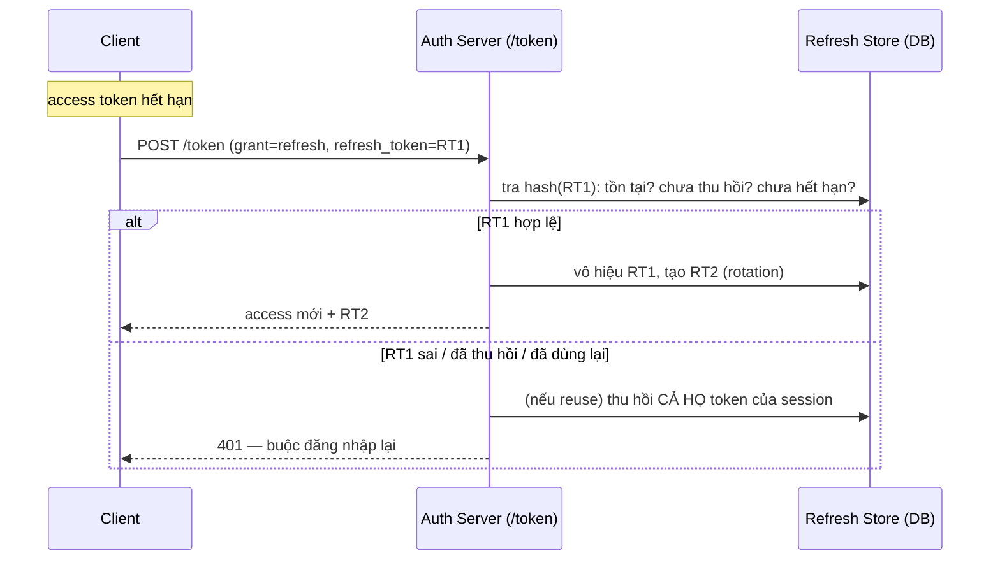

# Access Token vs Refresh Token — Deep Dive

## Mục lục

- [Một token không thể vừa ngắn vừa tiện](#1-một-token-không-thể-vừa-ngắn-vừa-tiện)
- [Hai token, hai vai trò tách bạch](#2-hai-token-hai-vai-trò-tách-bạch)
- [Vòng đời: access sống và chết thế nào](#3-vòng-đời-access-sống-và-chết-thế-nào)
- [Vòng đời: refresh và luồng gia hạn](#4-vòng-đời-refresh-và-luồng-gia-hạn)
- [Refresh token rotation — và vì sao nó cứu bạn](#5-refresh-token-rotation--và-vì-sao-nó-cứu-bạn)
- [Reuse detection — bắt token bị trộm](#6-reuse-detection--bắt-token-bị-trộm)
- [Opaque vs JWT cho refresh token](#7-opaque-vs-jwt-cho-refresh-token)
- [Lưu trữ token ở client — chỗ nào an toàn](#8-lưu-trữ-token-ở-client--chỗ-nào-an-toàn)
- [Code thực chiến — refresh có rotation](#9-code-thực-chiến--refresh-có-rotation)
- [Anti-patterns cần tránh](#10-anti-patterns-cần-tránh)
- [Tóm tắt — Cheat sheet](#11-tóm-tắt--cheat-sheet)

---

## 1. Một token không thể vừa ngắn vừa tiện

Đặt một token duy nhất để làm tất cả, bạn rơi vào mâu thuẫn không lối thoát:

```diagram
Muốn AN TOÀN  → TTL ngắn (lộ thì mau hết hạn)
Muốn TIỆN     → TTL dài (đừng bắt đăng nhập lại mỗi 15')

Một token: chọn ngắn HOẶC dài — không thể cả hai.
   ngắn  → user phải login lại liên tục (tệ UX)
   dài   → lộ một lần là nguy hiểm hàng tuần, và rất khó revoke
```

> [!IMPORTANT]
> Mô hình **hai token** giải mâu thuẫn này bằng cách *chia vai trò*: **access token ngắn hạn** để gọi API (lộ thì hết hạn nhanh), **refresh token dài hạn** chỉ để xin access mới (sống lâu nhưng được lưu ở server và **thu hồi tức thì** được). Mỗi token tối ưu cho đúng một việc.

---

## 2. Hai token, hai vai trò tách bạch

```diagram
┌─────────────── ACCESS TOKEN ───────────────┐   ┌────────── REFRESH TOKEN ──────────┐
│ Mục đích: gọi API                           │   │ Mục đích: xin ACCESS mới           │
│ Gửi tới: mọi resource server                │   │ Gửi tới: CHỈ /token của auth server│
│ Dạng:    JWT (self-contained, verify offline)│  │ Dạng:    opaque (nên thế), lưu store│
│ TTL:     5–15 phút                          │   │ TTL:     vài ngày–tuần             │
│ Lưu DB?  KHÔNG (stateless)                  │   │ Lưu DB?  CÓ (hash) → revoke được   │
│ Lộ thì:  nguy hiểm ≤ TTL (ngắn)             │   │ Lộ thì:  revoke ngay + reuse detect│
└─────────────────────────────────────────────┘   └────────────────────────────────────┘
```

| Tiêu chí | Access token | Refresh token |
|----------|--------------|---------------|
| Dùng để | gọi API/resource | xin access mới |
| Gửi tới | mọi resource server | chỉ endpoint `/token` |
| Tần suất gửi | mỗi request | chỉ khi access hết hạn |
| Trạng thái server | stateless (không lưu) | stateful (lưu hash) |
| Revoke tức thì | khó (phải đợi hết hạn / denylist) | dễ (xóa khỏi store) |
| Dạng khuyến nghị | JWT ký | opaque + store |

> [!NOTE]
> Vì refresh chỉ gửi tới **một** endpoint (`/token`) chứ không kèm mọi request, bề mặt lộ của nó nhỏ hơn nhiều access token. Đây là lý do "đặt cược" sống-lâu vào refresh (lưu server, revoke được) chứ không vào access (rải khắp nơi).

---

## 3. Vòng đời: access sống và chết thế nào

```diagram
cấp ──▶ [đang hiệu lực: 0 → 15']  ──exp──▶ [hết hạn] ──▶ vứt đi, dùng refresh xin cái mới
         verify offline mỗi request
         (kiểm chữ ký + exp/aud/iss — KHÔNG gọi DB)
```

```diagram
Đặc tính then chốt: access token KHÔNG được tra DB mỗi request
   → đó là cả lý do dùng JWT: verify bằng toán (chữ ký) + so sánh thời gian
   → đánh đổi: trong khoảng còn hạn, access "không thể bị rút lại" dễ dàng
              → nên TTL ngắn để cửa sổ rủi ro nhỏ
```

> [!TIP]
> Nếu bạn thấy mình phải tra DB để verify *access token* mỗi request, thường là thiết kế sai: hoặc đưa thông tin cần thiết vào claim, hoặc chấp nhận độ trễ thu hồi = TTL ngắn. Tra DB mỗi request làm mất luôn lợi thế stateless của JWT.

---

## 4. Vòng đời: refresh và luồng gia hạn



```diagram
Luồng "im lặng gia hạn" (silent refresh):
   access hết hạn → client tự gọi /token bằng refresh → nhận access mới
   → user KHÔNG thấy gì (không phải login lại) trong suốt vòng đời refresh
```

---

## 5. Refresh token rotation — và vì sao nó cứu bạn

**Rotation**: mỗi lần dùng refresh để gia hạn, refresh cũ bị **vô hiệu** và cấp refresh **mới**. Refresh không bao giờ dùng được hai lần.

```diagram
KHÔNG rotation (refresh tĩnh):
   RT cố định 7 ngày → nếu RT bị trộm, attacker dùng SUỐT 7 ngày, bạn không hề biết

CÓ rotation:
   RT1 ──dùng──▶ RT2 ──dùng──▶ RT3 ...   (mỗi cái chỉ sống tới lần dùng kế)
   → token cũ thành vô giá trị ngay sau khi xoay
   → mở ra REUSE DETECTION (§6): nếu RT cũ bị dùng lại = có bản sao = bị trộm
```

```diagram
Chuỗi rotation gắn vào một "token family" (theo session):
   family F: RT1 → RT2 → RT3 → ...
   thu hồi family = đăng xuất toàn bộ chuỗi (mọi RT phái sinh)
```

> [!IMPORTANT]
> Rotation biến refresh token từ "bí mật tĩnh sống lâu" thành "chuỗi bí mật dùng-một-lần". Lợi ích lớn nhất không phải bản thân việc xoay, mà là nó tạo **tín hiệu phát hiện trộm**: trong hệ có rotation, một refresh token cũ *không bao giờ* được dùng lại một cách hợp lệ — nên nếu thấy nó, chắc chắn có vấn đề.

---

## 6. Reuse detection — bắt token bị trộm

```diagram
Tình huống: attacker trộm RT2 (qua XSS/log/MITM). Cả nạn nhân và attacker đều có RT2.

  t1  attacker dùng RT2 → server cấp RT3 cho attacker, RT2 bị vô hiệu
  t2  nạn nhân (app thật) dùng RT2 (bản nó còn giữ) → server thấy RT2 ĐÃ bị dùng rồi!
         → RT2 reuse = bằng chứng có 2 bản = bị trộm
         → THU HỒI CẢ FAMILY (RT3 của attacker cũng chết)
         → buộc đăng nhập lại (cả hai), attacker mất quyền
```

```diagram
Quy tắc:
   refresh token ĐÃ rotate (đã có "con") mà bị dùng lại
      → coi là compromise → thu hồi toàn bộ token family của session đó
```

> [!WARNING]
> Reuse detection chỉ hoạt động khi refresh **lưu ở server** và có **rotation** (cần biết token nào đã bị xoay). Đây là một lý do nữa refresh **không nên** là JWT tự-verify: JWT stateless không cho server biết "token này đã dùng rồi". Reuse detection rút thời gian attacker giữ quyền từ "tới khi refresh hết hạn" xuống "tới lần nạn nhân refresh kế tiếp".

---

## 7. Opaque vs JWT cho refresh token

| | Opaque (chuỗi ngẫu nhiên + store) | JWT tự-verify |
|---|-----------------------------------|----------------|
| Revoke tức thì | ✅ (xóa khỏi store) | ❌ (sống tới exp) |
| Reuse detection | ✅ (biết đã dùng) | ❌ (không lưu trạng thái) |
| Cần DB lookup khi refresh | có (1 lần/refresh — rẻ) | không |
| Lộ nội dung | không (chỉ là id) | có (payload đọc được) |
| Phù hợp refresh? | **CÓ** | không nên |

```diagram
Vì refresh DÙ SAO cũng phải tra store (để rotate + revoke + reuse detect),
   lợi thế "stateless" của JWT mất hết ý nghĩa cho refresh
   → refresh nên OPAQUE: ngẫu nhiên 256-bit, lưu HASH (SHA-256) ở DB, KHÔNG lưu plaintext
```

> [!TIP]
> Ngược lại với access token: access *nên* là JWT vì nó cần verify offline ở nhiều resource server và TTL ngắn nên không cần revoke tức thì. "JWT cho access, opaque cho refresh" là kết hợp chuẩn.

---

## 8. Lưu trữ token ở client — chỗ nào an toàn

```diagram
                   XSS đọc được?   CSRF dùng nhầm?   Hợp cho
   localStorage         CÓ ⚠️          không          (tránh — JS đọc được → trộm)
   memory (biến JS)     khó*           không          access token (mất khi reload)
   Cookie httpOnly      KHÔNG ✅        CÓ (cần chống)  refresh token (JS không đọc)
   *vẫn mất nếu có XSS chạy trong cùng context
```

```diagram
Khuyến nghị phổ biến (web app):
   • access token  → giữ trong MEMORY (biến JS), gắn vào header Authorization
   • refresh token → cookie httpOnly + Secure + SameSite (JS không đọc được)
                     + chống CSRF (SameSite=strict/lax hoặc anti-CSRF token)
```

> [!WARNING]
> `localStorage` cho token là anti-pattern kinh điển: bất kỳ XSS nào cũng đọc và trộm sạch. Refresh token (sống lâu) trong `localStorage` đặc biệt nguy hiểm. Chi tiết tấn công và phòng thủ ở [XSS/CSRF & Token Theft](/security/xss-csrf-token-theft/) và [Secure Storage](/security/secure-storage/).

---

## 9. Code thực chiến — refresh có rotation

```javascript
import { createHash, randomBytes } from 'crypto';

const sha256 = (s) => createHash('sha256').update(s).digest('hex');

// Cấp refresh mới gắn vào một family (session)
async function mintRefresh(userId, familyId) {
  const raw = randomBytes(32).toString('base64url');
  await db.refresh.insert({
    hash: sha256(raw), userId, familyId,
    used: false, createdAt: Date.now(),
    expiresAt: Date.now() + 7 * 864e5,
  });
  return raw;
}

// Endpoint POST /token (grant_type=refresh_token)
async function handleRefresh(presentedRT) {
  const row = await db.refresh.findByHash(sha256(presentedRT));

  if (!row || row.expiresAt < Date.now()) throw new Unauthorized();

  // REUSE DETECTION: refresh đã dùng rồi mà lại xuất hiện → bị trộm
  if (row.used) {
    await db.refresh.revokeFamily(row.familyId);   // thu hồi CẢ họ
    throw new Unauthorized('refresh reuse detected — family revoked');
  }

  // ROTATION: vô hiệu cái cũ, cấp cái mới cùng family
  await db.refresh.markUsed(row.id);
  const newRT = await mintRefresh(row.userId, row.familyId);
  const accessToken = await issueAccessToken(row.userId);  // xem Issuing Token

  return { accessToken, refreshToken: newRT };
}
```

> [!NOTE]
> `revokeFamily` là chìa khóa: khi phát hiện reuse, không chỉ thu hồi token bị dùng lại mà **toàn bộ chuỗi** phái sinh từ cùng phiên — kể cả token attacker vừa nhận. Lưu `familyId` ngay từ lúc đăng nhập.

---

## 10. Anti-patterns cần tránh

| Anti-pattern | Hậu quả | Làm đúng |
|--------------|---------|----------|
| Dùng một token cho mọi việc | Phải chọn ngắn hoặc dài — đều tệ | Tách access (ngắn) + refresh (dài) |
| Access token TTL dài (giờ/ngày) | Lộ là nguy hiểm lâu, khó revoke | 5–15'; refresh gánh gia hạn |
| Refresh là JWT tự-verify | Không revoke / reuse detect được | Opaque + lưu hash ở store |
| Refresh không rotation | Trộm = dùng suốt tới hết hạn | Rotation: mỗi lần đổi token mới |
| Có rotation nhưng không reuse detection | Bỏ lỡ tín hiệu bị trộm | RT cũ bị dùng lại → thu hồi family |
| Lưu refresh ở `localStorage` | XSS trộm được token sống lâu | Cookie httpOnly + Secure + SameSite |
| Lưu refresh plaintext ở DB | Lộ DB = lộ mọi refresh | Lưu hash (SHA-256), so hash |
| Gửi refresh kèm mọi request | Mở rộng bề mặt lộ | Refresh chỉ gửi tới `/token` |
| Tra DB để verify access mỗi request | Mất lợi thế stateless | Verify access offline; revoke qua TTL ngắn |

---

## 11. Tóm tắt — Cheat sheet

```diagram
╭──────────────────────────────────────────────────────────────╮
│  HAI TOKEN giải mâu thuẫn "an toàn (ngắn) vs tiện (dài)":     │
│                                                                │
│  ACCESS  : JWT, 5–15', gọi API, stateless, verify offline     │
│            lộ → nguy hiểm ≤ TTL → giữ ngắn; nên ở MEMORY       │
│                                                                │
│  REFRESH : opaque, ngày–tuần, CHỈ gọi /token, lưu HASH ở store│
│            revoke tức thì + ROTATION + REUSE DETECTION         │
│            nên ở cookie httpOnly+Secure+SameSite (+chống CSRF) │
│                                                                │
│  ROTATION: RT1→RT2→RT3... mỗi cái dùng một lần                │
│  REUSE DETECT: RT đã rotate bị dùng lại → thu hồi CẢ family    │
│                                                                │
│  Opaque cho refresh vì dù sao cũng phải tra store              │
│     (rotate/revoke/reuse) → "stateless" của JWT vô nghĩa ở đây │
╰──────────────────────────────────────────────────────────────╯
```

**3 nguyên tắc xương sống:**

1. **Tách vai trò: access ngắn để gọi API, refresh dài để gia hạn.** Mỗi token tối ưu cho đúng một việc, không cố nhồi cả hai vào một.
2. **Refresh phải stateful: opaque + lưu hash + rotation.** Đó là điều cho phép revoke tức thì và reuse detection — những thứ JWT stateless không làm được.
3. **Reuse detection là lưới an toàn.** RT đã xoay mà bị dùng lại = bằng chứng bị trộm → thu hồi cả token family, buộc đăng nhập lại.

Đọc tiếp: [Expiration & Renewal — Deep Dive](/lifecycle/expiration-and-renewal/) (exp/nbf/iat, clock skew, sliding vs absolute) và [Revocation & Logout — Deep Dive](/lifecycle/revocation-and-logout/).
