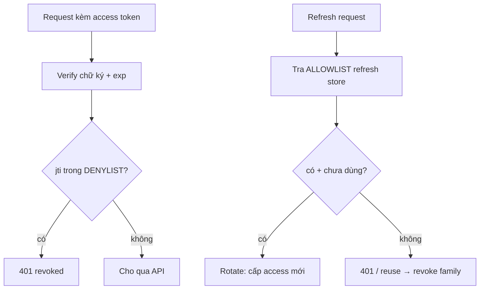

# Blacklist vs Whitelist — Deep Dive

## Mục lục

- [Hai triết lý đối nghịch về niềm tin](#1-hai-triết-lý-đối-nghịch-về-niềm-tin)
- [Denylist (blacklist): mặc định tin, chặn ngoại lệ](#2-denylist-blacklist-mặc-định-tin-chặn-ngoại-lệ)
- [Allowlist (whitelist): mặc định nghi, cho phép ngoại lệ](#3-allowlist-whitelist-mặc-định-nghi-cho-phép-ngoại-lệ)
- [Chi phí bộ nhớ — tính bằng số thật](#4-chi-phí-bộ-nhớ--tính-bằng-số-thật)
- [Vì sao TTL entry là tất cả với denylist](#5-vì-sao-ttl-entry-là-tất-cả-với-denylist)
- [Chi phí độ trễ — lookup mỗi verify](#6-chi-phí-độ-trễ--lookup-mỗi-verify)
- [Hybrid: denylist access + allowlist refresh](#7-hybrid-denylist-access--allowlist-refresh)
- [Code thực chiến — jti denylist trên Redis](#8-code-thực-chiến--jti-denylist-trên-redis)
- [Chọn cái nào — cây quyết định](#9-chọn-cái-nào--cây-quyết-định)
- [Anti-patterns cần tránh](#10-anti-patterns-cần-tránh)
- [Tóm tắt — Cheat sheet](#11-tóm-tắt--cheat-sheet)

---

## 1. Hai triết lý đối nghịch về niềm tin

Khi JWT stateless cần một lớp trạng thái để thu hồi (xem [Revocation & Logout](/lifecycle/revocation-and-logout/)), có đúng hai cách lưu — và chúng đối lập nhau về **giả định mặc định**:

```diagram
DENYLIST (blacklist):   "tin MỌI token hợp lệ, TRỪ những cái trong danh sách chặn"
   verify: chữ ký OK + KHÔNG nằm trong denylist  → cho qua
   → danh sách chứa cái BỊ THU HỒI (thiểu số)

ALLOWLIST (whitelist):  "NGHI mọi token, CHỈ cho qua cái có trong danh sách cho phép"
   verify: chữ ký OK + CÓ trong allowlist  → cho qua
   → danh sách chứa cái CÒN HIỆU LỰC (đa số)
```

> [!IMPORTANT]
> Khác biệt cốt lõi không phải kỹ thuật mà là **mặc định**: denylist *fail-open theo thiết kế* (không có trong list → tin), allowlist *fail-closed theo thiết kế* (không có trong list → từ chối). Chọn sai mô hình cho bài toán = hoặc tốn bộ nhớ vô lý, hoặc tạo lỗ hổng "token không bị chặn nên được tin".

---

## 2. Denylist (blacklist): mặc định tin, chặn ngoại lệ

```diagram
Lưu: chỉ những token (jti) BỊ THU HỒI mà CÒN hạn
Kích thước ≈ số token bị revoke trong cửa sổ [now, now+TTL]
   → thường NHỎ (đa số token không bị revoke; cái hết hạn tự rời list)

verify:  jwtVerify(token)            // chữ ký + exp, stateless
         if denylist.has(jti) → 401  // 1 lookup
```

```diagram
Hợp khi:
   • Số token bị thu hồi ÍT so với tổng (đa số token sống bình thường)
   • Muốn giữ phần lớn lợi thế stateless (chỉ tra list cho ngoại lệ)
   • TTL access ngắn → entry tự dọn nhanh → list luôn nhỏ
```

> [!NOTE]
> Đây là mô hình phổ biến nhất cho **access token**: vì hầu hết token không bị thu hồi, denylist nhỏ và rẻ. Nó "thêm tối thiểu trạng thái" — giữ verify gần như stateless, chỉ phải nhớ một tập nhỏ các ngoại lệ.

---

## 3. Allowlist (whitelist): mặc định nghi, cho phép ngoại lệ

```diagram
Lưu: MỌI token CÒN HIỆU LỰC (đang được tin)
Kích thước ≈ số token đang sống = (số phiên hoạt động × số token/phiên)
   → có thể RẤT LỚN (mọi user đăng nhập đều có entry)

verify:  jwtVerify(token)               // chữ ký + exp
         if NOT allowlist.has(jti) → 401 // không có = không tin
```

```diagram
Nghịch lý: allowlist token gần như XÓA SẠCH ý nghĩa stateless của JWT
   → nếu server PHẢI tra store để biết token nào còn được phép
     thì khác gì session truyền thống (token = id trỏ vào store)?
   → lúc này JWT chỉ còn là "session id có chữ ký", không hơn
```

> [!WARNING]
> Allowlist **toàn bộ access token** thường là dấu hiệu thiết kế sai: bạn trả chi phí stateful của session mà vẫn gánh độ phức tạp của JWT. Allowlist *hợp lý* ở tầng **refresh token** — vốn đã stateful (lưu hash ở store) và số lượng nhỏ (1–vài/phiên). Nói cách khác: "refresh token = allowlist tự nhiên".

---

## 4. Chi phí bộ nhớ — tính bằng số thật

Giả định 1 triệu user đang hoạt động, mỗi `jti` ~16 byte + overhead Redis.

```diagram
DENYLIST access (TTL 15'):
   chỉ chứa token BỊ revoke còn hạn.
   Giả sử 0.1% phiên bị revoke/15' → ~1.000 entry tại một thời điểm
   1.000 × ~100 byte (key+overhead) ≈ 100 KB     → không đáng kể

ALLOWLIST access (TTL 15'):
   chứa MỌI access đang sống. 1.000.000 user × 1 access ≈ 1.000.000 entry
   1.000.000 × ~100 byte ≈ 100 MB  (và refresh mỗi 15' → ghi liên tục)
   → gấp ~1000 lần denylist cho cùng mục tiêu

ALLOWLIST refresh (TTL 7 ngày):
   1.000.000 phiên × 1 refresh ≈ 1.000.000 entry  → nhưng refresh DÙ SAO
   cũng phải lưu (opaque + store) → chi phí này KHÔNG phải "thêm"
```

| Mô hình | Số entry điển hình (1M user) | Bộ nhớ | Ghi chú |
|---------|------------------------------|--------|---------|
| Denylist access | ~ số bị revoke (nhỏ) | ~100 KB | rẻ, giữ stateless |
| Allowlist access | ~ mọi token sống (1M+) | ~100 MB+ | đắt, mất stateless |
| Allowlist refresh | ~ số phiên (1M) | (đã phải lưu) | tự nhiên, hợp lý |

> [!TIP]
> Con số nói rõ: với **access**, denylist rẻ hơn allowlist ~3 bậc độ lớn vì chỉ lưu *ngoại lệ bị chặn* thay vì *toàn bộ cái còn sống*. Với **refresh**, allowlist là miễn phí vì refresh vốn đã phải nằm trong store.

---

## 5. Vì sao TTL entry là tất cả với denylist

```diagram
Quy tắc vàng: mỗi entry denylist TTL = exp − now (thời gian còn lại của token)

Vì sao? Token hết hạn rồi thì exp tự lo từ chối nó — KHÔNG cần nhớ trong denylist nữa.
   → đặt EXPIRE đúng = exp−now: entry tự bốc hơi đúng lúc token hết hạn tự nhiên
   → denylist KHÔNG bao giờ phình: |denylist| ≈ số token bị revoke CÒN hạn
```

```diagram
SAI (không TTL entry):
   revoke 10.000 token/ngày, mỗi entry sống mãi
   → sau 1 năm: 3.65 triệu entry rác (toàn token đã hết hạn từ đời nào)
   → denylist phình vô hạn, tra chậm dần, tốn RAM vô ích

ĐÚNG (TTL = exp−now):
   token TTL 15' → entry sống tối đa 15' rồi tự xóa
   → denylist luôn chỉ chứa "token bị chặn mà CÒN hạn" → bé và ổn định
```

> [!IMPORTANT]
> Đây là chi tiết hiện thực quan trọng nhất của denylist. Redis `SET deny:<jti> 1 EX <exp-now>` làm việc này tự động. Quên TTL = bug rò bộ nhớ kinh điển, denylist biến thành bãi rác token chết.

---

## 6. Chi phí độ trễ — lookup mỗi verify

```diagram
Stateless thuần:   verify = kiểm chữ ký (CPU) + exp     → ~µs, không I/O
+ denylist/allowlist: thêm 1 lookup store (Redis GET)   → +sub-ms (mạng nội bộ)

Đánh đổi: mỗi request gánh thêm 1 round-trip tới store
   → store thành phụ thuộc cứng: store sập = verify sập (hoặc phải fail-open NGUY HIỂM)
```

```diagram
Giảm độ trễ/phụ thuộc:
   • Cache cục bộ valid_after/version (đổi hiếm) → tránh tra mỗi request
   • Denylist nhỏ → có thể cache/replicate gần verifier
   • Bloom filter trước Redis: "chắc chắn KHÔNG bị chặn" → bỏ qua lookup
     (chỉ tra Redis khi Bloom nói "có thể có") → cắt phần lớn round-trip
```

> [!WARNING]
> Khi denylist/allowlist nằm trên đường verify, **store trở thành single point of failure**. Phải quyết trước: store sập thì fail-closed (từ chối hết — an toàn nhưng downtime) hay fail-open (cho qua — nguy hiểm). Với access TTL ngắn + denylist, fail-open *tạm thời* đôi khi chấp nhận được (rủi ro giới hạn bởi TTL); với allowlist thì fail-open = mở toang.

---

## 7. Hybrid: denylist access + allowlist refresh

Kết hợp tốt nhất tận dụng đúng bản chất mỗi loại token:

```diagram
ACCESS token  → DENYLIST (chỉ chặn ngoại lệ)
   • đa số access không bị revoke → denylist nhỏ
   • TTL ngắn → entry tự dọn → list luôn bé
   • giữ verify gần stateless

REFRESH token → ALLOWLIST (phải có trong store mới được dùng)
   • refresh DÙ SAO cũng lưu (opaque + hash) → allowlist là "miễn phí"
   • revoke = xóa khỏi allowlist → tức thì
   • reuse detection dựa trên việc tra allowlist (xem Access vs Refresh §6)
```



> [!TIP]
> Đây chính là kiến trúc các doc trước đã dựng tới: access stateless + denylist tùy chọn, refresh opaque + store (= allowlist tự nhiên) + rotation. "Blacklist hay whitelist?" không phải câu hỏi một-chọn-một — câu trả lời đúng là *denylist cho access, allowlist cho refresh*.

---

## 8. Code thực chiến — jti denylist trên Redis

```javascript
import { jwtVerify } from 'jose';

// Thu hồi 1 access token: thêm jti vào denylist với TTL = thời gian còn lại
async function revoke(payload) {
  const ttl = payload.exp - Math.floor(Date.now() / 1000);
  if (ttl > 0) {
    await redis.set(`deny:${payload.jti}`, '1', 'EX', ttl);  // tự hết hạn → list không phình
  }
}

// Verify access: stateless trước, denylist sau
async function verifyAccess(token) {
  const { payload } = await jwtVerify(token, publicKey, {
    issuer: 'https://auth.example.com',
    audience: 'api.payments',
    clockTolerance: '30s',
  });
  if (await redis.exists(`deny:${payload.jti}`)) {
    throw new Unauthorized('token revoked');
  }
  return payload;
}

// REFRESH = allowlist tự nhiên: chỉ token CÓ trong store mới dùng được
async function useRefresh(rawRT) {
  const row = await db.refresh.findByHash(sha256(rawRT));   // không có = không tin (allowlist)
  if (!row || row.used || row.expiresAt < Date.now()) {
    if (row?.used) await db.refresh.revokeFamily(row.familyId);  // reuse → thu hồi cả họ
    throw new Unauthorized();
  }
  await db.refresh.markUsed(row.id);
  return { access: await issueAccessToken(row.userId), refresh: await mintRefresh(row.userId, row.familyId) };
}
```

> [!NOTE]
> Để ý sự đối xứng: denylist hỏi *"có bị chặn không?"* (`exists` → từ chối nếu CÓ), allowlist hỏi *"có được phép không?"* (`findByHash` → từ chối nếu KHÔNG có). Cùng một store Redis/DB, hai logic ngược chiều cho hai loại token.

---

## 9. Chọn cái nào — cây quyết định

```diagram
Token loại gì?
├─ ACCESS (ngắn, nhiều, stateless)
│    Cần revoke tức thì 1 token cụ thể?
│      ├─ KHÔNG → chỉ TTL ngắn (không list gì cả) ✅ rẻ nhất
│      └─ CÓ    → DENYLIST jti (TTL entry = exp−now) ✅
│    Cần "logout mọi nơi"? → valid_after/version (không phải list) — xem Revocation
│
└─ REFRESH (dài, ít, đã stateful)
     → ALLOWLIST tự nhiên (opaque + store + rotation) ✅
     → revoke = xóa khỏi store; reuse detect dựa trên allowlist

TRÁNH: allowlist TOÀN BỘ access token → mất stateless, đắt, vô ích
```

| Tình huống | Mô hình nên dùng |
|------------|-------------------|
| Access, không cần hủy tức thì | TTL ngắn (không list) |
| Access, cần hủy 1 token ngay | Denylist `jti` |
| Access, logout mọi thiết bị | valid_after / version (không list) |
| Refresh token | Allowlist (store + rotation) |
| Muốn revoke tức thì cho mọi access | Cân nhắc lại TTL trước khi allowlist |

---

## 10. Anti-patterns cần tránh

| Anti-pattern | Hậu quả | Làm đúng |
|--------------|---------|----------|
| Allowlist toàn bộ access token | Mất stateless, tốn ~1000× bộ nhớ | Denylist access; allowlist chỉ refresh |
| Denylist không TTL entry | Phình vô hạn, đầy token chết | TTL entry = exp − now |
| Quên rằng store là SPOF | Store sập → verify sập / fail-open nguy hiểm | Quyết fail-open/closed; cache; bloom filter |
| Dùng denylist cho "logout mọi nơi" | Phải liệt kê mọi token | valid_after / version O(1)/user |
| Tra store mỗi verify dù không cần | Thêm độ trễ + phụ thuộc vô ích | TTL ngắn lo phần lớn; tra chỉ khi cần |
| Allowlist refresh nhưng lưu plaintext | Lộ store = lộ mọi refresh | Lưu hash (SHA-256) |
| Coi blacklist/whitelist là một-chọn-một | Chọn sai cho từng loại token | Hybrid: denylist access + allowlist refresh |

---

## 11. Tóm tắt — Cheat sheet

```diagram
╭────────────────────────────────────────────────────────────────╮
│  DENYLIST  = tin mặc định, chặn ngoại lệ (chứa cái BỊ revoke)  │
│  ALLOWLIST = nghi mặc định, cho ngoại lệ (chứa cái CÒN sống)   │
│                                                                │
│  BỘ NHỚ (1M user):                                             │
│     denylist access  ≈ số bị revoke (nhỏ, ~100KB)              │
│     allowlist access ≈ mọi token sống (1M+, ~100MB) ✗ đắt      │
│     allowlist refresh = miễn phí (refresh vốn đã phải lưu)     │
│                                                                │
│  TTL ENTRY = exp − now  → denylist KHÔNG BAO GIỜ phình         │
│  LOOKUP mỗi verify → store thành SPOF → quyết fail-open/closed │
│                                                                │
│  HYBRID đúng:  ACCESS → denylist | REFRESH → allowlist         │
│     (không phải một-chọn-một; mỗi loại token một mô hình)      │
╰────────────────────────────────────────────────────────────────╯
```

**3 nguyên tắc xương sống:**

1. **Khác biệt là ở mặc định: denylist tin-trừ-ngoại-lệ, allowlist nghi-trừ-ngoại-lệ.** Chọn theo "đa số token ở trạng thái nào" để danh sách luôn nhỏ.
2. **Denylist cho access (rẻ, giữ stateless), allowlist cho refresh (vốn đã stateful).** Allowlist toàn bộ access là anti-pattern: đắt và xóa luôn lợi thế JWT.
3. **TTL entry = exp − now là bắt buộc với denylist.** Đó là điều giữ danh sách bé và ổn định thay vì phình thành bãi rác token chết.

Đọc lại chuỗi vòng đời: [Issuing Token](/lifecycle/issuing-token/) → [Access vs Refresh](/lifecycle/access-token-vs-refresh-token/) → [Expiration & Renewal](/lifecycle/expiration-and-renewal/) → [Revocation & Logout](/lifecycle/revocation-and-logout/) → Blacklist vs Whitelist.
