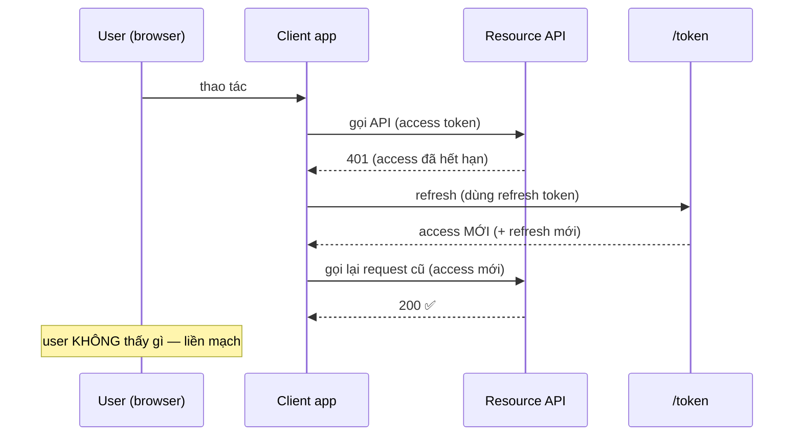

# Expiration & Renewal — Deep Dive

## Mục lục

- [Hết hạn là tính năng, không phải phiền toái](#1-hết-hạn-là-tính-năng-không-phải-phiền-toái)
- [Ba claim thời gian: exp, nbf, iat ở tầng giây](#2-ba-claim-thời-gian-exp-nbf-iat-ở-tầng-giây)
- [Verifier so sánh thời gian thế nào](#3-verifier-so-sánh-thời-gian-thế-nào)
- [Clock skew & leeway — vì sao và bao nhiêu](#4-clock-skew--leeway--vì-sao-và-bao-nhiêu)
- [Sliding vs absolute expiration](#5-sliding-vs-absolute-expiration)
- [Silent refresh — gia hạn không làm phiền user](#6-silent-refresh--gia-hạn-không-làm-phiền-user)
- [Đua refresh (race) & cách khử trùng lặp](#7-đua-refresh-race--cách-khử-trùng-lặp)
- [Code thực chiến — verify thời gian + refresh có khử đua](#8-code-thực-chiến--verify-thời-gian--refresh-có-khử-đua)
- [Anti-patterns cần tránh](#9-anti-patterns-cần-tránh)
- [Tóm tắt — Cheat sheet](#10-tóm-tắt--cheat-sheet)

---

## 1. Hết hạn là tính năng, không phải phiền toái

Vì JWT **stateless** — verifier không hỏi server "token này còn sống không?" — nên cách duy nhất để một token "chết" mà không cần tra DB là **tự nó mang hạn dùng**. Claim `exp` chính là cơ chế đó: nó biến một chuỗi ký bất biến thành thứ tự hủy theo thời gian.

```diagram
Không có exp:  token ký một lần → hợp lệ VĨNH VIỄN → lộ là thảm họa
Có exp:        token tự hết hiệu lực sau X phút → blast radius bị chặn theo thời gian
               → đây là "công tắc hẹn giờ" cài sẵn trong mọi token
```

> [!IMPORTANT]
> `exp` là tuyến phòng thủ chính của JWT trước token bị trộm. Vì revoke tức thì khó với stateless token (xem [Revocation & Logout](/lifecycle/revocation-and-logout/)), thời hạn ngắn là cách rẻ và đáng tin nhất để giới hạn thiệt hại. Hiểu đúng exp/nbf/iat và clock skew là điều kiện để hệ không vừa-không-an-toàn vừa-hay-lỗi-401.

---

## 2. Ba claim thời gian: exp, nbf, iat ở tầng giây

Cả ba là **NumericDate** trong RFC 7519: *số giây* (không phải mili-giây) từ epoch UNIX `1970-01-01T00:00:00Z`.

```diagram
exp (Expiration Time): token KHÔNG hợp lệ TỪ thời điểm này trở đi
nbf (Not Before):      token CHƯA hợp lệ TRƯỚC thời điểm này
iat (Issued At):       token được cấp lúc nào
```

Ví dụ cụ thể — token cấp lúc `2024-06-25 10:40:00 UTC`, hạn 15 phút:

```diagram
iat = 1719312000     → 2024-06-25 10:40:00 UTC
nbf = 1719312000     → (thường = iat: hiệu lực ngay)
exp = 1719312900     → 2024-06-25 10:55:00 UTC   (iat + 900)

Cửa sổ hợp lệ:  [nbf, exp)  =  10:40:00  ──── 15 phút ────  10:55:00
                            hợp lệ ✅                       hết hạn ❌
```

> [!WARNING]
> Bẫy **mili-giây vs giây** kinh điển: `Date.now()` trong JS trả **mili-giây**. Nếu lỡ set `exp = Date.now() + 900000` (không chia 1000), `exp` thành ~ năm 56000 → token "bất tử". Luôn: `exp = Math.floor(Date.now()/1000) + 900`. Thư viện (`jose`, `jsonwebtoken`) xử lý đúng nếu dùng API thời hạn của chúng (`setExpirationTime('15m')`).

---

## 3. Verifier so sánh thời gian thế nào

```diagram
now = thời điểm verify (epoch giây phía verifier)

Kiểm tra (không leeway):
   exp:  hợp lệ nếu  now <  exp        (đã qua exp → "token expired")
   nbf:  hợp lệ nếu  now >= nbf        (chưa tới nbf → "token not yet valid")
   iat:  thường chỉ tham khảo; có thể từ chối nếu iat ở TƯƠNG LAI (đồng hồ lệch/giả)
```

```diagram
Trục thời gian (verifier):
   ──────●───────────────●──────────────●─────────────▶ now
        nbf            (hợp lệ)         exp
   trước nbf → 401      trong khoảng    sau exp → 401
   "not yet valid"      → OK            "expired"
```

> [!NOTE]
> `exp` kiểm tra theo *biên mở* (`now < exp`): đúng giây `exp` token đã hết hạn. Trong thực tế khác biệt 1 giây hiếm khi quan trọng, nhưng cần nhất quán giữa các verifier để cùng một token không lúc-pass-lúc-fail ở hai service.

---

## 4. Clock skew & leeway — vì sao và bao nhiêu

Đồng hồ của issuer và verifier **không bao giờ khớp tuyệt đối**. Nếu đồng hồ verifier nhanh hơn issuer vài giây, một token vừa cấp có thể bị coi là "chưa tới nbf" hoặc "đã quá exp" oan.

```diagram
Issuer  đồng hồ: 10:40:00  → cấp token nbf=10:40:00, exp=10:55:00
Verifier đồng hồ: 10:40:03  (nhanh 3 giây)

Token có TTL 2 giây (exp=10:40:02)?  → verifier thấy now=10:40:03 > exp → 401 OAN
   (token thật ra vẫn còn hạn theo đồng hồ issuer)
```

**Leeway (skew tolerance)**: cho phép một khoảng dung sai nhỏ khi so sánh.

```diagram
Với leeway L:
   exp:  hợp lệ nếu  now <  exp + L      (gia hạn "mềm" L giây sau exp)
   nbf:  hợp lệ nếu  now >= nbf - L      (chấp nhận sớm L giây)

L điển hình: 30–60 giây   (đủ phủ lệch đồng hồ máy chủ thực tế)
```

| Leeway | Hệ quả |
|--------|--------|
| 0 giây | An toàn nhất nhưng dễ 401 oan khi đồng hồ lệch vài giây |
| 30–60 giây | Cân bằng phổ biến — phủ skew thực tế, rủi ro thấp |
| Vài phút+ | Nguy hiểm: token coi như "sống thêm" cả phút sau exp → nới blast radius |

> [!IMPORTANT]
> Leeway **không phải** để bù cho TTL chọn sai. Nó chỉ hấp thụ lệch đồng hồ máy (thường < 1 phút nếu chạy NTP). Đặt leeway 5–10 phút để "đỡ phiền" là tự nới hạn token thêm 5–10 phút — phá ý nghĩa của exp. Giải pháp gốc cho lệch đồng hồ là **đồng bộ NTP** trên mọi máy, leeway chỉ là lớp đệm.

---

## 5. Sliding vs absolute expiration

Hai mô hình "phiên sống bao lâu":

```diagram
ABSOLUTE (hạn cứng):
   đăng nhập 10:00 → phiên CHẾT lúc 10:00 + max_session (vd 8h) DÙ đang hoạt động
   → buộc đăng nhập lại theo lịch cố định (an toàn, đoán trước được)

SLIDING (gia hạn theo hoạt động):
   mỗi lần hoạt động → đẩy hạn lùi thêm (vd +30' kể từ lần dùng cuối)
   → đang dùng thì không bao giờ bị đá ra; ngừng 30' thì hết phiên
   → tiện, nhưng phiên có thể sống VÔ HẠN nếu cứ hoạt động
```

```diagram
Thực tế thường KẾT HỢP cả hai:
   sliding window (vd refresh idle 30')  GIỚI HẠN bở  absolute cap (vd 7 ngày)
   → "không dùng 30' thì hết" NHƯNG "tối đa 7 ngày dù có dùng tiếp"
   → vừa tiện vừa có trần an toàn
```

> [!TIP]
> Với mô hình hai token, **sliding** thường được hiện thực ở tầng **refresh** (mỗi lần refresh đẩy hạn refresh lùi, nhưng có absolute cap), còn **access** luôn absolute TTL ngắn cố định. Đừng làm access sliding — nó phá tính stateless (phải cập nhật trạng thái mỗi request).

---

## 6. Silent refresh — gia hạn không làm phiền user



```diagram
Hai chiến lược kích hoạt refresh:
   (A) REACTIVE — đợi 401 rồi mới refresh + retry request
        đơn giản; có 1 request "lỡ" phải thử lại
   (B) PROACTIVE — refresh TRƯỚC khi access hết hạn (vd còn 1' thì refresh)
        mượt hơn; cần biết exp (decode access) để hẹn giờ
```

> [!NOTE]
> Proactive cần đọc `exp` của access (decode payload — không cần verify ở client chỉ để đọc thời gian) rồi đặt timer refresh trước `exp` một khoảng (vd 60 giây). Reactive dựa vào việc bắt 401. Nhiều SDK kết hợp: proactive là chính, reactive là lưới đỡ.

---

## 7. Đua refresh (race) & cách khử trùng lặp

```diagram
Vấn đề: access vừa hết hạn, app bắn 5 request song song → CẢ 5 nhận 401
   → cả 5 cùng gọi /token refresh CÙNG LÚC

Nếu refresh có ROTATION:  request đầu xoay RT1→RT2 (RT1 chết)
   → 4 request còn lại dùng RT1 (đã chết) → REUSE DETECTION tưởng bị trộm
   → thu hồi family → user bị đá ra OAN!  (xem Access vs Refresh §6)
```

**Khử đua (single-flight)**: chỉ cho **một** lần refresh chạy; các request khác *chờ* kết quả đó.

```diagram
   request 1 → bắt đầu refresh, đặt cờ "đang refresh" + promise chung
   request 2..5 → thấy cờ → KHÔNG gọi /token, chỉ await promise chung
   refresh xong → tất cả dùng access mới → retry
   → chỉ MỘT lần xoay refresh, không kích reuse detection oan
```

> [!WARNING]
> Đây là một trong những bug refresh phổ biến và khó chịu nhất: rotation + nhiều tab/nhiều request song song → reuse detection bắn nhầm → user bị đăng xuất ngẫu nhiên. Luôn hiện thực **single-flight refresh** ở client (và cân nhắc "grace period" ngắn cho RT vừa xoay ở server để chịu đua chính đáng).

---

## 8. Code thực chiến — verify thời gian + refresh có khử đua

**Verify với leeway** (server):

```javascript
import { jwtVerify } from 'jose';

const { payload } = await jwtVerify(token, publicKey, {
  issuer: 'https://auth.example.com',
  audience: 'api.payments',
  clockTolerance: '30s',   // leeway cho exp & nbf — phủ lệch đồng hồ máy
});
// jose tự kiểm exp (now < exp + leeway), nbf (now >= nbf - leeway)
```

**Single-flight refresh** (client):

```javascript
let refreshing = null;   // promise dùng chung cho mọi request đang chờ

async function getValidAccessToken() {
  if (tokenStillFresh()) return accessToken;

  // KHỬ ĐUA: nếu đã có refresh đang chạy, chờ chính nó
  if (!refreshing) {
    refreshing = doRefresh().finally(() => { refreshing = null; });
  }
  return refreshing;   // mọi request song song cùng await 1 promise
}

async function doRefresh() {
  const res = await fetch('/token', { method: 'POST', credentials: 'include' });
  if (!res.ok) { redirectToLogin(); throw new Error('refresh failed'); }
  const { accessToken: at } = await res.json();
  accessToken = at;
  return at;
}
```

> [!TIP]
> `tokenStillFresh()` có thể kiểm `exp` đã decode kèm biên proactive (vd coi là hết hạn khi còn < 60s) để refresh sớm, mượt hơn việc đợi 401.

---

## 9. Anti-patterns cần tránh

| Anti-pattern | Hậu quả | Làm đúng |
|--------------|---------|----------|
| Token không có `exp` | Hợp lệ vĩnh viễn, lộ là thảm họa | Luôn set exp; access ngắn |
| `exp` tính bằng mili-giây | Token "bất tử" (exp ở năm 56000) | NumericDate = giây; dùng API thư viện |
| Leeway quá lớn (phút+) | Token sống thêm cả phút sau exp | Leeway 30–60s; sửa skew bằng NTP |
| Leeway = 0 nhưng đồng hồ lệch | 401 oan liên tục | Bật NTP + leeway nhỏ |
| Access sliding expiration | Mất stateless, ghi trạng thái mỗi request | Access absolute ngắn; sliding ở refresh |
| Sliding không có absolute cap | Phiên sống vô hạn nếu cứ hoạt động | Sliding + trần tuyệt đối (vd 7 ngày) |
| Refresh song song không khử đua | Reuse detection bắn nhầm → logout oan | Single-flight refresh (1 lần xoay) |
| Tin `exp` để "chắc chắn revoke" | Token vẫn sống tới exp dù đã muốn hủy | exp giới hạn rủi ro; revoke cần cơ chế riêng |

---

## 10. Tóm tắt — Cheat sheet

```diagram
╭────────────────────────────────────────────────────────────────╮
│  exp/nbf/iat = NumericDate (GIÂY từ epoch, KHÔNG mili-giây)    │
│     cửa sổ hợp lệ = [nbf, exp)                                 │
│                                                                │
│  VERIFY:  now < exp + leeway   &&   now >= nbf − leeway        │
│     leeway 30–60s (chỉ để bù lệch đồng hồ; fix gốc = NTP)      │
│                                                                │
│  SLIDING vs ABSOLUTE:                                          │
│     access  → absolute TTL ngắn (giữ stateless)                │
│     refresh → sliding (idle) + absolute cap (trần an toàn)     │
│                                                                │
│  SILENT REFRESH:  reactive (đợi 401) | proactive (refresh sớm) │
│  ĐUA REFRESH:  single-flight → chỉ 1 lần xoay → khỏi reuse oan │
│                                                                │
│  exp giới hạn blast radius theo THỜI GIAN; KHÔNG thay revoke.  │
╰────────────────────────────────────────────────────────────────╯
```

**3 nguyên tắc xương sống:**

1. **exp là công tắc hẹn giờ — tuyến phòng thủ chính của JWT stateless.** Luôn có exp, để access ngắn; nhớ NumericDate tính bằng giây.
2. **Leeway chỉ để bù lệch đồng hồ (30–60s), không để nới hạn.** Sửa lệch đồng hồ tận gốc bằng NTP, đừng lạm dụng leeway.
3. **Gia hạn phải mượt và không tự bắn vào chân.** Silent refresh + single-flight tránh logout oan do đua refresh kích reuse detection.

Đọc tiếp: [Revocation & Logout — Deep Dive](/lifecycle/revocation-and-logout/) — khi exp là chưa đủ và bạn cần hủy token *ngay*.
