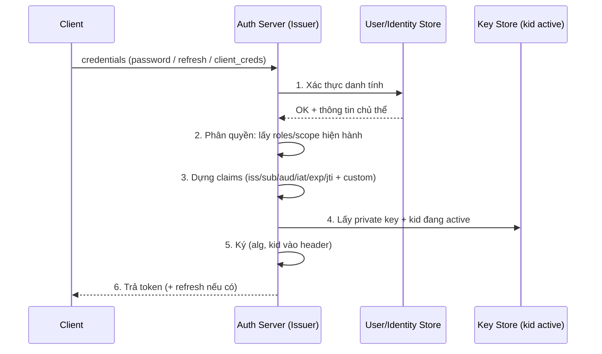

# Issuing Token — Deep Dive

## Mục lục

- [Khoảnh khắc cấp token — nơi mọi quyết định bảo mật bắt đầu](#1-khoảnh-khắc-cấp-token--nơi-mọi-quyết-định-bảo-mật-bắt-đầu)
- [Ba ngữ cảnh cấp token](#2-ba-ngữ-cảnh-cấp-token)
- [Pipeline cấp token — 6 bước](#3-pipeline-cấp-token--6-bước)
- [Dựng claims — đặt gì vào, bỏ gì ra](#4-dựng-claims--đặt-gì-vào-bỏ-gì-ra)
- [Dựng token thật tới từng byte](#5-dựng-token-thật-tới-từng-byte)
- [Chọn TTL — exp bao lâu cho từng loại](#6-chọn-ttl--exp-bao-lâu-cho-từng-loại)
- [jti, kid & iat — ba field vận hành hay bị xem nhẹ](#7-jti-kid--iat--ba-field-vận-hành-hay-bị-xem-nhẹ)
- [Cấp đồng thời access + refresh](#8-cấp-đồng-thời-access--refresh)
- [Code thực chiến — issuer hoàn chỉnh](#9-code-thực-chiến--issuer-hoàn-chỉnh)
- [Anti-patterns cần tránh](#10-anti-patterns-cần-tránh)
- [Tóm tắt — Cheat sheet](#11-tóm-tắt--cheat-sheet)

---

## 1. Khoảnh khắc cấp token — nơi mọi quyết định bảo mật bắt đầu

Mọi bài về JWT thường tập trung vào *verify*. Nhưng verify chỉ kiểm tra lại những gì đã được quyết định lúc **cấp**. Một token sống 24 giờ, mang claim `role: admin` sai, hay thiếu `aud` — verifier không sửa được; nó chỉ trung thành thực thi đúng cái issuer đã ký.

```diagram
Issuer quyết định 1 lần:  ai? được làm gì? trong bao lâu? cho dịch vụ nào?
   → ký lại thành sự thật bất biến trong token
Verifier về sau:          chỉ KIỂM lại chữ ký + các điều kiện issuer đặt
   → KHÔNG thể "sửa" một token cấp sai; chỉ từ chối hoặc chấp nhận
```

> [!IMPORTANT]
> Cấp token là **điểm tập trung quyền lực** của cả hệ thống auth: đây là nơi danh tính (sau khi xác thực) được "đóng dấu" thành claim mà hàng chục verifier sẽ tin trong suốt vòng đời token. Sai ở bước cấp = sai ở mọi nơi verify. Doc này mổ xẻ từng quyết định trong khoảnh khắc đó.

---

## 2. Ba ngữ cảnh cấp token

Token được cấp trong ba tình huống khác nhau — mỗi tình huống "chứng minh danh tính" theo cách riêng trước khi issuer chịu ký:

```diagram
(A) Sau ĐĂNG NHẬP người dùng
    bằng chứng: username/password (+MFA) đã verify
    → cấp access + refresh

(B) Sau REFRESH
    bằng chứng: refresh token hợp lệ (chưa thu hồi, chưa dùng lại)
    → cấp access MỚI (và thường refresh mới — rotation)

(C) SERVICE-to-SERVICE (machine auth)
    bằng chứng: client_credentials (client_id + secret / mTLS / assertion)
    → cấp access cho chính service (không có "người dùng")
```

| Ngữ cảnh | Bằng chứng đầu vào | sub là ai | Có refresh không |
|----------|--------------------|-----------|-------------------|
| Đăng nhập | mật khẩu + MFA | người dùng | có |
| Refresh | refresh token | người dùng (giữ nguyên) | có (rotation) |
| Service | client credentials / mTLS | chính service | thường không (cấp lại bằng credentials) |

> [!NOTE]
> Điểm chung: **issuer không bao giờ ký nếu chưa có bằng chứng danh tính hợp lệ.** "Cấp token" luôn là *hệ quả* của một bước xác thực thành công trước đó — không phải hành động độc lập.

---

## 3. Pipeline cấp token — 6 bước



```diagram
Bất biến ở mỗi bước:
   1. Xác thực FAIL → DỪNG, không sang bước nào khác (không "cấp tạm")
   2. Quyền lấy ở THỜI ĐIỂM cấp (không cache quyền cũ từ phiên trước)
   3. Claims tối thiểu-đủ-dùng (xem §4)
   4. Luôn dùng kid ĐANG ACTIVE (xem Key Rotation)
   5. alg cố định phía issuer (không để client chọn)
   6. Trả qua kênh an toàn (HTTPS; refresh nên httpOnly cookie)
```

---

## 4. Dựng claims — đặt gì vào, bỏ gì ra

Đây là quyết định cốt lõi. JWT trong access token thường **không mã hóa** (chỉ ký) — xem [Encoding vs Encryption](/fundamentals/encoding-vs-encryption/) — nên payload **ai đọc cũng được**.

```diagram
NÊN đặt (định danh + ủy quyền, không nhạy cảm):
   iss  — ai cấp           sub — chủ thể (user id, KHÔNG phải email/PII nếu tránh được)
   aud  — cho dịch vụ nào  exp/iat — thời gian
   jti  — id token (revoke/log)   scope/roles — quyền (tối thiểu)

KHÔNG đặt:
   • Mật khẩu, secret, số thẻ, token khác
   • PII nhạy cảm (CMND, địa chỉ) — payload đọc được công khai
   • Dữ liệu lớn / hay đổi (token phình + stale) — để verifier tra khi cần
```

> [!WARNING]
> Nguyên tắc **tối thiểu claim (least disclosure)**: chỉ nhét đủ để verifier ra quyết định ủy quyền *mà không phải gọi DB*. Mỗi claim thừa là (1) byte thừa gửi kèm mọi request, (2) dữ liệu có thể đọc bởi bất kỳ ai chặn được token, (3) thông tin dễ **stale** (quyền đổi nhưng token cũ vẫn mang quyền cũ tới khi hết hạn).

```diagram
Bẫy "stale claim":
   12:00  cấp token role=admin (exp 13:00)
   12:10  admin bị thu hồi quyền trong DB
   12:10–13:00  token CŨ vẫn mang role=admin → vẫn admin 50' nữa!
   → quyền "nguy hiểm" nên TTL ngắn, hoặc kiểm tra real-time, không chỉ tin claim
```

---

## 5. Dựng token thật tới từng byte

Lấy ví dụ cụ thể. Issuer dựng hai object JSON rồi base64url chúng (xem [JWT Structure](/fundamentals/jwt-structure/)).

```diagram
Thời điểm cấp: 2024-06-25 10:40:00 UTC
   iat = 1719312000     (epoch giây)
   exp = iat + 900 = 1719312900   (10:55:00 UTC, +15')
```

**Header** (JSON 43 byte):

```json
{"alg":"RS256","typ":"JWT","kid":"2024-q3"}
```

```diagram
base64url(header) =
   eyJhbGciOiJSUzI1NiIsInR5cCI6IkpXVCIsImtpZCI6IjIwMjQtcTMifQ
```

**Payload** (JSON 176 byte):

```json
{"iss":"https://auth.example.com","sub":"user_8f3a","aud":"api.payments",
 "iat":1719312000,"exp":1719312900,"jti":"a1b2c3d4",
 "scope":"read:orders write:orders","roles":["user"]}
```

```diagram
base64url(payload) =
   eyJpc3MiOiJodHRwczovL2F1dGguZXhhbXBsZS5jb20iLCJzdWIiOiJ1c2VyXzhmM2EiLCJhdWQi
   OiJhcGkucGF5bWVudHMiLCJpYXQiOjE3MTkzMTIwMDAsImV4cCI6MTcxOTMxMjkwMCwianRpIjoi
   YTFiMmMzZDQiLCJzY29wZSI6InJlYWQ6b3JkZXJzIHdyaXRlOm9yZGVycyIsInJvbGVzIjpbInVz
   ZXIiXX0
```

**Signing input** và chữ ký:

```diagram
SigningInput = base64url(header) ‖ "." ‖ base64url(payload)
signature    = base64url( RS256_Sign(privateKey_kid="2024-q3", SigningInput) )

Token = SigningInput ‖ "." ‖ signature
        └──────── 3 phần nối bằng dấu "." ────────┘
```

> [!NOTE]
> Cơ chế ký chi tiết (RS256/ES256/HS256 ở tầng byte) đã mổ trong [Chữ ký số JWT — Deep Dive](/internals/signature-deep-dive/). Điểm cần nhớ khi *cấp*: chữ ký phủ lên **header + payload** đã base64url — đổi bất kỳ byte claim nào sau khi ký đều làm chữ ký vỡ.

---

## 6. Chọn TTL — exp bao lâu cho từng loại

TTL (`exp - iat`) là đánh đổi giữa **bảo mật** (ngắn = blast radius nhỏ khi lộ) và **trải nghiệm/tải** (ngắn = refresh nhiều hơn).

| Loại token | TTL điển hình | Lý do |
|------------|---------------|-------|
| Access token | 5–15 phút | Lộ thì hết hạn nhanh; refresh gánh việc gia hạn |
| ID token (OIDC) | 5–60 phút | Chỉ để client biết "ai", dùng ngay sau login |
| Refresh token | vài ngày–vài tuần | Sống lâu nhưng **opaque + revoke được** (xem §8) |
| Service token | vài phút–1 giờ | Cấp lại dễ bằng client credentials |

```diagram
Công thức tư duy:
   TTL_access  = đủ ngắn để lộ không nguy hiểm lâu
               + đủ dài để không refresh mỗi vài giây
   → 15' là điểm cân bằng phổ biến cho access

Quyền càng nhạy cảm (admin, tài chính) → TTL càng ngắn (hoặc step-up auth riêng)
```

> [!IMPORTANT]
> TTL access ảnh hưởng trực tiếp tới **overlap window khi xoay khóa** (xem [Key Rotation §7](/cryptography/key-rotation/)) và tới **độ trễ thu hồi** (xem [Revocation & Logout](/lifecycle/revocation-and-logout/)). Đừng chọn TTL dài "cho tiện" — nó kéo theo cả chuỗi hệ quả vận hành.

---

## 7. jti, kid & iat — ba field vận hành hay bị xem nhẹ

```diagram
jti (JWT ID): id DUY NHẤT cho mỗi token
   → cần để: revoke chính xác 1 token, log/audit, chống replay (one-time token)
   → sinh từ CSPRNG (vd 128-bit ngẫu nhiên), KHÔNG đoán được

kid (Key ID, trong HEADER): trỏ verifier tới đúng public key trong JWKS
   → luôn gắn kid của khóa ĐANG ACTIVE lúc cấp → cho phép xoay khóa không downtime

iat (Issued At): thời điểm cấp
   → dùng cho: tính tuổi token, "đăng xuất mọi thiết bị trước thời điểm T"
     (từ chối mọi token có iat < T), phát hiện token quá cũ
```

> [!TIP]
> `jti` + `iat` mở ra hai cơ chế thu hồi nhẹ: (1) denylist theo `jti` (revoke từng token — xem [Blacklist/Whitelist](/lifecycle/blacklist-whitelist/)); (2) `tokens_valid_after` theo user — đăng xuất toàn bộ bằng cách từ chối mọi token có `iat` trước mốc đó, không cần lưu danh sách token.

---

## 8. Cấp đồng thời access + refresh

Sau đăng nhập, issuer thường cấp **cặp**: access (ngắn, JWT) + refresh (dài, nên **opaque + lưu store**).

```diagram
ĐĂNG NHẬP OK
   │
   ├─▶ access token  (JWT RS256, 15', mang claims/scope)   → client gọi API
   │
   └─▶ refresh token (opaque ngẫu nhiên, 7 ngày, lưu HASH ở DB)
          → chỉ dùng để xin access mới ở /token; KHÔNG gọi API bằng nó
```

```diagram
Vì sao refresh nên OPAQUE + lưu store (không phải JWT tự-verify):
   • Revoke được TỨC THÌ (xóa/đánh dấu ở DB) — JWT tự-verify thì không
   • Hỗ trợ ROTATION + reuse detection (mỗi lần refresh đổi token mới;
     nếu token cũ bị dùng lại → dấu hiệu bị trộm → thu hồi cả họ token)
```

> [!IMPORTANT]
> Tách rõ vai trò: **access để gọi API (stateless, ngắn), refresh để gia hạn (stateful, dài, revoke được)**. Chi tiết hai loại và refresh rotation ở [Access Token vs Refresh Token](/lifecycle/access-token-vs-refresh-token/).

---

## 9. Code thực chiến — issuer hoàn chỉnh

```javascript
import { SignJWT } from 'jose';
import { randomBytes, createHash } from 'crypto';

// kid + private key của khóa ĐANG ACTIVE (xem Key Rotation)
const ACTIVE_KID = '2024-q3';
const privateKey = /* load private key cho ACTIVE_KID */;

async function issueAccessToken(user, audience) {
  // 2. Phân quyền: lấy quyền HIỆN HÀNH, không cache quyền cũ
  const { roles, scopes } = await loadCurrentAuthz(user.id);

  // 3. Dựng claims tối thiểu-đủ-dùng
  return new SignJWT({
    scope: scopes.join(' '),
    roles,                              // tối thiểu — không nhét PII
  })
    .setProtectedHeader({ alg: 'RS256', kid: ACTIVE_KID })  // 4+5
    .setIssuer('https://auth.example.com')
    .setSubject(user.id)                // sub = id, KHÔNG phải email
    .setAudience(audience)              // ghim đúng dịch vụ tiêu thụ
    .setIssuedAt()                      // iat = now
    .setExpirationTime('15m')           // exp ngắn
    .setJti(randomBytes(16).toString('hex'))  // jti 128-bit
    .sign(privateKey);
}

// Refresh token: OPAQUE, lưu HASH (không lưu plaintext)
async function issueRefreshToken(user, sessionId) {
  const raw = randomBytes(32).toString('base64url');   // token thật trả cho client
  const hash = createHash('sha256').update(raw).digest('hex');
  await db.refreshTokens.insert({
    hash, userId: user.id, sessionId,
    expiresAt: Date.now() + 7 * 864e5,  // 7 ngày
    rotatedFrom: null,
  });
  return raw;   // chỉ client giữ bản gốc; server chỉ có hash
}
```

> [!WARNING]
> Đừng để client chọn `alg` hay TTL. Issuer **cố định** thuật toán (`RS256`) và thời hạn. Mọi tham số ảnh hưởng bảo mật phải do issuer quyết, không phải tham số đầu vào từ request.

---

## 10. Anti-patterns cần tránh

| Anti-pattern | Hậu quả | Làm đúng |
|--------------|---------|----------|
| Cấp token khi xác thực chưa chắc chắn | Token hợp lệ cho danh tính sai | Chỉ ký sau khi xác thực + MFA OK |
| Nhét PII/secret vào payload | Lộ dữ liệu (payload đọc được) | Tối thiểu claim; cần bí mật → JWE |
| Cache quyền cũ khi cấp lại | Token mang quyền đã bị thu hồi | Lấy roles/scope tại thời điểm cấp |
| TTL access dài (giờ/ngày) | Lộ là nguy hiểm lâu; revoke chậm | 5–15'; dùng refresh để gia hạn |
| Refresh là JWT tự-verify | Không revoke được tức thì | Refresh opaque + lưu hash + rotation |
| Không gắn `kid` | Không xoay khóa được | Luôn gắn kid active vào header |
| `jti` đoán được / trùng | Replay, revoke sai token | jti từ CSPRNG, đủ entropy |
| Quên `aud` | Token dùng nhầm dịch vụ | Luôn ghim `aud` đúng consumer |
| Để client chọn alg/TTL | Tham số bảo mật bị thao túng | Issuer cố định alg + thời hạn |

---

## 11. Tóm tắt — Cheat sheet

```diagram
╭──────────────────────────────────────────────────────────────╮
│  CẤP TOKEN = đóng dấu danh tính (đã xác thực) thành claim ký   │
│                                                                │
│  PIPELINE:  xác thực → phân quyền (quyền HIỆN HÀNH) →          │
│             dựng claims (tối thiểu) → kid active → ký → trả     │
│                                                                │
│  CLAIMS:  iss/sub/aud/iat/exp/jti + scope/roles (tối thiểu)    │
│     sub = id (không PII) ; KHÔNG nhét secret/PII/dữ liệu lớn   │
│                                                                │
│  TTL:   access 5–15' | id 5–60' | refresh ngày–tuần (opaque)  │
│         ngắn = blast radius nhỏ + revoke nhanh + overlap nhỏ   │
│                                                                │
│  FIELD VẬN HÀNH:                                              │
│     jti (CSPRNG) → revoke/log/anti-replay                     │
│     kid (header) → trỏ JWKS → xoay khóa không downtime         │
│     iat → tuổi token + "logout mọi thiết bị trước T"          │
│                                                                │
│  CẶP: access (JWT ngắn, gọi API) + refresh (opaque dài, revoke)│
│  Issuer CỐ ĐỊNH alg + TTL — không để client chọn.             │
╰──────────────────────────────────────────────────────────────╯
```

**3 nguyên tắc xương sống:**

1. **Cấp là nơi quyền lực tập trung — quyết định 1 lần, thực thi ở mọi verifier.** Sai claim/TTL/aud lúc cấp không sửa được về sau.
2. **Tối thiểu claim, TTL ngắn.** Payload đọc được công khai và dễ stale; nhét ít, hết hạn nhanh, dùng refresh để gia hạn.
3. **Tách access (JWT ngắn) khỏi refresh (opaque revoke được), gắn kid + jti.** Đây là nền cho xoay khóa, thu hồi và audit về sau.

Đọc tiếp: [Access Token vs Refresh Token — Deep Dive](/lifecycle/access-token-vs-refresh-token/).
