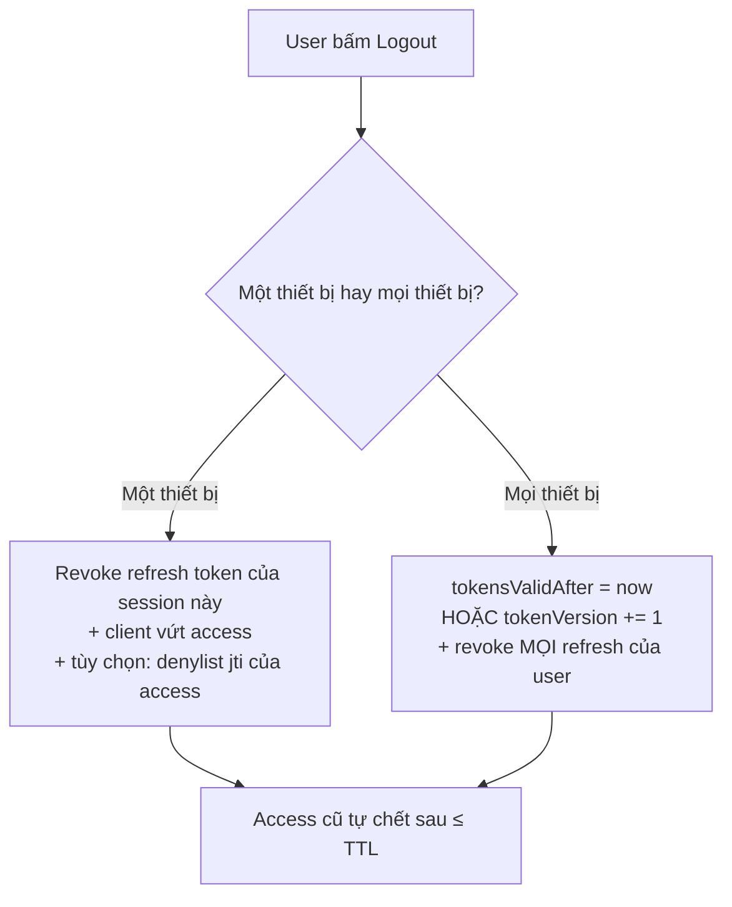

# Revocation & Logout — Deep Dive

## Mục lục

- [Nghịch lý: token tự chứng minh mình hợp lệ](#1-nghịch-lý-token-tự-chứng-minh-mình-hợp-lệ)
- [Bốn chiến lược thu hồi](#2-bốn-chiến-lược-thu-hồi)
- [Chiến lược 1: TTL ngắn (thu hồi bằng cách chờ)](#3-chiến-lược-1-ttl-ngắn-thu-hồi-bằng-cách-chờ)
- [Chiến lược 2: denylist theo jti](#4-chiến-lược-2-denylist-theo-jti)
- [Chiến lược 3: tokens_valid_after theo iat](#5-chiến-lược-3-tokens_valid_after-theo-iat)
- [Chiến lược 4: token version / epoch](#6-chiến-lược-4-token-version--epoch)
- [Logout: một thiết bị vs mọi thiết bị](#7-logout-một-thiết-bị-vs-mọi-thiết-bị)
- [Thu hồi access vs refresh — gánh nặng đặt ở đâu](#8-thu-hồi-access-vs-refresh--gánh-nặng-đặt-ở-đâu)
- [Code thực chiến — verify có kiểm thu hồi](#9-code-thực-chiến--verify-có-kiểm-thu-hồi)
- [Anti-patterns cần tránh](#10-anti-patterns-cần-tránh)
- [Tóm tắt — Cheat sheet](#11-tóm-tắt--cheat-sheet)

---

## 1. Nghịch lý: token tự chứng minh mình hợp lệ

Cả sức mạnh và điểm yếu của JWT nằm ở một câu: **verifier không hỏi ai cả**. Nó kiểm chữ ký + `exp` bằng toán, rồi tin. Điều đó khiến verify nhanh và phân tán — nhưng cũng nghĩa là **không có chỗ nào để bấm "hủy token này ngay"**.

```diagram
Session truyền thống (stateful):     JWT (stateless):
   token = id trỏ vào session ở DB      token = TỰ chứa sự thật đã ký
   logout = xóa session khỏi DB         logout = ... xóa cái gì? token nằm ở CLIENT
   → revoke TỨC THÌ, đương nhiên         → server không giữ gì để xóa
```

> [!IMPORTANT]
> "Đăng xuất" với session là xóa một dòng trong DB. Với JWT thuần, token vẫn hợp lệ về mặt toán học cho tới khi `exp`, dù user đã bấm logout. Thu hồi JWT *trước* `exp` luôn đòi **thêm trạng thái phía server** — tức hy sinh một phần tính stateless. Doc này là về việc chọn hy sinh *bao nhiêu* và *ở đâu*.

---

## 2. Bốn chiến lược thu hồi

```diagram
                       stateless ◄──────────────────────────► stateful
   (1) TTL ngắn        (2) token version    (3) valid_after    (4) denylist jti
   không trạng thái     1 field/user          1 field/user      N entry/token
   độ trễ = TTL         revoke NGAY (mọi tk)  revoke NGAY (mọi) revoke NGAY (1 tk)
   rẻ nhất              rẻ                    rẻ                tốn bộ nhớ nhất
```

| Chiến lược | Thu hồi được gì | Độ trễ | Trạng thái thêm | Lookup mỗi verify |
|------------|------------------|--------|------------------|--------------------|
| TTL ngắn | (tự hết hạn) | = TTL | không | không |
| denylist `jti` | từng token cụ thể | tức thì | N entry (tới khi exp) | có |
| `valid_after` (iat) | mọi token của 1 user | tức thì | 1 field/user | có |
| token version/epoch | mọi token của 1 user | tức thì | 1 field/user | có |

> [!NOTE]
> Không có "đúng" tuyệt đối — chỉ có đánh đổi. Thực tế nhiều hệ **kết hợp**: TTL ngắn cho access (giảm nhu cầu revoke), denylist/version cho các sự kiện cần hủy ngay (logout, đổi mật khẩu, lộ token). Việc đặt refresh là opaque + store (xem [Access vs Refresh](/lifecycle/access-token-vs-refresh-token/)) đã giải quyết phần lớn nhu cầu revoke ở tầng refresh.

---

## 3. Chiến lược 1: TTL ngắn (thu hồi bằng cách chờ)

```diagram
Không thật sự "thu hồi" — chỉ giới hạn cửa sổ rủi ro:
   access TTL 5'  → token bị trộm/cần hủy chỉ còn sống TỐI ĐA 5'
   logout = client vứt token + refresh bị revoke → access cũ tự chết sau ≤ 5'
```

```diagram
Độ trễ thu hồi thực tế = thời gian còn lại tới exp (≤ TTL)
   TTL 5'  → tệ nhất chờ 5' token mới hết hiệu lực
   TTL 1h  → tệ nhất chờ 1h (thường không chấp nhận được khi đã muốn hủy)
```

> [!TIP]
> Đây là chiến lược **mặc định và rẻ nhất** — giữ nguyên stateless hoàn toàn. Nếu TTL access đủ ngắn (vài phút) và bạn revoke refresh khi logout, thì với phần lớn hệ thống "chờ ≤ vài phút" là chấp nhận được, không cần denylist. Chỉ thêm cơ chế nặng hơn khi nghiệp vụ đòi hủy *tức thì* (tài chính, y tế, lộ token).

---

## 4. Chiến lược 2: denylist theo jti

Mỗi token có `jti` duy nhất (xem [Issuing Token §7](/lifecycle/issuing-token/)). Khi cần hủy một token cụ thể, thêm `jti` của nó vào **denylist**; verifier từ chối nếu `jti` có trong đó.

```diagram
revoke(token):  denylist.add(jti, ttl = exp − now)   // TTL = thời gian còn lại
verify(token):  nếu denylist.has(jti) → 401

Mẹo quan trọng: entry denylist tự HẾT HẠN đúng lúc token hết hạn
   → token hết hạn rồi thì không cần nhớ nữa (exp đã tự lo)
   → denylist KHÔNG phình vô hạn: kích thước ≈ số token bị revoke CÒN hạn
```

```diagram
Lưu ở đâu: Redis (key = "deny:"+jti, EXPIRE = exp−now)
   verify thêm 1 lần GET Redis (~sub-ms) → đánh đổi stateless lấy revoke tức thì
```

> [!WARNING]
> Denylist hiện thực sai sẽ phình mãi (nhớ cả token đã hết hạn). Luôn set TTL cho mỗi entry = thời gian còn lại tới `exp`. Khi đó denylist chỉ chứa token "bị hủy nhưng chưa tới hạn tự nhiên" — một tập nhỏ. Đây là dạng [blacklist](/lifecycle/blacklist-whitelist/) ở tầng token.

---

## 5. Chiến lược 3: tokens_valid_after theo iat

Thay vì nhớ từng token, lưu **một mốc thời gian cho mỗi user**: "mọi token cấp trước thời điểm T đều vô hiệu".

```diagram
Mỗi user có field:  tokensValidAfter (epoch)
verify(token):  nếu token.iat < user.tokensValidAfter → 401

Logout-mọi-thiết-bị / đổi mật khẩu:
   set user.tokensValidAfter = now
   → MỌI token cấp trước now (mọi thiết bị) lập tức vô hiệu
   → chỉ 1 field/user, không cần liệt kê token
```

```diagram
Ví dụ:
   10:00  user đăng nhập 3 thiết bị → 3 token, iat ∈ {10:00, 10:01, 10:02}
   10:30  đổi mật khẩu → tokensValidAfter = 10:30
   → cả 3 token (iat < 10:30) đều bị từ chối ngay ở verify kế tiếp
```

> [!TIP]
> Đây là cách **đăng xuất mọi thiết bị** rẻ và sạch nhất: O(1) bộ nhớ mỗi user, không denylist phình. Hợp hoàn hảo cho các sự kiện "hủy toàn bộ phiên": đổi mật khẩu, nghi ngờ tài khoản bị chiếm, user bấm "đăng xuất khắp nơi". Cần tra `tokensValidAfter` của user mỗi verify (1 lookup) — đánh đổi tương tự denylist nhưng O(1)/user.

---

## 6. Chiến lược 4: token version / epoch

Biến thể của valid_after, dùng **số đếm** thay vì thời gian — tránh phụ thuộc đồng hồ.

```diagram
Mỗi user có field:  tokenVersion (số nguyên)
cấp token:   nhét claim  ver = user.tokenVersion
verify:      nếu token.ver != user.tokenVersion → 401

Hủy mọi token:  user.tokenVersion += 1
   → mọi token mang ver cũ lập tức vô hiệu; token mới cấp mang ver mới
```

| | valid_after (iat) | token version |
|---|--------------------|----------------|
| Cơ sở so sánh | thời gian (iat vs mốc) | số đếm (ver vs ver) |
| Phụ thuộc đồng hồ | có (skew ảnh hưởng biên) | không |
| Hủy chọn lọc theo thời điểm | được (mốc bất kỳ) | không (chỉ "trước/sau lần bump") |

> [!NOTE]
> `tokenVersion` đặc biệt tiện khi muốn "vô hiệu mọi token cũ" mà không lo lệch đồng hồ: chỉ cần tăng số. Nhược điểm: không diễn đạt được "hủy token cấp trước 10:30" như valid_after. Nhiều hệ dùng cả hai tùy ngữ cảnh.

---

## 7. Logout: một thiết bị vs mọi thiết bị



```diagram
MỘT THIẾT BỊ (logout thường):
   • revoke refresh token của session đó (xóa khỏi store)  → không gia hạn được nữa
   • client xóa access khỏi memory
   • access còn hạn? → tự chết sau ≤ TTL (hoặc denylist jti nếu cần tức thì)

MỌI THIẾT BỊ (đổi mật khẩu / nghi bị chiếm):
   • tokensValidAfter = now  (hoặc tokenVersion += 1)  → mọi access cũ vô hiệu
   • revoke toàn bộ refresh token của user
```

> [!IMPORTANT]
> Logout một-thiết-bị chủ yếu dựa vào **revoke refresh + TTL access ngắn** — thường không cần denylist nếu TTL đủ ngắn. Logout mọi-thiết-bị mới thật sự cần `valid_after`/`version` (hủy tức thì hàng loạt). Đừng dùng denylist `jti` cho "mọi thiết bị" — sẽ phải liệt kê mọi token; dùng mốc/đếm O(1)/user.

---

## 8. Thu hồi access vs refresh — gánh nặng đặt ở đâu

```diagram
REFRESH token:  vốn đã stateful (opaque + store) → revoke = xóa khỏi store, TỨC THÌ
   → đây là nơi DỄ revoke nhất → đặt phần lớn việc thu hồi ở đây

ACCESS token:  stateless, sống ngắn → revoke tức thì TỐN (denylist / lookup mỗi req)
   → thường KHÔNG revoke trực tiếp; để TTL ngắn lo
   → chỉ thêm denylist/valid_after khi nghiệp vụ đòi hủy access tức thì
```

```diagram
Chiến lược kết hợp khuyến nghị (đa số hệ thống):
   1. access TTL ngắn (5–15')      → revoke "tự nhiên" cho phần lớn case
   2. refresh opaque + store       → revoke tức thì khi logout/lộ
   3. tokensValidAfter / version   → nút "đăng xuất mọi nơi" tức thì
   4. denylist jti (tùy chọn)      → chỉ khi cần hủy 1 access cụ thể NGAY
```

> [!TIP]
> Nguyên tắc đặt gánh nặng: **revoke ở tầng refresh (rẻ, stateful sẵn) + TTL access ngắn**, chỉ "leo thang" lên denylist/valid_after khi có yêu cầu hủy access *tức thì*. Đừng mặc định bắt mọi verify access phải tra Redis — đó là đánh mất lợi thế stateless cho một nhu cầu hiếm.

---

## 9. Code thực chiến — verify có kiểm thu hồi

```javascript
import { jwtVerify } from 'jose';

async function verifyAccess(token) {
  // 1. Verify chữ ký + exp/nbf/aud/iss (stateless, không DB)
  const { payload } = await jwtVerify(token, publicKey, {
    issuer: 'https://auth.example.com',
    audience: 'api.payments',
    clockTolerance: '30s',
  });

  // 2. (tùy chọn) denylist theo jti — hủy 1 token cụ thể
  if (await redis.exists(`deny:${payload.jti}`)) {
    throw new Unauthorized('token revoked');
  }

  // 3. valid_after / version — đăng xuất mọi thiết bị
  const user = await cache.getUser(payload.sub);       // cache để rẻ
  if (payload.iat < user.tokensValidAfter) {
    throw new Unauthorized('session invalidated (logout-all / password change)');
  }
  if (payload.ver !== user.tokenVersion) {
    throw new Unauthorized('token version stale');
  }

  return payload;
}

// Hủy 1 token (logout 1 thiết bị, cần tức thì)
async function revokeToken(payload) {
  const ttl = payload.exp - Math.floor(Date.now() / 1000);
  if (ttl > 0) await redis.set(`deny:${payload.jti}`, '1', 'EX', ttl);  // tự hết hạn
}

// Đăng xuất mọi thiết bị
async function logoutEverywhere(userId) {
  await db.users.update(userId, { tokensValidAfter: Math.floor(Date.now() / 1000) });
  await db.refresh.revokeAllForUser(userId);
}
```

> [!WARNING]
> Bước (2) và (3) thêm lookup vào mỗi verify — cân nhắc cache (`user.tokensValidAfter`/`tokenVersion` đổi hiếm nên cache mạnh được). Nếu chỉ cần "logout mọi nơi" mà không cần hủy-1-token tức thì, bỏ hẳn denylist (bước 2) để giữ verify nhẹ.

---

## 10. Anti-patterns cần tránh

| Anti-pattern | Hậu quả | Làm đúng |
|--------------|---------|----------|
| Tin "JWT logout = xóa ở client" | Token vẫn hợp lệ tới exp; refresh vẫn gia hạn được | Revoke refresh + TTL ngắn (+ valid_after nếu cần) |
| Access TTL dài + không revoke | Không cách nào hủy sớm | TTL ngắn hoặc thêm cơ chế revoke |
| Denylist không set TTL entry | Danh sách phình vô hạn | Entry TTL = exp − now (tự dọn) |
| Dùng denylist jti cho "logout mọi nơi" | Phải liệt kê mọi token | valid_after / version (O(1)/user) |
| Tra DB mỗi verify cho mọi token | Mất stateless, thành điểm nghẽn | Cache valid_after/version; denylist chỉ khi cần |
| Quên revoke refresh khi logout | User "đăng xuất" vẫn gia hạn được | Revoke refresh là bước bắt buộc của logout |
| Đổi mật khẩu không hủy token cũ | Token cũ vẫn sống sau đổi pass | Set tokensValidAfter = now khi đổi mật khẩu |

---

## 11. Tóm tắt — Cheat sheet

```diagram
╭──────────────────────────────────────────────────────────────╮
│  JWT stateless = KHÔNG có nút "hủy ngay" sẵn → phải thêm state │
│                                                                │
│  4 CHIẾN LƯỢC (stateless → stateful):                          │
│   1. TTL ngắn        : độ trễ = TTL, 0 state, rẻ nhất          │
│   2. denylist jti    : hủy 1 token, entry TTL = exp−now        │
│   3. valid_after iat : hủy MỌI token user, O(1)/user           │
│   4. token version   : như (3) nhưng dùng số đếm (khỏi đồng hồ)│
│                                                                │
│  LOGOUT:                                                       │
│   1 thiết bị  → revoke refresh + TTL access lo phần còn lại    │
│   mọi thiết bị→ valid_after/version + revoke mọi refresh       │
│                                                                │
│  ĐẶT GÁNH NẶNG ở REFRESH (stateful sẵn, revoke rẻ) + TTL ngắn; │
│  chỉ leo thang lên denylist khi cần hủy access TỨC THÌ.        │
╰──────────────────────────────────────────────────────────────╯
```

**3 nguyên tắc xương sống:**

1. **Thu hồi JWT luôn tốn thêm trạng thái server — chọn ít nhất đủ dùng.** TTL ngắn lo phần lớn; chỉ thêm denylist/valid_after khi nghiệp vụ đòi hủy tức thì.
2. **Revoke ở tầng refresh, không ở tầng access.** Refresh đã stateful nên revoke rẻ và tức thì; access để TTL ngắn tự chết.
3. **"Logout mọi nơi" dùng mốc/đếm O(1)/user (valid_after / version), không dùng denylist.** Denylist `jti` chỉ để hủy một token cụ thể ngay.

Đọc tiếp: [Blacklist vs Whitelist — Deep Dive](/lifecycle/blacklist-whitelist/) — hai mô hình lưu trạng thái thu hồi và đánh đổi bộ nhớ/độ trễ.
