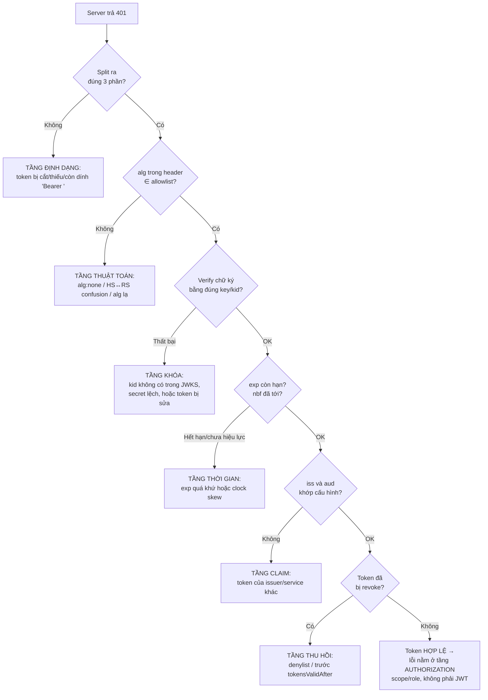

# Debugging JWT

## Mục lục

- [Tổng quan](#tổng-quan)
- [1. Giải phẫu một JWT bằng tay](#1-giải-phẫu-một-jwt-bằng-tay)
  - [1.1 Ba phần và bảng chữ cái Base64URL](#11-ba-phần-và-bảng-chữ-cái-base64url)
  - [1.2 Decode bằng CLI (offline, an toàn)](#12-decode-bằng-cli-offline-an-toàn)
  - [1.3 Đọc claim thời gian: iat, exp, nbf](#13-đọc-claim-thời-gian-iat-exp-nbf)
- [2. Decode ≠ Verify — phân biệt sống còn](#2-decode--verify--phân-biệt-sống-còn)
- [3. Cây quyết định: vì sao token bị 401?](#3-cây-quyết-định-vì-sao-token-bị-401)
- [4. Mã lỗi theo thư viện](#4-mã-lỗi-theo-thư-viện)
  - [4.1 jose (Node)](#41-jose-node)
  - [4.2 jsonwebtoken (Node)](#42-jsonwebtoken-node)
  - [4.3 PyJWT (Python)](#43-pyjwt-python)
- [5. Bảng tra lỗi theo triệu chứng](#5-bảng-tra-lỗi-theo-triệu-chứng)
- [6. Một ca điều tra 401 từ đầu đến cuối](#6-một-ca-điều-tra-401-từ-đầu-đến-cuối)
- [7. Debug theo từng tầng lỗi](#7-debug-theo-từng-tầng-lỗi)
  - [7.1 Clock skew (exp/nbf)](#71-clock-skew-expnbf)
  - [7.2 Sai khóa & kid/JWKS](#72-sai-khóa--kidjwks)
  - [7.3 Sai aud/iss giữa môi trường](#73-sai-audiss-giữa-môi-trường)
- [8. Debug theo môi trường](#8-debug-theo-môi-trường)
- [9. Recipe & công cụ](#9-recipe--công-cụ)
- [10. An toàn khi debug — đừng làm lộ token](#10-an-toàn-khi-debug--đừng-làm-lộ-token)
- [11. Checklist debug nhanh](#11-checklist-debug-nhanh)
- [Tài liệu tham khảo](#tài-liệu-tham-khảo)

---

## Tổng quan

Debug JWT khác debug logic thường ở một điểm cốt lõi: **một token nhìn "đúng" hoàn toàn vẫn có thể bị từ chối**. Một chuỗi decode ra header/payload đẹp đẽ, chữ ký "verified" trên jwt.io, vẫn trả `401` ở server — vì server kiểm tra nhiều hơn chữ ký rất nhiều: `exp`, `nbf`, `iss`, `aud`, thuật toán, đúng khóa, và cả việc token đã bị thu hồi hay chưa.

```diagram
        Bạn nhìn thấy:                       Sự thật ở server:
   ┌────────────────────┐         ┌──────────────────────────────────┐
   │ jwt.io: "verified" │  ──✗──▶ │ 401: aud="api.billing" nhưng      │
   │ payload đủ claim   │         │      service này là "api.orders"  │
   │ chữ ký hợp lệ      │         │ (jwt.io KHÔNG kiểm aud/iss/exp)   │
   └────────────────────┘         └──────────────────────────────────┘
```

Vì vậy việc debug JWT thực chất là **khoanh vùng lỗi nằm ở tầng nào** rồi mới sửa, thay vì nới lỏng cấu hình "cho chạy". Doc này cho bạn: cách đọc token bằng tay, bản đồ mã lỗi của các thư viện phổ biến, một quy trình điều tra lặp lại được, và các bẫy hay gặp nhất (clock skew, sai `kid`, lệch `aud`/`iss`).

> [!IMPORTANT]
> Khi debug, luôn tách bạch **ba câu hỏi độc lập**: (1) chuỗi có **đúng định dạng** (3 phần Base64URL) không? (2) chữ ký có **verify** được bằng **đúng khóa** + đúng thuật toán không? (3) các **claim** (`exp`, `nbf`, `iss`, `aud`) có thỏa không? Lỗi rơi vào tầng nào quyết định cách sửa — và ba tầng này có cách kiểm hoàn toàn khác nhau.

---

## 1. Giải phẫu một JWT bằng tay

### 1.1 Ba phần và bảng chữ cái Base64URL

Một JWT (dạng compact JWS) là **3 đoạn Base64URL** nối bằng dấu chấm:

```diagram
  header                 payload                         signature
┌─────────┐ . ┌────────────────────────┐ . ┌────────────────────────┐
│ {alg,   │   │ {sub, aud, iss, iat,   │   │ HMAC/RSA/ECDSA bytes    │
│  kid,   │   │  exp, jti, scope...}   │   │ của (header.payload)    │
│  typ}   │   │                        │   │ → Base64URL             │
└─────────┘   └────────────────────────┘   └────────────────────────┘
   đọc được      đọc được (KHÔNG mã hóa)        KHÔNG "đọc" được,
                                                  chỉ để VERIFY
```

Hai phần đầu **chỉ là encoding, không phải mã hóa** — bất kỳ ai có token cũng đọc được. Phần ba là chữ ký nhị phân, không có nghĩa khi "đọc", chỉ dùng để verify.

Base64URL khác Base64 chuẩn ở ba điểm — đây là nguồn lỗi decode phổ biến:

| Đặc điểm | Base64 chuẩn | Base64**URL** (JWT dùng) |
|----------|--------------|---------------------------|
| Ký tự thứ 62/63 | `+` `/` | `-` `_` |
| Padding `=` | Có | **Bỏ** (theo RFC 7515) |
| An toàn trong URL | Không | Có |

<Callout type="warn">
Vì header và payload chỉ là Base64URL, <b>bất kỳ ai chặn được token cũng đọc được toàn bộ claim</b>. Đừng bao giờ đặt mật khẩu, secret, hay PII nhạy cảm trong payload. Nếu thật sự cần giấu nội dung, dùng JWE. Xem <a href="/fundamentals/encoding-vs-encryption/">Encoding vs Encryption</a>.
</Callout>

### 1.2 Decode bằng CLI (offline, an toàn)

Khi không có internet — hoặc không muốn paste token thật lên web — decode ngay trên máy. Vấn đề duy nhất là chuyển Base64URL về Base64 chuẩn và bù padding:

```bash
# Hàm decode 1 đoạn Base64URL: chuyển -_ về +/ rồi bù '=' cho đủ bội số 4
b64url() { local s="${1//-/+}"; s="${s//_//}"; printf '%s' "$s" | base64 -d 2>/dev/null; }

TOKEN="eyJhbGciOiJSUzI1NiIsImtpZCI6ImtleS0yMDI0In0.eyJzdWIiOiJ1MTIzIn0.NHVh..."

# Header (đoạn 1) — xem alg + kid
b64url "$(echo "$TOKEN" | cut -d. -f1)" | jq .

# Payload (đoạn 2) — xem claim
b64url "$(echo "$TOKEN" | cut -d. -f2)" | jq .
```

```text
# Header decode ra:
{ "alg": "RS256", "kid": "key-2024", "typ": "JWT" }

# Payload decode ra:
{ "sub": "u123", "aud": "api.orders", "iss": "https://auth.example.com",
  "iat": 1750000000, "exp": 1750000900, "jti": "a1b2c3" }
```

> [!TIP]
> Nếu `base64 -d` báo "invalid input", gần như luôn là **thiếu padding**. Base64 chuẩn cần độ dài bội số 4; Base64URL của JWT đã bỏ `=`. Cách chắc ăn nhất là dùng thư viện (`jq -R 'gsub("-";"+")...'` hoặc một dòng Node/Python) thay vì `base64` thuần — chúng tự xử lý padding.

Một liner bằng Node (xử lý padding chuẩn xác, không lệ thuộc `base64`):

```bash
node -e 'const p=process.argv[1].split(".");
for (const [i,n] of [[0,"HEADER"],[1,"PAYLOAD"]])
  console.log(n, JSON.parse(Buffer.from(p[i],"base64url")));' "$TOKEN"
```

### 1.3 Đọc claim thời gian: iat, exp, nbf

Các claim thời gian là **Unix epoch tính bằng GIÂY** (không phải mili-giây). Đây là nguồn của một bug kinh điển.

```bash
date -d @1750000900    # Linux → giờ người đọc
date -r 1750000900     # macOS
date +%s               # epoch hiện tại để so sánh với exp
```

```diagram
  iat = 1750000000  (cấp lúc)        exp = 1750000900  (hết hạn)
   │                                  │
   ▼                                  ▼
   ├──────────── token sống ──────────┤
        TTL = exp - iat = 900s = 15 phút

  Nếu now > exp        → "jwt expired"
  Nếu now < nbf        → "jwt not active yet"
```

<Callout type="error" title="Bẫy mili-giây kinh điển">
Trong JS, <code>Date.now()</code> trả về <b>mili-giây</b>. Nếu đặt <code>exp: Date.now() + 900000</code>, bạn vừa tạo một token "hết hạn" sau ~1700 <i>năm</i>. Luôn dùng giây: <code>Math.floor(Date.now()/1000) + 900</code>. Khi debug thấy <code>exp</code> là một số 13 chữ số (vd <code>1750000900000</code>) thay vì 10 chữ số → chính là lỗi này.
</Callout>

---

## 2. Decode ≠ Verify — phân biệt sống còn

Đây là cái bẫy phổ biến nhất, đáng tách riêng vì nó vừa gây bug vừa gây lỗ hổng.

```diagram
╭───────────────────────────────────────────────────────────────────────╮
│  decode(token)                                                          │
│    • CHỈ Base64URL-decode header + payload                              │
│    • KHÔNG kiểm chữ ký, KHÔNG kiểm exp/aud/iss                          │
│    • input là chuỗi do CLIENT gửi → KHÔNG đáng tin                      │
│    → DÙNG ĐỂ: đọc/debug/log chẩn đoán                                   │
│    → TUYỆT ĐỐI KHÔNG dùng để phân quyền                                 │
│                                                                         │
│  verify(token, key, { algorithms, issuer, audience })                   │
│    • kiểm chữ ký bằng đúng khóa + alg trong allowlist                   │
│    • kiểm exp + nbf + iss + aud                                         │
│    • throw nếu bất kỳ cổng nào fail                                     │
│    → DÙNG ĐỂ: QUYẾT ĐỊNH cho phép hay từ chối                           │
╰───────────────────────────────────────────────────────────────────────╯
```

```javascript
import { decodeJwt, jwtVerify } from 'jose';

// ✅ ĐÚNG cho DEBUG: chỉ để NHÌN, không tin tưởng
const claims = decodeJwt(token);          // không throw dù chữ ký sai/hết hạn
console.log('debug:', claims.sub, claims.aud, new Date(claims.exp * 1000));

// ❌ SAI nghiêm trọng — dùng decode để cho qua:
// if (decodeJwt(token).role === 'admin') grantAccess();
//   → kẻ tấn công sửa payload thành {"role":"admin"} là vào được, KHÔNG cần chữ ký

// ✅ ĐÚNG để QUYẾT ĐỊNH:
const { payload } = await jwtVerify(token, key, {
  algorithms: ['RS256'],
  issuer: 'https://auth.example.com',
  audience: 'api.orders',
});
```

> [!WARNING]
> Dùng `jwt.decode` / `jwtDecode` để ra quyết định phân quyền là một lỗ hổng nghiêm trọng: payload chưa qua kiểm chữ ký nên kẻ tấn công sửa `role`, `sub`, `scope` tùy ý. `decode` **chỉ** được dùng để đọc khi debug và để **log** (lấy `jti`/`sub` ghi log) — không bao giờ để authz. Chi tiết khai thác: [Common Vulnerabilities](/security/common-vulnerabilities/).

---

## 3. Cây quyết định: vì sao token bị 401?

Khi server trả `401`, đi theo cây sau để khoanh đúng tầng lỗi thay vì sửa mò:



> [!NOTE]
> Pipeline verify đầy đủ 7 cổng (kèm code minh họa từng bước) được mổ xẻ ở [Luồng xác thực JWT — Deep Dive](/internals/token-validation-flow/). Cây trên là phiên bản rút gọn để **debug nhanh** — mục đích chỉ là chỉ ra "lỗi ở tầng nào".

---

## 4. Mã lỗi theo thư viện

Biết thư viện ném mã lỗi gì giúp đọc thẳng được tầng lỗi. Dưới đây là ba thư viện phổ biến.

### 4.1 jose (Node)

`jose` ném lỗi có thuộc tính `.code` rất rõ ràng — nên `catch` theo `code`:

| `error.code` | Tầng | Ý nghĩa |
|--------------|------|---------|
| `ERR_JWS_INVALID` / `ERR_JWT_MALFORMED` | Định dạng | Chuỗi sai cấu trúc |
| `ERR_JOSE_ALG_NOT_ALLOWED` | Thuật toán | `alg` không nằm trong `algorithms` |
| `ERR_JWS_SIGNATURE_VERIFICATION_FAILED` | Khóa | Chữ ký không khớp khóa |
| `ERR_JWT_EXPIRED` | Thời gian | `exp` đã qua |
| `ERR_JWT_CLAIM_VALIDATION_FAILED` | Claim | Sai `iss`/`aud`/`nbf`/thiếu claim bắt buộc |

```javascript
try {
  await jwtVerify(token, key, { algorithms: ['RS256'], issuer, audience });
} catch (e) {
  switch (e.code) {
    case 'ERR_JWT_EXPIRED':                       return debug('token hết hạn', e.claim);
    case 'ERR_JOSE_ALG_NOT_ALLOWED':              return debug('alg không cho phép');
    case 'ERR_JWS_SIGNATURE_VERIFICATION_FAILED': return debug('sai khóa/chữ ký');
    case 'ERR_JWT_CLAIM_VALIDATION_FAILED':       return debug('sai claim:', e.claim, e.reason);
    default:                                      return debug('lỗi khác', e.code);
  }
}
```

### 4.2 jsonwebtoken (Node)

`jsonwebtoken` phân lớp lỗi qua `error.name`:

| `error.name` | Tầng | Trường thêm |
|--------------|------|-------------|
| `TokenExpiredError` | Thời gian | `error.expiredAt` (Date) |
| `NotBeforeError` | Thời gian | `error.date` (nbf) |
| `JsonWebTokenError` | Khóa/định dạng/claim | `error.message`: `invalid signature`, `jwt malformed`, `jwt audience invalid`, `jwt issuer invalid`, `invalid algorithm` |

```javascript
jwt.verify(token, key, { algorithms: ['RS256'], issuer, audience }, (err, decoded) => {
  if (err?.name === 'TokenExpiredError') return debug('hết hạn lúc', err.expiredAt);
  if (err?.name === 'NotBeforeError')    return debug('chưa hiệu lực tới', err.date);
  if (err?.message === 'invalid signature') return debug('sai khóa');
  if (err) return debug('lỗi:', err.message);
});
```

### 4.3 PyJWT (Python)

PyJWT có cây exception kế thừa từ `InvalidTokenError`:

```python
import jwt
try:
    payload = jwt.decode(token, key, algorithms=["RS256"],
                         issuer=ISS, audience=AUD)
except jwt.ExpiredSignatureError:        # exp quá khứ  → tầng thời gian
    ...
except jwt.ImmatureSignatureError:       # nbf tương lai → tầng thời gian
    ...
except jwt.InvalidAudienceError:         # sai aud      → tầng claim
    ...
except jwt.InvalidIssuerError:           # sai iss      → tầng claim
    ...
except jwt.InvalidSignatureError:        # sai khóa     → tầng khóa
    ...
except jwt.InvalidAlgorithmError:        # alg lạ       → tầng thuật toán
    ...
except jwt.DecodeError:                  # méo/cắt      → tầng định dạng
    ...
```

> [!TIP]
> `jwt.decode(..., options={"verify_signature": False})` trong PyJWT là tương đương "chỉ decode để xem" — hữu ích khi debug nhưng **tuyệt đối không dùng cho authz** (xem [mục 2](#2-decode--verify--phân-biệt-sống-còn)).

---

## 5. Bảng tra lỗi theo triệu chứng

| Triệu chứng / message | Tầng | Nguyên nhân thường gặp | Cách kiểm & sửa |
|------------------------|------|------------------------|------------------|
| `jwt malformed` / `DecodeError` | Định dạng | Token bị cắt, thiếu phần, còn dính `Bearer ` | Kiểm header `Authorization`, strip đúng `Bearer ` |
| `invalid signature` | Khóa | Sai khóa verify, `kid` không khớp, token bị sửa | So `kid` header ↔ JWKS; kiểm key đúng issuer |
| `jwt expired` | Thời gian | `exp` đã qua, hoặc đồng hồ lệch | Decode `exp`, so `date +%s`; thêm `clockTolerance` |
| `jwt not active` (`nbf`) | Thời gian | `nbf` tương lai do clock skew | Đồng bộ NTP; thêm leeway nhỏ |
| `audience invalid` | Claim | Token cấp cho service khác | So `aud` payload ↔ `audience` verify |
| `issuer invalid` | Claim | Token từ issuer khác (staging↔prod) | So `iss` ↔ env hiện tại |
| `alg not allowed` / `invalid algorithm` | Thuật toán | Token `HS256` nhưng allowlist `RS256` (hoặc ngược) | Đồng bộ thuật toán issuer↔verifier |
| `secretOrPublicKey must be...` | Khóa | Quên truyền key / key sai định dạng PEM | RS256 cần PUBLIC key, không phải private |
| Verify OK nhưng vẫn 403 | Authorization | Thiếu `scope`/`role` | Token hợp lệ — không phải tầng JWT |
| jwt.io "verified" nhưng server 401 | Nhiều | jwt.io không kiểm `exp`/`aud`/`iss`/revoke | Đừng tin "verified" của jwt.io cho mọi cổng |
| 401 chập chờn lúc được lúc không | Khóa | Đang xoay khóa, một số node thiếu `kid` mới | Kiểm JWKS cache & propagation `kid` mới |
| 401 hàng loạt ngay sau deploy | Cấu hình | Đổi `aud`/`iss`/secret mà không có cửa sổ chuyển tiếp | Rollback cấu hình; xem [Migration](/operations/migration-strategy/) |

---

## 6. Một ca điều tra 401 từ đầu đến cuối

Tình huống thật: *"Login xong gọi `GET /api/orders` thì lúc 200 lúc 401, không ổn định."*

<Steps>
<Step>
### Bắt token THỰC đang gửi

Mở DevTools → Network → request `/api/orders` → tab Headers, copy giá trị `Authorization`. **Đừng dùng token bạn nghĩ** — dùng token thực server nhận. Phát hiện: header đúng dạng `Bearer eyJ...`.
</Step>
<Step>
### Decode để xem

```text
header:  { "alg": "RS256", "kid": "key-2024-Q2", "typ": "JWT" }
payload: { "sub":"u9","aud":"api.orders","iss":"https://auth.example.com",
           "iat":1750000000,"exp":1750000900 }
```
`aud`/`iss` đúng, `exp` còn hạn. Vậy không phải tầng claim/thời gian.
</Step>
<Step>
### Chú ý `kid`

`kid = key-2024-Q2`. Gọi JWKS của issuer: chỉ có `key-2024-Q3`. **Thiếu Q2!** Đây là dấu hiệu vừa xoay khóa.
</Step>
<Step>
### Vì sao "lúc được lúc không"?

Có 2 node verifier sau load balancer. Một node đã refetch JWKS (chỉ có Q3), node kia còn cache cũ (có cả Q2). Request rơi vào node nào quyết định 200/401. Token cũ ký bằng Q2 → node mới từ chối.
</Step>
<Step>
### Khoanh vùng & sửa

Lỗi ở **tầng khóa**, do xoay khóa không có overlap window đủ dài: gỡ `Q2` khỏi JWKS trong khi vẫn còn token ký bằng `Q2` đang sống. Sửa: tạm thêm lại `Q2` vào JWKS, chờ token cũ hết hạn (qua TTL 15') rồi mới gỡ.
</Step>
</Steps>

> [!IMPORTANT]
> Bài học: **401 chập chờn = nghĩ ngay tới sự khác biệt giữa các node/replica** (cache JWKS lệch, env var lệch, một node deploy trước). Decode token để lấy `kid`, rồi đối chiếu với JWKS thực tế trên *từng* node. Quy trình xoay khóa đúng (overlap) ở [Key Rotation](/cryptography/key-rotation/) và [Migration Strategy §4](/operations/migration-strategy/).

---

## 7. Debug theo từng tầng lỗi

### 7.1 Clock skew (exp/nbf)

`jwt expired` hoặc `jwt not active` **ngay sau khi vừa cấp token** gần như luôn là lệch đồng hồ giữa máy issuer và máy verifier.

```diagram
  Issuer cấp token (đồng hồ issuer)        Verifier kiểm (đồng hồ verifier)
        iat=1000, exp=1900                       now = 985  (chậm 15s)
                                          → nbf/iat "ở tương lai" → "not active"

        iat=1000, exp=1900                       now = 1915 (nhanh 15s)
                                          → đã qua exp dù token vừa cấp → "expired"
```

```javascript
// Cho phép lệch ±30-60s — KHÔNG nới exp dài ra "cho chạy"
await jwtVerify(token, key, { algorithms: ['RS256'], clockTolerance: '30s' });
```

> [!TIP]
> Cách sửa đúng là **đồng bộ NTP mọi node** và đặt `clockTolerance` (leeway) 30–60 giây. Cách sai là kéo dài TTL token để "che" lệch giờ — nó che triệu chứng và phóng to cửa sổ rủi ro bảo mật. Nếu lệch >60s, đó là sự cố hạ tầng cần sửa, không phải chỉnh JWT.

### 7.2 Sai khóa & kid/JWKS

Khi gặp `invalid signature`, tách thành ba khả năng và loại trừ:

```diagram
"invalid signature"
   ├── (a) sai KHÓA: verifier dùng khóa khác khóa đã ký
   │        → so kid header với khóa đang dùng; RS256 phải dùng PUBLIC key
   ├── (b) kid không có trong JWKS
   │        → curl JWKS endpoint, kiểm kid tồn tại; cache cũ?
   └── (c) token bị SỬA (header/payload đổi sau khi ký)
            → hiếm khi do người dùng thật; nghi tấn công nếu thấy hàng loạt
```

```bash
# Kiểm kid của token có trong JWKS không
KID=$(b64url "$(echo "$TOKEN" | cut -d. -f1)" | jq -r .kid)
curl -s https://auth.example.com/.well-known/jwks.json | jq ".keys[] | select(.kid==\"$KID\")"
# Rỗng → kid không có trong JWKS (xoay khóa? sai issuer? cache?)
```

> [!NOTE]
> RS256/ES256: verifier dùng **public key**; nếu lỡ cấu hình bằng private key hoặc nhầm khóa của môi trường khác → `invalid signature`. HS256: cả hai bên dùng **cùng secret**; lệch một ký tự là fail. Cơ chế chọn khóa theo `kid` qua JWKS: [JWK và JWKS](/cryptography/jwk-and-jwks/).

### 7.3 Sai aud/iss giữa môi trường

Lỗi `audience invalid` / `issuer invalid` phổ biến nhất khi **dùng token của môi trường này gọi môi trường khác** (token staging gọi prod), hoặc microservice B kiểm `aud` nhưng token cấp cho service A.

```bash
# So nhanh aud/iss của token với cấu hình verifier
b64url "$(echo "$TOKEN" | cut -d. -f2)" | jq '{aud, iss}'
echo "verifier mong đợi: aud=api.orders iss=https://auth.example.com"
```

Trong microservices, `aud` sai giữa service nội bộ là lỗi rất hay gặp — xem [Microservices Auth](/implementation/microservices-auth/).

---

## 8. Debug theo môi trường

| Môi trường | Cách lấy token thật | Bẫy đặc thù |
|------------|---------------------|-------------|
| **Trình duyệt / SPA** | DevTools → Network → request → `Authorization` | Token cache cũ trong memory; gửi nhầm refresh thay access |
| **Mobile** | Proxy (mitmproxy/Charles) bắt request | Cert pinning chặn proxy; token trong Keychain/Keystore khó xem |
| **Service-to-service** | Log request *đã redact* hoặc tcpdump nội bộ | Token có `aud` riêng cho service đích; dễ sai `aud` |
| **API Gateway** | Log của gateway (đã redact token) | Gateway có thể verify rồi truyền claim xuống qua header khác |
| **CI/CD test** | In ra `error.code`/`error.name`, không in token | Khóa test khác khóa prod; clock của runner |

<Callout type="info">
Trong kiến trúc có API Gateway, gateway thường verify JWT rồi <b>chuyển claim đã xác thực</b> xuống service nội bộ qua header riêng (vd <code>X-User-Id</code>) hoặc một token nội bộ khác. Khi service nội bộ trả 401, hãy kiểm xem nó đang verify token gốc hay token/claim do gateway cấp — hai thứ này có <code>aud</code>/<code>iss</code> khác nhau. Xem <a href="/implementation/api-gateway-auth/">API Gateway Auth</a>.
</Callout>

---

## 9. Recipe & công cụ

| Công cụ | Dùng để | Lưu ý |
|---------|---------|-------|
| **jwt.io** | Decode nhanh, xem header/payload, thử verify chữ ký | Chỉ verify **chữ ký**; KHÔNG dán token prod thật |
| **CLI** (`b64url`+`jq`) | Decode offline, an toàn, scriptable | Nhớ chuyển Base64URL→Base64 + bù padding |
| **Node/Python REPL** | Verify đầy đủ key + claim, tái hiện cấu hình server | Cách chắc nhất để tái hiện lỗi prod |
| **DevTools Network** | Lấy token THỰC server nhận | Token thật quan trọng hơn token bạn nghĩ |
| **`curl`** | Gọi lại request với token để tái hiện 401 | Đặt token ở header, không ở URL |

```bash
# Tái hiện request bằng curl (token ở HEADER, không ở URL)
curl -sS -i https://api.example.com/orders \
  -H "Authorization: Bearer $TOKEN" | head -20

# REPL verify bằng Node + jose, tái hiện đúng cấu hình verifier
node -e '
import("jose").then(async ({ jwtVerify, createRemoteJWKSet }) => {
  const JWKS = createRemoteJWKSet(new URL("https://auth.example.com/.well-known/jwks.json"));
  const { payload } = await jwtVerify(process.env.TOKEN, JWKS, {
    algorithms: ["RS256"],
    issuer: "https://auth.example.com",
    audience: "api.orders",
  });
  console.log("OK", payload);
}).catch(e => console.error("FAIL", e.code, e.message));
'
```

---

## 10. An toàn khi debug — đừng làm lộ token

Debug là lúc dễ vô tình rò token nhất: paste vào chat, log ra console, đính kèm ticket.

```diagram
□ KHÔNG paste token PRODUCTION thật lên jwt.io / web bên thứ ba
   → token còn hạn = ai thấy cũng đăng nhập được; decode OFFLINE hoặc dùng token test
□ KHÔNG log nguyên token (access/refresh) ra console/file/APM
   → nếu cần, chỉ log jti + sub + exp + reason, KHÔNG log chuỗi token
□ KHÔNG dán token vào ticket/Slack/PR/issue
   → coi token như mật khẩu tạm thời
□ Sau khi debug với token thật → cân nhắc revoke nó
□ Khi screenshot: chừa header (alg/kid để biết bối cảnh), che payload + signature
```

```javascript
// Helper an toàn: che token khi buộc phải in trong log debug
const mask = (t) => t ? `${t.slice(0,8)}…${t.slice(-4)} (len=${t.length})` : '(none)';
logger.debug('verify failed', { token: mask(token), reason: err.code });
```

> [!WARNING]
> Một token access còn hạn về cơ bản là **một mật khẩu dùng được ngay**. Mọi nơi bạn paste/log token khi debug (jwt.io, console, Slack, log tập trung, APM) đều là một chỗ rò rỉ tiềm tàng. Ưu tiên decode **offline** và chỉ log định danh (`jti`, `sub`), không log chuỗi token. Quy tắc log an toàn đầy đủ ở [Observability và Audit](/operations/observability-and-audit/).

---

## 11. Checklist debug nhanh

```diagram
KHI MỘT TOKEN BỊ TỪ CHỐI, SOÁT THEO THỨ TỰ (dừng ở dòng đầu tiên fail):
□ Token gửi đi có ĐÚNG là token bạn nghĩ? (bắt Network/proxy thật)
□ Header Authorization đúng dạng "Bearer <token>"? (không thừa/thiếu/2 dấu cách)
□ Split ra đúng 3 phần ngăn bằng "."?
□ alg trong header ∈ allowlist của verifier? (không phải none/alg lạ)
□ kid trong header tồn tại trong JWKS/keystore? (curl JWKS kiểm)
□ Chữ ký verify được bằng đúng khóa? (test riêng, tạm bỏ claim; RS256 dùng PUBLIC key)
□ exp còn hạn? (decode + so date +%s) — nghi clock skew thì thêm clockTolerance
□ iss khớp env (prod/staging)? aud khớp service này?
□ Token có bị revoke / trước tokensValidAfter không?
□ Vẫn fail dù mọi cổng OK → lỗi AUTHORIZATION (scope/role), KHÔNG phải JWT
□ 401 chập chờn → nghi node/replica lệch (JWKS cache / env / deploy)
```

<Callout type="success" title="Nguyên tắc gốc">
~90% bug JWT khi dev rơi vào năm nhóm: <b>sai khóa/kid</b>, <b>clock skew (exp/nbf)</b>, <b>lệch aud/iss giữa môi trường</b>, <b>nhầm decode với verify</b>, và <b>node/replica không đồng bộ</b>. Khoanh đúng nhóm trước khi sửa — và đừng bao giờ nới lỏng cấu hình bảo mật (bỏ allowlist alg, kéo dài exp, tắt kiểm aud) chỉ để "cho chạy".
</Callout>

---

## Tài liệu tham khảo

- [Luồng xác thực JWT — Deep Dive](/internals/token-validation-flow/) — 7 cổng verify chi tiết
- [Token Validation — Deep Dive](/internals/token-validation-deep-dive/)
- [Common Vulnerabilities](/security/common-vulnerabilities/) — vì sao decode≠verify nguy hiểm
- [Algorithm Confusion](/security/algorithm-confusion/) — lỗi tầng thuật toán
- [Cấu trúc JWT](/fundamentals/jwt-structure/) — header/payload/signature
- [JWK và JWKS](/cryptography/jwk-and-jwks/) — chọn khóa theo `kid`
- [Key Rotation](/cryptography/key-rotation/) — vì sao xoay khóa gây 401 chập chờn
- [Observability và Audit](/operations/observability-and-audit/) — log token an toàn
- [Testing Auth Flow](/operations/testing-auth-flow/) — viết test cho các lỗi trên
- [RFC 7519 — JSON Web Token](https://www.rfc-editor.org/rfc/rfc7519) · [RFC 7515 — JWS](https://www.rfc-editor.org/rfc/rfc7515)
