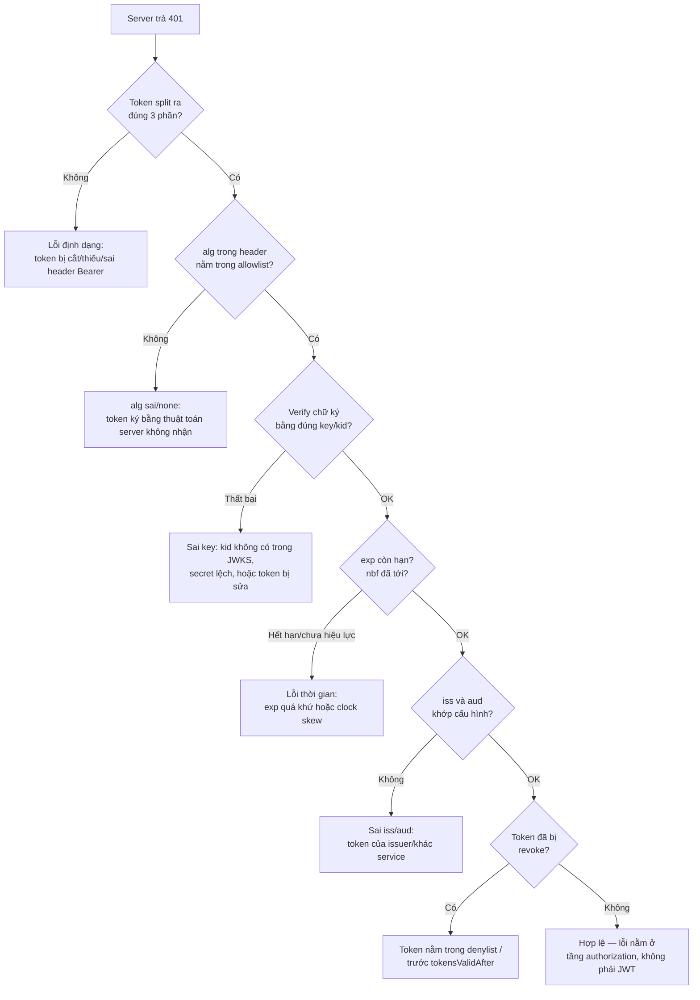

# Debugging JWT

## Mục lục

- [Tổng quan](#tổng-quan)
- [1. Đọc một JWT bằng tay (không cần thư viện)](#1-đọc-một-jwt-bằng-tay-không-cần-thư-viện)
  - [1.1 Cấu trúc 3 phần](#11-cấu-trúc-3-phần)
  - [1.2 Decode bằng CLI](#12-decode-bằng-cli)
- [2. Decode ≠ Verify — sai lầm số một khi debug](#2-decode--verify--sai-lầm-số-một-khi-debug)
- [3. Cây quyết định: vì sao token bị 401?](#3-cây-quyết-định-vì-sao-token-bị-401)
- [4. Bảng tra lỗi theo triệu chứng](#4-bảng-tra-lỗi-theo-triệu-chứng)
- [5. Quy trình debug 6 bước](#5-quy-trình-debug-6-bước)
- [6. Công cụ debug](#6-công-cụ-debug)
- [7. An toàn khi debug — đừng làm lộ token](#7-an-toàn-khi-debug--đừng-làm-lộ-token)
- [8. Checklist debug nhanh](#8-checklist-debug-nhanh)
- [Tài liệu tham khảo](#tài-liệu-tham-khảo)

---

## Tổng quan

Debug JWT khác debug logic thường ở một điểm: **token nhìn "đúng" vẫn có thể bị từ chối**. Một chuỗi decode ra header/payload đẹp đẽ trên jwt.io vẫn trả `401` ở server, vì server kiểm tra nhiều hơn chữ ký rất nhiều — `exp`, `iss`, `aud`, thuật toán, khóa, thậm chí token đã bị thu hồi.

Doc này tập trung vào **kỹ năng thực hành**: đọc token bằng tay, đối chiếu lỗi với triệu chứng, và một quy trình lặp lại được để không "đoán mò".

```
        Bạn thấy:                       Sự thật ở server:
   ┌────────────────────┐         ┌──────────────────────────────┐
   │ jwt.io: "verified" │  ──X──▶ │ 401: aud không khớp service   │
   │ payload đủ claim   │         │ (jwt.io KHÔNG kiểm aud/iss)   │
   └────────────────────┘         └──────────────────────────────┘
```

> [!IMPORTANT]
> "Decode thành công" và "hợp lệ" là hai chuyện hoàn toàn khác nhau. Khi debug, luôn tách bạch ba câu hỏi: (1) chuỗi có **đúng định dạng** không? (2) chữ ký có **verify** được bằng đúng khóa không? (3) các **claim** (`exp`, `iss`, `aud`, `nbf`) có thỏa không? Lỗi nằm ở tầng nào quyết định cách sửa.

---

## 1. Đọc một JWT bằng tay (không cần thư viện)

### 1.1 Cấu trúc 3 phần

Một JWT là 3 đoạn Base64URL nối bằng dấu chấm: `header.payload.signature`.

```text
eyJhbGciOiJSUzI1NiIsImtpZCI6ImtleS0yMDI0In0   ← header  (Base64URL JSON)
.
eyJzdWIiOiJ1MTIzIiwiYXVkIjoiYXBpIiwiZXhwIjoxNzUwMH0   ← payload (Base64URL JSON)
.
NHVhs... (chữ ký nhị phân, Base64URL)            ← signature
```

Hai phần đầu **chỉ là encoding, không mã hóa** — ai cũng đọc được. Phần ba là chữ ký, không "đọc" được mà chỉ để **verify**.

<Callout type="warn">
Vì header và payload chỉ là Base64URL, **bất kỳ ai chặn được token cũng đọc được toàn bộ claim**. Đừng bao giờ đặt mật khẩu, secret hay PII nhạy cảm trong payload. Xem [Encoding vs Encryption](/fundamentals/encoding-vs-encryption/).
</Callout>

### 1.2 Decode bằng CLI

Khi không có internet (hoặc không muốn paste token lên web), decode ngay trên máy:

```bash
# Tách lấy phần payload (đoạn giữa) rồi decode Base64URL
echo "$TOKEN" | cut -d. -f2 | tr '_-' '/+' | base64 -d 2>/dev/null | jq .

# Đọc header (đoạn đầu) để xem alg + kid
echo "$TOKEN" | cut -d. -f1 | tr '_-' '/+' | base64 -d 2>/dev/null | jq .
```

```text
# Header decode ra:
{ "alg": "RS256", "kid": "key-2024", "typ": "JWT" }

# Payload decode ra:
{ "sub": "u123", "aud": "api.orders", "iss": "https://auth.example.com",
  "iat": 1750000000, "exp": 1750000900, "jti": "a1b2c3" }
```

> [!TIP]
> `tr '_-' '/+'` chuyển bảng chữ cái Base64**URL** (`-` `_`) về Base64 chuẩn (`+` `/`) để `base64 -d` hiểu được. Nếu báo lỗi "invalid input", thường do thiếu padding `=` — thêm `echo "$PART==="` hoặc dùng `jq -R` / công cụ chuyên dụng.

Đổi `exp`/`iat` (Unix epoch giây) sang giờ người đọc:

```bash
date -d @1750000900    # Linux
date -r 1750000900     # macOS
```

---

## 2. Decode ≠ Verify — sai lầm số một khi debug

Đây là cái bẫy phổ biến nhất, đáng tách riêng một mục.

```
┌──────────────────────────────────────────────────────────────┐
│  decode(token)                                                 │
│    → chỉ Base64URL-decode, KHÔNG kiểm chữ ký, KHÔNG kiểm exp   │
│    → dùng để: ĐỌC/DEBUG, log chẩn đoán                         │
│    → KHÔNG BAO GIỜ dùng để phân quyền                          │
│                                                                │
│  verify(token, key, { algorithms, issuer, audience })          │
│    → kiểm chữ ký + alg + exp + nbf + iss + aud                 │
│    → dùng để: QUYẾT ĐỊNH cho phép hay từ chối                  │
└──────────────────────────────────────────────────────────────┘
```

```javascript
import { decodeJwt, jwtVerify } from 'jose';

// ✅ ĐÚNG cho debug: chỉ để NHÌN, không tin tưởng
const claims = decodeJwt(token);
console.log('debug claims:', claims.sub, claims.aud);

// ❌ SAI nếu dùng decode để cho qua:
// if (decodeJwt(token).role === 'admin') grantAccess();  // ai cũng giả được!

// ✅ ĐÚNG để quyết định:
const { payload } = await jwtVerify(token, key, {
  algorithms: ['RS256'],
  issuer: 'https://auth.example.com',
  audience: 'api.orders',
});
```

> [!WARNING]
> Dùng `jwt.decode` / `jwtDecode` để đưa ra quyết định phân quyền là một lỗ hổng bảo mật nghiêm trọng: payload chưa được kiểm chữ ký nên kẻ tấn công có thể sửa `role`, `sub` tùy ý. `decode` chỉ được dùng để **đọc khi debug**. Chi tiết ở [Common Vulnerabilities](/security/common-vulnerabilities/).

---

## 3. Cây quyết định: vì sao token bị 401?

Khi server trả `401`, đi theo cây sau để khoanh vùng tầng lỗi thay vì sửa mò:



> [!NOTE]
> Pipeline verify đầy đủ từng cổng được mổ xẻ ở [Luồng xác thực JWT — Deep Dive](/internals/token-validation-flow/). Cây trên là phiên bản rút gọn để **debug nhanh**.

---

## 4. Bảng tra lỗi theo triệu chứng

| Triệu chứng / message | Nguyên nhân thường gặp | Cách kiểm & sửa |
|------------------------|------------------------|------------------|
| `JsonWebTokenError: jwt malformed` | Token bị cắt, thiếu phần, hoặc còn dính chữ `Bearer ` | Kiểm header `Authorization`, đảm bảo strip đúng `Bearer ` |
| `invalid signature` | Sai khóa verify, `kid` không khớp, token bị sửa | So `kid` header với JWKS; kiểm secret/public key đúng issuer |
| `jwt expired` | `exp` đã qua, hoặc đồng hồ lệch (clock skew) | Decode `exp`, so `date`; thêm `clockTolerance: '30s'` |
| `jwt not active` (`nbf`) | `nbf` trong tương lai do clock skew giữa issuer↔verifier | Đồng bộ NTP; thêm leeway nhỏ |
| `audience invalid` | Token cấp cho service khác | So `aud` trong payload với `audience` cấu hình verify |
| `issuer invalid` | Token từ issuer khác (vd staging↔prod) | So `iss` với env hiện tại |
| `secretOrPublicKey must be...` | Quên truyền key, hoặc key sai định dạng (PEM thiếu header) | Kiểm key load đúng; RS256 cần PUBLIC key, không phải private |
| `alg ... not allowed` | Token dùng `HS256` nhưng server allowlist `RS256` (hoặc ngược lại) | Đồng bộ thuật toán issuer ↔ verifier |
| Verify OK nhưng vẫn 403 | Lỗi **authorization**, không phải JWT | Token hợp lệ — kiểm `scope`/`role`, không phải tầng JWT |
| jwt.io "Signature Verified" nhưng server 401 | jwt.io không kiểm `exp`/`aud`/`iss`/revoke | Đừng tin "verified" của jwt.io cho mọi cổng |

<Callout type="error" title="Bẫy clock skew">
`jwt expired` / `jwt not active` ngay sau khi cấp token gần như luôn là **lệch đồng hồ** giữa máy issuer và máy verifier. Sửa bằng đồng bộ NTP và cho phép `clockTolerance` 30–60 giây, đừng nới `exp` dài ra để "cho chạy".
</Callout>

---

## 5. Quy trình debug 6 bước

Khi gặp một token "không hiểu sao bị từ chối", làm tuần tự — đừng nhảy cóc:

<Steps>
<Step>
### Lấy đúng token đang gửi

Bắt request thật bằng DevTools (tab Network → Headers → `Authorization`) hoặc proxy. **Token bạn nghĩ đang gửi** thường khác token thực tế (cache cũ, gửi nhầm refresh token, thiếu `Bearer `).
</Step>
<Step>
### Decode header + payload

Decode bằng CLI ở [mục 1.2](#12-decode-bằng-cli). Ghi lại `alg`, `kid`, `iss`, `aud`, `exp`, `iat`. Đối chiếu `exp`/`iat` với giờ hiện tại.
</Step>
<Step>
### So alg và kid với cấu hình server

`alg` trong header có nằm trong allowlist của verifier? `kid` có tồn tại trong JWKS / keystore? Sai một trong hai → dừng ở đây, đó là lỗi.
</Step>
<Step>
### Verify chữ ký riêng biệt

Chạy `jwtVerify` (hoặc `jwt.verify`) **chỉ với khóa**, tạm bỏ kiểm claim, để tách lỗi "sai khóa" khỏi lỗi "sai claim".
</Step>
<Step>
### Bật kiểm claim từng cái

Thêm dần `issuer`, `audience`, `clockTolerance`. Cái nào bật vào thì fail → đó là claim sai.
</Step>
<Step>
### Loại trừ revocation & authorization

Token verify OK mà vẫn bị chặn → kiểm denylist/`tokensValidAfter`, rồi tới `scope`/`role`. Lúc này không còn là lỗi JWT nữa.
</Step>
</Steps>

---

## 6. Công cụ debug

| Công cụ | Dùng để | Lưu ý |
|---------|---------|-------|
| **jwt.io** | Decode nhanh, xem header/payload, verify chữ ký thử | Chỉ verify **chữ ký**; KHÔNG dán token production thật lên web |
| **CLI** (`cut`+`base64`+`jq`) | Decode offline, an toàn, scriptable | Nhớ chuyển Base64URL→Base64 (`tr '_-' '/+'`) |
| **`jose` / `jsonwebtoken`** trong REPL | Verify đầy đủ với key + claim | Tái hiện đúng cấu hình verify của server |
| **DevTools Network** | Xem token THỰC server nhận | Token thật quan trọng hơn token bạn nghĩ |
| **proxy (mitmproxy/Charles)** | Bắt request mobile / service-to-service | Cẩn thận lộ token trong log proxy |

```bash
# REPL verify nhanh bằng Node + jose (tái hiện cấu hình server)
node -e '
import("jose").then(async ({ jwtVerify, createLocalJWKSet }) => {
  const jwks = createLocalJWKSet(JSON.parse(process.env.JWKS));
  const { payload } = await jwtVerify(process.env.TOKEN, jwks, {
    algorithms: ["RS256"],
    issuer: "https://auth.example.com",
    audience: "api.orders",
  });
  console.log("OK", payload);
}).catch(e => console.error("FAIL", e.code, e.message));
'
```

---

## 7. An toàn khi debug — đừng làm lộ token

Debug là lúc dễ vô tình rò token nhất: paste vào chat, log ra console, gửi qua ticket.

```
□ KHÔNG paste token PRODUCTION thật lên jwt.io / web bên thứ ba.
   → token còn hạn = ai thấy cũng đăng nhập được. Dùng token test hoặc decode offline.
□ KHÔNG log nguyên token (access/refresh) ra console/file/APM.
   → nếu cần log để debug, chỉ log jti + sub + exp, KHÔNG log chuỗi token.
□ KHÔNG dán token vào ticket/Slack/PR.
   → coi token như mật khẩu tạm thời.
□ Sau khi debug xong với token thật → cân nhắc revoke nó.
□ Che bớt khi screenshot: chừa header để biết alg/kid, che signature.
```

> [!WARNING]
> Một token access còn hạn về cơ bản là **một mật khẩu dùng được ngay**. Mọi nơi bạn paste/log token khi debug (jwt.io, console, Slack, log APM) đều là một chỗ rò rỉ. Ưu tiên decode **offline** bằng CLI và chỉ log các định danh (`jti`, `sub`), không log chuỗi token. Xem thêm [Observability và Audit](/operations/observability-and-audit/).

---

## 8. Checklist debug nhanh

```
KHI MỘT TOKEN BỊ TỪ CHỐI, SOÁT THEO THỨ TỰ:
□ Token gửi đi có đúng là token bạn nghĩ? (bắt Network thật)
□ Header Authorization có đúng dạng "Bearer <token>"? (không thừa/thiếu)
□ Split ra đúng 3 phần ngăn bằng "."?
□ alg trong header ∈ allowlist của verifier?
□ kid trong header tồn tại trong JWKS/keystore?
□ Chữ ký verify được bằng đúng khóa? (test riêng, bỏ claim)
□ exp còn hạn? (decode + so date) — nghi clock skew thì thêm leeway
□ iss khớp env (prod/staging)? aud khớp service này?
□ Token có bị revoke / trước tokensValidAfter không?
□ Vẫn fail dù mọi cổng OK → lỗi authorization (scope/role), KHÔNG phải JWT
```

<Callout type="success" title="Nguyên tắc gốc">
90% bug JWT khi dev rơi vào bốn nhóm: <b>sai khóa/kid</b>, <b>clock skew (exp/nbf)</b>, <b>sai aud/iss giữa môi trường</b>, và <b>nhầm decode với verify</b>. Khoanh đúng nhóm trước khi sửa — đừng nới lỏng cấu hình bảo mật chỉ để "cho chạy".
</Callout>

---

## Tài liệu tham khảo

- [Luồng xác thực JWT — Deep Dive](/internals/token-validation-flow/) — 7 cổng verify chi tiết
- [Token Validation — Deep Dive](/internals/token-validation-deep-dive/)
- [Common Vulnerabilities](/security/common-vulnerabilities/) — vì sao decode≠verify nguy hiểm
- [Cấu trúc JWT](/fundamentals/jwt-structure/) — header/payload/signature
- [Observability và Audit](/operations/observability-and-audit/) — log token an toàn
- [Testing Auth Flow](/operations/testing-auth-flow/) — viết test cho các lỗi trên
- [RFC 7519 — JSON Web Token](https://www.rfc-editor.org/rfc/rfc7519)
