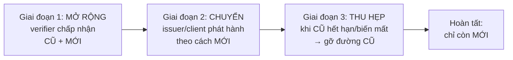
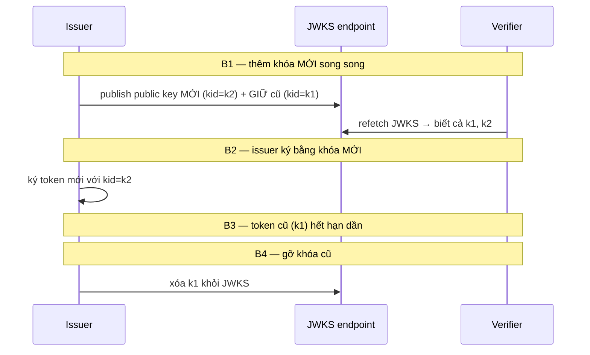

# Migration Strategy

## Mục lục

- [Tổng quan](#tổng-quan)
- [1. Nguyên tắc vàng: cửa sổ chuyển tiếp](#1-nguyên-tắc-vàng-cửa-sổ-chuyển-tiếp)
- [2. Migrate từ session sang JWT](#2-migrate-từ-session-sang-jwt)
  - [2.1 Dual-auth middleware (code)](#21-dual-auth-middleware-code)
  - [2.2 Data migration & tokenVersion](#22-data-migration--tokenversion)
- [3. Đổi thuật toán: HS256 → RS256](#3-đổi-thuật-toán-hs256--rs256)
- [4. Xoay khóa (key rotation) không downtime](#4-xoay-khóa-key-rotation-không-downtime)
- [5. Chuyển nơi lưu token (localStorage → cookie)](#5-chuyển-nơi-lưu-token-localstorage--cookie)
- [6. Rút TTL & đổi cấu trúc claim](#6-rút-ttl--đổi-cấu-trúc-claim)
- [7. Feature flag & metric theo dõi](#7-feature-flag--metric-theo-dõi)
- [8. Runbook & rollback từng bước](#8-runbook--rollback-từng-bước)
- [9. Một ca migrate thực tế](#9-một-ca-migrate-thực-tế)
- [10. Checklist migration](#10-checklist-migration)
- [Tài liệu tham khảo](#tài-liệu-tham-khảo)

---

## Tổng quan

Áp chuẩn JWT vào dự án mới thì dễ. Khó là **vá một hệ đang chạy** — có người dùng thật, không được downtime, không được "đá toàn bộ user ra ngoài" (401 hàng loạt) khi đổi. Doc này gom các kịch bản migration thường gặp, một nguyên tắc chung áp cho tất cả, và phần thực thi cụ thể (code, dòng thời gian, metric, rollback).

```diagram
   SAI: đổi hết một lúc                  ĐÚNG: cửa sổ chuyển tiếp
   ┌─────────────┐                       ┌──────────────────────────────┐
   │ deploy mới  │                       │ chấp nhận CŨ + MỚI            │
   │ → cũ chết   │ → 401 hàng loạt       │ → user chuyển dần             │
   │ ngay lập tức│   mất phiên           │ → khi mới phổ biến: gỡ CŨ     │
   └─────────────┘                       └──────────────────────────────┘
```

> [!IMPORTANT]
> Mọi migration JWT đụng token đang sống đều theo **một** nguyên tắc: *chấp nhận cả CŨ lẫn MỚI trong một cửa sổ chuyển tiếp, rồi gỡ CŨ khi MỚI đã phổ biến*. Áp cho khóa (overlap `kid`), thuật toán (allowlist tạm chứa cả hai), nơi lưu (hỗ trợ cả hai), TTL (siết dần), claim (thêm rồi mới bắt buộc). Đột ngột "đổi hết" = mất phiên hàng loạt.

---

## 1. Nguyên tắc vàng: cửa sổ chuyển tiếp

Ba giai đoạn lặp lại cho mọi loại migration:



| Giai đoạn | Verifier | Issuer/Client | Theo dõi |
|-----------|----------|----------------|----------|
| 1. Mở rộng | Nhận cũ **và** mới | Vẫn phát hành cũ | Triển khai verifier mới khắp nơi trước |
| 2. Chuyển | Nhận cũ và mới | Chuyển sang phát hành **mới** | `verify_failures` không tăng |
| 3. Thu hẹp | Gỡ nhận **cũ** | Chỉ mới | Chờ token cũ hết hạn (qua TTL) rồi mới gỡ |

<Callout type="warn">
Thứ tự bắt buộc: <b>verifier mở rộng TRƯỚC, issuer chuyển SAU</b>. Nếu issuer phát hành kiểu mới trước khi mọi verifier biết cách chấp nhận, các verifier chưa cập nhật sẽ từ chối token mới → 401. Luôn dạy bên "đọc" hiểu định dạng mới trước khi bên "viết" dùng nó.
</Callout>

> [!NOTE]
> Độ dài tối thiểu của cửa sổ chuyển tiếp = **TTL của token cũ**. Token cũ đang sống chỉ biến mất sau khi hết hạn; gỡ đường cũ trước thời điểm đó = từ chối token cũ còn hợp lệ. Vd access TTL 15' thì chờ ≥15' sau khi issuer ngừng cấp kiểu cũ mới được gỡ; refresh TTL 30 ngày thì cửa sổ tính bằng tuần.

---

## 2. Migrate từ session sang JWT

Chuyển từ session cookie (stateful, server giữ phiên) sang JWT (stateless) là migration lớn nhất về kiến trúc.

```diagram
SO SÁNH NHANH:
   Session:  cookie → session_id → server tra store → biết user
   JWT:      token tự mang claim → verify chữ ký → biết user (không tra store)
```

| Khía cạnh | Session | JWT | Cần xử lý khi migrate |
|-----------|---------|-----|------------------------|
| Trạng thái | Server giữ | Token tự chứa | Bỏ dần session store |
| Thu hồi | Xóa session = tức thì | Cần TTL ngắn/denylist | Thêm cơ chế revoke |
| Mở rộng (scale) | Cần sticky/shared store | Stateless dễ scale | Lợi ích chính của migration |

**Lộ trình đề xuất (chạy song song, không cắt phụt):**

<Steps>
<Step>
### Dual-auth: chấp nhận cả session lẫn JWT

Middleware verify: nếu có `Authorization: Bearer` → verify JWT; nếu không, fallback đọc session cookie cũ. Cả hai cùng hợp lệ trong cửa sổ chuyển tiếp (code ở [§2.1](#21-dual-auth-middleware-code)).
</Step>
<Step>
### Phát hành JWT cho phiên đăng nhập mới

Login mới cấp JWT (access ngắn + refresh). Người đang có session cũ vẫn dùng tiếp đến khi hết hạn tự nhiên hoặc đăng nhập lại.
</Step>
<Step>
### Theo dõi tỷ lệ chuyển đổi

Đo % request dùng JWT vs session. Khi session gần như biến mất (qua vài chu kỳ TTL session), chuẩn bị gỡ.
</Step>
<Step>
### Gỡ đường session

Tắt fallback session, xóa session store. Hoàn tất migration.
</Step>
</Steps>

### 2.1 Dual-auth middleware (code)

```javascript
// Trong cửa sổ chuyển tiếp: ưu tiên JWT, fallback session cũ
export async function authenticate(req, res, next) {
  const bearer = req.headers.authorization?.replace(/^Bearer\s+/i, '');

  if (bearer) {
    try {
      const { payload } = await jwtVerify(bearer, JWKS, {
        algorithms: ['RS256'], issuer: ISS, audience: AUD,
      });
      req.user = { id: payload.sub, scope: payload.scope, via: 'jwt' };
      authPathCounter.inc({ via: 'jwt' });    // metric: đếm theo đường auth
      return next();
    } catch (e) {
      // có Bearer nhưng sai → KHÔNG fallback sang session (tránh nhập nhằng)
      return res.status(401).json({ error: 'invalid_token' });
    }
  }

  // không có Bearer → thử session cũ (đường legacy trong cửa sổ chuyển tiếp)
  const sid = req.cookies?.session_id;
  if (sid) {
    const session = await sessionStore.get(sid);
    if (session) {
      req.user = { id: session.userId, scope: session.scope, via: 'session' };
      authPathCounter.inc({ via: 'session' });
      return next();
    }
  }
  return res.status(401).json({ error: 'unauthenticated' });
}
```

<Callout type="info">
Lưu ý quyết định thiết kế quan trọng: nếu có <code>Bearer</code> nhưng verify thất bại, <b>không</b> âm thầm fallback sang session — trả 401 luôn. Fallback ở đây dễ che giấu bug cấu hình JWT (token mới luôn "tự sửa" bằng session cũ, bạn không bao giờ biết JWT đang hỏng). Fallback chỉ áp dụng khi <i>hoàn toàn không có</i> Bearer.
</Callout>

### 2.2 Data migration & tokenVersion

Để hỗ trợ "đăng xuất mọi thiết bị" và thu hồi hàng loạt sau khi đã chuyển sang JWT, thêm cột `token_version` vào bảng user:

```diagram
users
┌──────────┬───────────────┬──────────────────┐
│ id       │ ...           │ token_version    │  ← thêm cột, default 0
└──────────┴───────────────┴──────────────────┘

• Cấp token:  payload.ver = user.token_version
• Verify:     reject nếu payload.ver < user.token_version (token cũ)
• Logout-all: UPDATE users SET token_version = token_version + 1 → mọi token cũ vô hiệu
```

> [!NOTE]
> Đừng cố "migrate" session đang sống thành JWT bằng cách phát hành token cho mọi session hiện có cùng lúc — vừa rủi ro vừa không cần thiết. Để session cũ **hết hạn tự nhiên** trong khi phiên mới dùng JWT. So sánh sâu hơn: [Session vs Token](/fundamentals/session-vs-token/); cơ chế thu hồi: [Revocation & Logout](/lifecycle/revocation-and-logout/).

---

## 3. Đổi thuật toán: HS256 → RS256

Lý do phổ biến: từ monolith (HS256, secret chung) chuyển sang nhiều service verify (RS256, verifier chỉ cần public key). Đây là **algorithm migration**, không phải chỉ đổi config.

```diagram
GIAI ĐOẠN 1 — verifier chấp nhận CẢ HAI:
   algorithms: ['RS256', 'HS256']   ← tạm thời nới allowlist
   (vẫn giữ secret HS256 để verify token cũ, đồng thời có public key RS256)

GIAI ĐOẠN 2 — issuer chuyển sang ký RS256:
   token mới ký bằng private key RS256, gắn kid mới
   token HS256 cũ vẫn còn hạn → verifier vẫn nhận nhờ allowlist hai thuật toán

GIAI ĐOẠN 3 — khi token HS256 cũ đã hết hạn hết:
   algorithms: ['RS256']            ← siết lại allowlist
   xóa secret HS256
```

<Callout type="error" title="Bẫy algorithm confusion khi nới allowlist">
Trong cửa sổ chấp nhận cả <code>RS256</code> lẫn <code>HS256</code>, hệ thống <b>tạm thời dễ bị algorithm confusion</b>: kẻ tấn công lấy public key RS256 (vốn công khai) dùng làm "secret" để ký token <code>HS256</code> giả. Giảm thiểu bằng cách rút ngắn tối đa cửa sổ này và, nếu thư viện hỗ trợ, ràng buộc <code>alg</code> theo <code>kid</code> (kid RS chỉ verify RS, kid HS chỉ verify HS). Chi tiết: <a href="/security/algorithm-confusion/">Algorithm Confusion</a>.
</Callout>

> [!TIP]
> Vì cửa sổ "chấp nhận hai thuật toán" có rủi ro confusion, hãy ưu tiên rút nó càng ngắn càng tốt — gắn với TTL access ngắn (15') thì cửa sổ chỉ cần vài chục phút thay vì nhiều ngày. So sánh thuật toán: [HMAC vs RSA vs ECDSA](/cryptography/hmac-vs-rsa-vs-ecdsa/).

---

## 4. Xoay khóa (key rotation) không downtime

Xoay khóa định kỳ hoặc khẩn cấp (nghi lộ) dùng **overlap window** qua `kid`:



```diagram
□ B1: Thêm khóa MỚI (kid mới) vào JWKS, GIỮ khóa cũ → verifier chấp nhận cả hai
□ B2: Issuer chuyển sang ký bằng khóa mới (kid mới)
□ B3: Chờ mọi token ký bằng khóa cũ hết hạn (qua TTL access)
□ B4: Gỡ khóa cũ khỏi JWKS
   (khẩn cấp/lộ khóa: rút ngắn B3, có thể buộc re-login)
```

> [!NOTE]
> Điều kiện để overlap window hoạt động: verifier phải **chọn khóa theo `kid`** trong header (không hardcode một khóa). Nếu verifier chưa hỗ trợ JWKS/`kid`, đó là việc cần làm **trước** khi xoay khóa. Chi tiết: [JWK và JWKS](/cryptography/jwk-and-jwks/), [Key Rotation](/cryptography/key-rotation/).

---

## 5. Chuyển nơi lưu token (localStorage → cookie)

Một sai lầm phổ biến cần sửa: refresh token đang ở `localStorage` (XSS đọc được) → chuyển sang cookie `HttpOnly`. Migration này đụng **client**, cần phối hợp frontend.

```diagram
GIAI ĐOẠN 1 — backend hỗ trợ CẢ HAI cách:
   • chấp nhận refresh từ body/header (cách cũ) VÀ từ cookie HttpOnly (cách mới)
   • endpoint /refresh đọc được token ở cả hai nơi

GIAI ĐOẠN 2 — client mới dùng cookie:
   • FE phát hành bản mới: lưu access ở memory, refresh ở cookie HttpOnly
   • client cũ (chưa cập nhật) vẫn chạy đường localStorage

GIAI ĐOẠN 3 — khi client mới phổ biến:
   • gỡ đường đọc refresh từ body/header
   • xóa token còn sót trong localStorage (FE chủ động clear khi nâng cấp)
```

<Callout type="warn">
Với app mobile/SPA cài sẵn, "client cũ" có thể tồn tại lâu (người dùng chưa cập nhật app). Theo dõi tỷ lệ phiên bản client và đặt mốc <b>min supported version</b> trước khi gỡ đường cũ, kẻo cắt mất nhóm user chưa nâng cấp. Lưu token đúng chuẩn: <a href="/security/secure-storage/">Secure Storage</a>.
</Callout>

---

## 6. Rút TTL & đổi cấu trúc claim

### Rút TTL access (vd 24h → 15')

```diagram
□ Siết DẦN qua vài đợt deploy: 24h → 4h → 1h → 15'
□ Sau mỗi đợt, theo dõi verify_failures{reason=expired} và lỗi 401 ở client
□ Đảm bảo silent refresh hoạt động TRƯỚC khi siết (nếu không → user bị đăng xuất liên tục)
```

### Đổi/thêm claim (vd thêm `aud`, đổi tên `scope`)

```diagram
□ Verifier: chấp nhận token CÓ và CHƯA CÓ claim mới trong cửa sổ chuyển tiếp
   (vd: nếu có aud thì kiểm, chưa có thì tạm bỏ qua — rồi siết thành bắt buộc sau)
□ Issuer: bắt đầu thêm claim mới vào token
□ Khi token cũ (thiếu claim) hết hạn hết → verifier siết thành BẮT BUỘC claim mới
```

> [!WARNING]
> Đừng biến một claim thành **bắt buộc** ngay khi vừa thêm vào issuer — token đang sống chưa có claim đó sẽ bị từ chối hàng loạt. Luôn: *issuer thêm claim → chờ token cũ hết hạn → verifier mới bắt buộc*. Đây vẫn là nguyên tắc cửa sổ chuyển tiếp áp cho claim.

---

## 7. Feature flag & metric theo dõi

Migration an toàn cần **điều khiển được** (bật/tắt từng giai đoạn không cần deploy) và **quan sát được** (metric quyết định nhịp).

```javascript
// Feature flag điều khiển giai đoạn — đổi nhịp không cần redeploy
const ACCEPT_LEGACY_HS256 = flags.get('jwt.accept_hs256');   // gỡ đường cũ = tắt flag
const REQUIRE_AUD         = flags.get('jwt.require_aud');     // siết claim = bật flag

const algorithms = ACCEPT_LEGACY_HS256 ? ['RS256', 'HS256'] : ['RS256'];
const requiredClaims = REQUIRE_AUD ? ['exp', 'sub', 'aud'] : ['exp', 'sub'];
```

| Metric theo dõi | Ý nghĩa khi migrate | Ngưỡng hành động |
|------------------|---------------------|-------------------|
| `auth_path_total{via}` | Tỷ lệ jwt vs session/legacy | `via=session` ~0 → có thể gỡ đường cũ |
| `jwt_verify_failures_total{reason}` | Đường mới có lỗi không | Tăng đột biến → dừng + điều tra |
| `jwt_verify_failures_total{reason="expired"}` | Token cũ còn nhiều không | Cao → cửa sổ chưa đủ dài, đừng gỡ |
| Tỷ lệ phiên bản client | Client cũ còn nhiều không | Còn nhiều → chưa gỡ đường lưu cũ |

> [!TIP]
> Dùng `auth_path_total{via}` (đếm request theo đường xác thực — xem `authPathCounter` ở [§2.1](#21-dual-auth-middleware-code)) làm tín hiệu chính: khi `via=session`/`via=legacy` về gần 0 và giữ ổn định qua vài chu kỳ TTL, đó là lúc an toàn để gỡ đường cũ. Đo lường, đừng đoán. Chi tiết metric: [Observability và Audit](/operations/observability-and-audit/).

---

## 8. Runbook & rollback từng bước

Mọi migration cần một runbook và đường lui:

```diagram
TRƯỚC KHI BẮT ĐẦU:
□ Xác định "token cũ" sống tối đa bao lâu (= TTL) → biết cửa sổ chờ tối thiểu
□ Dashboard: verify_failures{reason}, auth_path_total{via}, lỗi 401 client
□ Feature flag bật/tắt từng giai đoạn → rollback nhanh không deploy lại

TRONG KHI CHẠY:
□ Tiến từng giai đoạn, dừng giữa các bước để quan sát metric ≥ 1 chu kỳ TTL
□ Mỗi đợt siết: theo dõi verify_failures — tăng đột biến = dừng + điều tra

ROLLBACK:
□ Giai đoạn "mở rộng" (chấp nhận cả hai) là AN TOÀN — luôn lui về đây được
□ Chỉ "thu hẹp" (gỡ đường cũ) khi metric chứng minh đường cũ gần như không còn dùng
□ Nếu siết gây 401 tăng → nới allowlist/claim lại ngay (flag), không chờ deploy
```

```diagram
┌──────────────────────────────────────────────────────────────────────┐
│  RỦI RO HAI ĐẦU:                                                       │
│    • siết QUÁ NHANH → user bị 401 hàng loạt, mất phiên                  │
│    • siết QUÁ CHẬM  → lỗ hổng/đường cũ tồn tại lâu (vd cửa sổ confusion)│
│  → để metric verify_failures quyết định nhịp, không "cảm tính"          │
└──────────────────────────────────────────────────────────────────────┘
```

<Callout type="info">
Ngoại lệ duy nhất cho "đi từ từ": <b>đang bị tấn công chủ động</b> (khóa lộ, token bị trộm hàng loạt). Khi đó xoay khóa khẩn + <code>tokensValidAfter=now</code> + buộc re-login là chấp nhận được dù gây gián đoạn — đánh đổi UX lấy an toàn. Xem <a href="/case-studies/incident-response-leaked-token/">Incident Response</a>.
</Callout>

---

## 9. Một ca migrate thực tế

Tình huống: monolith dùng **HS256 + secret chung**, tách thành 3 microservice; cần chuyển sang **RS256** để service chỉ cần public key. Access TTL = 15'.

```diagram
DÒNG THỜI GIAN (access TTL 15' → cửa sổ tính bằng giờ):

T+0h   B1: deploy verifier ở CẢ 3 service với allowlist ['RS256','HS256']
            (vẫn giữ secret HS256; thêm public key RS256 vào JWKS)
            → metric: verify_failures phẳng, auth_path via=hs256 ~100%
T+2h   B2: bật flag issuer ký RS256 (kid=rs-2026-06) cho 10% traffic (canary)
            → theo dõi verify_failures{reason=bad_signature} KHÔNG tăng
T+4h   B2: tăng dần 10% → 50% → 100% issuer ký RS256
            → auth_path: via=rs256 tăng, via=hs256 giảm
T+4h30 mọi token HS256 cũ (cấp trước T+4h) hết hạn (qua TTL 15' + lề)
            → verify_failures{reason=expired} cho token HS256 về ~0
T+5h   B3: tắt flag accept_hs256 → allowlist còn ['RS256']; xóa secret HS256
            → cửa sổ algorithm-confusion đóng lại
```

<Steps>
<Step>
### Chuẩn bị & mở rộng (T+0h)

Deploy verifier mới ở cả 3 service trước, chấp nhận cả hai thuật toán. **Chưa** đổi issuer. Xác nhận `verify_failures` không tăng — chứng tỏ verifier mới tương thích ngược.
</Step>
<Step>
### Canary issuer (T+2h)

Bật flag ký RS256 cho 10% traffic. Đây là bước rủi ro nhất — theo dõi `bad_signature` sát sao. Nếu tăng → tắt flag (rollback tức thì, không deploy).
</Step>
<Step>
### Tăng dần lên 100% (T+4h)

Mở rộng canary. `auth_path_total{via}` cho thấy `rs256` tăng, `hs256` giảm. Không vội — để mỗi nấc ổn định.
</Step>
<Step>
### Chờ token cũ hết hạn & thu hẹp (T+4h30 → T+5h)

Chờ ≥ TTL access sau khi 100% issuer dùng RS256, để token HS256 cuối cùng hết hạn. Khi `expired{hs256}` về ~0, tắt `accept_hs256`, xóa secret. Cửa sổ confusion đóng.
</Step>
</Steps>

> [!IMPORTANT]
> Bài học rút ra: (1) verifier mở rộng **trước**, issuer đổi **sau**; (2) issuer đổi bằng **canary + flag** để rollback tức thì; (3) **chờ đủ TTL** trước khi thu hẹp; (4) cửa sổ chấp nhận hai thuật toán càng ngắn càng tốt (gắn TTL ngắn) vì có rủi ro confusion. Toàn bộ chỉ mất vài giờ nhờ TTL 15' — với refresh TTL dài, cùng quy trình nhưng tính bằng tuần.

---

## 10. Checklist migration

```diagram
CHUNG (mọi loại migration):
□ Verifier MỞ RỘNG (chấp nhận cũ+mới) trước, Issuer chuyển sau
□ Có cửa sổ chuyển tiếp đủ dài (≥ TTL token cũ) trước khi gỡ đường cũ
□ Dashboard verify_failures + auth_path_total{via}; feature flag từng giai đoạn
□ Rollback = lui về trạng thái "chấp nhận cả hai" (qua flag, không cần deploy)

SESSION → JWT:
□ Dual-auth (nhận cả session lẫn JWT); có Bearer sai thì KHÔNG fallback session
□ Để session cũ hết hạn tự nhiên, không ép convert
□ Thêm cơ chế revoke (TTL ngắn/denylist/token_version) vì JWT stateless

HS256 → RS256:
□ allowlist tạm ['RS256','HS256'] → siết về ['RS256'] khi token cũ hết hạn
□ Rút ngắn cửa sổ (rủi ro algorithm confusion); ràng alg theo kid nếu được
□ Canary issuer + flag để rollback tức thì

XOAY KHÓA:
□ Verifier chọn khóa theo kid (JWKS) TRƯỚC khi xoay
□ Overlap: thêm kid mới → ký bằng mới → chờ cũ hết hạn → gỡ kid cũ

NƠI LƯU (localStorage → cookie HttpOnly):
□ Backend nhận refresh ở cả hai nơi trong cửa sổ chuyển tiếp
□ Theo dõi phiên bản client; đặt min supported version trước khi gỡ đường cũ

TTL / CLAIM:
□ Siết TTL dần qua nhiều đợt; đảm bảo silent refresh chạy trước
□ Claim mới: issuer thêm → chờ token cũ hết hạn → verifier mới bắt buộc
```

<Callout type="success" title="Một câu để nhớ">
Migration JWT an toàn = <b>"chấp nhận cũ + mới → chuyển → gỡ cũ"</b>, để <b>token cũ hết hạn tự nhiên</b> thay vì ép đổi, điều khiển bằng <b>feature flag</b> và để <b>metric verify_failures</b> quyết định nhịp siết. Đột ngột "đổi hết một lúc" là cách nhanh nhất để đá toàn bộ user ra ngoài.
</Callout>

---

## Tài liệu tham khảo

- [Session vs Token](/fundamentals/session-vs-token/) — khác biệt khi migrate
- [Algorithm Confusion](/security/algorithm-confusion/) — rủi ro khi nới allowlist
- [HMAC vs RSA vs ECDSA](/cryptography/hmac-vs-rsa-vs-ecdsa/) — chọn thuật toán đích
- [Key Rotation](/cryptography/key-rotation/) — overlap window
- [JWK và JWKS](/cryptography/jwk-and-jwks/) — chọn khóa theo kid
- [Secure Storage](/security/secure-storage/) — chuyển nơi lưu token
- [Revocation & Logout](/lifecycle/revocation-and-logout/) — token_version, logout-all
- [Observability và Audit](/operations/observability-and-audit/) — metric theo dõi migration
- [Security Best Practices §12](/security/security-best-practices/) — nâng cấp hệ đang chạy
- [Production Checklist](/operations/production-checklist/) — rà trước khi launch bản đã migrate
- [Incident Response — Leaked Token](/case-studies/incident-response-leaked-token/)
