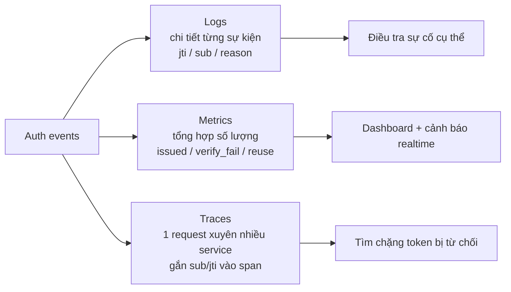
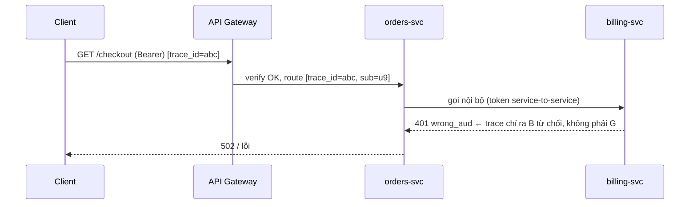

# Observability và Audit

## Mục lục

- [Tổng quan](#tổng-quan)
- [1. Quy tắc vàng: log gì, KHÔNG log gì](#1-quy-tắc-vàng-log-gì-không-log-gì)
- [2. Redaction tự động ở tầng logger](#2-redaction-tự-động-ở-tầng-logger)
- [3. Ba trụ cột cho hệ auth](#3-ba-trụ-cột-cho-hệ-auth)
- [4. Structured logging — schema sự kiện auth](#4-structured-logging--schema-sự-kiện-auth)
- [5. Metrics & Prometheus](#5-metrics--prometheus)
  - [5.1 Bộ metric tối thiểu](#51-bộ-metric-tối-thiểu)
  - [5.2 Instrument bằng code](#52-instrument-bằng-code)
- [6. Cảnh báo bảo mật (PromQL)](#6-cảnh-báo-bảo-mật-promql)
- [7. Tracing qua nhiều service](#7-tracing-qua-nhiều-service)
- [8. Audit log — chống chối bỏ](#8-audit-log--chống-chối-bỏ)
- [9. Một ca điều tra sự cố qua log](#9-một-ca-điều-tra-sự-cố-qua-log)
- [10. Lưu trữ, sampling & tuân thủ](#10-lưu-trữ-sampling--tuân-thủ)
- [11. Checklist observability & audit](#11-checklist-observability--audit)
- [Tài liệu tham khảo](#tài-liệu-tham-khảo)

---

## Tổng quan

Hệ JWT là **stateless** — server không giữ phiên, nên khi có sự cố ("ai đó dùng token bị trộm?", "vì sao đợt 401 tăng vọt?") bạn **chỉ có log/metric/trace để lần ra**. Observability không phải "nice to have"; nó là cách duy nhất để phát hiện token bị lạm dụng và điều tra sau sự cố.

Nhưng có một căng thẳng cốt lõi: **bạn cần log đủ để điều tra, nhưng token chính là bí mật — log token = tạo ra chỗ rò rỉ mới.**

```diagram
   CẦN nhìn thấy:                        KHÔNG được để lộ:
   • token bị từ chối vì sao (reason)    • chuỗi token (access/refresh)
   • token nào, của ai (jti/sub)         • chữ ký, secret, private key
   • khi nào, từ đâu (ts/ip/ua)          • PII trong payload (email, sđt, tên)
        │                                         │
        └────────► LOG ĐỊNH DANH, KHÔNG LOG BÍ MẬT ◄────┘
```

> [!IMPORTANT]
> Nguyên tắc nền tảng: **log định danh, không log bí mật**. Ghi `jti`, `sub`, `kid`, `iss`, `aud`, `exp`, và lý do thất bại — đủ để truy vết. KHÔNG bao giờ ghi chuỗi token, chữ ký, secret, hay PII. Một token còn hạn lọt vào log tập trung (mà cả công ty đọc được) là một sự cố bảo mật ngang với rò mật khẩu.

---

## 1. Quy tắc vàng: log gì, KHÔNG log gì

| Trường | Log? | Vì sao |
|--------|------|--------|
| `jti` (token id) | ✅ | Truy vết & nối với sự kiện revoke; an toàn |
| `sub` (user id) | ✅ | Biết token của ai; dùng id ổn định, không PII |
| `kid` | ✅ | Debug sai khóa / xoay khóa |
| `iss`, `aud` | ✅ | Phát hiện token sai môi trường/service |
| `iat`, `exp` | ✅ | Phân tích vòng đời, clock skew |
| Lý do verify thất bại (`reason`) | ✅ | `expired`/`bad_signature`/`wrong_aud`/`alg_not_allowed`... |
| IP, User-Agent | ✅* | Phát hiện bất thường (*coi là PII tùy vùng pháp lý) |
| **Chuỗi token đầy đủ** | ❌ | = mật khẩu dùng được ngay → rò rỉ nghiêm trọng |
| **Chữ ký** | ❌ | Vô dụng để debug, vẫn là một phần token |
| **Secret / private key** | ❌ | Lộ = giả mọi token |
| **PII trong payload** (email, sđt, tên) | ❌ | Vi phạm quyền riêng tư + phình log |

<Callout type="error" title="Hai sai lầm phổ biến nhất">
(1) <code>logger.info("verifying token: " + token)</code> — nối token sống vào message. (2) <code>logger.debug(req.headers)</code> — header chứa <code>Authorization: Bearer ...</code>. Cả hai đẩy token sống vào log tập trung. Giải pháp ở <a href="#2-redaction-tự-động-ở-tầng-logger">mục 2</a>: redact tự động, đừng trông chờ lập trình viên nhớ.
</Callout>

```javascript
// ❌ SAI — token sống vào log
logger.info(`verify failed for token ${token}`);
logger.debug('request headers', req.headers);   // chứa Bearer ...

// ✅ ĐÚNG — chỉ định danh + lý do
logger.warn('jwt_verify_failed', {
  reason: 'expired',          // không phải chuỗi token
  jti: claims?.jti,           // decode để LOG (không để authz)
  sub: claims?.sub,
  kid: header?.kid,
  ip: req.ip,
});
```

---

## 2. Redaction tự động ở tầng logger

Đừng dựa vào việc lập trình viên nhớ che token — cấu hình logger **tự động** xóa các field nhạy cảm. Ví dụ với `pino`:

```javascript
import pino from 'pino';

export const logger = pino({
  // redact tự động: thay giá trị bằng "[Redacted]" ở mọi nơi field xuất hiện
  redact: {
    paths: [
      'req.headers.authorization',
      'req.headers.cookie',
      'res.headers["set-cookie"]',
      'token', 'access_token', 'refresh_token',
      '*.token', '*.password', '*.secret',
    ],
    censor: '[Redacted]',
  },
});
```

```diagram
  Trước redact:  { req: { headers: { authorization: "Bearer eyJhbGci..." } } }
  Sau redact:    { req: { headers: { authorization: "[Redacted]" } } }
```

> [!WARNING]
> Redaction phải ở **tầng hạ tầng logger**, không phải mỗi lập trình viên tự nhớ che. Cấu hình một danh sách field nhạy cảm (`authorization`, `cookie`, `set-cookie`, `token`, `password`, `secret`) một lần, áp cho toàn hệ. Bổ sung một lint rule chặn `console.log(token)` / nối token vào chuỗi để bắt rò rỉ ngay trong PR.

---

## 3. Ba trụ cột cho hệ auth



| Trụ cột | Trả lời câu hỏi | Ví dụ với JWT |
|---------|------------------|----------------|
| **Logs** | "Chuyện gì xảy ra với token X?" | "jti=a1b2 của sub=u9 bị từ chối lúc 10:05 vì expired" |
| **Metrics** | "Hệ thống có bất thường không?" | "verify_failures tăng 10× trong 5 phút" |
| **Traces** | "Token bị chặn ở chặng nào?" | "Gateway cho qua nhưng service orders từ chối vì aud" |

---

## 4. Structured logging — schema sự kiện auth

Log dạng JSON có cấu trúc (không phải chuỗi tự do) để query được trong ELK/Loki/Datadog. Dùng **một schema nhất quán** cho mọi service:

```javascript
// Tập giá trị event CỐ ĐỊNH để dashboard đếm được theo loại
const AUTH_EVENTS = [
  'login_success', 'login_failed', 'token_issued',
  'verify_success', 'verify_failed', 'refresh', 'refresh_reuse_detected',
  'logout', 'logout_all', 'revoke', 'key_rotation',
];

function authLog(event, ctx) {
  logger.info({
    event,                       // ∈ AUTH_EVENTS
    jti:   ctx.jti,
    sub:   ctx.sub,
    kid:   ctx.kid,
    aud:   ctx.aud,
    reason: ctx.reason,          // chỉ khi *_failed
    ip:    ctx.ip,
    ua:    ctx.ua,
    trace_id: ctx.traceId,       // nối với trace
    ts:    new Date().toISOString(),
  }, event);
}
```

```text
{"event":"verify_failed","reason":"wrong_aud","jti":"a1b2","sub":"u9",
 "aud":"api.billing","ip":"203.0.113.7","trace_id":"abc123","ts":"2026-06-25T10:05:01Z"}
```

Truy vấn mẫu khi điều tra (LogQL / Lucene):

```logql
# Loki: mọi verify_failed vì sai audience trong 1h, gom theo aud
{app="api"} | json | event="verify_failed" | reason="wrong_aud"
```

> [!NOTE]
> Một schema log **nhất quán** quan trọng hơn log nhiều: cùng tên trường (`jti`, `sub`, `reason`, `trace_id`) ở mọi service giúp join/filter khi điều tra. Đặt `event` thành tập giá trị cố định (`AUTH_EVENTS`) để dashboard đếm và cảnh báo theo loại chính xác.

---

## 5. Metrics & Prometheus

### 5.1 Bộ metric tối thiểu

```diagram
# Counter
jwt_issued_total{kid, aud}              — số token cấp ra
jwt_issue_errors_total{reason}          — lỗi khi cấp (db down, key load fail...)
jwt_verify_total{result}                — tổng lần verify (result=ok|fail)
jwt_verify_failures_total{reason}       — fail theo lý do (expired/bad_sig/wrong_aud/alg)
jwt_refresh_total{result}               — số lần refresh
refresh_reuse_detected_total            — ⚠ phát hiện reuse (nghi token bị trộm)
jwks_refetch_total{kid}                 — verifier tải lại JWKS (kid lạ → có thể DoS)

# Histogram
jwt_verify_duration_seconds             — độ trễ verify (phát hiện JWKS chậm)
```

### 5.2 Instrument bằng code

```javascript
import { Counter, Histogram } from 'prom-client';

const verifyFailures = new Counter({
  name: 'jwt_verify_failures_total',
  help: 'JWT verify failures by reason',
  labelNames: ['reason'],
});
const reuseDetected = new Counter({
  name: 'refresh_reuse_detected_total',
  help: 'Refresh token reuse detections',
});

export async function verifyOrCount(token, opts) {
  try {
    return await jwtVerify(token, key, opts);
  } catch (e) {
    const reason = ({
      ERR_JWT_EXPIRED: 'expired',
      ERR_JOSE_ALG_NOT_ALLOWED: 'alg',
      ERR_JWS_SIGNATURE_VERIFICATION_FAILED: 'bad_signature',
      ERR_JWT_CLAIM_VALIDATION_FAILED: 'claim',
    })[e.code] ?? 'other';
    verifyFailures.inc({ reason });   // cắt lát theo reason
    throw e;
  }
}
```

> [!TIP]
> Hai nhãn quan trọng nhất: `jwt_verify_failures_total{reason}` (cắt theo `reason` để biết *kiểu* tấn công: `alg` lạ = thử confusion, `bad_signature` hàng loạt = giả token, `expired` cao = bug refresh) và `refresh_reuse_detected_total` (gần như luôn nghĩa là token bị trộm). Một dashboard chỉ với hai biểu đồ này đã bắt được phần lớn sự cố JWT.

---

## 6. Cảnh báo bảo mật (PromQL)

Metric không cảnh báo thì chỉ là biểu đồ đẹp. Bốn cảnh báo đáng tiền nhất:

| Cảnh báo | Nghĩa là gì | Mức |
|----------|-------------|-----|
| Reuse detection > 0 | Refresh token có thể đã bị trộm | critical |
| Verify failure spike | Đang bị tấn công hoặc deploy sai cấu hình | warning |
| Alg lạ xuất hiện | Có người thử `alg:none`/confusion | warning |
| JWKS refetch storm | DoS qua `kid` lạ ép tải JWKS liên tục | warning |

```yaml
groups:
- name: jwt
  rules:
  - alert: RefreshReuseDetected
    expr: increase(refresh_reuse_detected_total[5m]) > 0
    labels: { severity: critical }
    annotations:
      summary: "Phát hiện tái sử dụng refresh token — nghi token bị trộm"

  - alert: JwtVerifyFailureSpike
    # tăng >5× so với cùng kỳ 1h trước = bất thường
    expr: increase(jwt_verify_failures_total[5m])
          > 5 * increase(jwt_verify_failures_total[5m] offset 1h)
    labels: { severity: warning }
    annotations:
      summary: "verify_failures tăng bất thường — kiểm tấn công/cấu hình sai"

  - alert: JwtAlgNotAllowed
    expr: increase(jwt_verify_failures_total{reason="alg"}[10m]) > 0
    labels: { severity: warning }
    annotations:
      summary: "Có token với alg không cho phép — nghi algorithm confusion"
```

<Callout type="warn">
Phân biệt <b>baseline</b> và <b>bất thường</b>: một lượng <code>expired</code> đều đặn là bình thường (token hết hạn tự nhiên trước khi client refresh). Cảnh báo nên dựa trên <b>tăng đột biến so với baseline</b> (như <code>offset 1h</code> ở trên), không phải con số tuyệt đối — nếu không bạn sẽ bị alert fatigue và bỏ qua cảnh báo thật.
</Callout>

---

## 7. Tracing qua nhiều service

Trong microservices, một request đi qua Gateway → nhiều service. Khi token bị từ chối, trace giúp tìm **đúng chặng**:



```javascript
import { trace } from '@opentelemetry/api';

function verifyWithSpan(token, opts) {
  const span = trace.getActiveSpan();
  try {
    const { payload } = jwtVerifySync(token, key, opts);
    span?.setAttributes({ 'auth.sub': payload.sub, 'auth.jti': payload.jti }); // KHÔNG gắn token
    return payload;
  } catch (e) {
    span?.setAttributes({ 'auth.verify_failed': true, 'auth.reason': e.code });
    span?.recordException(e);
    throw e;
  }
}
```

> [!TIP]
> Trong microservices, lỗi auth phổ biến nhất là **token đúng cho service A nhưng sai `aud` cho service B nội bộ**. Trace có gắn `sub`/`jti`/`reason` vào span cho thấy ngay "B từ chối vì wrong_aud" thay vì phải đoán. Lưu ý: gắn `sub`/`jti` (định danh) vào span, **không** gắn token. Xem [Microservices Auth](/implementation/microservices-auth/).

---

## 8. Audit log — chống chối bỏ

Audit log khác application log: nó là **bằng chứng** cho các thao tác nhạy cảm, cần bất biến và lưu lâu hơn.

```diagram
SỰ KIỆN CẦN AUDIT (ai - làm gì - khi nào - bằng token nào):
□ login / login_failed         — phát hiện brute-force, truy vết truy cập
□ token_issued                 — token nào (jti) cấp cho ai (sub), quyền gì (scope)
□ privilege_change             — đổi role/scope
□ sensitive_action             — chuyển tiền, xóa dữ liệu, export...
□ revoke / logout_all          — thu hồi token, đổi mật khẩu
□ key_rotation                 — xoay khóa ký (kid cũ → mới)
```

| Thuộc tính | Application log | Audit log |
|-----------|------------------|-----------|
| Mục đích | Debug, vận hành | Chống chối bỏ, điều tra, tuân thủ |
| Bất biến | Không bắt buộc | **Có** (append-only, không sửa/xóa) |
| Thời gian lưu | Ngắn (ngày–tuần) | Dài (tháng–năm theo quy định) |
| Nội dung | `reason`, latency... | ai (`sub`), gì (`action`), khi (`ts`), token (`jti`) |
| Quyền ghi/xóa | Ứng dụng | Tách riêng — ứng dụng KHÔNG được xóa |

```diagram
   App service ──(append-only)──▶ Audit sink (WORM / log tập trung)
        │                                  │
        │ chỉ có quyền GHI THÊM             │ ứng dụng KHÔNG có quyền xóa/sửa
        ▼                                  ▼
   nếu service bị chiếm                điều tra viên đọc được toàn bộ lịch sử
   → vẫn không xóa được audit cũ
```

<Callout type="info">
Audit log nên trả lời được câu hỏi điều tra: <i>"Token <code>jti=a1b2</code> đã thực hiện những hành động nhạy cảm nào, được cấp cho ai, khi nào?"</i> — nhờ <code>jti</code> nối sự kiện cấp với sự kiện sử dụng. Đây là lý do <code>jti</code> nên có trong mọi token (xem <a href="/fundamentals/claims/">Claims</a>).
</Callout>

> [!WARNING]
> Audit log phải **append-only** và tách quyền ghi/xóa khỏi ứng dụng thường (vd ghi sang WORM storage / log tập trung mà service không có quyền xóa). Nếu kẻ tấn công chiếm service mà xóa được audit log của chính nó thì audit mất ý nghĩa chống chối bỏ.

---

## 9. Một ca điều tra sự cố qua log

Tình huống: cảnh báo `RefreshReuseDetected` bắn lúc 02:14.

<Steps>
<Step>
### Khoanh sự kiện gốc

Query audit: `event=refresh_reuse_detected` lúc 02:14 → lấy `jti` của refresh family và `sub=u9`.
</Step>
<Step>
### Dựng dòng thời gian của family

Lọc mọi log có `sub=u9` quanh thời điểm đó: thấy `login_success` từ IP Việt Nam lúc 01:50, rồi `refresh` từ IP nước ngoài lúc 02:14 — hai vùng địa lý không thể cùng người.
</Step>
<Step>
### Xác nhận thiệt hại

Audit `sensitive_action` của `sub=u9`: có một `export_data` lúc 02:13 từ IP lạ → token đã bị dùng trước khi reuse detection thu hồi.
</Step>
<Step>
### Phản ứng

`tokensValidAfter=now` cho `u9` (vô hiệu mọi token), buộc đổi mật khẩu, thông báo người dùng. Chuyển sang [Incident Response](/case-studies/incident-response-leaked-token/).
</Step>
</Steps>

> [!NOTE]
> Điều tra này chỉ khả thi vì log có `sub`/`jti`/`ip`/`ts` nhất quán và audit ghi `sensitive_action`. Nếu log token thô thay vì định danh, bạn vừa không điều tra tốt hơn, vừa tạo thêm chỗ rò rỉ.

---

## 10. Lưu trữ, sampling & tuân thủ

```diagram
□ Sampling hợp lý: log thành công có thể sample (vd 1%); log THẤT BẠI + AUDIT không sample
□ Thời gian lưu: application log ngắn (ngày-tuần); audit log theo quy định (vd 1 năm)
□ Quyền truy cập: log auth chứa sub/ip = dữ liệu nhạy cảm → giới hạn ai đọc được
□ PII: nếu vùng pháp lý coi IP/UA là PII (GDPR) → cân nhắc hash/ẩn danh khi lưu dài
□ Đồng bộ NTP mọi node → timestamp log/audit đáng tin để điều tra
```

| Khung tuân thủ | Liên quan tới observability JWT |
|----------------|----------------------------------|
| **GDPR** | IP/UA có thể là PII → hạn chế lưu, hỗ trợ xóa; không log PII trong payload |
| **SOC 2** | Audit log truy cập + thay đổi quyền; bất biến; kiểm soát ai đọc log |
| **PCI-DSS** | Không log dữ liệu nhạy cảm; theo dõi truy cập; lưu log đủ lâu |

<Callout type="warn">
Cân bằng giữa "lưu đủ để điều tra" và "không giữ PII quá mức": log thất bại và audit là phần đáng giữ lâu nhất; log thành công có thể sample mạnh. IP/UA hữu ích để phát hiện bất thường nhưng là PII ở nhiều nơi — đặt chính sách lưu/ẩn danh rõ ràng thay vì giữ mãi mọi thứ.
</Callout>

---

## 11. Checklist observability & audit

```diagram
LOG AN TOÀN:
□ KHÔNG log chuỗi token / chữ ký / secret / PII
□ Redact "authorization"/"cookie"/"set-cookie"/"token" TỰ ĐỘNG ở tầng logger
□ Chỉ log định danh: jti, sub, kid, iss, aud, exp, reason, ip, ua
□ Structured JSON log; event ∈ tập cố định; có trace_id
□ Lint chặn console.log(token) / nối token vào chuỗi

METRICS:
□ jwt_issued_total, jwt_verify_failures_total{reason}
□ refresh_reuse_detected_total  ← quan trọng nhất
□ jwks_refetch_total, jwt_verify_duration_seconds

CẢNH BÁO (PromQL):
□ reuse detection > 0 → critical (nghi trộm token)
□ verify_failures tăng đột biến so baseline (offset) → warning
□ reason=alg xuất hiện → nghi algorithm confusion
□ JWKS refetch storm theo kid lạ → nghi DoS

AUDIT:
□ Ghi login/issue/privilege_change/sensitive_action/revoke/key_rotation
□ Append-only, tách quyền xóa (WORM), lưu đủ lâu theo quy định
□ Nối được "token jti → các action đã làm"

TRACING & TUÂN THỦ:
□ trace_id xuyên service; gắn sub/jti (KHÔNG token) vào span + reason khi fail
□ NTP đồng bộ; giới hạn quyền đọc log auth
□ Chính sách lưu/ẩn danh IP-UA theo GDPR; audit theo SOC2/PCI nếu áp dụng
```

<Callout type="success" title="Hai tín hiệu vàng">
Nếu chỉ kịp dựng hai thứ: <b>refresh_reuse_detected_total</b> (token bị trộm) và <b>verify_failures{reason}</b> (tấn công đang diễn ra). Hai metric này, cộng audit log gắn <code>jti</code>, đủ để phát hiện và điều tra phần lớn sự cố JWT — miễn là bạn <i>không bao giờ</i> log chính token.
</Callout>

---

## Tài liệu tham khảo

- [Security Best Practices §8](/security/security-best-practices/) — vận hành: log, giám sát
- [JWT Threat Model](/security/jwt-threat-model/) — sự cố nào cần phát hiện
- [Revocation & Logout](/lifecycle/revocation-and-logout/) — reuse detection
- [Claims](/fundamentals/claims/) — vì sao cần `jti`
- [Microservices Auth](/implementation/microservices-auth/) — tracing đa service
- [Debugging JWT](/operations/debugging-jwt/) — debug an toàn, không lộ token
- [Incident Response — Leaked Token](/case-studies/incident-response-leaked-token/) — phản ứng sau khi log báo động
- [Production Checklist](/operations/production-checklist/)
