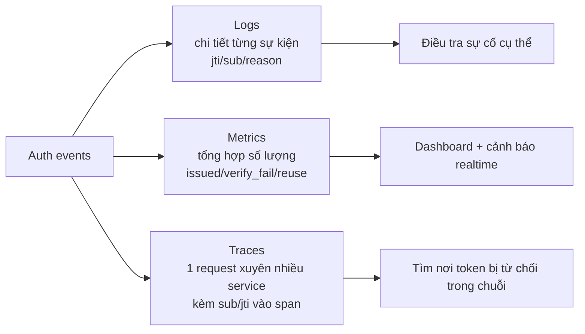
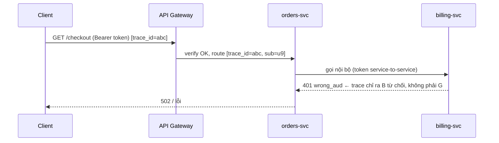

# Observability và Audit

## Mục lục

- [Tổng quan](#tổng-quan)
- [1. Quy tắc vàng: log gì, KHÔNG log gì](#1-quy-tắc-vàng-log-gì-không-log-gì)
- [2. Ba trụ cột cho hệ auth](#2-ba-trụ-cột-cho-hệ-auth)
- [3. Metrics nên thu thập](#3-metrics-nên-thu-thập)
- [4. Cảnh báo bảo mật giá trị nhất](#4-cảnh-báo-bảo-mật-giá-trị-nhất)
- [5. Structured logging cho sự kiện auth](#5-structured-logging-cho-sự-kiện-auth)
- [6. Audit log — chống chối bỏ](#6-audit-log--chống-chối-bỏ)
- [7. Tracing qua nhiều service](#7-tracing-qua-nhiều-service)
- [8. Lưu trữ, redaction & tuân thủ](#8-lưu-trữ-redaction--tuân-thủ)
- [9. Checklist observability & audit](#9-checklist-observability--audit)
- [Tài liệu tham khảo](#tài-liệu-tham-khảo)

---

## Tổng quan

Hệ JWT là **stateless** — server không giữ phiên, nên khi có sự cố ("ai đó dùng token bị trộm?", "vì sao đợt 401 tăng vọt?") bạn **chỉ có log/metric để lần ra**. Observability không phải "nice to have"; nó là cách duy nhất để phát hiện token bị lạm dụng và điều tra sau sự cố.

Nhưng có một căng thẳng cốt lõi: **bạn cần log đủ để điều tra, nhưng token chính là bí mật — log token = tạo ra chỗ rò rỉ mới.**

```
   Cần nhìn thấy:                    Không được để lộ:
   • token bị từ chối vì sao         • chuỗi token (access/refresh)
   • token nào, của ai (jti/sub)     • secret/private key
   • khi nào, từ đâu (ip/ua)         • PII trong payload (email, sđt...)
        │                                    │
        └──────────► log ĐỊNH DANH, không log BÍ MẬT ◄──┘
```

> [!IMPORTANT]
> Nguyên tắc nền tảng: **log định danh, không log bí mật**. Ghi `jti`, `sub`, `kid`, `iss`, `aud`, `exp`, lý do thất bại — đủ để truy vết. KHÔNG bao giờ ghi chuỗi token, chữ ký, secret, hay PII. Một token còn hạn lọt vào log tập trung (mà cả công ty đọc được) là một sự cố bảo mật.

---

## 1. Quy tắc vàng: log gì, KHÔNG log gì

| Trường | Log? | Vì sao |
|--------|------|--------|
| `jti` (token id) | ✅ | Truy vết & nối với sự kiện revoke; an toàn |
| `sub` (user id) | ✅ | Biết token của ai; dùng id ổn định, không PII |
| `kid` | ✅ | Debug sai khóa / xoay khóa |
| `iss`, `aud` | ✅ | Phát hiện token sai môi trường/service |
| `iat`, `exp` | ✅ | Phân tích vòng đời, clock skew |
| Lý do verify thất bại | ✅ | `expired` / `bad_signature` / `wrong_aud`... |
| IP, User-Agent | ✅* | Phát hiện bất thường (*coi là PII tùy vùng pháp lý) |
| **Chuỗi token đầy đủ** | ❌ | = mật khẩu dùng được ngay → rò rỉ nghiêm trọng |
| **Chữ ký** | ❌ | Vô dụng để debug, vẫn là phần token |
| **Secret / private key** | ❌ | Lộ = giả mọi token |
| **PII trong payload** (email, sđt, tên) | ❌ | Vi phạm quyền riêng tư + phình log |

<Callout type="error" title="Sai lầm phổ biến">
<code>logger.info("verifying token: " + token)</code> hoặc log nguyên <code>req.headers</code> (chứa <code>Authorization: Bearer ...</code>). Cả hai đẩy token sống vào log tập trung. Luôn redact <code>Authorization</code> trước khi log header, và không bao giờ nối token vào message log.
</Callout>

```javascript
// ❌ SAI — token sống vào log
logger.info(`verify failed for token ${token}`);
logger.debug('request headers', req.headers);   // chứa Bearer ...

// ✅ ĐÚNG — chỉ định danh + lý do
logger.warn('jwt_verify_failed', {
  reason: 'expired',          // không phải chuỗi token
  jti: claims?.jti,           // decode để LOG, không để authz
  sub: claims?.sub,
  kid: header?.kid,
  ip: req.ip,
});
```

---

## 2. Ba trụ cột cho hệ auth



| Trụ cột | Trả lời câu hỏi | Ví dụ với JWT |
|---------|------------------|----------------|
| **Logs** | "Chuyện gì xảy ra với token X?" | "jti=a1b2 của sub=u9 bị từ chối lúc 10:05 vì expired" |
| **Metrics** | "Hệ thống có bất thường không?" | "verify_failures tăng 10× trong 5 phút" |
| **Traces** | "Token bị chặn ở chặng nào?" | "Gateway cho qua, nhưng service `orders` từ chối vì aud" |

---

## 3. Metrics nên thu thập

Bộ metric tối thiểu cho một hệ JWT, gắn nhãn (label) theo `kid`/`aud`/`reason` để cắt lát:

```
# Counter
jwt_issued_total{kid, aud}              — số token cấp ra
jwt_issue_errors_total{reason}          — lỗi khi cấp (db down, key load fail...)
jwt_verify_total{result}                — tổng lần verify (result=ok|fail)
jwt_verify_failures_total{reason}       — fail theo lý do (expired/bad_sig/wrong_aud/alg)
jwt_refresh_total{result}               — số lần refresh
refresh_reuse_detected_total            — ⚠ số lần phát hiện reuse (nghi token bị trộm)
jwks_refetch_total{kid}                 — số lần verifier tải lại JWKS

# Histogram
jwt_verify_duration_seconds             — độ trễ verify (phát hiện JWKS chậm)
```

> [!TIP]
> Hai nhãn quan trọng nhất: `jwt_verify_failures_total{reason}` (cắt theo `reason` để biết *kiểu* tấn công: `alg` lạ = thử confusion, `bad_signature` hàng loạt = giả token, `expired` cao = bug refresh) và `refresh_reuse_detected_total` (gần như luôn nghĩa là token bị trộm). Một dashboard chỉ cần hai biểu đồ này đã bắt được phần lớn sự cố.

---

## 4. Cảnh báo bảo mật giá trị nhất

Metric không cảnh báo thì chỉ là biểu đồ đẹp. Bốn cảnh báo đáng tiền nhất:

| Cảnh báo | Điều kiện gợi ý | Nghĩa là gì |
|----------|------------------|-------------|
| **Reuse detection** | `refresh_reuse_detected_total` > 0 | Refresh token có thể đã bị trộm → điều tra ngay |
| **Verify failure spike** | `verify_failures_total` tăng đột biến | Đang bị tấn công hoặc vừa deploy cấu hình sai |
| **Alg lạ** | `verify_failures{reason="alg"}` > 0 | Có người thử `alg:none` / algorithm confusion |
| **JWKS refetch storm** | `jwks_refetch_total{kid="unknown"}` tăng vọt | DoS qua `kid` lạ ép verifier tải JWKS liên tục |

```yaml
# Prometheus alert rule (ví dụ)
- alert: RefreshReuseDetected
  expr: increase(refresh_reuse_detected_total[5m]) > 0
  labels: { severity: critical }
  annotations:
    summary: "Phát hiện tái sử dụng refresh token — nghi token bị trộm"

- alert: JwtVerifyFailureSpike
  expr: increase(jwt_verify_failures_total[5m])
        > 5 * increase(jwt_verify_failures_total[5m] offset 1h)
  labels: { severity: warning }
  annotations:
    summary: "verify_failures tăng bất thường — kiểm tấn công hoặc cấu hình sai"
```

<Callout type="warn">
Phân biệt <b>baseline</b> và <b>bất thường</b>: một lượng <code>expired</code> đều đặn là bình thường (token hết hạn tự nhiên trước khi client refresh). Cảnh báo nên dựa trên <b>tăng đột biến so với baseline</b>, không phải con số tuyệt đối — nếu không bạn sẽ bị alert fatigue và bỏ qua cảnh báo thật.
</Callout>

---

## 5. Structured logging cho sự kiện auth

Log dạng JSON có cấu trúc (không phải chuỗi tự do) để query được trong ELK/Loki/Datadog:

```javascript
// Một schema log nhất quán cho mọi sự kiện auth
function authLog(event, ctx) {
  logger.info(event, {
    event,                       // login_success | token_issued | verify_failed | refresh | logout | revoke
    jti:   ctx.jti,
    sub:   ctx.sub,
    kid:   ctx.kid,
    aud:   ctx.aud,
    reason: ctx.reason,          // chỉ khi thất bại
    ip:    ctx.ip,
    ua:    ctx.ua,
    trace_id: ctx.traceId,       // nối với trace
    ts:    new Date().toISOString(),
  });
}
```

```text
{"event":"verify_failed","reason":"wrong_aud","jti":"a1b2","sub":"u9",
 "aud":"api.billing","ip":"203.0.113.7","trace_id":"abc123","ts":"2024-06-25T10:05:01Z"}
```

> [!NOTE]
> Một schema log **nhất quán** quan trọng hơn log nhiều: cùng tên trường (`jti`, `sub`, `reason`, `trace_id`) ở mọi service giúp bạn join/filter khi điều tra. Đặt `event` thành tập giá trị cố định để dashboard đếm được theo loại.

---

## 6. Audit log — chống chối bỏ

Audit log khác application log: nó là **bằng chứng pháp lý** cho các thao tác nhạy cảm, cần bất biến và lưu lâu hơn.

```
SỰ KIỆN CẦN AUDIT (ai - làm gì - khi nào - bằng token nào):
□ login / login_failed         — phát hiện brute-force, truy vết truy cập
□ token_issued                 — token nào (jti) cấp cho ai (sub), quyền gì (scope)
□ privilege_change             — đổi role/scope
□ sensitive_action             — chuyển tiền, xóa dữ liệu, export...
□ revoke / logout_all          — thu hồi token, đổi mật khẩu
□ key_rotation                 — xoay khóa ký (kid cũ → mới)
```

| Thuộc tính | Application log | Audit log |
|-----------|------------------|-----------|
| Mục đích | Debug, vận hành | Chống chối bỏ, điều tra, tuân thủ |
| Bất biến | Không bắt buộc | **Có** (append-only, không sửa/xóa) |
| Thời gian lưu | Ngắn (ngày–tuần) | Dài (tháng–năm theo quy định) |
| Nội dung | `reason`, latency... | ai (`sub`), gì (`action`), khi (`ts`), token (`jti`) |

<Callout type="info">
Audit log nên trả lời được câu hỏi điều tra: <i>"Token <code>jti=a1b2</code> đã thực hiện những hành động nhạy cảm nào, và nó được cấp cho ai, khi nào?"</i> — nhờ <code>jti</code> nối sự kiện cấp với sự kiện sử dụng. Đây là lý do <code>jti</code> nên có trong mọi token (xem <a href="/fundamentals/claims/">Claims</a>).
</Callout>

> [!WARNING]
> Audit log phải **append-only** và tách quyền ghi/xóa khỏi ứng dụng thường (vd ghi sang WORM storage / log tập trung mà service không có quyền xóa). Nếu kẻ tấn công chiếm service mà xóa được audit log của chính nó thì audit mất ý nghĩa chống chối bỏ.

---

## 7. Tracing qua nhiều service

Trong microservices, một request đi qua Gateway → nhiều service. Khi token bị từ chối, trace giúp tìm **đúng chặng**:



```
□ Gắn sub + jti vào span attributes (KHÔNG gắn token).
□ Truyền trace_id (W3C traceparent) xuyên suốt; nối log ↔ trace bằng trace_id.
□ Đánh dấu span verify_failed kèm reason → thấy ngay chặng nào từ chối.
```

> [!TIP]
> Trong microservices, lỗi auth phổ biến là **token đúng cho service A nhưng sai `aud` cho service B nội bộ**. Trace có gắn `sub`/`jti`/`reason` vào span cho thấy ngay "B từ chối vì wrong_aud" thay vì bạn phải đoán. Xem [Microservices Auth](/implementation/microservices-auth/).

---

## 8. Lưu trữ, redaction & tuân thủ

```
□ Redaction TỰ ĐỘNG: cấu hình logger drop/redact field "authorization",
  "token", "refresh_token", "set-cookie" ở tầng framework (không dựa lập trình viên nhớ).
□ Sampling hợp lý: log thành công có thể sample; log thất bại + audit KHÔNG sample.
□ Thời gian lưu: application log ngắn; audit log theo quy định (vd 1 năm).
□ Quyền truy cập log: log auth chứa sub/ip = dữ liệu nhạy cảm → giới hạn ai đọc được.
□ PII: nếu vùng pháp lý coi IP/UA là PII (GDPR), cân nhắc hash/ẩn danh khi lưu dài.
□ Đồng bộ thời gian (NTP) mọi node → timestamp log/audit đáng tin để điều tra.
```

<Callout type="warn">
Redaction phải ở <b>tầng hạ tầng logger</b>, không phải trông chờ mỗi lập trình viên nhớ che token. Cấu hình một danh sách field nhạy cảm (<code>authorization</code>, <code>token</code>, <code>set-cookie</code>, <code>password</code>) để redact tự động trước khi log xuất ra — một lần, áp cho toàn hệ.
</Callout>

---

## 9. Checklist observability & audit

```
LOG AN TOÀN:
□ KHÔNG log chuỗi token / chữ ký / secret / PII
□ Redact "Authorization"/"Set-Cookie" tự động ở tầng logger
□ Chỉ log định danh: jti, sub, kid, iss, aud, exp, reason, ip, ua
□ Structured JSON log, schema nhất quán, có trace_id

METRICS:
□ jwt_issued_total, jwt_verify_failures_total{reason}
□ refresh_reuse_detected_total  ← quan trọng nhất
□ jwks_refetch_total, jwt_verify_duration_seconds

CẢNH BÁO:
□ reuse detection > 0 → critical (nghi trộm token)
□ verify_failures tăng đột biến so baseline → warning
□ reason=alg xuất hiện → nghi algorithm confusion
□ JWKS refetch storm theo kid lạ → nghi DoS

AUDIT:
□ Ghi login/issue/privilege_change/sensitive_action/revoke/key_rotation
□ Append-only, tách quyền xóa, lưu đủ lâu theo quy định
□ Nối được "token jti → các action đã làm"

TRACING & TUÂN THỦ:
□ trace_id xuyên service, gắn sub/jti (không gắn token) vào span
□ NTP đồng bộ; giới hạn quyền đọc log auth
```

<Callout type="success" title="Hai tín hiệu vàng">
Nếu chỉ kịp dựng hai thứ: <b>refresh_reuse_detected_total</b> (token bị trộm) và <b>verify_failures{reason}</b> (tấn công đang diễn ra). Hai metric này, cộng audit log gắn <code>jti</code>, đủ để phát hiện và điều tra phần lớn sự cố JWT — miễn là bạn <i>không bao giờ</i> log chính token.
</Callout>

---

## Tài liệu tham khảo

- [Security Best Practices §8](/security/security-best-practices/) — vận hành: log, giám sát
- [JWT Threat Model](/security/jwt-threat-model/) — sự cố nào cần phát hiện
- [Revocation & Logout](/lifecycle/revocation-and-logout/) — reuse detection
- [Claims](/fundamentals/claims/) — vì sao cần `jti`
- [Microservices Auth](/implementation/microservices-auth/) — tracing đa service
- [Debugging JWT](/operations/debugging-jwt/) — debug an toàn, không lộ token
- [Production Checklist](/operations/production-checklist/)
