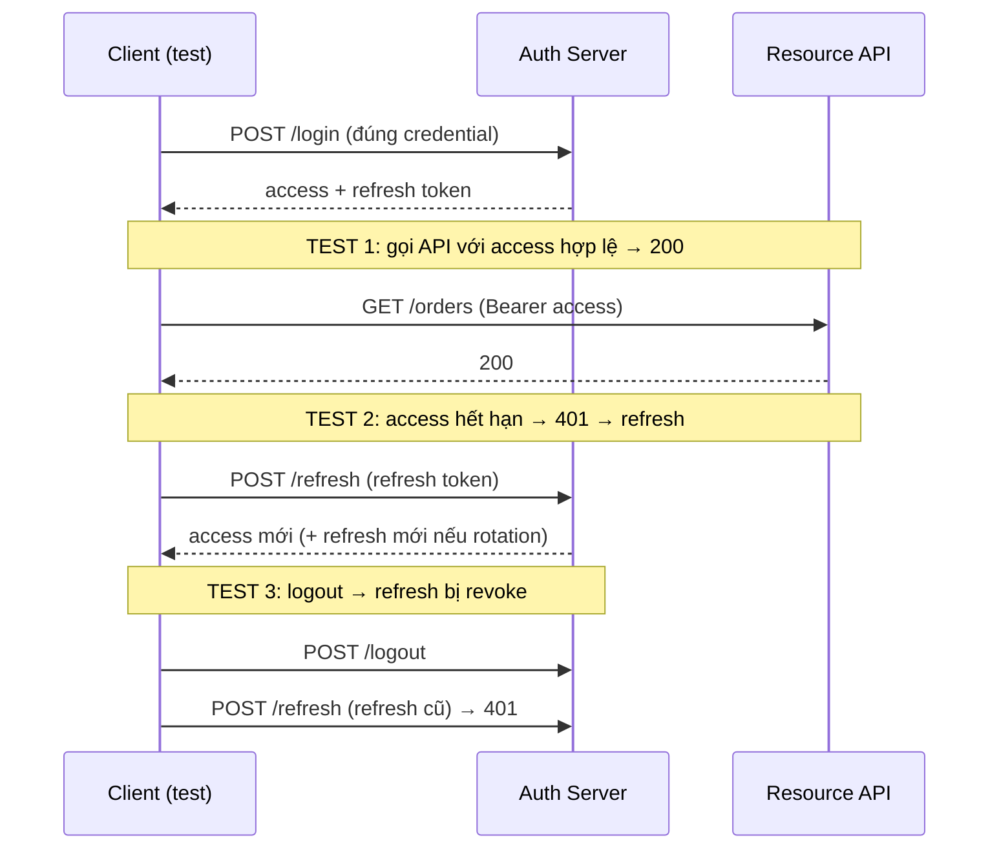

# Testing Auth Flow

## Mục lục

- [Tổng quan](#tổng-quan)
- [1. Vì sao test auth khác test thường](#1-vì-sao-test-auth-khác-test-thường)
- [2. Kim tự tháp test cho JWT](#2-kim-tự-tháp-test-cho-jwt)
- [3. Test theo từng giai đoạn vòng đời](#3-test-theo-từng-giai-đoạn-vòng-đời)
- [4. Negative cases BẮT BUỘC](#4-negative-cases-bắt-buộc)
- [5. Kỹ thuật: giả lập thời gian & khóa](#5-kỹ-thuật-giả-lập-thời-gian--khóa)
- [6. Test luồng refresh & rotation](#6-test-luồng-refresh--rotation)
- [7. Test end-to-end luồng đăng nhập](#7-test-end-to-end-luồng-đăng-nhập)
- [8. CI gate cho bảo mật token](#8-ci-gate-cho-bảo-mật-token)
- [9. Checklist test auth](#9-checklist-test-auth)
- [Tài liệu tham khảo](#tài-liệu-tham-khảo)

---

## Tổng quan

Test auth flow không chỉ là "đăng nhập thành công thì trả token". Phần lớn giá trị nằm ở **negative test** — đảm bảo token sai, hết hạn, giả mạo, hoặc đã thu hồi đều **bị từ chối**. Một hệ auth có 100% test "happy path" pass vẫn có thể dính `alg:none` hoặc chấp nhận token hết hạn.

```
   Test "happy path" trả lời:   "Người dùng đúng có vào được không?"
   Negative test trả lời:        "Người dùng SAI có bị chặn không?"   ← quan trọng hơn
```

> [!IMPORTANT]
> Với auth, **negative test quan trọng hơn positive test**. Một bug làm login thất bại sẽ bị phát hiện ngay (người dùng kêu). Một bug làm hệ thống *chấp nhận token không hợp lệ* thì im lặng — cho đến khi bị khai thác. Mọi cổng verify ([7 cổng](/internals/token-validation-flow/)) phải có ít nhất một test chứng minh "token sai cổng này → 401".

---

## 1. Vì sao test auth khác test thường

| Đặc điểm | Test logic thường | Test auth flow |
|----------|-------------------|----------------|
| Trọng tâm | Output đúng với input đúng | Input SAI bị TỪ CHỐI đúng cách |
| Phụ thuộc thời gian | Hiếm | Cao (`exp`, `nbf`, rotation, clock skew) |
| Phụ thuộc khóa | Không | Có (cần keypair test, JWKS giả) |
| Tiêu chí "đậu" | Trả đúng giá trị | Trả đúng **mã lỗi** (401 vs 403) và **không rò** |
| Rủi ro khi sai | Bug chức năng | Lỗ hổng bảo mật im lặng |

<Callout type="warn">
Phân biệt rõ <b>401 (Unauthorized)</b> — không xác thực được (token sai/thiếu/hết hạn) — với <b>403 (Forbidden)</b> — xác thực OK nhưng không đủ quyền. Test phải assert đúng mã, vì nhầm lẫn hai mã này thường che giấu lỗi logic.
</Callout>

---

## 2. Kim tự tháp test cho JWT

```
                  ╱╲
                 ╱  ╲   E2E (ít): login UI → gọi API thật → refresh → logout
                ╱────╲       chạy chậm, dễ vỡ, chỉ phủ luồng quan trọng nhất
               ╱      ╲
              ╱  INTEG ╲  Integration (vừa): middleware verify + route bảo vệ
             ╱──────────╲      + store refresh/denylist (in-memory hoặc testcontainer)
            ╱            ╲
           ╱    UNIT      ╲ Unit (nhiều): hàm sign/verify, kiểm từng claim,
          ╱────────────────╲    parse header, denylist check — nhanh, tất định
```

| Tầng | Test cái gì | Tốc độ / số lượng |
|------|-------------|--------------------|
| **Unit** | `signToken`, `verifyToken`, kiểm từng claim, denylist lookup | Nhanh nhất, nhiều nhất |
| **Integration** | Middleware verify + route được bảo vệ + store (Redis/DB giả) | Vừa |
| **E2E** | Login → nhận token → gọi API → refresh → logout qua HTTP/UI thật | Chậm, ít nhất |

> [!TIP]
> Phần lớn negative case về bảo mật (`alg:none`, sai chữ ký, hết hạn) nên test ở tầng **unit/integration** vì nhanh và tất định. Chỉ đẩy lên E2E những luồng end-to-end thực sự cần (đăng nhập đầy đủ, silent refresh trong trình duyệt).

---

## 3. Test theo từng giai đoạn vòng đời



| Giai đoạn | Test chính |
|-----------|------------|
| **Login** | Credential đúng → cấp token đủ claim (`sub`,`exp`,`aud`,`iss`,`jti`); credential sai → 401, **không cấp token** |
| **Truy cập API** | Access hợp lệ → 200; thiếu/sai → 401; đúng token nhưng thiếu `scope` → 403 |
| **Refresh** | Refresh hợp lệ → access mới; refresh hết hạn/sai → 401; rotation cấp refresh mới |
| **Revoke / Logout** | Sau logout, refresh cũ → 401; "logout mọi thiết bị" vô hiệu mọi token trước `tokensValidAfter` |

---

## 4. Negative cases BẮT BUỘC

Đây là phần cốt lõi. Mỗi case dưới đây phải có một test chứng minh hệ thống **từ chối**:

```
□ alg:none           — token header {"alg":"none"}, không chữ ký     → PHẢI 401
□ Algorithm confusion — token RS256 đổi thành HS256 ký bằng public key → PHẢI 401
□ Sai chữ ký          — sửa 1 ký tự payload, giữ chữ ký cũ           → PHẢI 401
□ Hết hạn             — exp ở quá khứ                                 → PHẢI 401
□ Chưa hiệu lực       — nbf ở tương lai                               → PHẢI 401
□ Sai issuer          — iss = "https://evil.com"                      → PHẢI 401
□ Sai audience        — aud = "service-khác"                         → PHẢI 401
□ Thiếu exp           — token không có exp                            → PHẢI 401 (không coi là vĩnh viễn)
□ Token rỗng/méo      — "", "abc", thiếu phần, thừa phần             → PHẢI 401
□ Token đã revoke     — jti trong denylist / trước tokensValidAfter   → PHẢI 401
□ Replay refresh      — dùng lại refresh đã rotate                    → PHẢI 401 + cảnh báo reuse
□ kid lạ / không tồn tại — kid không có trong JWKS                    → PHẢI 401 (không crash)
```

```javascript
import { describe, it, expect } from 'vitest';
import { SignJWT } from 'jose';
import { verifyToken } from '../src/auth';

describe('verifyToken — negative cases', () => {
  it('từ chối alg:none', async () => {
    const fake = base64url('{"alg":"none","typ":"JWT"}') + '.' +
                 base64url('{"sub":"u1","role":"admin"}') + '.';
    await expect(verifyToken(fake)).rejects.toThrow();
  });

  it('từ chối token hết hạn', async () => {
    const token = await signTestToken({ exp: nowSec() - 60 });
    await expect(verifyToken(token)).rejects.toMatchObject({ code: 'ERR_JWT_EXPIRED' });
  });

  it('từ chối sai audience', async () => {
    const token = await signTestToken({ aud: 'other-service' });
    await expect(verifyToken(token)).rejects.toThrow(/audience/i);
  });

  it('từ chối chữ ký bị sửa', async () => {
    const token = await signTestToken({ sub: 'u1' });
    const tampered = token.slice(0, -3) + 'AAA';
    await expect(verifyToken(tampered)).rejects.toThrow();
  });
});
```

> [!WARNING]
> Test `alg:none` và **algorithm confusion** (RS256→HS256) là bắt buộc với bất kỳ hệ JWT nào — đây là hai lỗ hổng kinh điển nhất. Nếu thư viện của bạn pass khi đưa vào token `alg:none` hoặc token RS256 bị ký lại bằng HS256 với public key, hệ thống đang có lỗ hổng nghiêm trọng. Chi tiết ở [Algorithm Confusion](/security/algorithm-confusion/).

---

## 5. Kỹ thuật: giả lập thời gian & khóa

### 5.1 Giả lập thời gian (test `exp`/`nbf`)

Đừng `sleep()` chờ token hết hạn — chậm và không tất định. Giả lập đồng hồ:

```javascript
import { vi } from 'vitest';

it('access hết hạn sau TTL', async () => {
  vi.useFakeTimers();
  vi.setSystemTime(new Date('2024-01-01T00:00:00Z'));
  const token = await signTestToken({ ttl: '15m' });

  vi.advanceTimersByTime(16 * 60 * 1000);   // nhảy 16 phút
  await expect(verifyToken(token)).rejects.toMatchObject({ code: 'ERR_JWT_EXPIRED' });
  vi.useRealTimers();
});
```

<Callout type="info">
Khi thư viện verify đọc giờ qua một nguồn riêng (không phải <code>Date.now()</code>), truyền tham số <code>currentDate</code>/<code>clockTimestamp</code> mà thư viện hỗ trợ thay vì fake timer toàn cục. Đồng thời test <b>clock skew</b>: token vừa "hết hạn 10 giây" vẫn nên pass nếu cấu hình <code>clockTolerance: 30s</code>.
</Callout>

### 5.2 Khóa test — đừng dùng khóa production

```javascript
import { generateKeyPair } from 'jose';

// Tạo keypair test một lần, tái dùng trong cả suite
export async function testKeys() {
  const { publicKey, privateKey } = await generateKeyPair('RS256');
  return { publicKey, privateKey };
}
```

```
□ Mỗi test suite tự sinh keypair riêng (không dùng khóa prod/staging).
□ JWKS giả: phơi public key test qua một endpoint mock (msw / nock).
□ Test "kid lạ": cấp token với kid không có trong JWKS giả → verify phải 401, KHÔNG crash.
□ Không commit private key thật vào test fixtures.
```

---

## 6. Test luồng refresh & rotation

Refresh token rotation + reuse detection là phần dễ sai nhất. Test ba kịch bản:

```
KỊCH BẢN 1 — rotation bình thường:
  refresh(R1) → nhận access mới + R2; R1 bị vô hiệu
  ✓ assert: dùng lại R1 → 401

KỊCH BẢN 2 — reuse detection (nghi trộm):
  refresh(R1) → R2 ; rồi lại refresh(R1)  ← R1 đã dùng
  ✓ assert: 401 + toàn bộ family token của session bị thu hồi + ghi cảnh báo

KỊCH BẢN 3 — refresh sau logout:
  logout() → refresh(R_current) → 401
```

```javascript
it('phát hiện reuse refresh token đã rotate', async () => {
  const { refresh: r1 } = await login();
  const { refresh: r2 } = await rotate(r1);     // r1 -> r2, r1 vô hiệu

  // dùng lại r1 (kẻ trộm) → phải bị chặn + thu hồi cả family
  await expect(rotate(r1)).rejects.toThrow(/reuse|revoked/i);
  await expect(rotate(r2)).rejects.toThrow();   // r2 cũng bị thu hồi theo
});
```

> [!NOTE]
> Chi tiết cơ chế rotation/reuse detection ở [Access vs Refresh Token](/lifecycle/access-token-vs-refresh-token/) và [Revocation & Logout](/lifecycle/revocation-and-logout/). Điểm phải test: khi phát hiện reuse, hệ thống thu hồi **cả family** chứ không chỉ token bị dùng lại.

---

## 7. Test end-to-end luồng đăng nhập

E2E ít nhưng cần cho luồng quan trọng nhất. Với SPA, dùng Playwright/Cypress:

```javascript
// Playwright — login → gọi API bảo vệ → silent refresh → logout
test('luồng đăng nhập đầy đủ', async ({ page, request }) => {
  await page.goto('/login');
  await page.fill('#email', 'user@example.com');
  await page.fill('#password', 'correct-horse');
  await page.click('button[type=submit]');
  await expect(page).toHaveURL('/dashboard');

  // access token nằm ở memory; refresh ở cookie HttpOnly (không đọc được từ JS)
  const cookies = await page.context().cookies();
  expect(cookies.find(c => c.name === 'refresh_token')?.httpOnly).toBe(true);

  // gọi API bảo vệ thành công
  await page.click('#load-orders');
  await expect(page.locator('.order-row')).toHaveCount(3);

  // logout → refresh bị vô hiệu
  await page.click('#logout');
  await expect(page).toHaveURL('/login');
});
```

> [!TIP]
> Trong E2E, assert refresh token là cookie `HttpOnly` (JS không đọc được) là một test bảo mật quan trọng — nó chứng minh storage đúng chuẩn ([Secure Storage](/security/secure-storage/)). Đừng để E2E phình to: chỉ phủ login/refresh/logout, đẩy mọi negative case xuống tầng unit/integration.

---

## 8. CI gate cho bảo mật token

Biến negative test thành **rào chắn** — PR không pass thì không merge:

<Steps>
<Step>
### Tách suite bảo mật

Gắn tag/nhóm riêng cho các test negative (`@security`) để chạy bắt buộc trong CI, không bị skip.
</Step>
<Step>
### Bắt buộc coverage cổng verify

Mỗi cổng trong [pipeline verify](/internals/token-validation-flow/) (alg, signature, exp, nbf, iss, aud, revoke) phải có ≥1 test. Review PR soát đủ.
</Step>
<Step>
### Chặn anti-pattern bằng lint/grep

Thêm bước CI bắt `jwt.decode(`/`jwtDecode(` dùng để phân quyền, hoặc `verify(` thiếu `algorithms`. Phát hiện → fail.
</Step>
<Step>
### Chạy SAST / dependency audit

`npm audit` + quét secret (gitleaks) để bắt khóa/secret lỡ commit vào test fixtures.
</Step>
</Steps>

```yaml
# .github/workflows/auth-tests.yml (rút gọn)
- name: Unit + integration auth tests
  run: npm test -- --reporter=verbose
- name: Security negative cases (bắt buộc, không skip)
  run: npm test -- --grep @security
- name: Chặn decode dùng để authz
  run: |
    ! grep -rnE "(jwt\.decode|jwtDecode)\(" src/ --include='*.ts' \
      | grep -iv "test" || (echo "decode không được dùng để phân quyền" && exit 1)
```

---

## 9. Checklist test auth

```
POSITIVE (happy path):
□ Login đúng credential → cấp token đủ claim (sub/exp/aud/iss/jti)
□ Access hợp lệ → API trả 200
□ Refresh hợp lệ → cấp access mới
□ Đủ scope/role → cho phép action

NEGATIVE (bắt buộc — mỗi dòng 1 test):
□ alg:none → 401
□ algorithm confusion RS256→HS256 → 401
□ chữ ký bị sửa → 401
□ token hết hạn (exp quá khứ) → 401
□ chưa hiệu lực (nbf tương lai) → 401
□ sai iss → 401 ; sai aud → 401
□ thiếu exp → 401 (không coi vĩnh viễn)
□ token rỗng/méo/thiếu phần → 401 (không crash)
□ token đã revoke → 401
□ replay refresh đã rotate → 401 + thu hồi family
□ kid lạ → 401 (không crash)
□ token hợp lệ nhưng thiếu quyền → 403 (KHÔNG 401)

KỸ THUẬT:
□ giả lập thời gian (fake timer) thay vì sleep
□ test clock skew với clockTolerance
□ dùng keypair TEST, không phải khóa prod
□ E2E: assert refresh là cookie HttpOnly

CI:
□ suite @security chạy bắt buộc, không skip
□ chặn decode-dùng-để-authz và verify thiếu allowlist
```

<Callout type="success" title="Một câu để nhớ">
Hệ auth tốt được chứng minh bằng <b>những gì nó từ chối</b>, không phải những gì nó cho qua. Nếu suite test của bạn không có dòng nào assert "token sai → 401", bạn chưa thực sự test auth.
</Callout>

---

## Tài liệu tham khảo

- [Luồng xác thực JWT — Deep Dive](/internals/token-validation-flow/) — các cổng cần phủ test
- [Algorithm Confusion](/security/algorithm-confusion/) — vì sao test alg:none/confusion
- [Access vs Refresh Token](/lifecycle/access-token-vs-refresh-token/) — luồng refresh
- [Revocation & Logout](/lifecycle/revocation-and-logout/) — test reuse detection
- [Secure Storage](/security/secure-storage/) — assert HttpOnly trong E2E
- [Debugging JWT](/operations/debugging-jwt/) — khi test fail, debug thế nào
- [Production Checklist](/operations/production-checklist/)
