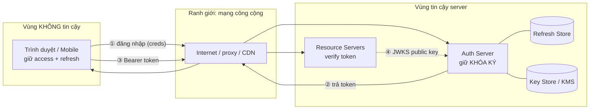
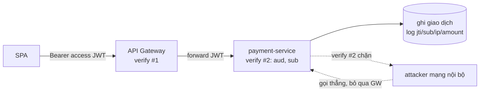

# JWT Threat Model — Deep Dive

## Mục lục

- [1. Vì sao cần mô hình đe dọa trước khi vá lỗ hổng](#1-vì-sao-cần-mô-hình-đe-dọa-trước-khi-vá-lỗ-hổng)
- [2. Tài sản cần bảo vệ & kẻ tấn công](#2-tài-sản-cần-bảo-vệ--kẻ-tấn-công)
- [3. Ranh giới tin cậy & sơ đồ luồng dữ liệu](#3-ranh-giới-tin-cậy--sơ-đồ-luồng-dữ-liệu)
- [4. Attack surface theo 5 giai đoạn vòng đời](#4-attack-surface-theo-5-giai-đoạn-vòng-đời)
- [5. Phân tích STRIDE cho JWT](#5-phân-tích-stride-cho-jwt)
- [6. Attack tree — "đánh cắp một phiên"](#6-attack-tree--đánh-cắp-một-phiên)
- [7. Xếp hạng rủi ro — DREAD rút gọn](#7-xếp-hạng-rủi-ro--dread-rút-gọn)
- [8. Threat model áp dụng — luồng checkout thực tế](#8-threat-model-áp-dụng--luồng-checkout-thực-tế)
- [9. Phòng thủ nâng cao — token bị ràng buộc người gửi](#9-phòng-thủ-nâng-cao--token-bị-ràng-buộc-người-gửi)
- [10. Ba hiểu lầm nền tảng tạo ra lỗ hổng](#10-ba-hiểu-lầm-nền-tảng-tạo-ra-lỗ-hổng)
- [11. Checklist tư duy threat-modeling](#11-checklist-tư-duy-threat-modeling)
- [12. Anti-patterns cần tránh](#12-anti-patterns-cần-tránh)
- [13. Tóm tắt — Cheat sheet](#13-tóm-tắt--cheat-sheet)

---

## 1. Vì sao cần mô hình đe dọa trước khi vá lỗ hổng

Người ta hay học bảo mật JWT theo kiểu "danh sách lỗ hổng": `alg:none`, secret yếu, `kid` injection... Nhưng học rời rạc như thế dễ vá chỗ này hở chỗ kia. **Threat model** lật ngược cách tiếp cận: trước hết hỏi *bảo vệ cái gì, khỏi ai, ở đâu* — rồi từng lỗ hổng cụ thể tự hiện ra như hệ quả.

```
┌─────────────────────────────────────────────────────────────────────────────┐
│   CÁCH TIẾP CẬN "DANH SÁCH LỖ HỔNG"   vs   CÁCH TIẾP CẬN "THREAT MODEL"      │
├─────────────────────────────────────────────────────────────────────────────┤
│   "alg:none là gì? vá thế nào"            "Token bị giả mạo bằng cách nào?"   │
│   "kid injection là gì? vá thế nào"        → chữ ký yếu/bỏ qua → alg:none,    │
│   ... (học thuộc N lỗ hổng rời)              confusion, secret yếu...          │
│                                            "Token bị đánh cắp bằng cách nào?" │
│   ✗ vá theo case → dễ sót case mới          → XSS, MITM, log rò, lưu sai chỗ  │
│                                            ✓ phủ theo MỤC TIÊU kẻ tấn công    │
└─────────────────────────────────────────────────────────────────────────────┘
```

> [!IMPORTANT]
> Threat modeling trả lời bốn câu hỏi của Adam Shostack: **(1) Ta đang xây gì?** (sơ đồ luồng) **(2) Cái gì có thể sai?** (STRIDE) **(3) Ta làm gì với nó?** (phòng thủ) **(4) Ta làm có tốt không?** (đánh giá lại). Doc này áp bốn câu đó vào JWT, rồi các bài sau ([Common Vulnerabilities](/security/common-vulnerabilities/), [XSS/CSRF](/security/xss-csrf-token-theft/), [Secure Storage](/security/secure-storage/)) mổ sâu từng nhánh.

---

## 2. Tài sản cần bảo vệ & kẻ tấn công

```
┌──────────────────────── TÀI SẢN (ASSETS) ────────────────────────┐
│  A1. Khóa ký (signing key)      → lộ = giả MỌI token (thảm họa)   │
│  A2. Token đang hiệu lực        → trộm = mạo danh trong TTL        │
│  A3. Refresh token / store      → trộm = phiên dài hạn            │
│  A4. Danh tính & quyền (claims) → giả = leo thang đặc quyền        │
│  A5. Dữ liệu trong payload      → đọc = lộ thông tin (nếu nhét PII)│
└────────────────────────────────────────────────────────────────────┘
```

```
┌──────────────────── KẺ TẤN CÔNG (THREAT ACTORS) ──────────────────┐
│  T1. Người ngoài qua mạng     — chặn/sửa request (MITM, sniff)     │
│  T2. Script độc trong trình duyệt nạn nhân (XSS) — đọc token       │
│  T3. Client độc / user hợp lệ tò mò — tự sửa token mình giữ        │
│  T4. Người trong nội bộ / log — đọc token rò ra log, URL, cache    │
│  T5. Kẻ chiếm được 1 service — dùng vị thế đó tấn công verify/JWKS │
└────────────────────────────────────────────────────────────────────┘
```

> [!NOTE]
> Xếp hạng tài sản giúp ưu tiên phòng thủ: **A1 (khóa ký) là tài sản tối thượng** — lộ khóa thì mọi biện pháp khác vô nghĩa (kẻ tấn công ký token hợp lệ tùy ý). Vì vậy bảo vệ khóa (KMS/HSM, xoay khóa — xem [Key Rotation](/cryptography/key-rotation/)) đứng đầu mọi danh sách.

---

## 3. Ranh giới tin cậy & sơ đồ luồng dữ liệu

Threat thường nảy sinh ở **ranh giới tin cậy** (trust boundary) — nơi dữ liệu vượt từ vùng kiểm soát này sang vùng khác.



```
RANH GIỚI TIN CẬY (mỗi mũi tên qua biên = điểm cần phòng thủ):
   ① creds rời client → server : có thể bị sniff (cần TLS), brute-force (rate limit)
   ② token rời server → client : có thể bị MITM (TLS), log rò (đừng log token)
   ③ token rời client → API    : XSS đọc trước khi gửi, MITM, replay (cần TLS+exp)
   ④ JWKS server → verifier     : kẻ tấn công ép verifier nạp key giả (jku/x5u inj)

⇒ Token đi qua VÙNG KHÔNG TIN CẬY (trình duyệt + mạng) → mọi thứ ở client
  đều coi như attacker có thể đọc/sửa. Niềm tin chỉ đặt vào CHỮ KÝ, không vào
  "token nằm ở client nên an toàn".
```

> [!WARNING]
> Sai lầm tư duy phổ biến: coi trình duyệt là "phía mình". Trình duyệt là **vùng không tin cậy** — XSS, extension độc, hay chính user đều có thể đọc/sửa mọi thứ ở đó. Đó là lý do payload JWT phải coi như **công khai** (đừng nhét bí mật) và verify phải dựa hoàn toàn vào chữ ký (xem [Token Validation — Deep Dive](/internals/token-validation-deep-dive/)).

---

## 4. Attack surface theo 5 giai đoạn vòng đời

Mỗi giai đoạn vòng đời token mở ra một nhóm tấn công riêng:

```
┌──────────┬───────────────────────────────────┬──────────────────────────────┐
│ Giai đoạn│ Mối đe dọa                          │ Phòng thủ chính              │
├──────────┼───────────────────────────────────┼──────────────────────────────┤
│ ① CẤP    │ cấp token cho danh tính giả        │ xác thực mạnh + MFA          │
│          │ cấp quá nhiều quyền / TTL dài       │ tối thiểu claim, TTL ngắn    │
│          │ lộ khóa ký                          │ KMS/HSM, xoay khóa           │
├──────────┼───────────────────────────────────┼──────────────────────────────┤
│ ② TRUYỀN │ sniff token (HTTP trần)            │ TLS bắt buộc                 │
│          │ token rò vào URL/log/Referer        │ token ở header, không ở URL  │
├──────────┼───────────────────────────────────┼──────────────────────────────┤
│ ③ LƯU    │ XSS đọc token (localStorage)        │ httpOnly cookie / memory     │
│          │ token còn trong cache/lịch sử       │ không lưu nơi JS đọc bừa     │
├──────────┼───────────────────────────────────┼──────────────────────────────┤
│ ④ VERIFY │ alg:none, alg confusion, kid inj    │ allowlist alg, ghim issuer   │
│          │ bỏ qua exp/aud/iss, secret yếu      │ verify ĐỦ cổng, secret mạnh  │
├──────────┼───────────────────────────────────┼──────────────────────────────┤
│ ⑤ THU HỒI│ token bị trộm vẫn dùng tới hết hạn  │ TTL ngắn + denylist + rotation│
│          │ logout không thật sự hủy            │ revoke refresh + valid_after │
└──────────┴───────────────────────────────────┴──────────────────────────────┘
```

> [!TIP]
> Cách dùng bảng này: với mỗi giai đoạn, hỏi "ở đây kẻ tấn công làm gì được?". Phần lớn lỗ hổng JWT nổi tiếng rơi vào giai đoạn ④ VERIFY (xem [Common Vulnerabilities](/security/common-vulnerabilities/) và [Algorithm Confusion](/security/algorithm-confusion-deep-dive/)) và ③ LƯU (xem [Secure Storage](/security/secure-storage/)).

---

## 5. Phân tích STRIDE cho JWT

STRIDE phân loại mối đe dọa thành 6 nhóm. Áp vào JWT:

### S — Spoofing (giả danh)

```
Mục tiêu attacker: được hệ thống coi là một danh tính khác.
Vector trong JWT:
   • alg:none — gửi token "không chữ ký", verifier lười chấp nhận → giả bất kỳ ai
   • alg confusion (RS256→HS256) — ký HMAC bằng PUBLIC key (mà ai cũng biết)
   • secret HMAC yếu — brute-force ra secret rồi tự ký token (xem định lượng dưới)
Phòng thủ: allowlist alg cố định; tách key theo alg; secret ≥ 256-bit ngẫu nhiên.
```

```
Định lượng "secret yếu" — vì sao nguy hiểm thật:
   Token nạn nhân ký bằng secret = "secret":
      eyJhbGciOiJIUzI1NiIsInR5cCI6IkpXVCJ9.eyJzdWIiOiIxMjM0Ii...
   Dictionary attack offline (chỉ cần token, không cần server):
      thử ['123456','password','admin','letmein','secret',...] → khớp "secret"
      sau 6 lần thử, 0.14 ms.
   Throughput: 1 core Node ≈ 477.000 HMAC/s; 1 GPU hashcat ≈ vài TỶ HMAC/s.
   ⇒ secret là từ điển/ngắn → crack trong mili-giây tới giây. Phải DÀI + NGẪU NHIÊN.
```

### T — Tampering (sửa đổi)

```
Mục tiêu: đổi claim (vd roles:user→admin) mà token vẫn được chấp nhận.
Vector: sửa payload rồi (a) bỏ verify chữ ký, (b) dùng alg:none, (c) giả chữ ký
        nếu khóa yếu/lộ.
Phòng thủ: LUÔN verify chữ ký; avalanche khiến sửa 1 claim làm chữ ký vỡ nếu
           attacker không có khóa (xem Issuing Token §6).
```

### R — Repudiation (chối bỏ)

```
Mục tiêu: thực hiện hành động rồi chối "không phải tôi".
Vector: token không có jti/không log → khó truy vết hành động về token/phiên nào.
Phòng thủ: jti duy nhất + log audit (jti, sub, iat, ip) cho hành động nhạy cảm.
```

### I — Information Disclosure (lộ thông tin)

```
Mục tiêu: đọc dữ liệu nhạy cảm.
Vector: payload JWT là base64url (KHÔNG mã hóa) → ai chặn được token đều đọc claim;
        nhét PII/secret vào payload = tự lộ. Token rò vào log/URL cũng là lộ.
Phòng thủ: tối thiểu claim, không nhét bí mật; cần bí mật thật → JWE (xem
           Encoding vs Encryption).
```

### D — Denial of Service (từ chối dịch vụ)

```
Mục tiêu: làm verify/issuer quá tải hoặc treo.
Vector: token khổng lồ (payload MB) → tốn CPU/mem verify; JWKS refetch storm;
        thuật toán nén "JWT bomb"; key quá lớn làm verify chậm.
Phòng thủ: giới hạn kích thước token; cache JWKS + cooldown; giới hạn alg/độ phức tạp.
```

### E — Elevation of Privilege (leo thang đặc quyền)

```
Mục tiêu: từ quyền thấp lên quyền cao.
Vector: sửa claim roles/scope (kết hợp T); claim confusion (verifier đọc sai claim,
        vd nhầm aud/sub); "stale claim" giữ quyền cũ sau khi bị thu hồi.
Phòng thủ: verify chữ ký + kiểm aud/iss đúng; quyền tươi; TTL ngắn cho cửa sổ stale.
```

```
┌─────────────────────────────────────────────────────────────────────────────┐
│  STRIDE ⇄ PHÒNG THỦ JWT (tóm tắt ma trận)                                    │
├───────────────┬──────────────────────────┬──────────────────────────────────┤
│ S Spoofing    │ giả danh                  │ allowlist alg, secret mạnh, MFA   │
│ T Tampering   │ sửa claim                 │ verify chữ ký (luôn)              │
│ R Repudiation │ chối hành động            │ jti + audit log                  │
│ I Info disc.  │ lộ payload/log            │ tối thiểu claim, không log token  │
│ D DoS         │ quá tải verify/JWKS       │ giới hạn size, cache JWKS         │
│ E Elevation   │ leo quyền                 │ kiểm aud/iss, quyền tươi, TTL ngắn│
└───────────────┴──────────────────────────┴──────────────────────────────────┘
```

> [!IMPORTANT]
> STRIDE cho thấy phòng thủ JWT không chỉ là "verify chữ ký": chữ ký chống S/T/E phần giả mạo, nhưng I (lộ payload), D (token bomb/JWKS storm), R (audit) cần biện pháp khác. Bảo mật JWT là **phòng thủ nhiều lớp**, không một viên đạn bạc.

---

## 6. Attack tree — "đánh cắp một phiên"

Cây tấn công phân rã một mục tiêu thành các cách đạt được nó — giúp thấy mọi nhánh cần chặn:

```
MỤC TIÊU: chiếm phiên của nạn nhân (hành động như họ)
│
├── (A) GIẢ token mới (không cần trộm)
│       ├── alg:none được chấp nhận ............... [Common Vulns]
│       ├── alg confusion RS256→HS256 ............. [Algorithm Confusion]
│       ├── brute-force HMAC secret yếu ........... [Common Vulns]
│       └── lộ KHÓA KÝ (A1) → ký tùy ý ............ [Key Rotation: KMS/HSM]
│
├── (B) TRỘM token đang hiệu lực
│       ├── XSS đọc token ở localStorage .......... [XSS/CSRF, Secure Storage]
│       ├── MITM trên HTTP trần .................... [TLS bắt buộc]
│       ├── token rò vào log / URL / Referer ...... [không log token, header-only]
│       └── trộm refresh → gia hạn dài hạn ........ [Access vs Refresh]
│
└── (C) LẠM DỤNG token hợp lệ
        ├── replay token đã chặn được ............. [exp ngắn + jti + TLS]
        ├── dùng token sai audience ............... [kiểm aud]
        └── dùng token sau khi đáng-lẽ-bị-thu-hồi . [denylist + valid_after]
```

```
Đọc cây: để bảo vệ phiên, phải chặn CẢ BA nhánh A, B, C.
   chặn A (giả) ≠ đủ nếu B (trộm) còn hở.
   ⇒ mỗi lá là một biện pháp; thiếu một lá = một đường vào.
```

> [!TIP]
> Attack tree là công cụ mạnh để rà soát độ phủ: đi từng lá, hỏi "ta đã chặn chưa?". Nếu một lá chưa có biện pháp tương ứng trong hệ thống của bạn, đó là lỗ hổng tiềm tàng cần xử lý.

---

## 7. Xếp hạng rủi ro — DREAD rút gọn

Không phải mối đe dọa nào cũng ngang nhau. Xếp hạng để ưu tiên (Damage × Likelihood):

| Mối đe dọa | Thiệt hại | Khả năng xảy ra | Ưu tiên |
|------------|-----------|------------------|---------|
| Lộ khóa ký | Thảm họa (giả mọi token) | Thấp nếu KMS | **TỐI CAO** |
| alg:none / confusion được chấp nhận | Cao (giả token) | TB (lib cũ/cấu hình sai) | **CAO** |
| HMAC secret yếu | Cao (giả token) | Cao (hay đặt secret yếu) | **CAO** |
| XSS trộm token | Cao (chiếm phiên) | Cao (XSS phổ biến) | **CAO** |
| Bỏ kiểm `aud`/`iss` | TB–Cao (token dùng nhầm chỗ) | TB | TB |
| Lộ PII trong payload | TB | TB (nếu lỡ nhét) | TB |
| JWKS DoS | TB (gián đoạn) | Thấp–TB | Thấp–TB |

```
Ưu tiên xử lý (đầu tư công sức theo thứ tự):
   1. Bảo vệ khóa ký (KMS/HSM, xoay khóa)        ← thiệt hại tối đa
   2. Verify đúng (allowlist alg, secret mạnh, đủ cổng)  ← khả năng cao + thiệt hại cao
   3. Chống trộm token (httpOnly, TLS, CSP chống XSS)
   4. Thu hồi (TTL ngắn, denylist, rotation)
   5. Còn lại (audit, giới hạn size, cache JWKS)
```

---

## 8. Threat model áp dụng — luồng checkout thực tế

Lý thuyết STRIDE chỉ sống động khi áp vào một luồng cụ thể. Lấy **luồng thanh toán (checkout)** của một app thương mại điện tử dùng JWT — đây là nơi tiền thật đổi chủ, nên đáng để mổ kỹ.

```
HỆ THỐNG: SPA (trình duyệt) → API Gateway → [order-service, payment-service]
   • access JWT (RS256, TTL 10') do auth-service ký, aud="api.shop"
   • refresh token (opaque) ở cookie httpOnly
   • payment-service verify JWT để biết user nào đang trả tiền

TÀI SẢN ở luồng này:
   • quyền "thực hiện thanh toán thay user X"  (giả = chiếm tiền)
   • giỏ hàng / địa chỉ / số tiền               (sửa = gian lận)
   • khóa ký của auth-service                   (lộ = giả mọi user)
```

```
ÁP STRIDE VÀO TỪNG BƯỚC CHECKOUT:

  Bước 1 — SPA gọi POST /checkout kèm Bearer <access JWT>
     S (spoofing): attacker gửi JWT giả (alg:none/confusion)?
        → gateway allowlist ['RS256'] + verify chữ ký → chặn
     T (tampering): attacker sửa sub trong JWT để trả tiền thay người khác?
        → sửa sub làm hỏng chữ ký (avalanche) → verify fail → chặn
     E (elevation): JWT user thường nhưng claim scope=["payment:admin"]?
        → scope do auth-service ký lúc cấp, client không sửa được → chặn

  Bước 2 — gateway chuyển request xuống payment-service
     S: payment-service có verify lại JWT hay "tin gateway đã verify"?
        → nếu tin mù → kẻ vào được mạng nội bộ gọi thẳng payment-service, bỏ qua
          gateway → PHẢI verify aud="api.shop" ở CHÍNH payment-service (defense in depth)
     I (info disc): số thẻ có nằm trong JWT payload không? → KHÔNG BAO GIỜ

  Bước 3 — payment-service ghi giao dịch
     R (repudiation): user chối "tôi không mua"?
        → log jti + sub + iat + ip + amount → có bằng chứng truy vết
     D (DoS): attacker spam /checkout với JWT kid lạ làm verify fetch JWKS liên tục?
        → cache JWKS + cooldown → chặn storm
```



> [!IMPORTANT]
> Bài học lớn nhất từ ví dụ này: **mỗi service tiêu thụ token phải tự verify, không tin "ai đó đã verify rồi"**. Đây chính là *defense in depth* — nếu payment-service tin gateway mù quáng, một kẻ lọt vào mạng nội bộ (qua SSRF, service bị chiếm) gọi thẳng payment-service là bỏ qua mọi kiểm tra. Verify ở mỗi điểm tiêu thụ là rẻ và chặn cả lớp tấn công "đông cứng vỏ ngoài, mềm nhũn bên trong".

Sau khi chạy STRIDE cho luồng này, ta rút ra danh sách phòng thủ *tối thiểu nhưng đủ*:

```
□ Gateway VÀ payment-service đều verify (allowlist alg + aud + chữ ký + exp)
□ scope/quyền nằm trong claim ĐÃ KÝ (client không tự nâng quyền được)
□ KHÔNG bao giờ số thẻ/PII trong JWT payload
□ Log audit (jti, sub, ip, amount) cho mỗi giao dịch
□ TTL access ngắn (10') → token trộm hết giá trị nhanh
□ Step-up auth (xác thực lại) cho giao dịch giá trị lớn → xem §9
```

---

## 9. Phòng thủ nâng cao — token bị ràng buộc người gửi

Mọi phòng thủ ở trên vẫn chừa một lỗ hổng cốt lõi: **bearer token** — "ai cầm là dùng được". Nếu token bị trộm (XSS, log rò, MITM), kẻ trộm dùng y như chủ thật vì token không gắn với ai. Phòng thủ nâng cao đóng lỗ này.

```
BEARER TOKEN (mặc định):  "ai mang token cũng được phục vụ"
   → token trộm = chiếm phiên, không cách nào phân biệt chủ thật vs kẻ trộm

SENDER-CONSTRAINED TOKEN: "token chỉ dùng được bởi đúng client đã được cấp"
   → token trộm trở nên VÔ DỤNG vì kẻ trộm thiếu "chứng cứ sở hữu" (proof-of-possession)
```

### DPoP (Demonstrating Proof-of-Possession)

```
Ý tưởng: client tạo cặp khóa; mỗi request kèm một "DPoP proof" (JWS nhỏ) ký bằng
         private key của client, và access token nhúng thumbprint của public key đó.

Luồng:
   1. client sinh cặp khóa (private giữ trong memory/WebCrypto non-extractable)
   2. khi lấy token, gửi public key → server nhúng jkt (thumbprint) vào access token
   3. mỗi request: kèm header DPoP = JWS ký bằng private key, chứa method+URL+thời gian
   4. server kiểm: thumbprint(public trong DPoP) == jkt trong access token?
      → khớp ⇒ đúng client sở hữu private key ⇒ phục vụ
      → token trộm KHÔNG kèm được DPoP hợp lệ (kẻ trộm không có private key) ⇒ từ chối
```

```
┌───────────────────────────────────────────────────────────────────────────┐
│  TẠI SAO DPoP CHẶN TOKEN THEFT:                                            │
│    access token nhúng jkt = SHA-256(public key client)                     │
│    kẻ trộm có access token NHƯNG không có private key                      │
│    → không ký được DPoP proof khớp jkt → server từ chối                     │
│    ⇒ token trộm hết giá trị (proof-of-possession, không còn là bearer)     │
└───────────────────────────────────────────────────────────────────────────┘
```

### mTLS (mutual TLS) — ràng buộc bằng chứng chỉ client

```
Client có chứng chỉ TLS riêng; server nhúng thumbprint chứng chỉ vào token (cnf claim).
Mỗi request đi qua mTLS → server đối chiếu chứng chỉ TLS với cnf trong token.
   token trộm dùng ở kết nối TLS khác (không có chứng chỉ client đúng) → từ chối.
→ phù hợp service-to-service / hệ doanh nghiệp có hạ tầng PKI.
```

### Step-up authentication — nâng bảo đảm theo rủi ro hành động

```
Không phải hành động nào cũng cần mức tin như nhau:
   xem đơn hàng        → access token thường là đủ
   chuyển tiền > 10tr   → YÊU CẦU xác thực lại (MFA/sinh trắc) ngay trước hành động
                         → cấp token "acr" (mức bảo đảm) cao + TTL rất ngắn cho thao tác đó
→ token trộm (mức thường) KHÔNG vượt được cổng step-up cho hành động nhạy cảm.
```

> [!TIP]
> Khi nào cần phòng thủ nâng cao? **Bearer token + TTL ngắn là đủ cho phần lớn hệ**; chỉ leo lên DPoP/mTLS/step-up khi tài sản đủ giá trị (tài chính, y tế, hạ tầng) để bù lại chi phí phức tạp. Đừng over-engineer — nhưng biết các công cụ này tồn tại để chọn đúng lúc. Xem phân tầng theo mức nhạy cảm ở [Security Best Practices](/security/security-best-practices/).

---

## 10. Ba hiểu lầm nền tảng tạo ra lỗ hổng

```
HIỂU LẦM 1: "JWT được mã hóa nên payload an toàn"
   THỰC TẾ: payload chỉ base64url (encoding) — ai cũng giải ra đọc được.
   HỆ QUẢ:  nhét PII/secret → lộ. (xem Encoding vs Encryption)

HIỂU LẦM 2: "Có chữ ký nên không thể giả token"
   THỰC TẾ: chỉ đúng NẾU verifier verify đúng + khóa an toàn.
            alg:none/confusion/secret yếu phá vỡ điều đó.
   HỆ QUẢ:  chữ ký là điều kiện CẦN, verify-đúng + khóa-mạnh là điều kiện ĐỦ.

HIỂU LẦM 3: "Token nằm ở client nên server không lo"
   THỰC TẾ: client là vùng KHÔNG tin cậy; token bị đọc/sửa/trộm ở đó.
   HỆ QUẢ:  phải coi mọi thứ client-side là công khai + có thể bị thao túng.
```

> [!WARNING]
> Gần như mọi lỗ hổng JWT thực tế đều truy về một trong ba hiểu lầm này. Sửa tư duy ở gốc (payload công khai, chữ ký cần verify-đúng, client không tin được) sẽ phòng được cả lớp lỗ hổng thay vì vá từng case.

---

## 11. Checklist tư duy threat-modeling

```
□ Đã liệt kê TÀI SẢN (khóa ký, token, refresh, claims, PII)?
□ Đã xác định KẺ TẤN CÔNG (ngoài mạng, XSS, client độc, nội bộ)?
□ Đã vẽ luồng dữ liệu + đánh dấu RANH GIỚI TIN CẬY?
□ Với mỗi biên: dữ liệu qua đó bị đọc/sửa/chặn được không?
□ Đã chạy STRIDE cho từng thành phần (issuer, transport, store, verifier)?
□ Đã dựng ATTACK TREE cho mục tiêu chính (chiếm phiên) và chặn mọi lá?
□ Đã XẾP HẠNG rủi ro và ưu tiên khóa ký + verify đúng lên đầu?
□ Đã kiểm 3 hiểu lầm nền tảng không tồn tại trong hệ thống?
□ Đã lên kế hoạch ĐÁNH GIÁ LẠI khi kiến trúc thay đổi?
```

> [!TIP]
> Threat model không phải tài liệu làm một lần rồi bỏ. Mỗi khi thêm service verify token mới, đổi nơi lưu token, hay thêm loại client (mobile/SPA), hãy chạy lại checklist — attack surface vừa thay đổi.

---

## 12. Anti-patterns cần tránh

| Anti-pattern | Hậu quả | Làm đúng |
|--------------|---------|----------|
| Vá lỗ hổng rời rạc, không có mô hình | Sót case mới, phòng thủ vá víu | Threat model trước, lỗ hổng là hệ quả |
| Coi trình duyệt là "phía mình" | Nhét bí mật/tin client mù quáng | Client = vùng không tin cậy |
| Đầu tư phòng thủ dàn trải đều | Bỏ sót rủi ro tối cao (khóa ký) | Xếp hạng, ưu tiên khóa + verify |
| Chỉ lo verify chữ ký, quên I/D/R | Lộ PII, DoS, không truy vết được | Phòng thủ nhiều lớp theo STRIDE |
| Không vẽ ranh giới tin cậy | Bỏ sót điểm tấn công ở biên | Sơ đồ luồng + đánh dấu biên |
| Threat model một lần rồi quên | Attack surface mới không được xét | Đánh giá lại khi kiến trúc đổi |

---

## 13. Tóm tắt — Cheat sheet

```
╭──────────────────────────────────────────────────────────────────────────╮
│  THREAT MODEL JWT = 4 câu hỏi:                                            │
│    1 Xây gì? (luồng + ranh giới tin cậy)                                  │
│    2 Gì có thể sai? (STRIDE: S/T/R/I/D/E)                                  │
│    3 Làm gì với nó? (phòng thủ nhiều lớp)                                  │
│    4 Làm tốt không? (đánh giá lại khi đổi)                                 │
│                                                                            │
│  TÀI SẢN xếp hạng: KHÓA KÝ (tối cao) > token > refresh > claims > PII      │
│  CLIENT = VÙNG KHÔNG TIN CẬY → payload công khai, mọi thứ client bị thao túng│
│                                                                            │
│  ATTACK SURFACE 5 giai đoạn: Cấp → Truyền → Lưu → VERIFY → Thu hồi         │
│     (VERIFY & LƯU là nơi nhiều lỗ hổng nổi tiếng nhất)                     │
│                                                                            │
│  ƯU TIÊN: 1 bảo vệ khóa ký  2 verify đúng (alg/secret/cổng)               │
│           3 chống trộm (httpOnly/TLS/CSP)  4 thu hồi  5 audit/size/JWKS    │
│                                                                            │
│  3 HIỂU LẦM GỐC cần diệt: "payload mã hóa" / "có ký là bất khả giả" /      │
│     "token ở client nên an toàn"                                          │
╰──────────────────────────────────────────────────────────────────────────╯
```

**3 nguyên tắc xương sống:**

1. **Mô hình trước, vá sau.** Liệt kê tài sản + kẻ tấn công + ranh giới tin cậy; chạy STRIDE và attack tree — lỗ hổng cụ thể sẽ lộ ra như hệ quả, và bạn phủ theo mục tiêu kẻ tấn công thay vì theo danh sách.
2. **Khóa ký là tài sản tối thượng; verify-đúng là phòng tuyến số hai.** Lộ khóa = mọi thứ sụp; verify sai = chữ ký vô dụng. Ưu tiên hai thứ này lên đầu.
3. **Client không bao giờ tin được.** Payload coi như công khai, mọi dữ liệu client-side coi như bị thao túng được — đây là gốc rễ diệt cả lớp lỗ hổng.

Đọc tiếp các nhánh cụ thể: [Common Vulnerabilities](/security/common-vulnerabilities/) · [Algorithm Confusion](/security/algorithm-confusion-deep-dive/) · [XSS/CSRF & Token Theft](/security/xss-csrf-token-theft/) · [Secure Storage](/security/secure-storage/) · [Security Best Practices](/security/security-best-practices/).
