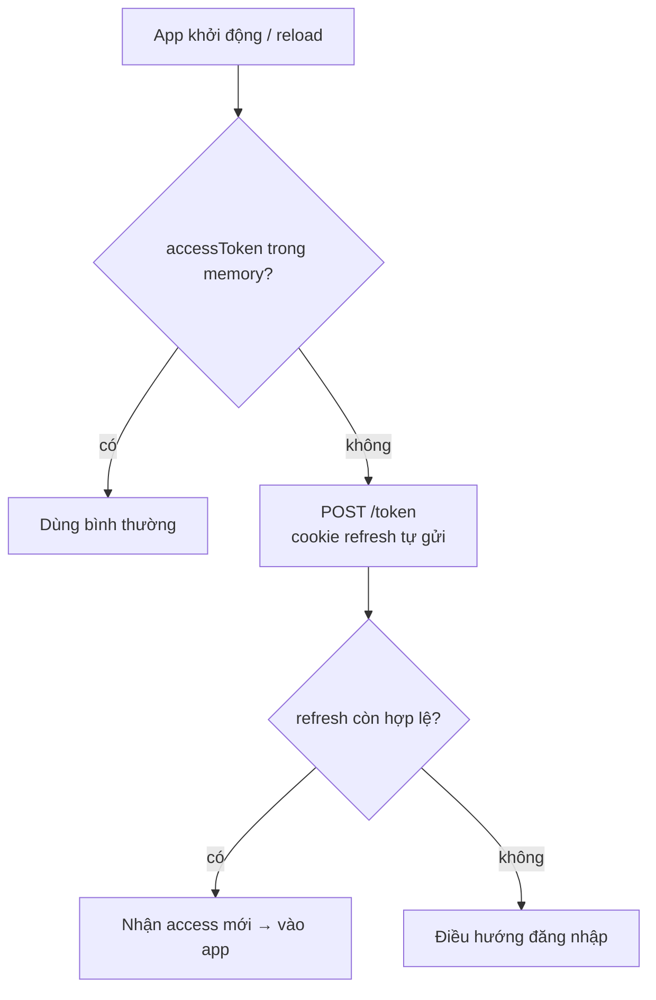

# Secure Token Storage — Deep Dive

## Mục lục

- [1. Câu hỏi sai và câu hỏi đúng](#1-câu-hỏi-sai-và-câu-hỏi-đúng)
- [2. Ba trục đánh giá một nơi lưu](#2-ba-trục-đánh-giá-một-nơi-lưu)
- [3. Mổ từng nơi lưu trên web](#3-mổ-từng-nơi-lưu-trên-web)
- [4. Mô hình khuyến nghị: access-memory + refresh-cookie](#4-mô-hình-khuyến-nghị-access-memory--refresh-cookie)
- [5. Vòng đời reload — vấn đề "mất access khi F5"](#5-vòng-đời-reload--vấn-đề-mất-access-khi-f5)
- [6. BFF pattern — token không chạm trình duyệt](#6-bff-pattern--token-không-chạm-trình-duyệt)
- [7. Lưu trữ trên mobile & native](#7-lưu-trữ-trên-mobile--native)
- [8. Cây quyết định chọn nơi lưu](#8-cây-quyết-định-chọn-nơi-lưu)
- [9. Code thực chiến](#9-code-thực-chiến)
- [10. Cookie scoping: domain, Path, SameSite, tiền tố __Host-](#10-cookie-scoping-domain-path-samesite-tiền-tố-__host-)
- [11. Đồng bộ đa tab & lan truyền logout](#11-đồng-bộ-đa-tab--lan-truyền-logout)
- [12. Anti-patterns cần tránh](#12-anti-patterns-cần-tránh)
- [13. Tóm tắt — Cheat sheet](#13-tóm-tắt--cheat-sheet)

---

## 1. Câu hỏi sai và câu hỏi đúng

Câu hỏi "lưu JWT ở đâu cho an toàn nhất?" không có một đáp án tuyệt đối — vì mỗi nơi lưu *mạnh ở mặt này, yếu ở mặt kia*. Câu hỏi đúng hơn là:

```
SAI:  "Nơi nào AN TOÀN NHẤT?"           → không tồn tại đáp án đơn
ĐÚNG: "Token NÀO (access/refresh) lưu ở nơi nào, để TỐI THIỂU rủi ro
       NÀO, và biện pháp BÙ cho rủi ro còn lại là gì?"
```

```
Nhắc lại quy luật từ XSS/CSRF (bài trước):
   • thứ JS ĐỌC được   → XSS trộm được
   • thứ trình duyệt TỰ GỬI → CSRF lợi dụng được
   ⇒ chọn nơi lưu = chọn phơi ra rủi ro nào + cam kết biện pháp bù tương ứng
```

> [!IMPORTANT]
> Lưu trữ token an toàn không phải tìm "két sắt bất khả xâm phạm" trong trình duyệt (không có) mà là **phân bổ đúng token vào đúng nơi**: token sống-ngắn (access) chấp nhận rủi ro nhẹ để đổi lấy tiện dụng; token sống-lâu (refresh) phải được che kỹ nhất (httpOnly) vì lộ nó = chiếm phiên dài hạn. Bài này dựa trên nền [XSS/CSRF & Token Theft](/security/xss-csrf-token-theft/).

---

## 2. Ba trục đánh giá một nơi lưu

```
┌─────────────────────────────────────────────────────────────────────────────┐
│  TRỤC 1 — XSS ĐỌC ĐƯỢC KHÔNG?                                                │
│     JS có API đọc giá trị token không? Có → XSS một lần là trộm sạch.        │
│                                                                               │
│  TRỤC 2 — TRÌNH DUYỆT TỰ GỬI KHÔNG? (→ CSRF)                                 │
│     credential gửi tự động kèm request cross-site không? Có → cần chống CSRF.│
│                                                                               │
│  TRỤC 3 — TỒN TẠI QUA RELOAD / TAB MỚI KHÔNG? (persistence ↔ UX)            │
│     reload/đóng-mở tab có giữ được không? Giữ = tiện nhưng phơi lâu hơn.      │
│        memory: mất khi reload (an toàn hơn, kém tiện)                         │
│        storage/cookie: giữ (tiện hơn, phơi lâu hơn)                          │
└─────────────────────────────────────────────────────────────────────────────┘
```

```
Đánh đổi cốt lõi giữa TRỤC 1 và TRỤC 3:
   càng PERSISTENT (giữ lâu, JS đọc được) → càng TIỆN nhưng càng dễ bị XSS trộm
   càng EPHEMERAL  (memory, mất khi reload) → càng AN TOÀN nhưng cần silent refresh
```

> [!NOTE]
> Ba trục này giải thích vì sao không nơi nào "thắng tất cả": localStorage thắng trục 3 (persistent) nhưng thua trục 1 (XSS đọc được); memory thắng trục 1 nhưng thua trục 3 (mất khi reload); httpOnly cookie thắng trục 1 nhưng thua trục 2 (CSRF). Thiết kế tốt **kết hợp** để mỗi token thắng ở trục quan trọng nhất với nó.

---

## 3. Mổ từng nơi lưu trên web

```
┌────────────────────┬──────────┬────────────┬────────────┬──────────────────────┐
│ Nơi lưu             │ XSS đọc  │ Tự gửi/CSRF│ Persistent │ Đánh giá             │
├────────────────────┼──────────┼────────────┼────────────┼──────────────────────┤
│ localStorage        │ CÓ ⚠️     │ không      │ vĩnh viễn  │ TRÁNH cho token      │
│ sessionStorage      │ CÓ ⚠️     │ không      │ theo tab   │ TRÁNH cho token      │
│ Biến memory (JS)    │ khó*     │ không      │ mất/reload │ TỐT cho access       │
│ Cookie (thường)     │ CÓ ⚠️     │ CÓ ⚠️       │ theo maxAge│ TỆ NHẤT (cả 2 rủi ro)│
│ Cookie httpOnly     │ KHÔNG ✅  │ CÓ         │ theo maxAge│ TỐT cho refresh+CSRF │
│ IndexedDB           │ CÓ ⚠️     │ không      │ vĩnh viễn  │ như localStorage→tránh│
└────────────────────┴──────────┴────────────┴────────────┴──────────────────────┘
   *memory: XSS không "đọc bừa" được như storage, nhưng script cùng context vẫn có thể
    hook fetch / chặn lúc token dùng → coi là "khó hơn", không phải "miễn nhiễm".
```

### localStorage / sessionStorage — vì sao tránh

```
   localStorage.getItem('token')   ← một dòng JS là đọc xong
   → bất kỳ XSS nào (kể cả từ thư viện bên thứ ba bị nhiễm) đọc và gửi đi
   → đặc biệt CHẾT NGƯỜI với refresh token (sống-lâu): 1 XSS = chiếm phiên nhiều ngày
   sessionStorage chỉ khác ở chỗ "mất khi đóng tab" — vẫn XSS đọc được → vẫn tránh
```

### Biến memory — tốt cho access

```
   let accessToken = '...';   // biến module/closure, KHÔNG ghi ra storage
   ✓ không nằm trong kho JS đọc-bừa-được → XSS khó "quét" thấy
   ✓ mất khi reload → cửa sổ phơi nhiễm ngắn
   ✗ mất khi reload → cần silent refresh để khôi phục (xem §5)
   → hợp với access token NGẮN HẠN (mất cũng không sao, lấy lại nhanh)
```

### Cookie httpOnly — tốt cho refresh

```
   Set-Cookie: rt=...; HttpOnly; Secure; SameSite=Strict; Path=/token
   ✓ HttpOnly → JS (và XSS) KHÔNG đọc được giá trị → che được token sống-lâu
   ✓ Secure → chỉ HTTPS ; Path hẹp → chỉ gửi tới /token
   ✗ trình duyệt tự gửi → CSRF → BÙ bằng SameSite + (tùy chọn) anti-CSRF token
   → hợp với refresh token (cần che kỹ nhất + chỉ dùng ở /token)
```

> [!WARNING]
> `IndexedDB` đôi khi được đề xuất vì "lưu được nhiều/cấu trúc" — nhưng về bảo mật token nó **giống localStorage**: JavaScript đọc được → XSS đọc được. Đừng coi IndexedDB an toàn hơn cho token. Quy luật bất biến: *nơi nào JS đọc được thì XSS đọc được.*

---

## 4. Mô hình khuyến nghị: access-memory + refresh-cookie

```
┌───────────────────────────────────────────────────────────────────────────┐
│                   MÔ HÌNH PHỔ BIẾN & CÂN BẰNG NHẤT                         │
├───────────────────────────────────────────────────────────────────────────┤
│  ACCESS TOKEN  → biến MEMORY, gửi qua  Authorization: Bearer <access>      │
│     • không CSRF (header không tự gửi cross-site)                          │
│     • XSS khó quét; nếu lộ cũng chỉ là token 5–15' → thiệt hại giới hạn     │
│     • mất khi reload → silent refresh lấy lại (§5)                         │
│                                                                             │
│  REFRESH TOKEN → cookie HttpOnly + Secure + SameSite=Strict, Path=/token   │
│     • XSS KHÔNG đọc được token sống-lâu (che mặt nguy hiểm nhất)           │
│     • chỉ gửi tới /token → bề mặt hẹp                                      │
│     • SameSite chống CSRF cho endpoint refresh                            │
│                                                                             │
│  + CSP nghiêm & escape output (diệt XSS bảo vệ access ở memory)            │
│  + refresh rotation + reuse detection (giảm thiệt hại nếu refresh lỡ lộ)   │
└───────────────────────────────────────────────────────────────────────────┘
```

```
Vì sao phân bổ thế này TỐI ƯU:
   • token NGUY HIỂM NHẤT khi lộ (refresh, sống-lâu) → che KỸ NHẤT (httpOnly)
   • token PHẢI dùng bởi JS (access, gắn header mỗi request) → để memory
     (chấp nhận rủi ro nhẹ vì nó ngắn hạn) thay vì storage (rủi ro nặng)
   • mỗi rủi ro còn lại đều có biện pháp bù (CSP cho access, SameSite cho refresh)
```

> [!TIP]
> Đây là "đường mặc định an toàn" cho phần lớn SPA/web app. Chỉ đi chệch khi có lý do rõ ràng (vd dùng [BFF](#6-bff-pattern--token-không-chạm-trình-duyệt) để token không bao giờ chạm trình duyệt — an toàn hơn nữa). Liên hệ access/refresh ở [Access vs Refresh](/lifecycle/access-token-vs-refresh-token/).

---

## 5. Vòng đời reload — vấn đề "mất access khi F5"

Để access ở memory nghĩa là **reload trang là mất access token**. Đây không phải lỗi — là đánh đổi có chủ đích, và xử lý bằng silent refresh:

```
Trục thời gian khi user F5:
   t0  trang đang chạy, accessToken trong memory, user thao tác bình thường
   t1  user F5 (reload) → toàn bộ JS state reset → accessToken = null
   t2  app khởi động lại → gọi /token (cookie refresh httpOnly TỰ đính kèm)
   t3  /token trả access mới → accessToken phục hồi → user không thấy gián đoạn

   → user KHÔNG phải đăng nhập lại: refresh token (cookie) sống sót qua reload,
     dùng nó "bơm" lại access. Chỉ chớp nhoáng không có access (t1→t3).
```



> [!NOTE]
> "Mất access khi reload" thường bị xem là bất tiện, nhưng thực ra là **tính năng bảo mật**: access token không tồn tại lâu ở client. Refresh token (cookie httpOnly) mới là thứ giữ phiên qua reload — và nó được che kỹ. Silent refresh khiến trải nghiệm liền mạch dù access là phù du. Chi tiết silent/single-flight refresh ở [Expiration & Renewal](/lifecycle/expiration-and-renewal/).

---

## 6. BFF pattern — token không chạm trình duyệt

Mức an toàn cao hơn: **Backend-for-Frontend (BFF)** giữ token **hoàn toàn ở server**, trình duyệt chỉ có cookie phiên thường.

```
┌───────────────────────────────────────────────────────────────────────────┐
│  KHÔNG BFF (token ở client):                                              │
│     trình duyệt giữ access/refresh → JS chạm token → XSS có cửa            │
│                                                                             │
│  CÓ BFF (token ở server):                                                  │
│     trình duyệt ──cookie phiên(httpOnly)──▶ BFF ──giữ access/refresh──▶ API│
│     • JWT KHÔNG BAO GIỜ tới trình duyệt → XSS không có token để trộm        │
│     • trình duyệt chỉ có cookie phiên đối với BFF (httpOnly)               │
│     • BFF đổi cookie→token khi gọi API thay client                         │
└───────────────────────────────────────────────────────────────────────────┘
```

```
Đánh đổi BFF:
   ✓ an toàn nhất với XSS (không có token client-side để đọc)
   ✓ token (kể cả access) được che hoàn toàn
   ✗ thêm một tầng server (BFF) → phức tạp hạ tầng + state phiên ở server
   ✗ vẫn cần chống CSRF cho cookie phiên BFF (SameSite/anti-CSRF)
   → hợp với app nhạy cảm cao (ngân hàng, y tế) chịu được thêm hạ tầng
```

> [!TIP]
> BFF là khuyến nghị ngày càng phổ biến (OAuth2 for Browser-Based Apps) cho ứng dụng nhạy cảm: nó đổi "rủi ro XSS đọc token" lấy "một tầng server + chống CSRF". Nếu hệ thống của bạn đã có gateway/BFF, cân nhắc giữ token ở đó. Liên hệ kiến trúc gateway ở các bài Implementation.

---

## 7. Lưu trữ trên mobile & native

Mobile/native không có "XSS trình duyệt" nhưng có rủi ro riêng (thiết bị bị root/jailbreak, app khác đọc storage, backup lộ token).

```
┌──────────────────────────────────────────────────────────────────────────┐
│  iOS:      Keychain Services (mã hóa, tách theo app, hỗ trợ Secure Enclave)│
│  Android:  Keystore + EncryptedSharedPreferences (khóa trong TEE/StrongBox)│
│                                                                            │
│  TRÁNH trên mobile:                                                        │
│     ✗ SharedPreferences/UserDefaults THƯỜNG (plaintext) → app/backup đọc   │
│     ✗ file plaintext trong sandbox app                                     │
│     ✗ log token ra logcat/console                                         │
└──────────────────────────────────────────────────────────────────────────┘
```

```
Nguyên tắc mobile:
   • refresh token → secure storage hệ điều hành (Keychain/Keystore), mã hóa phần cứng
   • access token  → memory trong vòng đời app (như web), refresh khi cần
   • cân nhắc gắn token với thiết bị (device binding) + sinh trắc học cho thao tác nhạy cảm
   • với thiết bị root/jailbreak: coi mọi storage là có thể bị đọc → giảm TTL,
     bật phát hiện môi trường không an toàn nếu nghiệp vụ đòi hỏi
```

> [!NOTE]
> Khác biệt mô hình đe dọa: web lo XSS (script trong origin), mobile lo *thiết bị bị xâm phạm vật lý/quyền* (root, app độc, backup). Cả hai cùng nguyên tắc: token sống-lâu phải ở kho được hệ thống bảo vệ mạnh nhất (httpOnly cookie ↔ Keychain/Keystore), token sống-ngắn ở memory.

---

## 8. Cây quyết định chọn nơi lưu

```
Bạn đang xây gì?
│
├─ WEB APP (SPA / SSR)
│   ├─ nhạy cảm cao (tài chính/y tế) & chịu được thêm hạ tầng?
│   │     → BFF: token ở server, trình duyệt chỉ có cookie phiên httpOnly ✅
│   └─ tiêu chuẩn:
│         access  → MEMORY + Authorization header ✅
│         refresh → cookie HttpOnly+Secure+SameSite, Path=/token ✅
│         + CSP/escape (XSS) + rotation/reuse (giảm thiệt hại)
│         ✗ KHÔNG localStorage/sessionStorage/IndexedDB cho token
│
└─ MOBILE / NATIVE
      refresh → Keychain (iOS) / Keystore+EncryptedSharedPrefs (Android) ✅
      access  → memory trong app ✅
      ✗ KHÔNG SharedPreferences/UserDefaults thường; ✗ không log token
```

| Bối cảnh | Access token | Refresh token |
|----------|--------------|---------------|
| SPA tiêu chuẩn | memory + header | cookie httpOnly + SameSite |
| App nhạy cảm cao | (BFF — server giữ) | (BFF — server giữ) |
| Mobile/native | memory | Keychain / Keystore |
| ❌ Mọi bối cảnh | ❌ localStorage | ❌ localStorage |

---

## 9. Code thực chiến

### Web — access ở memory, refresh ở httpOnly cookie

```javascript
// ----- CLIENT: access CHỈ trong memory, không bao giờ ghi storage -----
let accessToken = null;                       // module-scoped, không localStorage

export function setAccessToken(t) { accessToken = t; }
export function getAccessToken() { return accessToken; }

export async function apiFetch(url, opts = {}) {
  let res = await fetch(url, {
    ...opts,
    headers: { ...opts.headers, Authorization: `Bearer ${accessToken}` },
  });
  if (res.status === 401) {                    // access hết hạn → silent refresh
    const ok = await silentRefresh();
    if (!ok) { location.href = '/login'; return res; }
    res = await fetch(url, {                   // thử lại với access mới
      ...opts,
      headers: { ...opts.headers, Authorization: `Bearer ${accessToken}` },
    });
  }
  return res;
}

export async function silentRefresh() {
  // KHÔNG đụng vào refresh token — nó ở httpOnly cookie, trình duyệt tự gửi
  const res = await fetch('/token', { method: 'POST', credentials: 'include' });
  if (!res.ok) return false;
  accessToken = (await res.json()).accessToken;
  return true;
}
```

```javascript
// ----- SERVER: set refresh cookie an toàn -----
res.cookie('refresh_token', rt, {
  httpOnly: true, secure: true, sameSite: 'strict',
  path: '/token', maxAge: 7 * 864e5,
});
// access token KHÔNG set vào cookie — trả trong body để client giữ ở memory
res.json({ accessToken });
```

> [!WARNING]
> Lỗi hay gặp khi "chuyển access sang memory": vẫn lỡ tay `localStorage.setItem('access', token)` ở đâu đó (vd để debug, hoặc thư viện state cũ persist). Rà soát kỹ — chỉ cần một chỗ ghi token ra storage là phá vỡ toàn bộ mô hình. Đừng persist token vào Redux-persist/Vuex-persist.

---

## 10. Cookie scoping: domain, Path, SameSite, tiền tố __Host-

Đặt cookie refresh đúng cờ mới chỉ là một nửa — *phạm vi* (scope) của cookie quyết định nó bị gửi tới đâu và ai chèn được nó. Hiểu rõ từng thuộc tính tránh được những lỗ tinh vi.

```
┌───────────────────────────────────────────────────────────────────────────┐
│  Domain   — cookie gửi tới host nào                                        │
│     KHÔNG đặt Domain → "host-only": chỉ gửi tới ĐÚNG host đặt nó (an toàn) │
│     đặt Domain=.example.com → gửi tới MỌI subdomain (api., blog., ...)      │
│        ⚠ rủi ro: một subdomain bị chiếm/kém an toàn (vd trang blog cũ)      │
│          có thể đọc/ghi cookie → lan sang phiên chính → nên TRÁNH mở rộng   │
│                                                                             │
│  Path     — cookie gửi cho đường dẫn nào                                   │
│     Path=/token → chỉ đính kèm khi gọi /token (endpoint refresh)           │
│        → refresh KHÔNG bị gửi kèm mọi API call → giảm bề mặt rò             │
│                                                                             │
│  SameSite — gửi kèm request cross-site không                               │
│     Strict → KHÔNG gửi với mọi điều hướng từ site khác (chống CSRF mạnh     │
│              nhất; nhược: bấm link từ email vào app sẽ thấy như chưa login) │
│     Lax    → gửi với điều hướng top-level GET (cân bằng UX/bảo mật; mặc     │
│              định của nhiều trình duyệt) → vẫn chặn POST cross-site         │
│     None   → gửi mọi nơi (BẮT BUỘC kèm Secure) → chỉ khi thật sự cần       │
│              cross-site; mở cửa CSRF nên cần anti-CSRF token                │
└───────────────────────────────────────────────────────────────────────────┘
```

```
TIỀN TỐ COOKIE (browser ép ràng buộc, chống chèn cookie):
   __Host-refresh_token=...; Secure; Path=/; (KHÔNG Domain)
      → trình duyệt CHỈ chấp nhận nếu: Secure + Path=/ + KHÔNG có Domain
      → chống "cookie fixation/injection" từ subdomain (subdomain không ghi đè được)
   __Secure-...=...; Secure
      → trình duyệt chỉ chấp nhận nếu có cờ Secure
   ⇒ với refresh token, __Host- prefix là lựa chọn cứng cáp nhất.
```

```
Cookie refresh "đủ cứng" điển hình:
   Set-Cookie: __Host-rt=<opaque>; HttpOnly; Secure; SameSite=Strict; Path=/
   (dùng __Host- nên Path phải =/ và không Domain; nếu muốn Path=/token thì
    bỏ __Host- và chấp nhận đánh đổi — cân nhắc theo cấu trúc route của bạn)
```

> [!WARNING]
> Lỗ hổng tinh vi hay gặp: đặt `Domain=.example.com` "cho tiện dùng chung subdomain". Khi đó **bất kỳ subdomain nào** (kể cả trang marketing cũ kỹ, hệ thống bên thứ ba host trên `*.example.com`) cũng nằm trong phạm vi cookie — một XSS ở `blog.example.com` có thể chạm cookie phiên chính. Mặc định **không đặt Domain** (host-only) trừ khi thực sự cần chia sẻ, và khi đó cô lập subdomain cẩn thận.

---

## 11. Đồng bộ đa tab & lan truyền logout

Người dùng thường mở app ở nhiều tab. Khi token ở memory (mỗi tab một bản), hoặc khi logout/đổi mật khẩu, cần đồng bộ trạng thái — vừa cho UX, vừa cho bảo mật.

```
VẤN ĐỀ:
   • access ở memory → mỗi tab giữ access RIÊNG → tab A refresh, tab B vẫn dùng access cũ
   • user logout ở tab A → tab B vẫn nghĩ đang đăng nhập (còn access trong memory)
   • đổi mật khẩu → muốn MỌI tab/thiết bị bị đá ra

CÔNG CỤ ĐỒNG BỘ ĐA TAB (cùng origin):
   • BroadcastChannel API — phát sự kiện "logged_out"/"token_refreshed" cho mọi tab
   • storage event — ghi một cờ vào localStorage (KHÔNG ghi token!) → tab khác nghe
   → khi nhận "logged_out": tab xóa access trong memory + điều hướng /login
```

```javascript
// Lan truyền logout cho mọi tab (KHÔNG truyền token — chỉ truyền tín hiệu)
const ch = new BroadcastChannel('auth');

export function logoutAllTabs() {
  accessToken = null;
  ch.postMessage({ type: 'logout' });        // báo các tab khác
  fetch('/logout', { method: 'POST', credentials: 'include' }); // revoke refresh server
  location.href = '/login';
}

ch.onmessage = (e) => {
  if (e.data.type === 'logout') {            // tab khác đã logout
    accessToken = null;
    location.href = '/login';
  }
};
```

```
LAN TRUYỀN LOGOUT XUỐNG SERVER (mọi thiết bị):
   logout-mọi-thiết-bị / đổi mật khẩu → server đặt tokensValidAfter = now
   → mọi access token cấp TRƯỚC mốc đó bị từ chối ở verifier (so iat < validAfter)
   → kết hợp revoke mọi refresh của user (xem Revocation & Logout)
   → kể cả thiết bị khác cũng bị đá ra ở lần verify/refresh kế tiếp.
```

> [!TIP]
> Đừng dùng `localStorage` để *truyền token* giữa các tab (vi phạm "không để token nơi JS đọc được"); chỉ dùng `BroadcastChannel`/`storage event` để truyền **tín hiệu** (logged_out, refreshed). Đồng bộ đa tab là vấn đề UX *và* bảo mật: một logout phải thực sự kết thúc phiên ở mọi nơi, không để sót tab còn giữ access trong memory.

---

## 12. Anti-patterns cần tránh

| Anti-pattern | Hậu quả | Làm đúng |
|--------------|---------|----------|
| Token (nhất là refresh) ở `localStorage` | XSS trộm sạch, phiên dài hạn | refresh→httpOnly cookie; access→memory |
| Coi `IndexedDB`/`sessionStorage` an toàn hơn | Vẫn JS đọc được → XSS trộm | Không lưu token nơi JS đọc được |
| Cookie token không `HttpOnly`/`Secure`/`SameSite` | XSS đọc + CSRF + sniff | Đủ 3 cờ + Path hẹp |
| Persist token qua redux-persist/localStorage | Vô tình đưa token vào storage | Giữ access ở biến memory thuần |
| Mobile lưu token ở SharedPreferences thường | App/backup/root đọc được | Keychain/Keystore mã hóa phần cứng |
| Log token (console/logcat/server log) | Token rò ra log nhiều tầng | Không bao giờ log token |
| Token trong URL/query | Rò qua Referer/lịch sử/log | Token ở header / cookie |
| Để access dài hạn "cho khỏi refresh" | Mất an toàn của mô hình memory | Access ngắn + silent refresh |

---

## 13. Tóm tắt — Cheat sheet

```
╭──────────────────────────────────────────────────────────────────────────╮
│  KHÔNG có "két sắt" trong trình duyệt → PHÂN BỔ đúng token vào đúng nơi    │
│                                                                            │
│  QUY LUẬT BẤT BIẾN:                                                       │
│    nơi nào JS ĐỌC được   → XSS trộm được  (localStorage/sessionStorage/    │
│                                            IndexedDB/cookie-thường = TRÁNH)│
│    thứ trình duyệt TỰ GỬI → CSRF lợi dụng (cookie → cần SameSite)          │
│                                                                            │
│  3 TRỤC: (1) XSS đọc?  (2) tự gửi/CSRF?  (3) sống qua reload? (UX↔phơi)    │
│                                                                            │
│  MÔ HÌNH MẶC ĐỊNH AN TOÀN (web):                                          │
│    access  → MEMORY + Authorization header (mất khi reload = OK)          │
│    refresh → cookie HttpOnly+Secure+SameSite+Path=/token                   │
│    + CSP/escape (XSS) + rotation/reuse (giảm thiệt hại) + TLS              │
│                                                                            │
│  CAO CẤP HƠN: BFF → token KHÔNG chạm trình duyệt (an toàn nhất với XSS)    │
│  MOBILE: refresh→Keychain/Keystore ; access→memory ; KHÔNG prefs thường    │
╰──────────────────────────────────────────────────────────────────────────╯
```

**3 nguyên tắc xương sống:**

1. **Không nơi nào an toàn tuyệt đối — phân bổ token theo mức nguy hiểm.** Refresh (sống-lâu, lộ = thảm họa) che kỹ nhất (httpOnly/Keychain); access (sống-ngắn, phải dùng bởi JS) ở memory.
2. **Nơi JS đọc được thì XSS đọc được.** localStorage/sessionStorage/IndexedDB/cookie-thường đều loại khỏi danh sách lưu token; "mất access khi reload" là tính năng, không phải lỗi.
3. **Mỗi lựa chọn kèm biện pháp bù; cao cấp thì dùng BFF.** Memory cần CSP chống XSS; cookie cần SameSite chống CSRF; nhạy cảm cao thì giữ token ở server (BFF) để trình duyệt không bao giờ chạm token.

Đọc tiếp: [Security Best Practices — Deep Dive](/security/security-best-practices/) — checklist tổng hợp toàn vòng đời.
